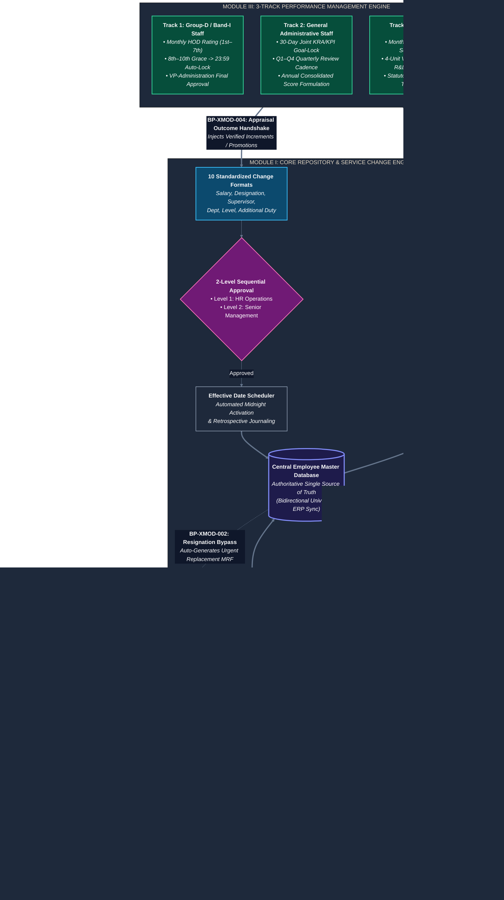

# University HR Change Management & Automation System

[](#1-executive-overview)
[](#6-system-status--implementation-roadmap)
[](#4-documentation-sitemap)
[-black.svg)](#5-technology-stack)
[-ea284e.svg)](#5-technology-stack)
[](#5-technology-stack)
[](#5-technology-stack)
[](#8-license-ownership--legal-disclaimer)

> An enterprise-grade, institutional HR automation platform designed to serve as the single source of truth for university employee lifecycles, talent acquisition, dynamic organizational structures, two-level change approvals, and statutory academic performance evaluations.

> [!WARNING]
> **PROPRIETARY & CONFIDENTIAL NOTICE — THE NEOTIA UNIVERSITY**  
> This repository contains confidential, proprietary intellectual property, specifications, and architecture belonging to **The Neotia University**.  
> - **Strict Prohibition:** Downloading, cloning, forking, scraping, reproducing, or redistributing this repository or any portion thereof without explicit prior written authorization from the repository owner is strictly forbidden.  
> - **Legal Enforcement:** Any unauthorized possession, reproduction, or suspicious activity will be subject to immediate legal action under applicable Copyright, Intellectual Property, and Cyber Laws.  
> - **Official Contact & Authorization:** For inquiries or access permissions, contact: [halderaditya632@gmail.com](mailto:halderaditya632@gmail.com).

---

## 1. Executive Overview

The **University HR Change Management & Automation System** eliminates administrative friction, insulates the university against statutory audit vulnerabilities, and automates deadline-driven academic and administrative operations across three cohesive modules:



### Core Problems Solved
- **Elimination of Duplicate Data Entry:** Updates in employee service conditions or recruitment milestones automatically synchronize across digital personal dossiers, organization hierarchies, and the central university ERP.
- **Dynamic Organization Chart:** Instant, sub-second visual realignment of reporting trees upon designation, supervisor, or departmental modifications without manual diagramming.
- **Statutory Academic Compliance:** Strict segregation of Academic (UGC-compliant SCM panel with mandatory external experts) and Non-Academic (3-Round interviews) hiring tracks.
- **Three Independent Performance Tracks:** Group-D monthly ratings with automated 10th-of-month auto-lockouts, General Staff quarterly KRA/KPI cycles, and Faculty annual appraisals via statutory Evaluation Committee Meetings (ECM).

---

## 2. Institutional Invariants at a Glance

The entire engineering and documentation baseline is strictly grounded in frozen institutional mandates:

| Metric | Count | Canonical Specification |
|---|:---:|---|
| **Atomic System Requirements** | **104** | [Software Requirements Specification](docs/01-requirements/SOFTWARE-REQUIREMENTS-SPECIFICATION.md) |
| **End-to-End Business Processes** | **59** | [Business Process Specification](docs/02-business-process/01-BUSINESS-PROCESS-SPECIFICATION.md) |
| **Invariant Business Rules** | **60** | [Business Rules Specification](docs/02-business-process/02-BUSINESS-RULES-SPECIFICATION.md) |
| **Granular Functional Specs (FRD)**| **152** | [Functional Requirements Specification](docs/03-functional-requirements/01-FUNCTIONAL-REQUIREMENTS-SPECIFICATION.md) |
| **Primary Conceptual Entities** | **33** | [Database Design & Schema Specification](docs/05-database/01-DATABASE-DESIGN-AND-SCHEMA-SPECIFICATION.md) |
| **Relational Entity Mappings** | **41** | [Database Design & Schema Specification](docs/05-database/01-DATABASE-DESIGN-AND-SCHEMA-SPECIFICATION.md) |
| **Logical Data Attributes** | **344** | [Logical Data Dictionary](docs/05-database/02-LOGICAL-DATA-DICTIONARY.md) |
| **Institutional Governance Actors** | **16** | [Security & RBAC Specification](docs/08-security/01-SECURITY-AND-RBAC-SPECIFICATION.md) |

---

## 3. Repository Architecture

```
HR-CHANGE-MANAGEMENT-SYSTEM/
├── README.md                                          [This Master Portal]
│
├── source-requirements/                               [PERMANENT LEGAL & INSTITUTIONAL SOURCE OF TRUTH]
│   ├── Module-I/                                      Official Requirement Briefs & Narrative Workflows (PDF)
│   ├── Module-II/                                     Recruitment Requirement Briefs, Narratives & Diagrams
│   ├── Module-III/                                    Performance Requirement Briefs & Workflow Diagrams
│   ├── PROJECT_REQUIREMENTS_ANALYSIS.md              Foundational Inception Requirements Extraction
│   └── TECHNOLOGY_ARCHITECTURE_BASELINE.md           Authoritative Technology Stack Baseline
│
└── docs/                                              [CANONICAL 10-DOMAIN DOCUMENTATION SUITE]
    ├── README.md                                      Detailed Documentation Sitemap & Reading Guide
    ├── 01-requirements/                               Software Requirements Specification (SRS)
    ├── 02-business-process/                           Business Processes, Workflows, RACI & Business Rules
    ├── 03-functional-requirements/                    Functional Requirements Document (152 FRDs)
    ├── 04-system-architecture/                        Modular Monolith Architecture & Real-Time ADR
    ├── 05-database/                                   Database Relational Design & 344-Attribute Data Dictionary
    ├── 06-design/                                     Official UI Design Tokens & Theme Specification
    ├── 07-api/                                        REST API Contracts & Socket.IO Event Payloads
    ├── 08-security/                                   16-Actor Permission Matrix, JWT & Row-Level Security
    ├── 09-testing/                                    Test Strategy & 7 Critical Path Verification Suites
    └── 10-deployment/                                 Docker Compose, Environment Config & DevOps Runbook
```

---

## 4. Documentation Sitemap

The canonical documentation is organized into 10 cohesive, production-grade domains:

| Domain | Specification Document | Key Contents & Responsibilities |
|---|---|---|
| **01. Requirements** | [Software Requirements Specification](docs/01-requirements/SOFTWARE-REQUIREMENTS-SPECIFICATION.md) | 104 Atomic Requirements, In-Scope/Out-of-Scope boundaries, Traceability Matrix, 11 Baseline TBDs, and `CONF-01` to `10` decisions. |
| **02. Processes** | [Business Process Specification](docs/02-business-process/01-BUSINESS-PROCESS-SPECIFICATION.md) | 59 End-to-End Processes across Modules I, II, III & Cross-Module, 16-Actor RACI matrix, and automated SLA countdown matrix. |
| **02. Rules** | [Business Rules Specification](docs/02-business-process/02-BUSINESS-RULES-SPECIFICATION.md) | 60 Invariant Business Rules, auto-lockout criteria, quota limits, and two-level approval gating controls. |
| **03. Functional** | [Functional Requirements Specification](docs/03-functional-requirements/01-FUNCTIONAL-REQUIREMENTS-SPECIFICATION.md) | 152 Functional Requirements (`MOD1-REQ`, `MOD2-REQ`, `MOD3-REQ`, `SHR-REQ`), validation pipes, state transitions, and error handling. |
| **04. Architecture** | [System Architecture Specification](docs/04-system-architecture/01-SYSTEM-ARCHITECTURE-SPECIFICATION.md) | Modular Monolith topology, NestJS architecture, Next.js frontend, BullMQ background queues, Redis caching, and ERP outbox. |
| **04. ADR** | [Real-Time Communication ADR](docs/04-system-architecture/ADR-001-REAL-TIME-COMMUNICATION.md) | Approved Architectural Decision Record selecting Socket.IO for live Org Chart invalidation and notifications. |
| **05. Database** | [Database Design & Schema Specification](docs/05-database/01-DATABASE-DESIGN-AND-SCHEMA-SPECIFICATION.md) | Single PostgreSQL engine with 4 domain schemas, 33 entities, 41 relationships, relational schema profiles, and indexing strategy. |
| **05. Dictionary** | [Logical Data Dictionary](docs/05-database/02-LOGICAL-DATA-DICTIONARY.md) | Exhaustive 344-attribute specification covering all 33 entities with logical data types, nullability, defaults, and validations. |
| **06. Design** | [Official Design Tokens & Tokens Guide](docs/06-design/DESIGN.md) | Official UI Design Tokens: curated palette, Inter typography, elevation, surface container hierarchies, and component styling rules. |
| **07. API** | [REST API & WebSocket Specification](docs/07-api/01-API-SPECIFICATION.md) | REST endpoint contracts (`/api/v1`), request/response JSON schemas, error handling envelopes, and Socket.IO events. |
| **08. Security** | [Security & RBAC Specification](docs/08-security/01-SECURITY-AND-RBAC-SPECIFICATION.md) | Master 16-Actor Permission Matrix, JWT token lifecycle, sensitive salary masking, and Row-Level Security (RLS). |
| **09. Testing** | [Test Strategy & Verification Plan](docs/09-testing/01-TEST-STRATEGY-AND-VERIFICATION-PLAN.md) | Multi-tier testing pyramid, automated CI/CD tooling, and 7 critical path test suites (10th auto-lock, 2-level approvals, SCM quorum). |
| **10. DevOps** | [Deployment & DevOps Guide](docs/10-deployment/01-DEPLOYMENT-AND-DEVOPS-GUIDE.md) | Production Docker Compose configuration, `.env.example` parameter mapping, database migration runbook, and backup policies. |

---

## 5. Technology Stack

```
┌──────────────────────────────────────────────────────────────────────────────────────────────────┐
│                                   PRODUCTION TECHNOLOGY STACK                                    │
├───────────────────────────┬──────────────────────────────────────────────────────────────────────┤
│ Frontend Application      │ Next.js (App Router, React 19, TypeScript)                           │
│ Frontend Styling          │ Vanilla CSS, CSS Modules (*.module.css), CSS Variables (No Tailwind)│
│ Backend API Engine        │ NestJS (TypeScript, Modular Monolith Architecture)                   │
│ Relational Database       │ PostgreSQL 16 (Single DB with 4 Logical Domain Schemas)              │
│ Cache & Background Queues │ Redis 7 + BullMQ (SLA Countdowns, Auto-Lockouts, Background Sync)    │
│ Real-Time Communication   │ Socket.IO v4 (WebSocket with Long-Polling Fallback & Room Channels)  │
│ Binary Document Storage   │ S3-Compatible Object Store (MinIO in local dev, AWS S3 in prod)      │
│ Container Orchestration   │ Docker & Docker Compose                                              │
└───────────────────────────┴──────────────────────────────────────────────────────────────────────┘
```

---

## 6. System Status & Implementation Roadmap

### 6.1 Current Repository Status: Phases 1 to 4 Complete
This repository currently houses the **Approved Canonical Architecture & Complete Engineering Specification Baseline** for the University HR Change Management & Automation System. 

The analytical and specification phases (Phases 1 through 4) are formally frozen and complete. All foundational artifacts—from atomic requirements to database schemas, REST APIs, design tokens, and deployment runbooks—have been validated and documented in full.

### 6.2 Reviewing & Navigating the Specifications
Reviewers, mentors, and academic leadership can inspect the institutional specifications directly:

1. **Clone the Repository:**
   ```bash
   git clone https://github.com/Aditya11o/HR-CHANGE-MANAGEMENT-SYSTEM.git
   cd HR-CHANGE-MANAGEMENT-SYSTEM
   ```

2. **Recommended Review Paths:**
   - **Academic Leadership & Mentors:** Review [SRS](docs/01-requirements/SOFTWARE-REQUIREMENTS-SPECIFICATION.md) and [Business Process Specification](docs/02-business-process/01-BUSINESS-PROCESS-SPECIFICATION.md) for institutional workflow conformance and governance rules.
   - **Software Engineers & Architects:** Examine [System Architecture](docs/04-system-architecture/01-SYSTEM-ARCHITECTURE-SPECIFICATION.md), [Database Design](docs/05-database/01-DATABASE-DESIGN-AND-SCHEMA-SPECIFICATION.md), [Logical Data Dictionary](docs/05-database/02-LOGICAL-DATA-DICTIONARY.md), and [API Specification](docs/07-api/01-API-SPECIFICATION.md).
   - **UI/UX Designers & Frontend Developers:** Inspect [Official Design Tokens & Guide](docs/06-design/DESIGN.md) for color tokens, typography scales, and CSS Module patterns.
   - **Quality Assurance & Verification Teams:** Refer to [Test Strategy & Verification Plan](docs/09-testing/01-TEST-STRATEGY-AND-VERIFICATION-PLAN.md) for test suites, auto-lockout verification, and SCM quorum validation.
   - **DevOps & Infrastructure Teams:** Review [Deployment & DevOps Guide](docs/10-deployment/01-DEPLOYMENT-AND-DEVOPS-GUIDE.md) for container topology and environment specifications.

### 6.3 Downstream Engineering Roadmap (Phase 5: Implementation)
Active software implementation is scheduled under Phase 5 and will follow the rigorous step-by-step engineering roadmap below:

- **Milestone 5.1 — Monorepo & Workspace Scaffolding:** Initialize modular workspace structure with `apps/backend` (NestJS) and `apps/frontend` (Next.js App Router).
- **Milestone 5.2 — Infrastructure Orchestration:** Provision local development containers (`PostgreSQL 16`, `Redis 7`, and `MinIO`) using Docker Compose as specified in `docs/10-deployment/`.
- **Milestone 5.3 — Database & ORM Entity Generation:** Translate the 33 conceptual entities and 41 relational foreign keys from `docs/05-database/` into TypeORM / Prisma entities and automated database migrations.
- **Milestone 5.4 — Backend Modular Monolith Development:** Build NestJS domain modules (`mod1_core`, `mod2_recruitment`, `mod3_performance`), implement JWT/RBAC guards, BullMQ cron workers, and Socket.IO gateways adhering to `docs/04-system-architecture/` and `docs/07-api/`.
- **Milestone 5.5 — Frontend UI & Component Construction:** Construct Next.js Server Components and client views using Vanilla CSS Modules and design tokens strictly adhering to `docs/06-design/DESIGN.md`.
- **Milestone 5.6 — Automated Testing & Statutory Verification:** Execute the 7 critical path verification suites (10th-of-month Group-D auto-lock, two-level approval gating, SCM quorum validation) as defined in `docs/09-testing/`.

---

## 7. Institutional Governance & Compliance

- **University Grants Commission (UGC) Norms:** Faculty recruitment, statutory selection panels (SCM), and annual performance assessments strictly observe national higher education regulatory guidelines.
- **Audit Defensibility:** Complete, immutable, append-only audit ledgers guarantee that every personnel modification is reconstructible and legally defensible.
- **Separation of Duties:** Built-in RBAC prevents self-approval and enforces sequential two-level sign-offs across academic and administrative hierarchies.

---

## 8. License, Ownership & Legal Disclaimer

**Copyright (c) 2026 The Neotia University. All Rights Reserved.**

This software system, architectural design, database schemas, and documentation suite are the confidential and proprietary intellectual property of **The Neotia University**.

- **All Rights Reserved:** No part of this codebase, documentation, diagrams, or requirements specifications may be copied, cloned, downloaded, forked, modified, published, or distributed in any form or by any means—electronic, mechanical, or otherwise—without prior explicit written consent from the copyright holder.
- **Monitoring & Enforcement:** All access, downloads, or suspicious repository activities are monitored. Any unauthorized extraction, duplication, or commercial exploitation constitutes a violation of institutional intellectual property rights and will result in formal legal proceedings and prosecution under applicable state, national, and international copyright regulations.
- **Official Inquiries & Access Requests:** For institutional clearance, collaboration agreements, or authorization requests, please direct official communications to:
  - **Organization:** The Neotia University
  - **Designated Contact:** [halderaditya632@gmail.com](mailto:halderaditya632@gmail.com)
