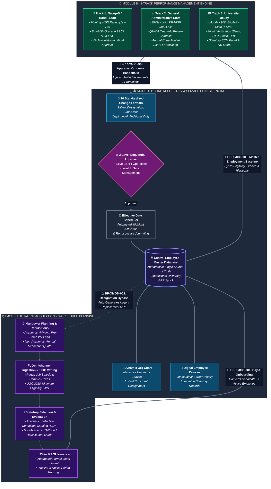

# Software Requirements Specification (SRS)
## University HR Change Management & Automation System

| Document Metadata | Specification Detail |
|---|---|
| **Document Identifier** | `DOC-01-SRS-CANONICAL` |
| **Project Name** | University HR Change Management & Automation System |
| **System Phase** | Phase 1 — Consolidated Requirements Engineering Baseline |
| **Document Status** | Approved Canonical Requirements Baseline |
| **Date** | October 2026 |
| **Classification Standard** | `[A]` Explicit Requirement, `[B]` Logical Implication, `[C]` Approved Technical Decision, `[D]` Proposed Detail, `[E]` TBD / Open Decision |
| **Authoritative Sources** | `source-requirements/` (Module I, II, III Official Briefs & Baseline Analysis) |

---

## 1. Executive Summary & Vision

### 1.1 Purpose
This document establishes the authoritative, end-to-end **Software Requirements Specification (SRS)** for the **University HR Change Management & Automation System**. It serves as the primary contractual, architectural, and engineering baseline for University Leadership, Academic Deans, Department Heads, Human Resources personnel, and technical engineering teams.

### 1.2 System Vision
The University operates across diverse academic schools, administrative directorates, research cells, and operational support units. The platform acts as the institutional **digital backbone** for the complete employee lifecycle, spanning three core modules:

### 1.3 Strategic Objectives
1. **Elimination of Duplicate Data Entry [A]:** Any approved change or milestone automatically updates all connected records, org trees, and dossiers without manual intervention.
2. **Single Source of Truth & ERP Reflection [A]:** Centralized Employee Database synchronized with the University ERP platform.
3. **Multi-Track Governance & Procedural Integrity [A]:** Strict separation between Academic and Non-Academic hiring; independent operation of all three performance appraisal tracks.
4. **Comprehensive Auditability & Temporal Versioning [A]:** Uniform change methodology with immutable audit logs, actor attribution, before-and-after diffs, and `effective_date` validity.
5. **Automated SLA Enforcement [A]:** Automated calendar triggers, reminder sequences, grace periods, auto-lockouts, and executive escalation.
6. **Dynamic Operational Visibility [A]:** Real-time reporting engine, executive vacancy trackers, and longitudinal employee files.

---

## 2. System Scope & Boundaries

### 2.1 In-Scope Capabilities
- **Module I: HR Change Management & Core Employee Database:**
  - Authoritative Central Employee Database with personal, academic, and service records.
  - Dynamic Organization Chart realigning in real time upon designation, supervisor, or departmental changes.
  - Digital Employee Files (Dossiers) archiving service history, credentials, and evaluations.
  - 10 Standardized Service Change Formats (Salary, Designation, Reportee, Reporting Authority, Level, Department, Location, Additional Responsibility, Qualifications, Other Service Conditions).
  - Mandatory Two-Level Sequential Approval Hierarchy (Level 1: HR Operations $\rightarrow$ Level 2: Senior Management).
  - Effective Date Processing supporting scheduled future activations and retrospective non-destructive entries.
  - Real-time reporting engine and immutable audit logs.
- **Module II: Recruitment & Selection Automation:**
  - Segregated Academic (Faculty/Lab Tech) and Non-Academic (General Staff) recruitment tracks.
  - Academic manpower planning initiated 4 months prior to semester, with 15-day Dean submission window.
  - Non-Academic annual manpower planning (quota of 1 planned MRF per department per year).
  - Urgent replacement workflow triggered immediately upon Dean's acceptance of an employee resignation.
  - Central CV database with multi-channel sourcing and statutory UGC criteria screening.
  - Digital Recruiter Calling Sheet (RCS) preliminary screening ledger.
  - Academic Selection Committee Meetings (SCM) with mandatory external expert and digital scoring matrix.
  - Non-Academic 3-Round interview process (Technical, HR, Management) with weighted evaluation.
  - Automated Letter of Intent (LOI) generation and "Yet to Join" pipeline tracking.
- **Module III: Performance Management Automation:**
  - *Subsystem 1 (Group-D / Band I):* Monthly evaluation form (due on 7th, 3-day grace period to 10th, auto-lockout on 10th), VP-Administration approval, and 1-year anniversary weighted average score calculation.
  - *Subsystem 2 (General Staff KRA/KPI):* 30-day onboarding goal-setting, joint HR/Management goal locking, quarterly review cadence (Q1–Q4), and annual consolidation.
  - *Subsystem 3 (Faculty ECM):* Automated monthly eligibility scan on the 10th (probation completed + $\ge$ 12 months service), 7-day self-appraisal submission, 4-unit parallel verification (Dean, R&D, Placement, HR) with discrepancy dispute loop, monthly Evaluation Committee Meeting (ECM), and TNU Protocol benchmark matrix.
  - Automated feeding of finalized performance outcomes into Module I Service Change Requests.

### 2.2 Out-of-Scope (Delimited System Boundaries)
- Direct payroll processing and bank disbursement execution (delegated to University ERP / Payroll).
- Direct biometric attendance device hardware integration (raw clock-in/out hardware integration).
- Learning Management Systems (LMS) and student grading engines.
- Legal litigation management and union disputes handling.

---

## 3. Master Requirements Catalogue (104 Atomic Invariants)

Every atomic requirement is tagged with its official classification:
- **`[A] Explicit Requirement`**: Directly stated in authoritative source briefs (88 requirements).
- **`[B] Logical Implication`**: Operationally or mathematically necessary primitive (8 requirements).
- **`[C] Approved Technical Decision`**: Approved technical architecture baseline decision (4 requirements).
- **`[D] Proposed Detail`**: Proposed engineering threshold awaiting policy confirmation (1 requirement).
- **`[E] TBD / Open Decision`**: Unresolved policy, schema, or integration detail (3 requirements).

### 3.1 Section A: Enterprise & Platform Common Requirements
| ID | Requirement Statement | Class | Source Reference | Dependencies |
|---|---|:---:|---|---|
| `REQ-ENT-01` | Single, centralized database representing the authoritative single source of truth for all employee service records. | `[A]` | Module I Brief, Structure (1) | None |
| `REQ-ENT-02` | Eliminate duplicate data entry: approved changes automatically update all connected records, org trees, and dossiers. | `[A]` | Module I Brief, Background | `REQ-ENT-01` |
| `REQ-ENT-03` | Role-based authentication and granular authorization across all administrative, academic, and executive users. | `[B]` | Universal Baseline | None |
| `REQ-ENT-04` | All system timestamps stored in UTC with display rendering in Local University Time (IST). | `[B]` | Universal Baseline | None |
| `REQ-ENT-05` | Master records, transaction histories, and evaluations shall never be physically deleted; soft deletion with audit logs. | `[B]` | Universal Baseline | None |
| `REQ-ENT-06` | All workflow state transition operations shall be idempotent, preventing duplicate approvals or double-execution. | `[B]` | Universal Baseline | None |

### 3.2 Section B: Module I — HR Change Management & Core DB Requirements
| ID | Requirement Statement | Class | Source Reference | Dependencies |
|---|---|:---:|---|---|
| `REQ-MOD1-01` | Authoritative Central Database of all Employees containing complete service, personal, academic, and structural profiles. | `[A]` | Module I Brief, Structure (1) | `REQ-ENT-01` |
| `REQ-MOD1-02` | Dynamic Organization Chart directly connected to the Central Employee Database. | `[A]` | Module I Brief, Structure (2) | `REQ-MOD1-01` |
| `REQ-MOD1-03` | Organization Chart automatically realigns hierarchy when designations, reportees, supervisors, or departments change. | `[A]` | Module I Brief, Structure (2) | `REQ-MOD1-02` |
| `REQ-MOD1-04` | Organizational hierarchy shall render with high performance, ensuring real-time reflection across visual tree structures. | `[B]` | Module I Brief, Structure (2) | `REQ-MOD1-03` |
| `REQ-MOD1-05` | Connected Digital Employee File serving as an immutable, longitudinal dossier for each employee. | `[A]` | Module I Brief, Objective | `REQ-MOD1-01` |
| `REQ-MOD1-06` | Standardized digital change format for Change in Salary (increments, revisions, allowances) [Format (a)]. | `[A]` | Module I Brief, Structure 3(a) | `REQ-MOD1-01` |
| `REQ-MOD1-07` | Standardized digital change format for Change in Designation [Format (b)]. | `[A]` | Module I Brief, Structure 3(b) | `REQ-MOD1-01` |
| `REQ-MOD1-08` | Standardized digital change format for Change in Reportee [Format (c)]. | `[A]` | Module I Brief, Structure 3(c) | `REQ-MOD1-02` |
| `REQ-MOD1-09` | Standardized digital change format for Change in Reporting Authority [Format (d)]. | `[A]` | Module I Brief, Structure 3(d) | `REQ-MOD1-02` |
| `REQ-MOD1-10` | Standardized digital change format for Change in Level (grade/band progression) [Format (e)]. | `[A]` | Module I Brief, Structure 3(e) | `REQ-MOD1-01` |
| `REQ-MOD1-11` | Standardized digital change format for Change in Department / School [Format (f)]. | `[A]` | Module I Brief, Structure 3(f) | `REQ-MOD1-02` |
| `REQ-MOD1-12` | Standardized digital change format for Change in Location (campus/office) [Format (g)]. | `[A]` | Module I Brief, Structure 3(g) | `REQ-MOD1-01` |
| `REQ-MOD1-13` | Standardized digital change format for Additional Responsibility Added (Dean, HOD, Proctor, etc.) [Format (h)]. | `[A]` | Module I Brief, Structure 3(h) | `REQ-MOD1-01` |
| `REQ-MOD1-14` | Track effective start dates and tenures for additional responsibilities (allowances subject to HR policy confirmation). | `[B]` | Module I Brief, Structure 3(h) | `REQ-MOD1-13` |
| `REQ-MOD1-15` | Standardized digital change format for Change in Qualifications (degrees, certifications, licenses) [Format (i)]. | `[A]` | Module I Brief, Structure 3(i) | `REQ-MOD1-01` |
| `REQ-MOD1-16` | Extensible change format for Any Other Employee Service Condition [Format (j)]. | `[A]` | Module I Brief, Structure 3(j) | `REQ-MOD1-01` |
| `REQ-MOD1-17` | Mandatory two-level approval hierarchy: Level 1 (HR Level) followed by Level 2 (Senior Management Level). | `[A]` | Module I Brief, Approval (a, b)| `REQ-MOD1-06`–`16` |
| `REQ-MOD1-18` | Change methodology natively supports `effective_date` parameter for all change formats, allowing future scheduling. | `[A]` | Module I Brief, Methodology | `REQ-MOD1-17` |
| `REQ-MOD1-19` | Automated Scheduled Activation: background processing commits scheduled changes, realigns org tree, emits ERP events. | `[C]` | Tech Architecture Baseline | `REQ-MOD1-18` |

### 3.3 Section C: Module II — Recruitment & Selection Automation Requirements
| ID | Requirement Statement | Class | Source Reference | Dependencies |
|---|---|:---:|---|---|
| `REQ-MOD2-01` | Strict segregation of approval chains and workflows between Academic (Faculty/Lab Tech) and Non-Academic (Staff). | `[A]` | Module II Brief, Section 1 | None |
| `REQ-MOD2-02` | Academic manpower planning communication automatically initiated at least four (4) months prior to semester. | `[A]` | Module II Brief, Section 1(a) | `REQ-MOD2-01` |
| `REQ-MOD2-03` | School Deans submit academic manpower requirements and teaching loads (Attachment 1) within fifteen (15) days. | `[A]` | Module II Brief, Section 1(b) | `REQ-MOD2-02` |
| `REQ-MOD2-04` | HR vets teaching loads over a 3-month window and consolidates into Enclosure 1 (MRF) and Attachment 2. | `[A]` | Module II Brief, Section 1(c, d) | `REQ-MOD2-03` |
| `REQ-MOD2-05` | Consolidated academic manpower submitted to Pro-Chancellor for approval with mandatory 7-day turnaround time. | `[A]` | Module II Brief, Section 1(e) | `REQ-MOD2-04` |
| `REQ-MOD2-06` | HR launches public recruitment advertisements within seven (7) days of receiving Pro-Chancellor approval. | `[A]` | Module II Brief, Section 1(f) | `REQ-MOD2-05` |
| `REQ-MOD2-07` | Non-Academic manpower planning initiated with Department Heads, restricted to one (1) planned requisition per year. | `[A]` | Module II Brief, Section 1(g) | `REQ-MOD2-01` |
| `REQ-MOD2-08` | Employee resignation acceptance by School Dean immediately triggers urgent replacement countdown and alerts Head HR. | `[A]` | Module II Brief, Section 1(i) | `REQ-MOD1-01` |
| `REQ-MOD2-09` | Upon resignation notification, Dean/HOD submits ad-hoc MRF (Enclosure 1) specifying urgency and reason for hire. | `[A]` | Module II Brief, Section 1(i) | `REQ-MOD2-08` |
| `REQ-MOD2-10` | Maintain Open Positions Tracker (Attachment 3 / Enclosure 4) within thirty (30) days of requisition approval. | `[A]` | Module II Brief, Section 2 & 3 | `REQ-MOD2-05`, `09` |
| `REQ-MOD2-11` | Capture applications into Central CV Database across print media, website, social channels, emails, and job portals. | `[A]` | Module II Brief, Section 4 | None |
| `REQ-MOD2-12` | Automatically segregate, classify, and shortlist CVs against qualifications, experience, and statutory UGC norms. | `[A]` | Module II Brief, Section 5 | `REQ-MOD2-11` |
| `REQ-MOD2-13` | Digital Recruiter Calling Sheet (RCS) capturing initial phone screening remarks, communication rating, and qualification checks. | `[A]` | Module II Brief, Section 6 | `REQ-MOD2-12` |
| `REQ-MOD2-14` | RCS evaluation comments reviewed by HOD-HR and submitted to Management for pre-approval prior to interview. | `[A]` | Module II Brief, Section 7 | `REQ-MOD2-13` |
| `REQ-MOD2-15` | Academic selection conducted by statutory Selection Committee Meeting (SCM) with VC, Dean, HOD, and External Expert. | `[A]` | Module II Brief, Selection A | `REQ-MOD2-14` |
| `REQ-MOD2-16` | SCM panel members record digital evaluation scores; system compiles final selection matrix for Management approval. | `[A]` | Module II Brief, Selection A | `REQ-MOD2-15` |
| `REQ-MOD2-17` | Non-Academic selection follows 3-Round interview process: Round 1 (Technical), Round 2 (HR), and Round 3 (Management). | `[A]` | Module II Brief, Selection B | `REQ-MOD2-14` |
| `REQ-MOD2-18` | Non-Academic candidates evaluated on Job Knowledge, Communication Skills, and Attitude with weighted scoring per round. | `[A]` | Module II Brief, Selection B | `REQ-MOD2-17` |
| `REQ-MOD2-19` | Upon Management approval, system automatically generates official Letter of Intent (LOI) with compensation terms. | `[A]` | Module II Brief, Selection A/B | `REQ-MOD2-16`, `18` |
| `REQ-MOD2-20` | Candidates accepting LOI tagged as "Yet to Join", triggering notice period tracking and pre-onboarding notifications. | `[A]` | Module II Brief, Selection A/B | `REQ-MOD2-19` |

### 3.4 Section D: Module III — Performance Management Automation Requirements
| ID | Requirement Statement | Class | Source Reference | Dependencies |
|---|---|:---:|---|---|
| `REQ-MOD3-01` | Group-D monthly digital Evaluation Form (Enclosure 1) routed to HOD/supervisor for each reporting employee. | `[A]` | Group-D Brief, Section 1 & 2 | `REQ-MOD1-01` |
| `REQ-MOD3-02` | Group-D monthly evaluation forms enforce strict submission due date of the 7th of every month. | `[A]` | Group-D Brief, Section 2(c) | `REQ-MOD3-01` |
| `REQ-MOD3-03` | Automated 3-day grace period up to the 10th of the month, sending daily reminders on the 8th, 9th, and 10th. | `[A]` | Group-D Brief, Section 2(c, d) | `REQ-MOD3-02` |
| `REQ-MOD3-04` | Auto-Lockout on 10th: evaluations unsubmitted by cutoff automatically lock, flagging "Not Submitted" for HR. | `[A]` | Group-D Brief, Section 2(e) | `REQ-MOD3-03` |
| `REQ-MOD3-05` | Group-D evaluations require mandatory digital sign-off and approval from VP – Administration. | `[A]` | Group-D Brief, Section 2(b) | `REQ-MOD3-01` |
| `REQ-MOD3-06` | Automatically collate submitted monthly evaluations into Monthly Performance Report (Enclosure 2) for HR. | `[A]` | Group-D Brief, Section 3 | `REQ-MOD3-05` |
| `REQ-MOD3-07` | Annual Report triggered for Group-D staff at one (1) year of employment based on Date of Joining (DOJ). | `[A]` | Group-D Brief, Section 4(a) | `REQ-MOD1-01` |
| `REQ-MOD3-08` | Annual Report computes parameter-wise weighted average scores across the twelve (12) monthly evaluations. | `[A]` | Group-D Brief, Section 4(b) | `REQ-MOD3-07` |
| `REQ-MOD3-09` | Mandatory probation verification gate; unconfirmed staff cannot proceed to compensation review. | `[A]` | Group-D Brief, Section 5(b) | `REQ-MOD3-08` |
| `REQ-MOD3-10` | General Staff new joiners configure KRA/KPI Goal Sheets within thirty (30) days of Date of Joining. | `[A]` | KRA/KPI Brief, Stage 1 | `REQ-MOD1-01` |
| `REQ-MOD3-11` | KRA/KPI goal sheets require joint review and locking by HR and Management, freezing goals for evaluation cycle. | `[A]` | KRA/KPI Brief, Stage 1 | `REQ-MOD3-10` |
| `REQ-MOD3-12` | Four quarterly review cycles (Q1–Q4) with 90-day intimation, 20-day reminder, 15-day submission, 7-day supervisor review. | `[A]` | KRA/KPI Brief, Stage 2 | `REQ-MOD3-11` |
| `REQ-MOD3-13` | Annual KRA/KPI outcome feeds directly into Module I as formal service change request (promotion, increment, level). | `[A]` | KRA/KPI Brief, Stage 3 | `REQ-MOD3-12` |
| `REQ-MOD3-14` | Auto-identify eligible faculty (probation completed + $\ge$ 12 months service) on the 10th of every month; send to Registrar. | `[A]` | Faculty ECM Brief, Section 1 | `REQ-MOD1-01` |
| `REQ-MOD3-15` | Eligible faculty submit digital Self-Appraisal Form (Enclosure 1) within seven (7) working days of notification. | `[A]` | Faculty ECM Brief, Section 2 | `REQ-MOD3-14` |
| `REQ-MOD3-16` | Self-appraisals route for parallel verification across Dean, Director R&D, Placement, HR with circular dispute loop. | `[A]` | Faculty ECM Brief, Section 3 | `REQ-MOD3-15` |
| `REQ-MOD3-17` | Registrar schedules monthly Evaluation Committee Meeting (ECM) with digital scoring sheets (Enclosure 2). | `[A]` | Faculty ECM Brief, Section 4 | `REQ-MOD3-16` |
| `REQ-MOD3-18` | Compile Evaluation Matrix combining ECM scores, previous increments, and TNU Protocol parameters for Management. | `[A]` | Faculty ECM Brief, Section 5 | `REQ-MOD3-17` |
| `REQ-MOD3-19` | Approved faculty increments tracked into next salary cycle; auto-generate official compensation revision letter. | `[A]` | Faculty ECM Brief, Section 6 | `REQ-MOD3-18` |

### 3.5 Section E: Cross-Module Integration Requirements
| ID | Requirement Statement | Class | Source Reference | Dependencies |
|---|---|:---:|---|---|
| `REQ-INT-01` | When candidate accepts LOI and completes Day-1 joining, Module II auto-instantiates employee record in Module I. | `[A]` | Mod II Selection & Mod I CDB | `REQ-MOD2-19` |
| `REQ-INT-02` | Dean resignation acceptance in Module I immediately notifies Head HR and starts Module II replacement countdown. | `[A]` | Mod II Section 1(i) & Mod I | `REQ-MOD1-01` |
| `REQ-INT-03` | Module III continuously consumes DOJ, probation status, department, and supervisor hierarchy from Module I. | `[A]` | Universal Master Baseline | `REQ-MOD1-01` |
| `REQ-INT-04` | Approved annual appraisal outcomes from Module III automatically inject service change requests into Module I. | `[A]` | Mod III Briefs & Mod I | `REQ-MOD3-08`, `13`, `18` |

### 3.6 Section F: Reporting Requirements
| ID | Requirement Statement | Class | Source Reference | Dependencies |
|---|---|:---:|---|---|
| `REQ-REP-01` | Extensible reporting engine enabling HR administrators to configure, modify, or retire report formats dynamically. | `[A]` | Module I Brief, Reports | `REQ-MOD1-01` |
| `REQ-REP-02` | All operational and master reports support real-time execution against current database state. | `[A]` | Module I Brief, Reports | `REQ-MOD1-01` |
| `REQ-REP-03` | Auto-generate Weekly Open Positions Report submitted to Senior Management on active vacancies and progress. | `[A]` | Module II Brief, Section 3 | `REQ-MOD2-10` |
| `REQ-REP-04` | Maintain dedicated "Yet to Join" Tracker dashboard monitoring candidate notice periods and joining schedules. | `[A]` | Module II Brief, Selection A/B | `REQ-MOD2-19` |
| `REQ-REP-05` | Auto-collate Group-D Monthly Performance Reports using Enclosure 2 template for HR without manual compilation. | `[A]` | Group-D Brief, Section 3 | `REQ-MOD3-06` |
| `REQ-REP-06` | Generate Annual Performance Report for Group-D computing 12-month weighted average scores per parameter. | `[A]` | Group-D Brief, Section 4 | `REQ-MOD3-08` |
| `REQ-REP-07` | Real-time non-compliance audit reports identifying HODs who failed to submit Group-D evaluations by 10th auto-lock. | `[A]` | Group-D Brief, Section 2(e) | `REQ-MOD3-04` |
| `REQ-REP-08` | Auto-generate Monthly Eligible Faculty List on 10th of every month (probation completed + $\ge$ 12 months service). | `[A]` | Faculty ECM Brief, Section 1 | `REQ-MOD3-14` |
| `REQ-REP-09` | All system reports support structured data export in Excel (XLSX) and CSV formats. | `[B]` | Universal Baseline | `REQ-REP-01` |

### 3.7 Section G: Audit and Versioning Requirements
| ID | Requirement Statement | Class | Source Reference | Dependencies |
|---|---|:---:|---|---|
| `REQ-AUD-01` | Immutable audit trail capturing every master modification, approval, rejection, and state change with timestamps and actor IDs. | `[A]` | Module I Brief, Methodology | None |
| `REQ-AUD-02` | Maintain complete version history across all employee service changes without destructive overwrites. | `[A]` | Module I Brief, Methodology | `REQ-AUD-01` |
| `REQ-AUD-03` | Allow HR Team to update evaluation forms, versioning each iteration with an immutable audit trail. | `[A]` | Group-D Brief, Section 1(b) | None |
| `REQ-AUD-04` | KRA/KPI goal sheets frozen and version-locked upon HR and Management sign-off; revisions require tracked requests. | `[A]` | KRA/KPI Brief, Stage 1 | None |

### 3.8 Section H: Notification and SLA Requirements
| ID | Requirement Statement | Class | Source Reference | Dependencies |
|---|---|:---:|---|---|
| `REQ-SLA-01` | Automated advance notification dispatched $\ge$ 4 months prior to semester to initiate Academic Manpower Planning. | `[A]` | Module II Brief, Section 1(a) | None |
| `REQ-SLA-02` | 15-day SLA timer enforced for School Deans to submit academic requirements and teaching loads. | `[A]` | Module II Brief, Section 1(b) | `REQ-SLA-01` |
| `REQ-SLA-03` | 7-day turnaround SLA enforced for Pro-Chancellor review and approval of consolidated academic manpower. | `[A]` | Module II Brief, Section 1(e) | `REQ-SLA-02` |
| `REQ-SLA-04` | 7-day SLA enforced for HR to launch recruitment advertisements following Pro-Chancellor approval. | `[A]` | Module II Brief, Section 1(f) | `REQ-SLA-03` |
| `REQ-SLA-05` | Monthly submission due date enforced on the 7th of every month for Group-D evaluations. | `[A]` | Group-D Brief, Section 2(c) | None |
| `REQ-SLA-06` | Automated 3-day grace period up to the 10th of the month with daily reminders (8th, 9th, 10th). | `[A]` | Group-D Brief, Section 2(c, d) | `REQ-SLA-05` |
| `REQ-SLA-07` | 30-day onboarding SLA countdown from Date of Joining for new joiners to configure KRA/KPI goal sheets. | `[A]` | KRA/KPI Brief, Stage 1 | `REQ-ENT-01` |
| `REQ-SLA-08` | Structured quarterly SLA: 90-day intimation, 20-day reminder, 15-day self-review, and 7-day supervisor verification. | `[A]` | KRA/KPI Brief, Stage 2 | `REQ-SLA-07` |
| `REQ-SLA-09` | 7 working days submission SLA for eligible faculty to submit annual self-appraisal form upon notification. | `[A]` | Faculty ECM Brief, Section 2 | `REQ-REP-08` |
| `REQ-SLA-10` | Notification dispatch offloaded to asynchronous background queues to prevent blocking web transactions. | `[C]` | Approved Tech Baseline | None |

### 3.9 Section I: Document, Form, and Template Requirements
| ID | Requirement Statement | Class | Source Reference | Dependencies |
|---|---|:---:|---|---|
| `REQ-DOC-01` | Centralized, version-controlled repository maintaining standardized digital forms for Formats (a) through (j). | `[A]` | Module I Brief, Structure 3 | None |
| `REQ-DOC-02` | Standardized digital templates for Enclosure 1 (MRF), Attachment 1 (Teaching Load), Attachment 2, Attachment 3, RCS. | `[A]` | Module II Enclosures | None |
| `REQ-DOC-03` | Standardized digital templates for Group-D Form/Report, KRA Goal Sheet, Faculty Form, ECM Sheet, TNU Matrix. | `[A]` | Module III Enclosures | None |
| `REQ-DOC-04` | Auto-generate official Letter of Intent (LOI) documents upon Management approval of candidate selection. | `[A]` | Module II Brief, Selection A/B | `REQ-MOD2-16`, `18` |
| `REQ-DOC-05` | Auto-generate official compensation revision letters for faculty upon Management approval of ECM appraisal outcomes. | `[A]` | Faculty ECM Brief, Section 6 | `REQ-MOD3-18` |
| `REQ-DOC-06` | Binary files (CVs, certificates, letters) stored in Object Storage; metadata, checksums, and paths in relational DB. | `[C]` | Approved Tech Baseline | None |
| `REQ-DOC-07` | File Upload Security & Validation: strict MIME-type validation and SHA-256 integrity hashing on all uploaded files. | `[B]` | Universal Baseline | None |
| `REQ-DOC-08` | File size limit enforcement (proposed threshold of max 10MB per document), subject to University IT confirmation. | `[D]` | Architecture Baseline | `REQ-DOC-07` |

### 3.10 Section J: External Integration Requirements
| ID | Requirement Statement | Class | Source Reference | Dependencies |
|---|---|:---:|---|---|
| `REQ-EXT-01` | Central Employee Database shall be fully reflected and synchronized with the University ERP platform. | `[A]` | Module I Brief, Structure (1) | `REQ-MOD1-01` |
| `REQ-EXT-02` | Outbound ERP synchronization payloads written to an immutable outbox within local transaction for eventual consistency. | `[C]` | Approved Tech Baseline | `REQ-EXT-01` |
| `REQ-EXT-03` | Technical transport protocol for ERP synchronization is classified as `[E] TBD` pending University IT confirmation. | `[E]` | Module I Brief & Tech Base | `REQ-EXT-01` |
| `REQ-EXT-04` | Institutional Single Sign-On (SSO) integration mechanism (Google Workspace, Microsoft Entra ID, LDAP) is `[E] TBD`. | `[E]` | Universal Baseline | None |
| `REQ-EXT-05` | External Subject Expert secure access mechanism (time-limited magic links or OTP-verified portal) is `[E] TBD`. | `[E]` | Module II Selection A | None |

---

## 4. Controlled Baseline TBD Register (`REQ-TBD-01` to `REQ-TBD-11`)

| TBD ID | Open Decision Topic | Nature of Gap | Operational Impact & Mitigation |
|---|---|---|---|
| `REQ-TBD-01` | ERP Synchronization Protocol | Transport Mechanism | REST API, direct DB staging, or SFTP batch file transfer pending University IT infrastructure sign-off. |
| `REQ-TBD-02` | Form & Enclosure Field Schemas | UI/Data Contract | Exact field layouts for MRF, Teaching Load Attachment 1, and Group-D Enclosure 1 awaiting sample paper forms. |
| `REQ-TBD-03` | Staff Appraisal Track Allocation Rules | Policy Boundary | Categorization of hybrid personnel (e.g. Lab Technicians, Teaching Associates) under Faculty ECM vs Staff KRA. |
| `REQ-TBD-04` | TNU Protocol Benchmark Weights | Mathematical Weightage | Exact percentage weights across teaching, research publications, patents, and consultancy in Enclosure 3. |
| `REQ-TBD-05` | Pre-Defined Compensation Revision Slabs | Financial Policy | Monetary increment slabs and percentage bands for Group-D and Staff annual progression. |
| `REQ-TBD-06` | Resignation Intake & Upstream Clearance | Workflow Interface | Mechanism for employee resignation submission (self-service portal vs offline paper memo to Dean). |
| `REQ-TBD-07` | Enterprise SSO & External Expert Portal | Security / Auth | IdP protocol (SAML/OIDC) and authentication method for external selection committee subject experts. |
| `REQ-TBD-08` | LOI vs Formal Appointment Letter Lifecycle | Contractual Workflow | Post-joining formal contract workflow and issuance timing following preliminary LOI acceptance. |
| `REQ-TBD-09` | Administrative Allowance for Secondary Roles | Financial Policy | Compensation policies for Deans, HODs, Proctors holding additional administrative charges (Format 3h). |
| `REQ-TBD-10` | Outbound Communication Gateways | Infrastructure Config | SMTP mail server relay parameters and transactional SMS/WhatsApp gateway credentials. |
| `REQ-TBD-11` | Document Archival & Retention Schedule | Legal Compliance | Retention period for rejected candidate CVs, audit trail logs, and historical performance scorecards. |

---

## 5. Stakeholder Confirmation Register (`CONF-01` to `CONF-10`)

Following post-release stakeholder workflows, ten key institutional governance decisions were identified. They are summarized below for formal administrative confirmation:

| ID | Module | Governance Topic | Current Baseline Position | Proposed Alternative / Question | Status |
|---|---|---|---|---|:---:|
| `CONF-01` | Mod I | Service Change Initiator Scope | Restricted strictly to HR Operations (`REQ-MOD1-05`). | Extend initiation to Admin Officers and School Deans/HODs as per policy? | Pending |
| `CONF-02` | Mod II | Associate Dean Academic Planning Role | Initiated by central HR / Registrar. | Formally designate Associate Dean (Academics) as initiator & co-consolidator? | Pending |
| `CONF-03` | Mod II | Academic Manpower Vetting Authority | HR conducts 3-month vetting (`REQ-MOD2-04`). | Associate Dean (Academics) vets academic requisitions in place of or jointly with HR? | Pending |
| `CONF-04` | Mod II | Lab Technician Cadre Alignment | Grouped under Non-Academic 3-round interview. | Re-align Lab Techs with Faculty under Academic SCM track? | Pending |
| `CONF-05` | Mod II | Management Pre-Approval for Interview | Direct progression from recruiter shortlisting. | Enforce mandatory Senior Management approval for all interview schedules? | Pending |
| `CONF-06` | Mod II | Post-SCM Formal HR Recommendation | SCM scorecards route directly to Management. | Insert formal HR compensation review gate prior to final Management sign-off? | Pending |
| `CONF-07` | Mod III | Group-D Evaluation Form Completion | Completed by immediate supervisor (`REQ-MOD3-01`). | HOD directly completes and submits form, or supervisor drafts for HOD endorsement? | Pending |
| `CONF-08` | Mod III | Staff Quarterly Reminder Trigger Timing | Reminder sent during review cycle (`REQ-MOD3-12`). | Clarify trigger: 20 days prior to quarter end, on Day 20 of quarter, or overdue escalation? | Pending |
| `CONF-09` | Mod III | Faculty Verification Routing Scope | Fixed to 4 units (Dean, R&D, Placement, HR). | Keep fixed to 4 units, or allow dynamically configurable verification units (e.g. IQAC)? | Pending |
| `CONF-10` | Mod III | Faculty ECM Outcome Taxonomy Scope | Increments and Promotions (`REQ-MOD3-18`). | Expand outcome options to 7 types (including PIP, Reprimand, Probation Extension)? | Pending |

---

## 6. Requirements Traceability Matrix

| Source Document Reference | Source Brief Section | Mapped Requirement IDs |
|---|---|---|
| Module I Requirement Brief | Background & Structure (1) — Central Employee DB | `REQ-ENT-01`, `REQ-MOD1-01`, `REQ-EXT-01` |
| Module I Requirement Brief | Structure (2) — Dynamic Organization Chart | `REQ-MOD1-02`, `REQ-MOD1-03`, `REQ-MOD1-04` |
| Module I Requirement Brief | Objective — Digital Employee Dossier | `REQ-MOD1-05`, `REQ-AUD-02` |
| Module I Requirement Brief | Structure 3(a–j) — Standardized Change Formats | `REQ-MOD1-06` through `REQ-MOD1-16`, `REQ-DOC-01` |
| Module I Requirement Brief | Approval Hierarchy — Level 1 & Level 2 | `REQ-MOD1-17` |
| Module I Requirement Brief | Methodology — Effective Date & Audit Trail | `REQ-MOD1-18`, `REQ-MOD1-19`, `REQ-AUD-01` |
| Module I Requirement Brief | Reporting Section — Dynamic Reports | `REQ-REP-01`, `REQ-REP-02` |
| Module II Requirement Brief | Section 1(a–f) — Academic Manpower Planning & SLAs | `REQ-MOD2-01` through `REQ-MOD2-06`, `REQ-SLA-01`–`04` |
| Module II Requirement Brief | Section 1(g–h) — Non-Academic Manpower Planning | `REQ-MOD2-07` |
| Module II Requirement Brief | Section 1(i) — Urgent Replacement (Resignation) | `REQ-MOD2-08`, `REQ-MOD2-09`, `REQ-INT-02` |
| Module II Requirement Brief | Section 2 & 3 — Open Positions Tracker | `REQ-MOD2-10`, `REQ-REP-03` |
| Module II Requirement Brief | Section 4 & 5 — CV Ingestion & UGC Norms Screening | `REQ-MOD2-11`, `REQ-MOD2-12` |
| Module II Requirement Brief | Section 6 & 7 — Recruiter Calling Sheet (RCS) | `REQ-MOD2-13`, `REQ-MOD2-14` |
| Module II Requirement Brief | Selection A — Academic SCM Selection & Scoring | `REQ-MOD2-15`, `REQ-MOD2-16`, `REQ-EXT-05` |
| Module II Requirement Brief | Selection B — Non-Academic 3-Round Interviews | `REQ-MOD2-17`, `REQ-MOD2-18` |
| Module II Requirement Brief | Selection A(e) & B(b) — LOI & Yet to Join Tracking | `REQ-MOD2-19`, `REQ-MOD2-20`, `REQ-DOC-04`, `REQ-REP-04` |
| Module III Group-D Brief | Section 1 & 2 — Monthly Form, 7th/10th SLA, VP Sign-Off | `REQ-MOD3-01` through `REQ-MOD3-05`, `REQ-SLA-05`–`06` |
| Module III Group-D Brief | Section 3 & 4 — Monthly Collation & Annual Weighted Avg | `REQ-MOD3-06` through `REQ-MOD3-08`, `REQ-REP-05`–`07` |
| Module III Group-D Brief | Section 5 — Probation Verification Gate & Increments | `REQ-MOD3-09` |
| Module III Staff KRA Brief | Stage 1 — 30-Day Goal Setting & Joint Lock | `REQ-MOD3-10`, `REQ-MOD3-11`, `REQ-SLA-07`, `REQ-AUD-04` |
| Module III Staff KRA Brief | Stage 2 — Quarterly Reviews (Q1–Q4) & Reminders | `REQ-MOD3-12`, `REQ-SLA-08` |
| Module III Staff KRA Brief | Stage 3 — Annual Outcome to Module I Handshake | `REQ-MOD3-13`, `REQ-INT-04` |
| Module III Faculty Brief | Section 1 — Monthly 10th Eligibility Scan & Registrar | `REQ-MOD3-14`, `REQ-REP-08` |
| Module III Faculty Brief | Section 2 — 7-Day Self-Appraisal Submission | `REQ-MOD3-15`, `REQ-SLA-09` |
| Module III Faculty Brief | Section 3 — 4-Unit Verification & Dispute Return Loop | `REQ-MOD3-16` |
| Module III Faculty Brief | Section 4 & 5 — ECM Scoring & TNU Benchmark Matrix | `REQ-MOD3-17`, `REQ-MOD3-18`, `REQ-DOC-05` |
| Module III Faculty Brief | Section 6 — Salary Cycle Update & Auto-Letter | `REQ-MOD3-19` |
