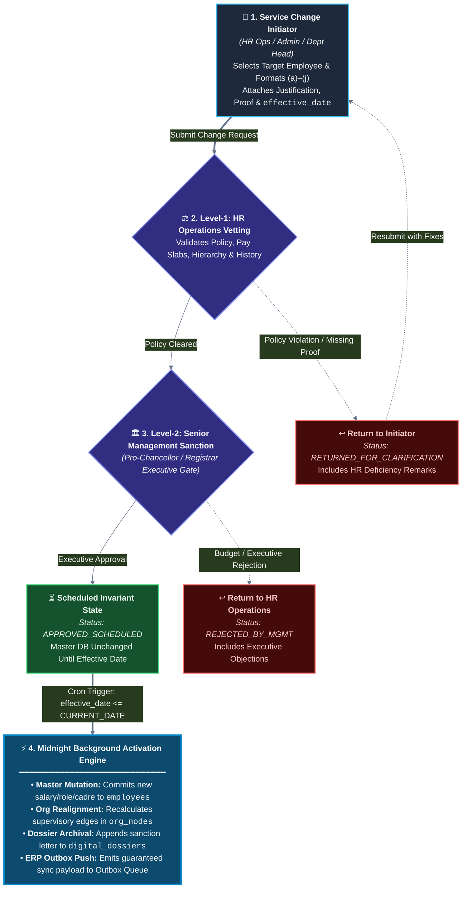
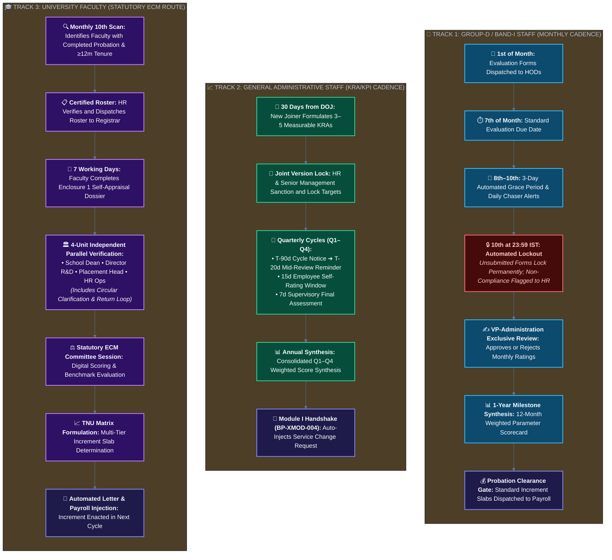

# Business Process Specification
## University HR Change Management & Automation System

| Document Metadata | Specification Detail |
|---|---|
| **Document Identifier** | `DOC-02-BPS-CANONICAL` |
| **Project Name** | University HR Change Management & Automation System |
| **System Phase** | Phase 2 — Consolidated Business Process & Workflow Specification |
| **Document Status** | Approved Canonical Business Process Baseline |
| **Date** | October 2026 |
| **Coverage** | 59 End-to-End Processes across Module I, II, III & Cross-Module, RACI Matrix, SLA Framework |
| **Authoritative Sources** | `source-requirements/` (Module I, II, III Briefs & Visual Workflows) |

---

## 1. Executive Framework & Actor Taxonomy

### 1.1 Purpose
This specification documents the complete, end-to-end operational workflows and business process lifecycles across the University HR Change Management & Automation System. It defines the sequence of operational steps, actor interactions, decision gateways, timing SLAs, exception loops, and cross-module handshakes.

### 1.2 Institutional Actor Taxonomy
The system governs interactions among 16 primary institutional actors:

| Actor Code | Role Title | Institutional Scope & Governance Function |
|---|---|---|
| `ACT-PRO` | Pro-Chancellor / Management | Apex executive authority; final sanction for academic manpower and high-impact appointments. |
| `ACT-VC` | Vice-Chancellor | Statutory head; chairs academic Selection Committee Meetings (SCM) and ECMs. |
| `ACT-REG` | Registrar | Statutory university administrator; oversees institutional notices, ECM dockets, and official orders. |
| `ACT-VPA` | Vice President – Administration | Exclusive approval authority for Group-D / Band-I monthly performance reviews. |
| `ACT-HHR` | Head – Human Resources | Oversees HR operations, manpower planning consolidation, interview approvals, and change vetting. |
| `ACT-HRO` | HR Operations Officer | Executes day-to-day data entry, service change initiation, recruiter calling sheets, and dossier management. |
| `ACT-ADE` | Associate Dean (Academics) | Academic coordinator; initiates manpower planning with School Deans and vets teaching load models. |
| `ACT-DEA` | School Dean | Academic executive head; calculates faculty requirements (Attachment 1) and accepts resignations. |
| `ACT-HOD` | Head of Department | Departmental administrator; conducts Group-D reviews, submits non-academic MRFs, and supervises staff. |
| `ACT-EXP` | External Subject Expert | Independent domain specialist participating in statutory academic Selection Committees (SCM). |
| `ACT-SCM` | Selection Committee Member | Statutory committee member participating in faculty interview panels and digital scoring. |
| `ACT-ECM` | Evaluation Committee Member | Statutory evaluation committee member assessing faculty annual appraisal dossiers. |
| `ACT-FAC` | Academic Faculty Member | Teaching and research staff submitting annual self-appraisals and qualification update requests. |
| `ACT-STF` | General Administrative Staff | Operational and technical staff setting KRA/KPI goals and submitting quarterly self-reviews. |
| `ACT-GPD` | Group-D / Band-I Staff | Maintenance, security, and facility staff evaluated on a monthly cadence by departmental supervisors. |
| `ACT-SYS` | Automated System Engine | Automated background worker managing SLA countdowns, grace periods, auto-locks, and sync outboxes. |

### 1.3 RACI Responsibility Matrix
- **R (Responsible):** The role that executes the task.
- **A (Accountable):** The sole decision-maker with final sign-off authority.
- **C (Consulted):** Domain experts or advisors providing inputs.
- **I (Informed):** Roles notified upon state transitions or milestone completions.

---

## 2. Module I — HR Change Management Processes (`BP-M1-001` to `BP-M1-011`)

### `BP-M1-001`: Employee Profile Creation & Onboarding Intake
- **Trigger:** Selected candidate completes Day-1 joining verification in Module II (`BP-XMOD-001`).
- **Actors:** HR Operations (`ACT-HRO` - R), Head HR (`ACT-HHR` - A), System (`ACT-SYS` - R).
- **Process Steps:**
  1. System receives validated onboarding payload from Module II containing candidate personal, educational, and compensation records.
  2. System mints a globally unique Employee Code and provisions the initial Central Database record (`ENT-MOD1-01`).
  3. System anchors the employee node to their designated department, designation, and reporting supervisor.
  4. System initializes the immutable Digital Personal Dossier (`ENT-MOD1-03`) and archives uploaded onboarding documents.
  5. System enqueues an ERP Master Employee Synchronization event in the transactional outbox (`ENT-SHR-08`).

### `BP-M1-002`: Dynamic Organization Hierarchy Maintenance & Rendering
- **Trigger:** Effective-date activation of any change in designation, reporting authority, reportee, or department.
- **Actors:** System (`ACT-SYS` - R), Head HR (`ACT-HHR` - I).
- **Process Steps:**
  1. Background worker triggers organizational realignment upon change request activation.
  2. Hierarchy tree traverser recalculates parent-child edges and subtree depths.
  3. Tree cache is invalidated and rebuilt in Redis with sub-second response times (`REQ-MOD1-04`).
  4. Real-time WebSocket event (`org-tree:updated`) is broadcast to connected clients to refresh visual canvas.

### `BP-M1-003`: Digital Personal Dossier Maintenance & File Aggregation
- **Trigger:** Employee profile update, service change approval, or annual appraisal completion.
- **Actors:** HR Operations (`ACT-HRO` - R), System (`ACT-SYS` - R).
- **Process Steps:**
  1. Event listener captures completed lifecycle event (LOI, increment letter, evaluation scorecard, degree certificate).
  2. System writes document metadata, SHA-256 hash, and object storage URL to `ENT-MOD1-03`.
  3. Longitudinal timeline view is updated, preserving non-destructive historical inspection.

### `BP-M1-004`: Service Condition Change Request Initiation
- **Trigger:** Requirement to alter employee service terms under Formats (a) through (j).
- **Actors:** HR Operations (`ACT-HRO` - R), Initiator (`ACT-HRO` / `ACT-HOD` - R).
- **Process Steps:**
  1. Initiator selects target employee and specifies one of the 10 approved change formats:
     - *(a) Salary*, *(b) Designation*, *(c) Reportee*, *(d) Reporting Authority*, *(e) Level*, *(f) Department*, *(g) Location*, *(h) Additional Responsibility*, *(i) Qualifications*, *(j) Other Service Condition*.
  2. Form captures current values, proposed values, mandatory `effective_date`, business rationale, and evidentiary attachments.
  3. System validates input constraints, prevents overlapping in-flight changes, and transitions status to `PENDING_HR_REVIEW`.

### `BP-M1-005`: Two-Level Sequential Approval Workflow
- **Trigger:** Submission of change request in `BP-M1-004`.
- **Actors:** HR Reviewer (`ACT-HHR` - R), Senior Management (`ACT-PRO` - A).
- **Process Steps:**
  1. *Level-1 (HR Operations Review):* HR verifies policy compliance, compensation bands, and qualification validity.
     - If rejected: Returned to initiator with comments.
     - If approved: Endorsed and escalated to Level-2.
  2. *Level-2 (Senior Management Approval):* Management reviews business justification and institutional impact.
     - If rejected: Returned to HR with remarks.
     - If approved: Request transitions to `APPROVED_SCHEDULED`.

### `BP-M1-006`: Effective-Date Scheduling & Activation Engine
- **Trigger:** Scheduled date arrives for an `APPROVED_SCHEDULED` change request.
- **Actors:** Automated System Engine (`ACT-SYS` - R).
- **Process Steps:**
  1. Daily midnight batch scheduler identifies requests where `effective_date <= CURRENT_DATE`.
  2. System commits updates to active employee master record in an atomic database transaction.
  3. Dynamic Org Chart is updated, employee dossier receives official notification, and request transitions to `ACTIVE`.

### `BP-M1-007`: Change Execution & Transactional ERP Event Emission
- **Trigger:** Atomic database commit in `BP-M1-006`.
- **Actors:** Automated System Engine (`ACT-SYS` - R).
- **Process Steps:**
  1. Within the same database transaction as the master update, an ERP sync payload is written to `ENT-SHR-08`.
  2. Asynchronous poller consumes outbox entry and transmits update to University ERP platform.
  3. System logs transmission receipt and updates sync status to `ACKNOWLEDGED`.

### `BP-M1-008`: Immutable Audit Ledger & Version History Management
- **Trigger:** Any create, update, approve, reject, or lock transaction across the system.
- **Actors:** Automated System Engine (`ACT-SYS` - R).
- **Process Steps:**
  1. Audit interceptor captures actor ID, IP address, timestamp, table name, before-diff, and after-diff.
  2. Interceptor writes append-only record to `ENT-SHR-02`. Mutation or deletion is physically barred.

### `BP-M1-009`: Dynamic Management Reporting & Analytics Query Execution
- **Trigger:** HR administrator or executive runs custom or canned workforce report.
- **Actors:** HR Administrator (`ACT-HRO` - R), Pro-Chancellor / Registrar (`ACT-PRO` / `ACT-REG` - I).
- **Process Steps:**
  1. User specifies filters (department, cadre, tenure, gender, qualification, vacancy status).
  2. System executes read-optimized SQL query against active database state.
  3. System renders interactive grid and enables structured export to XLSX / CSV.

### `BP-M1-010`: Additional Responsibility Assignment & Tenure Tracking (Format 3h)
- **Trigger:** Faculty or staff assigned secondary institutional role (Dean, HOD, Proctor, Warden).
- **Actors:** HR Operations (`ACT-HRO` - R), Senior Management (`ACT-PRO` - A).
- **Process Steps:**
  1. Change request initiated under Format (h) specifying secondary title, department, start date, and tenure.
  2. Primary post remains active; secondary role node is linked to org hierarchy without unseating primary node.
  3. Administrative allowances (if any) are flagged subject to HR policy sanction (`REQ-TBD-09`).

### `BP-M1-011`: Employee Resignation Recording & Departmental Handoff
- **Trigger:** Employee tenders resignation and School Dean formally accepts it.
- **Actors:** School Dean (`ACT-DEA` - R), Head HR (`ACT-HHR` - I), System (`ACT-SYS` - R).
- **Process Steps:**
  1. Dean logs formal resignation acceptance into Module I with effective separation date.
  2. System marks employee status `RESIGNED_SERVING_NOTICE`.
  3. System immediately invokes cross-module handshake `BP-XMOD-002` to trigger urgent recruitment replacement.

---

## 3. Module II — Recruitment & Selection Processes (`BP-M2-001` to `BP-M2-020`)

```mermaid
%%{init: {'theme': 'base', 'themeVariables': { 'primaryColor': '#1e293b', 'primaryTextColor': '#f8fafc', 'primaryBorderColor': '#38bdf8', 'lineColor': '#64748b'}}}%%
flowchart TD
    %% Styling Classes
    classDef planNode fill:#1e1b4b,stroke:#818cf8,stroke-width:2px,color:#f8fafc;
    classDef acadNode fill:#2e1065,stroke:#c084fc,stroke-width:2px,color:#f8fafc;
    classDef staffNode fill:#064e3b,stroke:#34d399,stroke-width:2px,color:#f8fafc;
    classDef urgentNode fill:#451a03,stroke:#f97316,stroke-width:2px,color:#fff7ed;
    classDef successNode fill:#0c4a6e,stroke:#38bdf8,stroke-width:2px,color:#f8fafc;
    classDef decisionNode fill:#701a75,stroke:#f472b6,stroke-width:2px,color:#ffffff;

    subgraph PLAN ["📅 MANPOWER PLANNING & REQUISITION PHASE"]
        direction TB
        A_TRIG["⏰ <b>Calendar Planning Trigger</b><br/><i>4 Months Pre-Semester / Pre-FY</i>"]:::planNode
        A_DEAN["📋 <b>Deans / HODs Submit Requisitions</b><br/><i>Attachment 1: Teaching Workload & Student Ratios (15d SLA)</i>"]:::planNode
        A_VETT["🔍 <b>HR Comprehensive Vetting</b><br/><i>Consolidated into Master Manpower Plan (Encl 1 & 3)</i>"]:::planNode
        A_CHANC["⚖️ <b>Pro-Chancellor Executive Sanction</b><br/><i>Strict 7-Day Turnaround SLA</i>"]:::decisionNode
        A_AD["📢 <b>Public Recruitment Advertisement</b><br/><i>Print, Portals & Digital Media (7-Day SLA)</i>"]:::planNode

        A_TRIG --> A_DEAN --> A_VETT --> A_CHANC --> A_AD
    end

    subgraph SOURCING ["📥 OMNICHANNEL INGESTION & SCREENING"]
        direction TB
        SRC["🌐 <b>Omnichannel CV Sourcing</b><br/><i>University Portal, Job Boards, Campus & Internshala</i>"]:::planNode
        UGC["🎓 <b>Automated UGC 2018 Screening</b><br/><i>Minimum Qualifications, Ph.D. & Experience Filter</i>"]:::planNode
        RCS["📞 <b>Recruiter Calling Sheet (RCS)</b><br/><i>Telephonic CTC, Notice Period & Communication Rating</i>"]:::planNode

        SRC --> UGC --> RCS
    end

    A_AD ==> SRC

    %% Urgent Replacement Bypass
    RESIGN["⚠️ <b>Dean Accepts Resignation</b><br/><i>(Logged in Module I)</i>"]:::urgentNode
    URG_MRF["⚡ <b>Urgent Replacement MRF (BP-XMOD-002)</b><br/><i>Bypasses Annual Planning Quota</i>"]:::urgentNode
    RESIGN ==> URG_MRF ==> SRC

    RCS ==> SPLIT{"🔀 Cadre Selection Pathway"}:::decisionNode

    subgraph EVAL_ACAD ["🎓 ACADEMIC SELECTION COMMITTEE (SCM)"]
        direction TB
        SCM["🏛️ <b>Statutory SCM Panel Session</b><br/>━━━━━━━━━━━━━━━━━━━━━━━━━━━━━<br/>• Vice-Chancellor / Nominee (Chair)<br/>• School Dean & Head of Department<br/>• Mandatory External Subject Expert<br/>• Standardized Digital Scoring Compilation"]:::acadNode
    end

    subgraph EVAL_STAFF ["🏢 NON-ACADEMIC 3-ROUND INTERVIEWS"]
        direction TB
        NONACAD["👥 <b>3-Round Sequential Evaluation</b><br/>━━━━━━━━━━━━━━━━━━━━━━━━━━━━━<br/>• Round 1: Technical & Functional Test<br/>• Round 2: HR Behavioral Assessment<br/>• Round 3: Executive Leadership Review"]:::staffNode
    end

    SPLIT -- " Academic Cadre " --> SCM
    SPLIT -- " Non-Academic Staff " --> NONACAD

    subgraph OFFER ["📜 OFFER & ONBOARDING LIFECYCLE"]
        direction TB
        MGMT["🤝 <b>Management Sanction & Budget Sign-Off</b>"]:::decisionNode
        LOI["📄 <b>Formal Letter of Intent (LOI) Dispatched</b><br/><i>Automated PDF Populated with Terms & Salary</i>"]:::successNode
        YTJ["⏳ <b>'Yet-to-Join' Pipeline Tracking</b><br/><i>Notice Period Countdown & Relocation Checks</i>"]:::successNode
        ONB["🎉 <b>Day-1 Document Verification & Handshake</b><br/><i>(BP-XMOD-001: Direct Injection to Module I Master DB)</i>"]:::successNode

        MGMT --> LOI --> YTJ --> ONB
    end

    SCM ==> MGMT
    NONACAD ==> MGMT
```

### Academic Manpower Planning Sub-Workflow (`BP-M2-001` to `BP-M2-006`)
- **`BP-M2-001` (Calendar Trigger):** System triggers Academic Manpower Planning 4 months before semester, dispatching planning templates to all School Deans (`REQ-MOD2-02`).
- **`BP-M2-002` (Dean Submission):** Deans compute semester teaching loads using Attachment 1 and submit requisitions within 15 calendar days (`REQ-MOD2-03`).
- **`BP-M2-003` (HR Vetting Window):** HR conducts comprehensive 3-month vetting of curriculum requirements, student-faculty ratios, and cadre allocations (`REQ-MOD2-04`).
- **`BP-M2-004` (Consolidation):** HR consolidates approved requirements into Master Manpower Plan (Enclosures 1 & 3) within 15 days of vetting completion.
- **`BP-M2-005` (Pro-Chancellor Sanction):** Consolidated plan submitted to Pro-Chancellor with mandatory 7-day turnaround SLA (`REQ-MOD2-05`).
- **`BP-M2-006` (Public Advertisement):** HR launches public recruitment advertisements across print and digital media within 7 days of Pro-Chancellor sanction (`REQ-MOD2-06`).

### Non-Academic Manpower Planning Sub-Workflow (`BP-M2-007` to `BP-M2-010`)
- **`BP-M2-007` (Annual Initiation):** HR initiates annual administrative staffing planning 4 months prior to financial year / onboarding date (`REQ-MOD2-07`).
- **`BP-M2-008` (Annual Requisition Quota):** Department Heads submit planned MRFs within 15 days; system strictly enforces quota of one (1) planned MRF per department per year (`BR-M2-009`).
- **`BP-M2-009` (Approval & Initiation):** Approved non-academic requisitions trigger sourcing within 7 days of management approval.
- **`BP-M2-010` (Completion Window):** Non-academic hiring concluded at least 15 days prior to target onboarding date (`BR-M2-012`).

### Sourcing, Screening & Selection (`BP-M2-011` to `BP-M2-020`)
- **`BP-M2-011` (Urgent Replacement):** Resignation acceptance by Dean bypasses annual quota, immediately opening an urgent replacement MRF and starting the countdown clock (`REQ-MOD2-08`).
- **`BP-M2-012` (Open Positions Tracker):** System maintains authoritative vacancy ledger (Attachment 3 / Enclosure 4), generating weekly executive briefings (`REQ-MOD2-10`, `REQ-REP-03`).
- **`BP-M2-013` (CV Ingestion):** CVs ingested across website, job boards, emails, and Internshala into Central CV Database with duplicate deduplication (`REQ-MOD2-11`).
- **`BP-M2-014` (UGC Shortlisting):** Resumes segregated by academic qualifications, experience, and statutory UGC guidelines (`REQ-MOD2-12`).
- **`BP-M2-015` (RCS Phone Screening):** Recruiters conduct initial telephonic screening, recording communication scores, current CTC, and remarks in Recruiter Calling Sheet (`REQ-MOD2-13`).
- **`BP-M2-016` (Academic SCM Panel):** Statutory committee convened with VC, Dean, HOD, and mandatory External Subject Expert; members record scores in digital matrix (`REQ-MOD2-15`, `REQ-MOD2-16`).
- **`BP-M2-017` (Non-Academic 3-Round Selection):** Candidates evaluated sequentially across Round 1 (Technical), Round 2 (HR), and Round 3 (Management) on Job Knowledge, Communication, Attitude (`REQ-MOD2-17`, `REQ-MOD2-18`).
- **`BP-M2-018` (Executive Sanction):** Compiled selection matrix submitted to Management for compensation and budget clearance.
- **`BP-M2-019` (LOI Generation):** System auto-generates official Letter of Intent (LOI) populated with candidate terms, probation period, and salary breakdown (`REQ-MOD2-19`).
- **`BP-M2-020` (Yet to Join Tracking):** Candidates accepting LOI tracked through notice periods, initiating pre-joining logistics, equipment requests, and Day-1 handoff (`REQ-MOD2-20`).

---

## 4. Module III — Performance Management Processes (`BP-M3-001` to `BP-M3-022`)

### Subsystem 1: Group-D / Band-I Performance (`BP-M3-001` to `BP-M3-008`)
- **`BP-M3-001` (Dispatch):** Monthly digital Evaluation Form dispatched on 1st of month to evaluating supervisor/HOD.
- **`BP-M3-002` (7th Due Date):** Supervisor evaluates attendance, conduct, task diligence, and hygiene; formal due date on 7th.
- **`BP-M3-003` (Grace & Lockout):** Automated 3-day grace period (8th, 9th, 10th) with daily reminders. At 23:59 on 10th, unsubmitted forms auto-lock and flag non-compliance (`REQ-MOD3-04`).
- **`BP-M3-004` (VP-Admin Approval):** Submitted monthly forms route exclusively to VP-Administration for executive sign-off (`REQ-MOD3-05`).
- **`BP-M3-005` (Monthly Collation):** System collates approved evaluations into Enclosure 2 format for HR.
- **`BP-M3-006` (1-Year Anniversary Milestone):** Exactly 1 year from employee DOJ, system compiles 12-month parameter-weighted average scores (`REQ-MOD3-07`, `REQ-MOD3-08`).
- **`BP-M3-007` (Probation Verification):** System verifies probation clearance; unconfirmed staff cannot receive increments (`REQ-MOD3-09`).
- **`BP-M3-008` (Slab Compensation Update):** System applies institutional pre-defined compensation increment slab and triggers Module I change request (`REQ-TBD-05`).

### Subsystem 2: General Staff KRA/KPI (`BP-M3-009` to `BP-M3-013`)
- **`BP-M3-009` (30-Day Goal Setting):** New administrative joiners configure KRA/KPI Goal Sheets with supervisor within 30 days of joining (`REQ-MOD3-10`).
- **`BP-M3-010` (Joint Lock):** Goal sheets reviewed jointly by HR and Management, freezing targets for the annual cycle (`REQ-MOD3-11`).
- **`BP-M3-011` (Quarterly Review Cadence):** Automated quarterly schedule (Q1–Q4): 90-day advance notice, 20-day reminder, 15-day employee self-review window, 7-day supervisor verification (`REQ-MOD3-12`).
- **`BP-M3-012` (HR Observations):** HR reviews quarterly progress, flags support needs, and submits summary to Management.
- **`BP-M3-013` (Annual Outcome Handshake):** Consolidated annual performance rating triggers in-flight Module I Service Change Request for promotion or salary increment (`REQ-MOD3-13`).

### Subsystem 3: Faculty ECM Performance (`BP-M3-014` to `BP-M3-022`)
- **`BP-M3-014` (Monthly 10th Scan):** Automated engine runs on 10th of every month, scanning for faculty who completed probation and have $\ge$ 12 months service; certified roster sent to Registrar (`REQ-MOD3-14`).
- **`BP-M3-015` (7-Day Self-Appraisal):** Eligible faculty submit digital self-appraisal dossier with publications, workload, and student feedback within 7 working days (`REQ-MOD3-15`).
- **`BP-M3-016` (4-Unit Parallel Verification):** Dossier routed simultaneously to School Dean (academic work), Director R&D (research/patents), Placement Cell (corporate linkages), and HR (leave/conduct) (`REQ-MOD3-16`).
- **`BP-M3-017` (Discrepancy Dispute Loop):** Verifying units can return queries for evidentiary correction; faculty has fixed correction window while verified sections remain locked (`BR-M3-018`).
- **`BP-M3-018` (Monthly ECM Convening):** Registrar dockets verified dossiers for monthly Executive Committee Meeting; panel enters scores into digital Enclosure 2 scorecards (`REQ-MOD3-17`).
- **`BP-M3-019` (TNU Benchmark Matrix):** Scores mapped against TNU Protocol criteria matrix (Enclosure 3) to formulate increment or promotion recommendations (`REQ-MOD3-18`).
- **`BP-M3-020` (Management Sanction):** Executive leadership reviews matrix and sanctions increments.
- **`BP-M3-021` (Next Salary Cycle Execution):** Increment applied in upcoming payroll cycle; system auto-generates official compensation revision letter (`REQ-MOD3-19`).
- **`BP-M3-022` (Dossier Archival):** Full appraisal record, scoring sheets, and signed revision letter archived into Digital Employee File in Module I.

---

## 5. Cross-Module Integration Workflows (`BP-XMOD-001` to `BP-XMOD-006`)

| Process ID | Name | Trigger | Source $\rightarrow$ Target | Outcome |
|---|---|---|---|---|
| `BP-XMOD-001` | Candidate Onboarding Handshake | Day-1 Joining Verification | Mod II $\rightarrow$ Mod I | Auto-instantiates master employee code, Central DB record, org tree node, and digital dossier. |
| `BP-XMOD-002` | Resignation Urgent Replacement | Dean Resignation Acceptance | Mod I $\rightarrow$ Mod II | Alerts Head HR and immediately opens urgent replacement MRF countdown. |
| `BP-XMOD-003` | Master Baseline Data Feed | Daily / Continuous | Mod I $\rightarrow$ Mod III | Provides authoritative DOJ, probation status, department, and supervisor hierarchy. |
| `BP-XMOD-004` | Appraisal Outcome Service Change | Annual Appraisal Approval | Mod III $\rightarrow$ Mod I | Injects formal Service Change Request into Module I, routed for Level-1 & Level-2 approvals. |
| `BP-XMOD-005` | Dynamic Org Realignment | Org Structure Modification | Mod I $\rightarrow$ Mod III | Updates in-flight performance evaluation routing to new supervisor. |
| `BP-XMOD-006` | Transactional ERP Outbox Sync | Master Record Activation | Mod I $\rightarrow$ University ERP | Writes sync event to transactional outbox; poller guarantees delivery. |

---

## 6. Comprehensive SLA and Escalation Matrix

| SLA Code | Governed Process & Target Action | Statutory Window / Countdown Timer | Escalation Pathway & Breach Notification |
|---|---|---|---|
| `SLA-M2-01` | **Academic Planning Trigger** | 4 Months Pre-Semester | Automated alert to Associate Dean & HR Operations |
| `SLA-M2-02` | **Dean Workload Submission (Att. 1)** | 15 Calendar Days from Trigger | Direct escalation to Pro-Chancellor & Registrar |
| `SLA-M2-03` | **HR Curriculum & Ratio Vetting** | 3-Month Comprehensive Window | Milestone briefing to Head HR & Vice-Chancellor |
| `SLA-M2-04` | **Pro-Chancellor Requisition Sanction** | Strict 7-Day Turnaround SLA | Critical alert to Senior Executive Management |
| `SLA-M2-05` | **Public Recruitment Advertisement** | 7 Calendar Days from Sanction | Escalation ticket dispatched to Head HR |
| `SLA-M2-06` | **Academic Hiring Conclusion** | 1 Month Prior to Semester Start | High-priority staffing risk flag to Vice-Chancellor |
| `SLA-M2-07` | **Non-Academic Annual Initiation** | 4 Months Prior to Fiscal Year / DOJ | Automated dispatch of MRF templates to Department Heads |
| `SLA-M2-08` | **Department Non-Academic MRF** | 15 Calendar Days from Trigger | Escalation alert dispatched to Registrar |
| `SLA-M2-09` | **Non-Academic Public Ad Launch** | 7 Calendar Days from Sanction | Operations reminder to HR Recruitment Cell |
| `SLA-M2-10` | **Non-Academic Hiring Conclusion** | 15 Days Prior to Onboarding Date | Facility and IT provisioning alert to Department Head |
| `SLA-M3-01` | **Group-D Evaluation Due Date** | 7th of Every Month | System initiates 3-day grace period with reminder toasts |
| `SLA-M3-02` | **Group-D Grace Period Reminders** | Daily on 8th, 9th, and 10th | High-priority SMS and email alerts to Evaluating Supervisor |
| `SLA-M3-03` | **Group-D Automated Lockout** | 10th of Month at 23:59:59 IST | Form auto-locks permanently; non-compliance logged to HR |
| `SLA-M3-04` | **Staff KRA/KPI Target Setting** | 30 Days from Date of Joining | Overdue alert dispatched to Direct Supervisor & Head HR |
| `SLA-M3-05` | **Staff Quarterly Self-Review** | 15 Calendar Days from Cycle Open | Automated reminder to Employee & Direct Supervisor |
| `SLA-M3-06` | **Staff Supervisor Review Verification**| 7 Calendar Days from Self-Review | Escalation ticket to HR Operations Manager |
| `SLA-M3-07` | **Faculty Eligibility Scan** | 10th of Every Month at 00:01 IST | Automated generation and certified dispatch to Registrar |
| `SLA-M3-08` | **Faculty Self-Appraisal Submission** | 7 Working Days from Roster Notice | Formal reminder to Faculty Member & School Dean |
| `SLA-M3-09` | **Faculty Increment Enactment** | Next Immediate Payroll Cycle | Financial discrepancy escalation to Chief Finance Officer |

