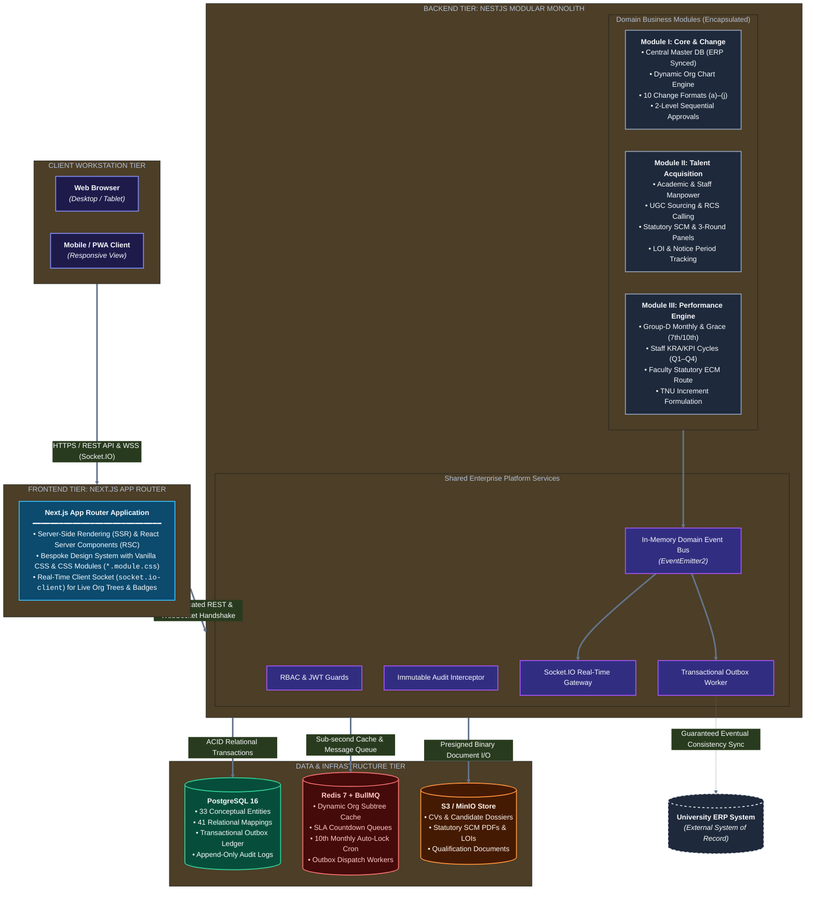
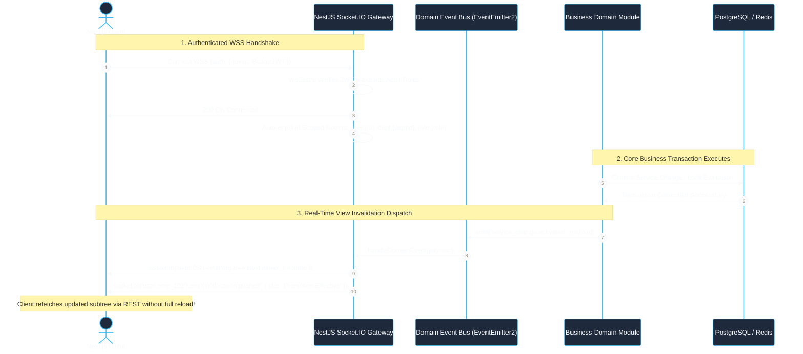
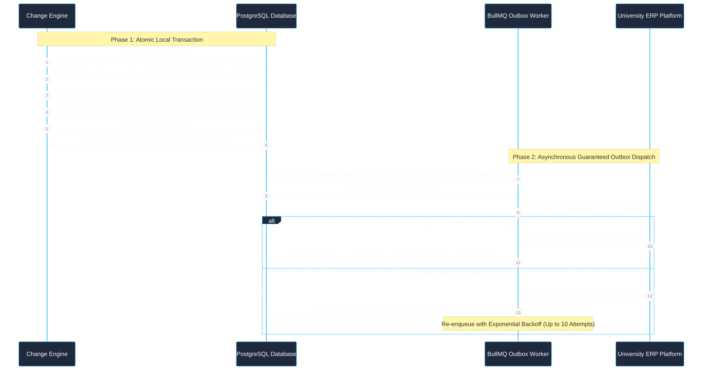

# System Architecture Specification
## University HR Change Management & Automation System

| Document Metadata | Specification Detail |
|---|---|
| **Document Identifier** | `DOC-04-ARCH-CANONICAL` |
| **Project Name** | University HR Change Management & Automation System |
| **System Phase** | Phase 1.5 & Phase 4 — Consolidated System Architecture Specification |
| **Document Status** | Approved Canonical Architecture Baseline |
| **Date** | October 2026 |
| **Architectural Pattern** | Modular Monolith (NestJS Backend + Next.js Frontend) |
| **Authoritative Sources** | `source-requirements/TECHNOLOGY_ARCHITECTURE_BASELINE.md` & `ADR-001` |

---

## 1. Architectural Principles & System Context

### 1.1 Architectural Style: The Modular Monolith
The University HR Change Management & Automation System is architected as an enterprise-grade **Modular Monolith**. 

Rather than deploying distributed microservices—which introduce network latency, distributed transaction complexity, and excessive DevOps overhead for an institutional HR platform—the system encapsulates distinct business modules within a single deployable application unit. Strong logical boundaries, encapsulated domain schemas, and in-memory event buses enforce decoupling between modules.

---

## 2. Technology Stack Selection & Baseline Invariants

| Layer | Selected Technology | Architectural Rationale & Standards |
|---|---|---|
| **Frontend Framework** | **Next.js (App Router, React 19, TypeScript)** | High performance, server-side rendering for data-heavy administrative views, deep linking, and automated bundle splitting. |
| **Styling & CSS Architecture** | **Vanilla CSS + CSS Modules (`*.module.css`)** | Maximum styling control, zero runtime CSS bloat, scoped styles per component, bespoke University Design System using CSS Variables. Tailwind CSS is strictly excluded. |
| **Backend Framework** | **NestJS (TypeScript)** | Enterprise TypeScript architecture, dependency injection, modular domain isolation, built-in validation pipes, and robust ecosystem for WebSockets and queues. |
| **Primary Database** | **PostgreSQL** | ACID relational transactions, JSONB for flexible change schemas, strong referential integrity, and high-throughput query performance. |
| **In-Memory Cache & Queues** | **Redis + BullMQ** | Sub-second caching for dynamic organization trees; reliable persistent queues with retry mechanisms for notifications and cron tasks. |
| **Real-Time Communication** | **Socket.IO** | Bi-directional event push, WebSocket with automatic HTTP long-polling fallback, room-based channel routing, heartbeat reconnection (`ADR-001`). |
| **Binary Object Storage** | **S3-Compatible Object Store** | Complete separation of binary files (CVs, qualification documents, LOI PDFs) from relational database records. Relational tables store metadata and SHA-256 hashes only. |

---

## 3. Real-Time Communication Architecture (Socket.IO)

Per the approved **`ADR-001-REAL-TIME-COMMUNICATION.md`**, Socket.IO provides the real-time event pipeline for institutional operations:

### 3.1 Room & Namespace Architecture
1. **User Personal Room (`user:{userId}`):** Personal notifications, SLA reminders, document verification return queries, and task assignments.
2. **Departmental Room (`dept:{deptId}`):** Department-wide announcements, vacancy updates, and recruitment milestones.
3. **Role-Based Room (`role:{roleCode}`):** High-priority alerts to Deans, HR Operations, or Senior Management.
4. **Global System Room (`system:broadcast`):** University-wide maintenance announcements and emergency broadcasts.

### 3.2 Key Real-Time Events
- `org-tree:invalidated`: Triggered upon effective-date activation of designation/supervisor/dept changes; instructs client tree canvas to invalidate local cache and re-fetch active subtree.
- `notification:pushed`: Pushes instant task assignments and SLA warning toasts without full page refreshes.
- `evaluation:locked`: Real-time notification dispatched at 23:59 on 10th of month to evaluating supervisors whose Group-D submissions have been locked.

---

## 4. Background Job Scheduling & Asynchronous Queues

All time-sensitive, schedule-driven, and compute-heavy operations are offloaded to **BullMQ** running on Redis:

| Queue Name | Job Responsibility | Frequency / Trigger | Failure / Retry Policy |
|---|---|---|---|
| `sla-countdown-queue` | Monitors deadlines for Deans (15d), Pro-Chancellor (7d), Faculty (7d), Staff (15d). | Recurring 15-minute cron | 3 retries, exponential backoff, alerts admin on dead letter. |
| `group-d-lockout-queue` | Executes auto-lockout for unsubmitted Group-D forms on 10th of month at 23:59 IST. | Exact monthly schedule (10th 23:59) | Critical job; executes with idempotent locking and emits HR non-compliance alert. |
| `effective-date-activation` | Scans for approved service changes where `effective_date <= CURRENT_DATE` and commits them. | Daily at 00:01 IST | Transactional commit; rolls back on failure and alerts HR. |
| `erp-sync-outbox-queue` | Polls transactional outbox and dispatches updates to University ERP platform. | Poller every 30 seconds | At-least-once delivery; exponential backoff up to 24 hours. |
| `notification-dispatch-queue` | Dispatches outbound SMTP emails and transactional SMS notifications. | Immediate event push | 5 retries, rate-limited to avoid gateway throttling. |

---

## 5. Security, Identity & Data Governance

### 5.1 Authentication & RBAC
- Stateless **JSON Web Tokens (JWT)** with short-lived access tokens (15 minutes) and rotating refresh tokens stored in HTTP-only, Secure cookies.
- Granular **Role-Based Access Control (RBAC)** enforced at the controller level via NestJS Guards (`@Roles('HR_ADMIN', 'DEAN', 'REGISTRAR')`).
- Strict segregation of duties: No user may approve their own requisition, evaluation, or change request (`BR-ENT-003`).

### 5.2 Immutable Audit Ledger
- All master mutations intercept through a database middleware capturing:
  - `actor_id`: Authenticated user performing action.
  - `ip_address`: Source IP address.
  - `table_name`: Target database table.
  - `action_type`: `INSERT`, `UPDATE`, `SOFT_DELETE`, `STATE_TRANSITION`.
  - `before_state`: Complete JSON snapshot prior to mutation.
  - `after_state`: Complete JSON snapshot following mutation.
  - `timestamp`: UTC microsecond timestamp.
- Audit table permissions are restricted to `INSERT` and `SELECT` only; `UPDATE` and `DELETE` SQL grants are revoked at the PostgreSQL engine level.

---

## 6. Integration Architecture: Transactional Outbox Pattern

To synchronize employee master data with the University ERP without distributed transaction failures, the system implements the **Transactional Outbox Pattern**:

