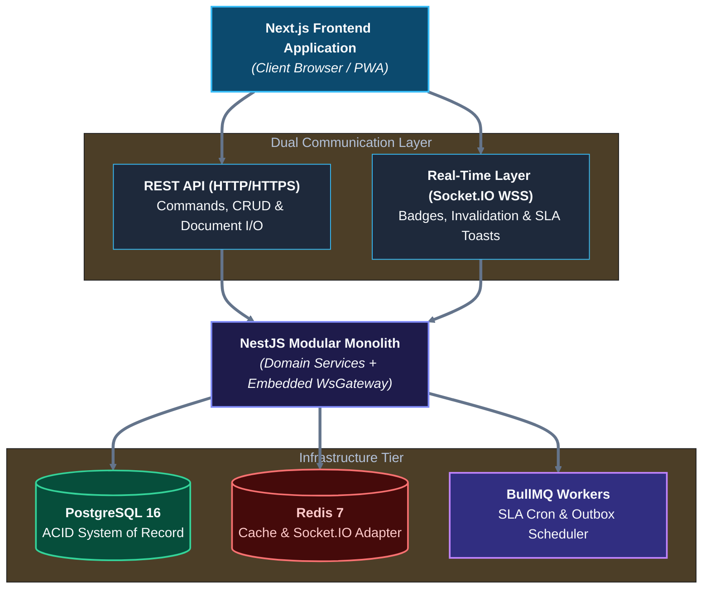
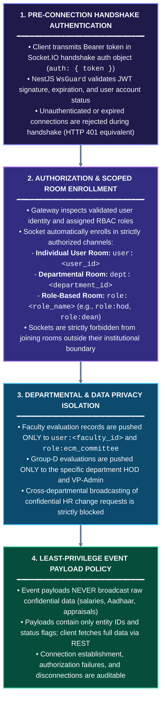
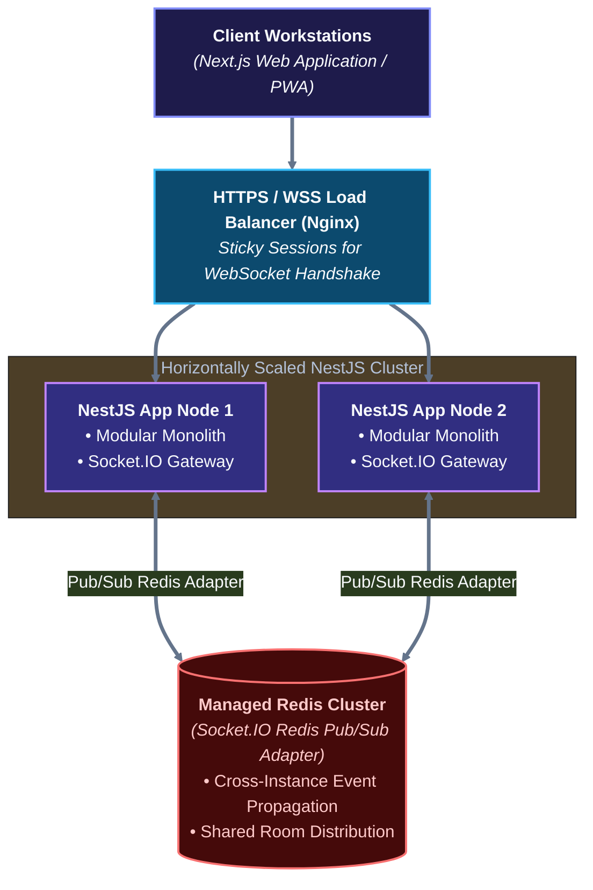

# ADR-001 — Real-Time Communication Strategy
## University HR Change Management & Automation System

**Document Identifier:** `ADR-001`  
**Architecture Domain:** System Architecture & Integration  
**File Location:** `docs/07-system-architecture/ADR-001-REAL-TIME-COMMUNICATION.md`  
**Status:** **APPROVED BASELINE** (`[C] Approved Technical Decision`)  
**Date of Decision:** September 29, 2026  
**Decision Authority:** System Architecture Working Group  
**Workspace:** `d:\Desktop\HR-CHANGE-MANAGEMENT-SYSTEM`  

---

## 1. Status

**APPROVED BASELINE (`[C] Approved Technical Decision`)**

This Architecture Decision Record (ADR) formally establishes the server-to-client real-time communication strategy, technology selection, and architectural boundary rules for the University HR Change Management & Automation System.

---

## 2. Date

**September 29, 2026**

---

## 3. Context

The University HR Change Management & Automation System encompasses three core operational modules and cross-cutting shared capabilities:
- **Module I — HR Change Management:** Central Employee Database, Dynamic Organization Chart realignments, 10 standardized service-change categories, two-level approval hierarchies (HR Level → Senior Management), and temporal effective-date tracking.
- **Module II — Recruitment & Selection Automation:** Academic (Faculty & Lab Technicians) and Non-Academic (Staff) manpower planning, urgent replacement pipelines, Open Positions Tracker, multi-channel sourcing, UGC-norms screening, Recruiter Calling Sheet (RCS), Statutory Selection Committee Meetings (SCM), 3-round interviews, Letter of Intent (LOI) generation, and "Yet to Join" onboarding integration.
- **Module III — Performance Management Automation:** Three independent appraisal subsystems: Group-D Monthly/Annual review with 10th-of-month lockout, Staff KRA/KPI quarterly cycles, and Faculty Annual Evaluation Committee Meetings (ECM Route) with the TNU Protocol scoring matrix.
- **Shared Platform Capabilities:** Role-Based Access Control (RBAC), SLA & Timeline Engine, Asynchronous Job Schedulers, Notification Management, Document Storage, and Real-Time Reporting.

The approved technical baseline ([`TECHNOLOGY_ARCHITECTURE_BASELINE.md`](file:///d:/Desktop/HR-CHANGE-MANAGEMENT-SYSTEM/TECHNOLOGY_ARCHITECTURE_BASELINE.md)) defines:
- **Architecture:** Modular Monolith.
- **Frontend:** Next.js, TypeScript, Vanilla CSS, CSS Modules, CSS Variables.
- **Backend:** NestJS, TypeScript, REST API.
- **Primary Database (System of Record):** PostgreSQL.
- **Supporting Infrastructure:** Redis (Cache, Queue Broker, Distributed Locks), Object Storage (S3-compatible), Background Workers / Schedulers (`[C] Approved Technical Decision`; specific queue engine such as BullMQ is `[D] Proposed Detail`).

While the primary communication paradigm for user commands, transactional updates, approvals, and report requests is synchronous **REST over HTTP/HTTPS**, the system requirements repeatedly demand immediate operational visibility, live queue updates, real-time dashboard refresh, SLA warnings, and dynamic organizational structure reflections.

---

## 4. Problem

How should the University HR Change Management & Automation System implement server-to-client live communication to satisfy requirements for timely operational visibility, pending approval indicators, dynamic org-chart synchronization, and SLA alerts, while strictly preserving:
1. **The Modular Monolith architecture** (without introducing microservices or independent messaging brokers)?
2. **PostgreSQL as the sole System of Record (SoR)** (ensuring real-time channels never store or lose authoritative business state)?
3. **REST as the primary protocol** for all transactional business operations, workflow commands, and full-state page hydration?
4. **Strict institutional data isolation and RBAC** (ensuring confidential HR, compensation, and appraisal data is never leaked via broadcast channels)?
5. **Operational resilience and recovery** (ensuring that clients can gracefully handle network disconnects and reconnect without state desynchronization)?

---

## 5. Requirements Driving the Decision

The decision is driven by both explicit source requirements (`[A]`) and logically derived technical primitives (`[B]`):

| Requirement ID | Source Document | Mandate / Functional Need | Classification | Real-Time Driver |
|---|---|---|:---:|---|
| `MOD1-ORG-01` / `REQ-MOD1-04` | Module I Brief, Structure (2) | Organization Chart must dynamically update when employee department, designation, or supervisor changes are approved. | `[A]` Explicit | Active viewers of the org-chart must receive immediate notification to invalidate their tree cache and reflect realigned reporting structures. |
| `MOD1-APP-01` / `REQ-MOD1-16` | Module I Brief, Process (4) | Two-level approval hierarchy (HR Level → Senior Management) with tracking of pending submissions. | `[A]` Explicit | Approvers require live indicator badges and real-time queue counters without manual page reloads. |
| `MOD1-DAT-01` / `REQ-MOD1-19` | Module I Brief, Process (5) | Effective-date processing activates changes at midnight of the target date. | `[C]` Approved Tech | Background activation worker must notify online HR dashboards that scheduled updates have transitioned to active status. |
| `MOD2-POS-01` / `REQ-MOD2-09` | Module II Brief, Trackers (1) | Open Positions Tracker (Attachment 3) maintained within 30 days and updated weekly for Executive Management. | `[A]` Explicit | Recruitment team and executive leadership require immediate visibility into vacancy status transitions (Sourced → Interviewing → Offered → Joined). |
| `MOD2-ONB-01` / `REQ-MOD2-20` | Module II Brief, Onboarding | "Yet to Join" tracker updates upon LOI acceptance, alerting Deans, HODs, and IT Admin. | `[A]` Explicit | Multi-department onboarding stakeholders require live notifications when an offer is formally accepted. |
| `MOD3-GD-EVAL-01` / `REQ-MOD3-04` | Module III Brief, Group-D | Evaluation form due by 7th, 3-day grace to 10th; automated system lockout at 23:59 on the 10th. | `[A]` Explicit | HODs with pending evaluations must receive urgent visual SLA warning banners and real-time countdown reminders before lockout. |
| `MOD3-KRA-QTR-01` / `REQ-MOD3-12` | Module III Brief, KRA/KPI | Quarterly review cycle: 90-day intimation, 20-day reminder, 15-day submission, 7-day supervisor verification. | `[A]` Explicit | Time-sensitive quarterly appraisal milestones require live in-app notification alerts for employees and reviewing supervisors. |
| `MOD3-FAC-ECM-01` / `REQ-MOD3-17` | Module III Brief, Faculty | Monthly ECM scoring with digital entry, online score compilation, and immediate matrix visibility to Management. | `[A]` Explicit | Meeting participants and executive leadership require real-time score updates during statutory committee proceedings. |
| `REQ-SLA-01` to `REQ-SLA-10` | Universal Specifications | In-app dashboard notifications, SLA breach warnings, and multi-tier approval escalations. | `[A]` Explicit / `[B]` Implied | Users require immediate server-push delivery of notifications and SLA warnings while actively working in the browser. |

> **Distinction Note:** While business requirements explicitly mandate real-time visibility (`[A]`), the selection of a dedicated server-push technology is a logical architectural derivation (`[B]`) and technical architecture decision (`[C]`). The source requirement briefs do not dictate WebSocket or Socket.IO; they dictate timely, responsive visibility.

---

## 6. Options Considered

The architecture working group evaluated four potential technical strategies:

| Strategy | Protocol / Paradigm | In-Flight Latency | Infrastructure Overhead | Architectural Decision |
|---|---|---|---|---|
| **Option 1: REST Only** | HTTP/HTTPS Pull | Stale until user navigation | Zero additional persistent state | **REJECTED** (Fails real-time SLA alerting) |
| **Option 2: Periodic Polling** | Automated HTTP `setInterval` | Interval-bounded (10–30s) | High database read churn | **REJECTED** (Wasteful database load) |
| **Option 3: Native WebSocket** | Raw RFC 6455 (`ws`) | Sub-second (<100ms) | Custom heartbeats, reconnects, channels | **REJECTED** (Excessive bespoke logic) |
| **Option 4: Socket.IO** | Engine.IO over WSS + Polling Fallback | Sub-second (<50ms) | Low; reuses existing Redis cluster | **APPROVED** (Native rooms, resilience, NestJS support) |

### Option 1: REST Only (No Server-Push)
- **Mechanism:** Client requests data strictly on page navigation, explicit user refresh, or form submission.
- **Advantages:** Minimal backend complexity; completely stateless; zero persistent connections; simple caching.
- **Disadvantages:** Fails to meet the requirement for immediate visibility; approvers remain unaware of pending requests until manual page reload; SLA warnings can be missed during active browser sessions; dynamic org-chart updates remain stale.
- **Evaluation:** **REJECTED.** Inadequate for institutional workflow alerting, live counters, and collaborative committee evaluations.

### Option 2: Periodic HTTP Polling (Short / Long Polling)
- **Mechanism:** Next.js client runs `setInterval()` timers (e.g., every 10–30 seconds) issuing repeated REST requests to check for updates.
- **Advantages:** Utilizes existing REST endpoints; standard HTTP request/response semantics; firewall friendly.
- **Disadvantages:** Extremely wasteful network and database utilization (thousands of empty queries executed by idle workstation tabs); high connection churn; artificial latency (updates delayed by polling interval); causes unnecessary database read load on PostgreSQL.
- **Evaluation:** **REJECTED.** Creates unacceptable server load and latency trade-offs that scale poorly across university staff and faculty.

### Option 3: Native WebSocket (`ws` / `@nestjs/platform-ws`)
- **Mechanism:** Raw RFC 6455 bidirectional TCP connections maintained between browser and NestJS backend.
- **Advantages:** Minimal protocol overhead; low frame size; standard web technology.
- **Disadvantages:**
  - Requires writing custom heartbeat ping/pong mechanisms to detect dead TCP connections.
  - Requires building custom client-side reconnection logic with exponential backoff and jitter.
  - Lacks native room and namespace abstractions, requiring bespoke channel subscription and routing code.
  - Complex to scale across multiple backend instances (requires manual Redis Pub/Sub integration and message serialization).
  - Lacks built-in transport fallback if corporate/campus proxy firewalls block native WebSocket handshakes.
- **Evaluation:** **REJECTED.** High engineering and maintenance overhead for capabilities that are commoditized in established libraries.

### Option 4: Socket.IO (`@nestjs/platform-socket.io` + `socket.io-client`)
- **Mechanism:** Enterprise-grade real-time event library providing bidirectional event-based communication over WebSocket with automatic HTTP long-polling fallback.
- **Advantages:**
  - **First-Class NestJS Support:** Native `@WebSocketGateway()`, `@SubscribeMessage()`, and `@WebSocketServer()` decorators supported out of the box via `@nestjs/platform-socket.io`.
  - **Seamless Next.js Integration:** Lightweight `socket.io-client` easily encapsulated in custom React Context / hook abstractions.
  - **Automatic Reconnection & Resilience:** Battle-tested reconnection mechanics with configurable backoff, jitter, and connection lifecycle event hooks (`connect`, `disconnect`, `connect_error`).
  - **Native Rooms & Namespaces:** Elegant server-side abstractions for user-specific (`user:<id>`), department-specific (`dept:<id>`), and role-specific (`role:<role>`) channels, perfectly matching university RBAC isolation requirements.
  - **Zero-Code Multi-Node Scaling:** Seamless horizontal distribution via the official `@socket.io/redis-adapter`, leveraging the already-approved Redis infrastructure ([`TDR-06`](file:///d:/Desktop/HR-CHANGE-MANAGEMENT-SYSTEM/TECHNOLOGY_ARCHITECTURE_BASELINE.md)).
  - **Transport Fallback:** Automatically degrades to HTTP long-polling if restrictive campus network firewalls terminate raw WebSocket connections.
- **Evaluation:** **SELECTED AND APPROVED.**

---

## 7. Decision

**Socket.IO is APPROVED as the official real-time communication technology (`[C] Approved Technical Decision`) for the application-level server-to-client real-time layer.**

### Core Tenets of the Approved Real-Time Baseline:
1. **REST Remains Primary Protocol:** All CRUD operations, business commands, workflow mutations, approvals, file uploads, and report generations must be executed via authenticated **REST API** endpoints. Socket.IO **does NOT replace REST**.
2. **PostgreSQL Remains Sole System of Record:** Business data is committed strictly to PostgreSQL within transactional boundaries. Socket.IO is strictly an **ephemeral notification and view-invalidation channel**.
3. **Real-Time Layer Scope:** The real-time channel is strictly reserved for:
   - Live badge counters (e.g., pending approvals, unread notifications).
   - In-app toast alerts and SLA breach warnings.
   - Cache invalidation signals (e.g., prompting the client to re-fetch the org chart branch or candidate pipeline).
   - Active workflow state transition indicators.
4. **Architectural Form:** The real-time gateway runs embedded within the **NestJS Modular Monolith** process, maintaining full cohesion with domain modules and leveraging the existing Redis cache/queue cluster for multi-instance scaling.

### Proposed Conceptual Communication Topology:



### Protocol & Architectural Responsibility Separation:

| Layer / Component | Architectural Responsibilities & Allowed Operations |
|---|---|
| **REST API (HTTP/HTTPS)** | • Primary mechanism for all client-to-server operations.<br>• User authentication and session issuance.<br>• Business commands: form submissions, change requests.<br>• Workflow actions: approvals, rejections, returns.<br>• Master data retrieval: employee records, org trees, CV lists.<br>• Report requests: dynamic query execution, XLSX/CSV streaming.<br>• Document operations: uploads, downloads, presigned URLs. |
| **Real-Time Layer (Socket.IO over WebSocket)** | • Server-to-client live event push only.<br>• Live approval queue counter badges.<br>• In-app notification toast alerts.<br>• SLA countdown warnings and lockout notifications.<br>• Org chart cache invalidation triggers.<br>• Live workflow state update notifications.<br>• Collaborative evaluation score sync (ECM session). |
| **Background Workers / Scheduler (NestJS + BullMQ)** | • SLA timeline calculations and countdown tracking.<br>• Scheduled cron jobs (midnight effective-date activations).<br>• Automated 10th-of-month Group-D evaluation lockout at 23:59.<br>• Asynchronous PDF generation (LOIs, letters, reports).<br>• External ERP outbox synchronization dispatch.<br>• Outbound multi-channel notification dispatch (SMTP/SMS). |
| **Managed PostgreSQL 16** | • Sole authoritative System of Record (SoR).<br>• ACID transactional integrity for all master and change data.<br>• Append-only immutable audit ledger (`audit_logs`).<br>• Temporal tracking (`effective_date`, `valid_from`, `valid_to`). |
| **Managed Redis 7** | • In-memory fast cache (org chart hierarchy, permissions).<br>• Persistent queue backing for background workers (BullMQ).<br>• Cross-instance event distribution via `@socket.io/redis-adapter`.<br>• Atomic distributed locks for scheduled crons.<br>• NOT the System of Record; loss of Redis does not lose data. |

### Real-Time Use Case Classification Catalogue:

| Use Case ID | Functional Domain & Use Case | Primary Protocol | Real-Time Push Mechanism | Background Processing | Classification |
|---|---|:---:|:---:|:---:|:---:|
| **UC-RT-01** | **Org Chart Dynamic Updates:** Hierarchy realignments, supervisor changes, or department transfers. | `[REST]` (Fetch tree data) | `[REAL-TIME PUSH]` (`orgchart.updated` notifies active viewers to re-fetch branch) | Cache invalidation in Redis | `[COMBINATION]` |
| **UC-RT-02** | **Employee Service-Change Approval:** 2-level approval transition (HR → Senior Management). | `[REST]` (Submit approval command) | `[REAL-TIME PUSH]` (`approval.completed` updates request status badge) | Write audit log; check effective date | `[COMBINATION]` |
| **UC-RT-03** | **Effective-Date Activation:** Midnight activation of scheduled salary, designation, or role changes. | `[REST]` (Fetch active profile) | `[REAL-TIME PUSH]` (`employee.activated` pushes notification to HR & employee) | `[BACKGROUND]` (Background Scheduler executes commit at 00:00) | `[COMBINATION]` |
| **UC-RT-04** | **Pending Approval Indicators:** Live counter badges for pending HR and Senior Management approvals. | `[REST]` (Fetch approval list) | `[REAL-TIME PUSH]` (`approval.pending` increments pending badge counter) | None | `[COMBINATION]` |
| **UC-RT-05** | **Digital Employee File Updates:** Attachment additions, service records, or document archiving. | `[REST]` (Upload file & metadata) | `[REAL-TIME PUSH]` (`employee.file.updated` notifies viewing HR officer) | Virus scan & checksum verification | `[COMBINATION]` |
| **UC-RT-06** | **Recruitment Workflow Transitions:** MRF submission, Dean vetting, Pro-Chancellor sign-off. | `[REST]` (Submit requisition/approval) | `[REAL-TIME PUSH]` (`recruitment.updated` updates pipeline view) | SLA timer initialization | `[COMBINATION]` |
| **UC-RT-07** | **Open Positions Tracker Live Updates:** Status changes from sourcing through interview and selection. | `[REST]` (Fetch tracker dataset) | `[REAL-TIME PUSH]` (`recruitment.tracker.updated` triggers row refresh) | Weekly digest collation | `[COMBINATION]` |
| **UC-RT-08** | **Candidate Pipeline Stage Movement:** CV screened, RCS completed, interview scheduled. | `[REST]` (Update candidate status) | `[REAL-TIME PUSH]` (`candidate.status.changed` updates Kanban/stage column) | Automated screening engine | `[COMBINATION]` |
| **UC-RT-09** | **Interview Scheduling & Panel Updates:** SCM panel finalized, 3-round interview slot assigned. | `[REST]` (Save schedule) | `[REAL-TIME PUSH]` (`interview.scheduled` delivers toast to panelists) | `[BACKGROUND]` (Email invitation & calendar dispatch) | `[COMBINATION]` |
| **UC-RT-10** | **"Yet-to-Join" Pre-Onboarding Updates:** Candidate accepts LOI; onboarding countdown starts. | `[REST]` (Record LOI acceptance) | `[REAL-TIME PUSH]` (`onboarding.accepted` alerts Deans, HODs, IT Admin) | `[BACKGROUND]` (Creates Master DB record & org node) | `[COMBINATION]` |
| **UC-RT-11** | **Recruitment SLA Warning Alerts:** 15-day MRF window, 7-day Pro-Chancellor review countdown. | `[REST]` (View SLA dashboard) | `[REAL-TIME PUSH]` (`sla.warning` renders visual amber/red alert banner) | `[BACKGROUND]` (Background Worker evaluates breach threshold) | `[COMBINATION]` |
| **UC-RT-12** | **Group-D Evaluation Pending Counters:** Monthly evaluation pending indicators for HODs. | `[REST]` (Fetch monthly forms) | `[REAL-TIME PUSH]` (`appraisal.groupd.pending` increments HOD pending badge) | Monthly form generation on 1st | `[COMBINATION]` |
| **UC-RT-13** | **Group-D 10th-of-Month Lockout Alert:** Urgent warning banner as 23:59 lockout approaches. | `[REST]` (Submit completed form) | `[REAL-TIME PUSH]` (`sla.lockout.warning` pushes urgent modal alert) | `[BACKGROUND]` (Worker enforces auto-lock at 23:59) | `[COMBINATION]` |
| **UC-RT-14** | **VP-Administration Group-D Approval:** Formal sign-off on monthly collated evaluation. | `[REST]` (Submit VP sign-off) | `[REAL-TIME PUSH]` (`appraisal.groupd.approved` updates status to finalized) | Triggers probation/annual score worker | `[COMBINATION]` |
| **UC-RT-15** | **KRA/KPI Pending Review Counters:** 30-day goal-setting, quarterly review submission indicators. | `[REST]` (Fetch KRA review list) | `[REAL-TIME PUSH]` (`appraisal.kra.pending` increments pending badge) | SLA timer monitoring | `[COMBINATION]` |
| **UC-RT-16** | **KRA Quarterly Status Transitions:** Employee submits → Supervisor verifies → HR locks. | `[REST]` (Submit KRA verification) | `[REAL-TIME PUSH]` (`appraisal.kra.updated` notifies employee of verification) | Quarterly milestone scheduler | `[COMBINATION]` |
| **UC-RT-17** | **Faculty ECM Live Score Compilation:** Digital scoring during meeting; matrix update to Mgmt. | `[REST]` (Submit committee score) | `[REAL-TIME PUSH]` (`appraisal.ecm.score.updated` pushes score to matrix) | Compiles TNU Protocol scores | `[COMBINATION]` |
| **UC-RT-18** | **Faculty Eligibility List Notification:** Monthly 10th batch scan completes eligible faculty list. | `[REST]` (View eligibility list) | `[REAL-TIME PUSH]` (`appraisal.faculty.eligible` alerts HR & Registrar) | `[BACKGROUND]` (Monthly 10th batch scanner query) | `[COMBINATION]` |
| **UC-RT-19** | **Shared In-App Notification Delivery:** Universal notification bell alerts across all modules. | `[REST]` (Fetch notification history) | `[REAL-TIME PUSH]` (`notification.created` delivers toast & increments bell) | `[BACKGROUND]` (Persists notification record in Postgres)| `[COMBINATION]` |
| **UC-RT-20** | **Shared SLA Reminders & Escalations:** Pre-deadline reminders and escalation indicators. | `[REST]` (View escalation log) | `[REAL-TIME PUSH]` (`sla.warning` renders banner alert to supervisor) | `[BACKGROUND]` (Background Worker evaluates escalation level) | `[COMBINATION]` |
| **UC-RT-21** | **Audit Trail & System Event Visibility:** Security anomaly alerts or real-time admin monitoring. | `[REST]` (Query audit logs) | `[REAL-TIME PUSH]` (Reserved strictly for critical security alerts) | `[BACKGROUND]` (Interceptors write audit logs to DB) | `[REST]` / `[PUSH]` |

---

## 8. Decision Rationale

| Evaluation Criterion | Assessment for University HR System | Socket.IO Alignment & Justification |
|---|---|---|
| **Fit with NestJS Backend** | High. NestJS provides first-class modular architecture for WebSocket Gateways. | Dedicated `@nestjs/platform-socket.io` driver integrates with NestJS dependency injection, execution context, and exception filters. |
| **Fit with Next.js Frontend** | High. Clean React component lifecycle integration. | `socket.io-client` connects on client mount, listens to domain events, and triggers UI re-renders or REST query invalidation. |
| **Server-to-Client Event Delivery** | Essential for push alerts without client polling. | Named event multiplexing (`event_name`, `payload`) avoids manual JSON parsing loops and enables declarative listeners. |
| **Reconnection Support** | Critical for laptop sleep, WiFi roaming, and intermittent connectivity. | Built-in heartbeat detection, configurable retry backoff, and transparent reconnection handling without custom state machines. |
| **Room / Channel Support** | Mandatory for institutional RBAC and departmental confidentiality. | Built-in server-side `socket.join()` allows instantaneous subscription to user, role, and departmental channels without custom registry code. |
| **Horizontal Scaling** | Required for high-availability clustered deployment. | Supported out-of-the-box via `@socket.io/redis-adapter` using existing Redis infrastructure without code modifications. |
| **Operational Complexity** | Must not add operational burden or new infrastructure dependencies. | Runs in-process inside NestJS; reuses existing Redis cluster; zero new server daemons required. |
| **Security & Authorization** | Must strictly enforce least privilege and prevent data leakage. | Pre-connection handshake authentication inspects JWT/Session tokens; room membership is verified against user permissions. |

---

## 9. Consequences

| Consequence Dimension | Architectural Realities & Governance Mandates |
|---|---|
| **Positive Consequences** | • Sub-second visual responsiveness for approvals, live counter badges, and workflow transitions.<br>• Dramatic reduction in database read load compared to continuous HTTP polling.<br>• Native room scoping (`user:<id>`, `dept:<id>`, `role:<role>`) provides robust RBAC data isolation.<br>• Built-in heartbeat detection, exponential retry reconnection, and long-polling fallback.<br>• Seamless horizontal scaling via existing Redis cluster using official `@socket.io/redis-adapter`.<br>• Zero architectural drift away from the approved Modular Monolith paradigm. |
| **Trade-Offs & Mitigations** | • Reverse proxy (Nginx) requires explicit WebSocket upgrade header forwarding and sticky sessions for handshake.<br>• Maintaining persistent TCP connections has memory footprint; mitigated by stateless event broadcasting.<br>• Dual communication paradigm (REST + Socket.IO) documented with strict separation of concerns.<br>• Clients must implement post-reconnect REST resync logic upon transient disconnection. |

---

## 10. Security Considerations

Real-time connections must adhere to the same zero-trust security standards as the REST API:



*Note: Enterprise Single Sign-On (SSO) identity provider integration remains classified as `[E] TBD` (`REQ-TBD-07a`). Handshake authentication utilizes the abstracted AuthModule JWT contract.*

---

## 11. Scaling Considerations

The real-time layer is designed to operate seamlessly across both single-node development environments and horizontally scaled enterprise production clusters:



### 11.1 Single Instance Deployment (Baseline / Staging)
- Socket.IO gateway runs in-memory within the single NestJS container.
- Rooms and connected socket registries reside in memory.
- Events published by domain services emit directly to locally connected sockets.

### 11.2 Horizontally Scaled Deployment (Production Cluster)
- Multiple stateless NestJS Modular Monolith instances run behind a reverse proxy / load balancer.
- **Sticky Sessions:** The load balancer is configured with session affinity (cookie or client IP hash) during the initial HTTP handshake to ensure the multi-step Socket.IO upgrade completes against the same backend node.
- **Cross-Node Event Distribution:** Nodes connect via the `@socket.io/redis-adapter` using the existing Redis cluster.
- When Node 1 emits an event to room `dept:cse`, the Redis adapter publishes the event to Redis Pub/Sub. All other application nodes (Node 2, Node 3) receive the message and broadcast it to their locally connected clients in room `dept:cse`.
- **Architectural Invariant:** This mechanism scales the Modular Monolith horizontally without introducing microservices, external message buses (Kafka/RabbitMQ), or architectural fragmentation.

---

## 12. Reliability Considerations

The fundamental reliability invariant of the real-time layer is:

> **The client must always be capable of establishing and recovering authoritative system state through REST API reads, even if the real-time WebSocket connection is completely lost, disconnected, or blocked.**

```
                      TRANSACTIONAL CONSISTENCY PIPELINE
                      
          Client Action / Business Command (e.g., Approve Promotion)
                                     │
                                     ▼
                    1. REST API Controller / Domain Service
                                     │
                                     ▼
                    2. PostgreSQL Database Transaction
                       • ACID state mutation
                       • Write immutable audit log record
                       • COMMIT TRANSACTION (Authoritative State Persisted)
                                     │
                                     ▼
                    3. Post-Commit Real-Time Event Dispatch
                       • Emit event via Socket.IO Gateway
                       • Propagate via Redis Pub/Sub if clustered
                                     │
                                     ▼
                    4. Connected Client Invalidation
                       • Client receives lightweight event
                       • Client triggers targeted REST re-fetch
                       • UI reflects updated authoritative state
```

### Reliability Guarantees and Failure Modes
1. **Missed Event Protection:** If a client loses network connection, sleeps, or closes a browser tab, real-time events are not delivered. **This is acceptable and by design.** Real-time events are non-authoritative invalidation signals.
2. **Reconnection State Recovery:** Upon Socket.IO reconnection (`connect` event fired after disconnect), the Next.js frontend triggers a reconciliation sweep:
   - Re-fetches the current unread notification count via REST (`GET /api/v1/notifications/unread-count`).
   - Re-fetches the pending approval queue summary via REST (`GET /api/v1/approvals/pending-count`).
   - Invalidates active screen data caches (e.g., SWR / React Query cache invalidation) to pull authoritative PostgreSQL data.
3. **No Distributed WebSocket Outbox:** Because PostgreSQL is the authoritative store and REST is the recovery mechanism, the system does not require a complex, persistent outbox pattern for WebSocket event delivery. Delivery is "at-most-once" server push; authoritative state is guaranteed by PostgreSQL.

---

## 13. Redis Relationship

- Redis acts strictly as an **ephemeral accelerator and distributed coordinator**:
  - Provides in-memory caching for hierarchical org trees.
  - Backs job queues for asynchronous background workers (proposed: BullMQ `[D]`).
  - Serves as the Pub/Sub transport for `@socket.io/redis-adapter` in multi-node clusters.
- **Redis is NEVER the System of Record.** If Redis restarts or flushes its cache, zero business data, audit logs, or approval records are lost.

---

## 14. Background Worker Relationship

- Asynchronous tasks and time-based business rules are executed exclusively by **Background Workers / Schedulers** (`[C] Approved Technical Decision`; proposed: BullMQ `[D]`):
  - SLA timers and pre-deadline reminder sequences.
  - Midnight effective-date activation processing.
  - Automated 10th-of-month Group-D evaluation lockout at 23:59.
  - Asynchronous PDF generation (LOIs, letters, reports).
  - External ERP outbox synchronization dispatch.
  - Outbound multi-channel notification dispatch (SMTP/SMS).
- **Worker-to-Real-Time Handshake:** When a background worker completes a milestone or detects an SLA breach, it invokes the shared real-time gateway (or publishes to Redis Pub/Sub). The gateway delivers an immediate visual alert to online users, while the Notification Service handles external email delivery.

---

## 15. Future Implementation Notes

### 15.1 Gateway Implementation Pattern (Phase 09 Dependency)
When implemented in Phase 09, real-time gateways will be encapsulated within an application-level infrastructure module:
- `@WebSocketGateway({ namespace: '/realtime', cors: { origin: true } })`
- Pre-connection authentication via NestJS `WsGuard`.
- Room join handlers executed inside `handleConnection()` lifecycle hook.

### 15.2 Client-Side Integration Pattern (Phase 10 Dependency)
In the Next.js presentation layer:
- Encapsulated within a custom `RealTimeProvider` React context.
- Maintains single persistent socket instance with automatic cleanup on unmount.
- Dispatches event invalidations to data-fetching hooks (e.g., triggering mutate/refetch on active SWR / TanStack Query keys).

### 15.3 Conceptual Event Model Taxonomy (`[D] Proposed Detail`)

> [!IMPORTANT]
> The event names listed below represent a **conceptual architecture model (`[D] Proposed Detail`)**. They do NOT constitute final API contracts. Final event schemas and DTOs will be defined in upcoming specification phases.

| Event Concept | Target Audience / Scoped Room | Payload Concept (Least Privilege) |
|---|---|---|
| `orgchart.updated` | `dept:<dept_id>`, `role:hr` | `{ deptId, modifiedNodeId, timestamp }` |
| `employee.updated` | `user:<emp_id>`, `role:hr` | `{ employeeId, changeType, timestamp }` |
| `approval.pending` | `role:approver`, `user:<auth_id>` | `{ requestId, module, type, count }` |
| `approval.completed`| `user:<initiator_id>` | `{ requestId, module, status, outcome }` |
| `recruitment.updated`| `role:recruiter`, `dept:<dept>` | `{ mrfId, currentStage, timestamp }` |
| `candidate.status` | `role:recruiter`, `panel:<id>` | `{ candidateId, mrfId, newStatus }` |
| `appraisal.updated` | `user:<emp_id>`, `user:<sup_id>` | `{ appraisalId, subsystem, status }` |
| `sla.warning` | `user:<assignee_id>`, `role:mgr` | `{ entityId, entityType, hoursLeft }` |
| `notification.new` | `user:<user_id>` | `{ notificationId, title, severity }` |

*Note: Application coding, gateway scaffolding, and package installation remain strictly prohibited during documentation phases.*

---

## 16. Revisit Conditions

This architecture decision is stable and approved. It may be formally reopened only under the following conditions:
1. University IT mandates an enterprise network policy that permanently blocks all WebSocket traffic and long-polling fallbacks across campus workstations.
2. The real-time requirement evolves to require high-frequency, massive-scale binary streaming (e.g., video streaming or high-frequency telemetry), which would justify dedicated media streaming protocols.
3. The university mandates a Server-Sent Events (SSE) only policy across all institutional applications.

---

## 17. Requirement Traceability

| Requirement ID | Requirement Description | Primary Command Protocol | Real-Time Mechanism | Real-Time Decision Classification |
|---|---|:---:|:---:|:---:|
| `MOD1-ORG-01` / `REQ-MOD1-04` | Dynamic Org Chart realignments | REST API | Socket.IO Push (`orgchart.updated`) | `[C] Approved Technical Decision` |
| `MOD1-APP-01` / `REQ-MOD1-16` | 2-Level approval workflow indicators | REST API | Socket.IO Push (`approval.pending`) | `[C] Approved Technical Decision` |
| `MOD1-DAT-01` / `REQ-MOD1-19` | Midnight effective-date activation | Background Scheduler | Socket.IO Push (`employee.activated`) | `[C] Approved Technical Decision` |
| `MOD2-POS-01` / `REQ-MOD2-09` | Open Positions Tracker live status | REST API | Socket.IO Push (`recruitment.tracker.updated`) | `[C] Approved Technical Decision` |
| `MOD2-ONB-01` / `REQ-MOD2-20` | Yet-to-Join pre-onboarding updates | REST API | Socket.IO Push (`onboarding.accepted`) | `[C] Approved Technical Decision` |
| `MOD3-GD-EVAL-01` / `REQ-MOD3-04` | Group-D 10th lockout SLA warnings | Background Scheduler | Socket.IO Push (`sla.lockout.warning`) | `[C] Approved Technical Decision` |
| `MOD3-KRA-QTR-01` / `REQ-MOD3-12` | KRA/KPI quarterly cycle notifications | Background Scheduler | Socket.IO Push (`appraisal.kra.updated`) | `[C] Approved Technical Decision` |
| `MOD3-FAC-ECM-01` / `REQ-MOD3-17` | Faculty ECM live score compilation | REST API | Socket.IO Push (`appraisal.ecm.score.updated`) | `[C] Approved Technical Decision` |
| `REQ-SLA-01` to `REQ-SLA-10` | Universal in-app SLA alerts & toasts | Background Scheduler | Socket.IO Push (`sla.warning`, `notification.new`) | `[C] Approved Technical Decision` |

---
*End of Architecture Decision Record — ADR-001 Real-Time Communication Strategy.*
