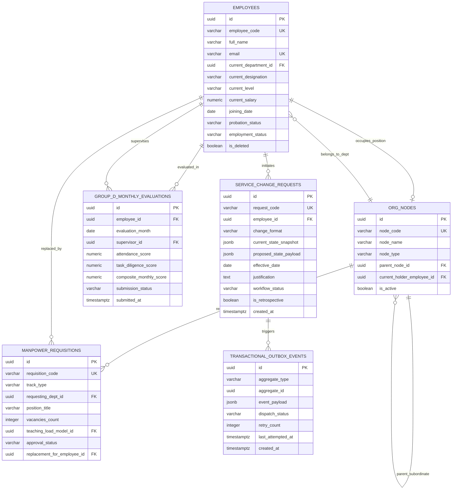

# Database Design & Schema Specification
## University HR Change Management & Automation System

| Document Metadata | Specification Detail |
|---|---|
| **Document Identifier** | `DOC-05-DBS-CANONICAL` |
| **Project Name** | University HR Change Management & Automation System |
| **System Phase** | Phase 4 — Consolidated Database Design & Relational Schema Specification |
| **Document Status** | Approved Canonical Database Baseline |
| **Date** | October 2026 |
| **Data Architecture** | Single PostgreSQL Instance with Logical Domain Schemas |
| **Coverage** | 33 Conceptual Entities, 41 Relationships, Logical Schema Profiles, Indexing & Outbox |
| **Authoritative Sources** | `source-requirements/` & Phase 1–3 Canonical Specifications |

---

## 1. Database Architecture & Design Philosophy

### 1.1 Architectural Pattern: Single Relational Engine with Domain Encapsulation
The University HR Change Management & Automation System utilizes a **single, highly available PostgreSQL instance**. In strict alignment with the Modular Monolith application architecture:
- **No Physical Database Sharding:** The platform avoids distributed databases or multi-database sprawl, ensuring ACID transaction guarantees across critical employee master updates and cross-module handshakes.
- **Logical Domain Partitioning:** Database tables are organized into four cohesive logical domain schemas:
  1. `mod1_core`: Master employee records, organizational tree nodes, digital dossier metadata, and service change requests.
  2. `mod2_recruitment`: Manpower requisitions, candidate CVs, screening sheets, selection committee scoring, and LOIs.
  3. `mod3_performance`: Group-D monthly scorecards, Staff KRA goal sheets, Faculty self-appraisals, and ECM evaluation matrices.
  4. `shared_platform`: RBAC users, roles, permissions, immutable audit logs, notification queues, and the transactional outbox.

| Schema / Domain | Primary Conceptual Entity Inventory | Entity Identifier Range | Total Entities |
|---|---|---|:---:|
| `mod1_core` | `EmployeeMaster`, `OrgHierarchyNode`, `DigitalDossierItem`, `ServiceChangeRequest`, `ChangeApprovalStep`, `AdditionalResponsibility` | `ENT-MOD1-01` to `ENT-MOD1-06` | **6** |
| `mod2_recruitment` | `ManpowerRequisition`, `TeachingLoadModel`, `OpenPosition`, `CandidateProfile`, `CandidateDocument`, `RecruiterScreening`, `SelectionPanel`, `InterviewScorecard`, `OfferLetter`, `YetToJoinTracking` | `ENT-MOD2-01` to `ENT-MOD2-10` | **10** |
| `mod3_performance` | `GroupDMonthlyEvaluation`, `GroupDAnnualScorecard`, `StaffKraGoalSheet`, `StaffQuarterlyReview`, `StaffAnnualSynthesis`, `FacultyEligibilityDocket`, `FacultySelfAppraisal`, `MultiUnitVerification`, `EcmEvaluationMatrix` | `ENT-MOD3-01` to `ENT-MOD3-09` | **9** |
| `shared_platform` | `UserAccount`, `AuditLog`, `RoleDefinition`, `UserRoleAssignment`, `NotificationMessage`, `OutboundEmailDispatch`, `TemplateRegistry`, `TransactionalOutboxEvent` | `ENT-SHR-01` to `ENT-SHR-08` | **8** |
| **Institutional Total** | **Authoritative Complete Schema Coverage** | **ENT-01 to ENT-33** | **33 Entities** |

### 1.2 Core Invariant Database Principles
1. **Source Grounding & Baseline Traceability:** Every entity, relationship, and constraint is directly traceable to the 104 atomic requirements and 60 business rules.
2. **Temporal Integrity via `effective_date`:** Service changes never mutate active master records prior to their designated effective date. The database supports future scheduling and retrospective non-destructive entries (`REQ-MOD1-18`, `BR-M1-005`).
3. **Immutable Audit Trails:** Master mutations write append-only records to `shared_platform.audit_logs`. Physical deletion is strictly barred; records utilize soft deletion (`is_deleted = TRUE`).
4. **Binary & Relational Separation:** Files are stored in external Object Storage; database tables persist metadata, file paths, MIME types, and SHA-256 hashes (`REQ-DOC-06`, `REQ-DOC-07`).
5. **Transactional Outbox for ERP:** Outbound synchronization events are committed in the same database transaction as the master record change, guaranteeing eventual consistency without distributed transaction failure (`REQ-EXT-02`).

---

## 2. Master Entity Catalogue (33 Conceptual Entities)

### 2.1 Module I: Change Management Entities (`mod1_core`)
| Entity ID | Entity Code / Name | Conceptual Role | Business Description & Purpose |
|---|---|---|---|
| `ENT-MOD1-01` | `EmployeeMaster` | Master Data | Authoritative single source of truth for all employee bio-data, statutory codes, dates of joining, and core employment status. |
| `ENT-MOD1-02` | `OrgHierarchyNode` | Master / Structural | Hierarchical tree node representing schools, departments, designations, and supervisory reporting edges. |
| `ENT-MOD1-03` | `DigitalDossierItem` | Document Metadata | Immutable longitudinal file metadata aggregating employment contracts, degrees, letters, and appraisals. |
| `ENT-MOD1-04` | `ServiceChangeRequest` | Transactional Data | Primary change management entity capturing requests across Formats (a) through (j), justifications, and effective dates. |
| `ENT-MOD1-05` | `ChangeApprovalStep` | Workflow / Process | Individual approval decision record for Level-1 (HR) and Level-2 (Senior Management) sequential sign-offs. |
| `ENT-MOD1-06` | `AdditionalResponsibility` | Transactional / Role | Tracks secondary administrative appointments (Dean, HOD, Proctor) with tenure and allowance flags. |

### 2.2 Module II: Recruitment & Talent Acquisition Entities (`mod2_recruitment`)
| Entity ID | Entity Code / Name | Conceptual Role | Business Description & Purpose |
|---|---|---|---|
| `ENT-MOD2-01` | `ManpowerRequisition` | Transactional Data | Authoritative requisition record for Academic and Non-Academic hiring; tracks annual quotas and urgent replacement bypasses. |
| `ENT-MOD2-02` | `TeachingLoadModel` | Reference / Workload | Academic workload calculation model (Attachment 1) submitted by Deans to substantiate faculty hiring. |
| `ENT-MOD2-03` | `OpenPosition` | Derived / Tracking | Authoritative vacancy ledger tracking active openings, days-open metrics, and weekly briefings (Attachment 3). |
| `ENT-MOD2-04` | `CandidateProfile` | Master / Candidate | Central CV database record capturing candidate bio-data, academic credentials, and UGC eligibility status. |
| `ENT-MOD2-05` | `CandidateDocument` | Document Metadata | Resumes, degree certificates, experience letters, and identity proofs uploaded by applicants. |
| `ENT-MOD2-06` | `RecruiterScreening` | Transactional / Screen | Recruiter Calling Sheet (RCS) preliminary phone screening scores, communication ratings, and remarks. |
| `ENT-MOD2-07` | `SelectionPanel` | Configuration / Panel | Statutory Selection Committee Meeting (SCM) or Non-Academic 3-Round interview panel constitution and members. |
| `ENT-MOD2-08` | `InterviewScorecard` | Evaluation Data | Digital scoring sheets capturing panel member ratings across research, teaching, job knowledge, attitude. |
| `ENT-MOD2-09` | `OfferLetter` | Transactional / Document | Official Letter of Intent (LOI) and formal appointment letter records with compensation terms and status. |
| `ENT-MOD2-10` | `YetToJoinTracking` | Workflow / Pipeline | Pre-onboarding tracking ledger monitoring accepted candidates through notice periods to Day-1 reporting. |

### 2.3 Module III: Performance Management Entities (`mod3_performance`)
| Entity ID | Entity Code / Name | Conceptual Role | Business Description & Purpose |
|---|---|---|---|
| `ENT-MOD3-01` | `GroupDMonthlyEvaluation` | Evaluation Data | Monthly performance evaluation form (Enclosure 1) submitted by HOD for Group-D staff by 7th/10th of month. |
| `ENT-MOD3-02` | `GroupDAnnualScorecard` | Evaluation / Synthesis| 1-year anniversary appraisal record computing 12-month parameter-weighted averages for increment review. |
| `ENT-MOD3-03` | `StaffKraGoalSheet` | Reference / Target | Annual KRA/KPI Goal Sheet configured within 30 days of joining; version-locked upon joint HR/Management sign-off. |
| `ENT-MOD3-04` | `StaffQuarterlyReview` | Evaluation Data | Quarterly performance review record (Q1–Q4) capturing employee self-ratings and supervisory assessments. |
| `ENT-MOD3-05` | `StaffAnnualSynthesis` | Evaluation / Synthesis| Annual consolidated KRA/KPI performance rating triggering in-flight Module I Service Change Requests. |
| `ENT-MOD3-06` | `FacultyEligibilityDocket` | Derived / Workflow | Monthly 10th eligibility scan record identifying faculty completing probation and $\ge$ 12 months service. |
| `ENT-MOD3-07` | `FacultySelfAppraisal` | Evaluation / Dossier | Comprehensive annual self-appraisal dossier (Enclosure 1) submitted by faculty within 7 working days. |
| `ENT-MOD3-08` | `MultiUnitVerification` | Workflow / Audit | Independent parallel verification records across School Dean, R&D Cell, Placement Cell, and HR Department. |
| `ENT-MOD3-09` | `EcmEvaluationMatrix` | Evaluation / Synthesis| Statutory ECM digital scoring compilation and TNU Protocol benchmark matrix formulated for Management sanction. |

### 2.4 Shared Enterprise Platform Entities (`shared_platform`)
| Entity ID | Entity Code / Name | Conceptual Role | Business Description & Purpose |
|---|---|---|---|
| `ENT-SHR-01` | `UserAccount` | Security / Identity | Authentication credentials, account status, password hashes, and linked employee/external identities. |
| `ENT-SHR-02` | `AuditLog` | Audit / History | Append-only chronological audit ledger capturing actor ID, timestamp, table, and JSON before/after state diffs. |
| `ENT-SHR-03` | `RoleDefinition` | Security / RBAC | Role catalogue (e.g. `PRO_CHANCELLOR`, `DEAN`, `HOD`, `HR_ADMIN`, `EXTERNAL_EXPERT`). |
| `ENT-SHR-04` | `UserRoleAssignment` | Security / RBAC | Mapping linking UserAccounts to specific RoleDefinitions with institutional scope constraints. |
| `ENT-SHR-05` | `NotificationMessage` | Communication | In-app notification alerts, task assignments, and push payloads. |
| `ENT-SHR-06` | `OutboundEmailDispatch` | Communication | Outbound SMTP email staging records with retry counters and delivery statuses. |
| `ENT-SHR-07` | `TemplateRegistry` | Configuration | Version-controlled repository of document, letter, and form template schemas. |
| `ENT-SHR-08` | `TransactionalOutboxEvent` | Integration / Outbox | Transactional outbox staging records ensuring guaranteed, reliable event synchronization with University ERP. |

---

## 3. Conceptual Relationship Specification (41 Invariant Relationships)

The 41 primary entity relationships across the database are categorized below:

| Relationship Domain | Coverage Scope | Identifier Range | Total Invariant Relationships |
|---|---|---|:---:|
| **Module I Core & Hierarchy** | Employee to Dossier, Org Tree Nodes, Service Changes, Approvals | `REL-01` to `REL-08` | **8** |
| **Module II Recruitment & Sourcing** | Requisitions, Teaching Models, Candidates, SCM Panels, LOIs | `REL-09` to `REL-20` | **12** |
| **Module III Performance Appraisal** | Group-D Monthly/Annual, Staff KRA/KPI, Faculty ECM Matrices | `REL-21` to `REL-32` | **12** |
| **Cross-Module Lifecycle Handshakes**| Candidate $\rightarrow$ Employee, Resignation $\rightarrow$ MRF, Appraisal $\rightarrow$ Change | `REL-33` to `REL-36` | **4** |
| **Shared Platform Security & Outbox**| Users, RBAC Roles, Audit Logs, Transactional Outbox Events | `REL-37` to `REL-41` | **5** |
| **Verified Institutional Total** | **Complete Relational Foreign Key Graph** | **REL-01 to REL-41** | **41 Relationships** |

### Key Relational Anchor Points
1. **`EmployeeMaster` (Center of Gravity):** Acts as the foundational parent for Digital Dossiers (`1:N`), Service Change Requests (`1:N`), Org Hierarchy Nodes (`1:1`), Group-D Monthly Reviews (`1:N`), Staff KRA Goal Sheets (`1:N`), and Faculty Appraisals (`1:N`).
2. **Hierarchical Self-Reference in `OrgHierarchyNode` (`REL-02`):** Direct parent-child supervisory relationship (`parent_node_id` foreign key referencing `node_id`), powering recursive tree traversal for dynamic Org Chart rendering.
3. **Cross-Module Foreign Keys:**
   - `REL-33`: `CandidateProfile` $\rightarrow$ `EmployeeMaster` (Onboarding Handshake `BP-XMOD-001`).
   - `REL-34`: `EmployeeMaster` (Resignation) $\rightarrow$ `ManpowerRequisition` (Urgent Replacement `BP-XMOD-002`).
   - `REL-35`: `EcmEvaluationMatrix` / `StaffAnnualSynthesis` $\rightarrow$ `ServiceChangeRequest` (Appraisal to Service Change `BP-XMOD-004`).
   - `REL-36`: `ServiceChangeRequest` $\rightarrow$ `TransactionalOutboxEvent` (ERP Event Emission `BP-M1-007`).

---

## 4. Logical Relational Schema Profiles

---

## 5. Indexing & Query Optimization Strategy

| Target Table | Indexed Column(s) | Index Type | Query Optimization Rationale |
|---|---|---|---|
| `mod1_core.employees` | `employee_code` | B-Tree (UNIQUE) | Primary indexed identifier for directory and ERP lookup. |
| `mod1_core.employees` | `email`, `national_id` | B-Tree (UNIQUE) | Deduplication enforcement and SSO authentication lookup. |
| `mod1_core.org_nodes` | `parent_node_id` | B-Tree | High-speed recursive CTE traversal for dynamic Org Chart rendering. |
| `mod1_core.service_change_requests` | `effective_date`, `workflow_status` | Composite B-Tree | Fast lookup for automated daily midnight activation worker. |
| `mod2_recruitment.candidate_profiles` | `email`, `phone_number` | Composite B-Tree | CV deduplication on omnichannel resume ingestion. |
| `mod3_performance.group_d_monthly_evaluations` | `evaluation_month`, `submission_status` | Composite B-Tree | 10th-of-month auto-lock query optimization. |
| `shared_platform.transactional_outbox_events` | `dispatch_status`, `created_at` | Composite B-Tree | Outbox poller query: `WHERE dispatch_status = 'PENDING' ORDER BY created_at ASC`. |
| `shared_platform.audit_logs` | `table_name`, `record_id`, `created_at` | Composite B-Tree | Point-in-time entity state audit reconstruction. |
