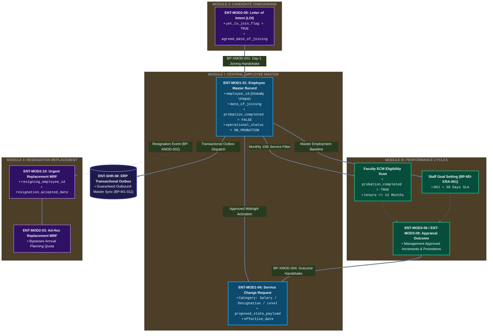

# Logical Data Dictionary (344 Attribute Specification)
## University HR Change Management & Automation System

**Document Identifier:** `DOC-05-LDD-CANONICAL`  
**Phase:** Phase 4 — Canonical Logical Data Dictionary & Attribute Specification  
**Location:** `docs/05-database/02-LOGICAL-DATA-DICTIONARY.md`  
**Status:** Approved Logical Attribute Baseline  
**Date:** October 2026  
**Workspace:** `d:\Desktop\HR-CHANGE-MANAGEMENT-SYSTEM`  

---

## 1. Document Control & Status

### 1.1 Document Revision History

| Version | Release Date | Primary Author / Contributor | Description of Changes / Baseline State |
|---|---|---|---|
| `1.0.0` | October 2, 2026 | Database Architecture & Engineering Working Group | Initial official release of the Logical Data Model & Entity-Wise Attribute Specification covering all thirty-three (33) approved conceptual entities across Module I, Module II, Module III, and the Shared Platform. Establishes the 5-tier classification framework, requiredness taxonomy, logical domain typing, sensitivity classifications, cross-module dependency mappings, and traceability links. |

### 1.2 Document Lifecycle & Governance State

```
====================================================================================================
LIFECYCLE STATUS:
APPROVED LOGICAL ATTRIBUTE BASELINE — DOCUMENTATION ONLY

GOVERNANCE DIRECTIVE:
1. STRICT DOCUMENTATION ONLY: Contains zero physical DDL, SQL scripts, primary keys, foreign keys,
   indexes, storage engine directives, ORM schemas (Prisma/TypeORM), or application code.
2. SOURCE-GROUNDED GROUND TRUTH: Grounded strictly in the frozen official requirements baseline
   (104 atomic requirements, 59 business processes, 60 business rules, 11 baseline TBDs).
3. CLASSIFICATION RIGOR: Every logical attribute is explicitly tagged with the 5-tier classification
   ([A] Explicit Requirement, [B] Logical Implication, [C] Approved Technical Decision,
   [D] Proposed Detail, [E] TBD / Open Decision).
4. UNRESOLVED UNCERTAINTY ISOLATION: Open policy items, missing enclosure templates, and uncodified
   statutory retention rules are isolated under [E] and mapped to the official project TBD register.
====================================================================================================
```

---

## 2. Purpose and Scope

### 2.1 Purpose

The primary objective of this document is to bridge the conceptual domain models established in [`03-ENTITY-IDENTIFICATION.md`](file:///d:/Desktop/HR-CHANGE-MANAGEMENT-SYSTEM/docs/08-database/03-ENTITY-IDENTIFICATION.md) and the relationship semantics formalized in [`04-ENTITY-RELATIONSHIP-SPECIFICATION.md`](file:///d:/Desktop/HR-CHANGE-MANAGEMENT-SYSTEM/docs/08-database/04-ENTITY-RELATIONSHIP-SPECIFICATION.md) into a comprehensive, source-grounded **Logical Data Model and Attribute Identification Specification**.

This specification formalizes the informational anatomy of the University HR Change Management & Automation System by identifying, defining, and classifying the logical attributes necessary to fulfill every approved business requirement, business process, business rule, and architectural capability without prematurely committing to physical database artifacts or database engine idioms.

### 2.2 Functional Scope

This specification provides comprehensive, entity-wise attribute definitions for all **thirty-three (33) approved primary conceptual entities**:

| Domain Module | Primary Entity Identifier Range | Total Primary Conceptual Entities |
|---|---|:---:|
| **Module I: Change Management Engine** | `ENT-MOD1-01` to `ENT-MOD1-06` | **6 Conceptual Entities** |
| **Module II: Recruitment & Talent Acquisition** | `ENT-MOD2-01` to `ENT-MOD2-10` | **10 Conceptual Entities** |
| **Module III: Performance Management Engine** | `ENT-MOD3-01` to `ENT-MOD3-09` | **9 Conceptual Entities** |
| **Shared Enterprise Platform Services** | `ENT-SHR-01` to `ENT-SHR-08` | **8 Conceptual Entities** |
| **Authoritative System Total** | **Full 100% Scope Coverage** | **33 Conceptual Entities** |

### 2.3 Strict Physical Design Exclusions

In strict accordance with Phase 4 governance, this document remains exclusively logical and conceptual. The following physical implementation elements are strictly excluded:

- **No SQL, DDL, or DML Statements:** No `CREATE TABLE`, `ALTER TABLE`, or SQL syntax.
- **No Physical Database Tables or Schemas:** No PostgreSQL physical tables, tablespaces, or physical schema partitions.
- **No Physical Keys:** No SQL `PRIMARY KEY`, `FOREIGN KEY`, or surrogate key sequence definitions.
- **No Physical Database Constraints or Indexes:** No B-Tree, GIN, unique constraint indexes, or SQL check clauses.
- **No Engine-Specific Data Types:** No database-specific types (e.g., `VARCHAR(255)`, `BIGINT`, `SERIAL`, `TIMESTAMPTZ`, `CITEXT`); attributes utilize purely logical/conceptual domain types.
- **No Object-Relational Mapping (ORM) Code:** No Prisma schemas, TypeORM entities, or ActiveRecord models.
- **No Migrations or Seed Data:** No database migration files, seeds, stored procedures, or triggers.
- **No Application Code:** No TypeScript classes, REST endpoints, DTOs, or interface declarations.

---

## 3. Source Documents and Governance

### 3.1 Authoritative Baseline Hierarchy

This document derives its authority and attribute grounding from the following frozen project documents:

1. **Requirements Baseline:**
   - [`docs/01-requirements/01-PROJECT-REQUIREMENTS-SPECIFICATION.md`](file:///d:/Desktop/HR-CHANGE-MANAGEMENT-SYSTEM/docs/01-requirements/01-PROJECT-REQUIREMENTS-SPECIFICATION.md)
   - [`docs/01-requirements/02-REQUIREMENT-CATALOGUE.md`](file:///d:/Desktop/HR-CHANGE-MANAGEMENT-SYSTEM/docs/01-requirements/02-REQUIREMENT-CATALOGUE.md) (104 Atomic Requirements)
   - [`docs/01-requirements/05-REQUIREMENTS-TBD-AND-OPEN-DECISIONS.md`](file:///d:/Desktop/HR-CHANGE-MANAGEMENT-SYSTEM/docs/01-requirements/05-REQUIREMENTS-TBD-AND-OPEN-DECISIONS.md) (11 Baseline TBDs: `REQ-TBD-01` to `REQ-TBD-11`)
2. **Business Process & Business Rule Baseline:**
   - [`docs/02-business-process/00-BUSINESS-PROCESS-INDEX.md`](file:///d:/Desktop/HR-CHANGE-MANAGEMENT-SYSTEM/docs/02-business-process/00-BUSINESS-PROCESS-INDEX.md) (59 Business Processes: `BP-*`)
   - [`docs/02-business-process/01-BUSINESS-RULES-CATALOGUE.md`](file:///d:/Desktop/HR-CHANGE-MANAGEMENT-SYSTEM/docs/02-business-process/01-BUSINESS-RULES-CATALOGUE.md) (60 Business Rules: `BR-*`)
   - Module-Specific Process Specifications: `03-MODULE-1-*`, `04-MODULE-2-*`, `05-MODULE-3-*`, `06-CROSS-MODULE-*`.
3. **Functional Requirements Specifications (FRDs):**
   - [`docs/03-functional-requirements/01-MODULE-I-FUNCTIONAL-REQUIREMENTS.md`](file:///d:/Desktop/HR-CHANGE-MANAGEMENT-SYSTEM/docs/03-functional-requirements/01-MODULE-I-FUNCTIONAL-REQUIREMENTS.md)
   - [`docs/03-functional-requirements/02-MODULE-II-FUNCTIONAL-REQUIREMENTS.md`](file:///d:/Desktop/HR-CHANGE-MANAGEMENT-SYSTEM/docs/03-functional-requirements/02-MODULE-II-FUNCTIONAL-REQUIREMENTS.md)
   - [`docs/03-functional-requirements/03-MODULE-III-FUNCTIONAL-REQUIREMENTS.md`](file:///d:/Desktop/HR-CHANGE-MANAGEMENT-SYSTEM/docs/03-functional-requirements/03-MODULE-III-FUNCTIONAL-REQUIREMENTS.md)
   - [`docs/03-functional-requirements/04-SHARED-FUNCTIONAL-REQUIREMENTS.md`](file:///d:/Desktop/HR-CHANGE-MANAGEMENT-SYSTEM/docs/03-functional-requirements/04-SHARED-FUNCTIONAL-REQUIREMENTS.md)
4. **Architectural Baseline:**
   - [`TECHNOLOGY_ARCHITECTURE_BASELINE.md`](file:///d:/Desktop/HR-CHANGE-MANAGEMENT-SYSTEM/TECHNOLOGY_ARCHITECTURE_BASELINE.md)
   - [`docs/08-database/00-DATABASE-DOCUMENTATION-INDEX.md`](file:///d:/Desktop/HR-CHANGE-MANAGEMENT-SYSTEM/docs/08-database/00-DATABASE-DOCUMENTATION-INDEX.md)
   - [`docs/08-database/01-DATABASE-DESIGN-OVERVIEW.md`](file:///d:/Desktop/HR-CHANGE-MANAGEMENT-SYSTEM/docs/08-database/01-DATABASE-DESIGN-OVERVIEW.md)
   - [`docs/08-database/02-DATA-MODEL-OVERVIEW.md`](file:///d:/Desktop/HR-CHANGE-MANAGEMENT-SYSTEM/docs/08-database/02-DATA-MODEL-OVERVIEW.md)
   - [`docs/08-database/03-ENTITY-IDENTIFICATION.md`](file:///d:/Desktop/HR-CHANGE-MANAGEMENT-SYSTEM/docs/08-database/03-ENTITY-IDENTIFICATION.md)
   - [`docs/08-database/04-ENTITY-RELATIONSHIP-SPECIFICATION.md`](file:///d:/Desktop/HR-CHANGE-MANAGEMENT-SYSTEM/docs/08-database/04-ENTITY-RELATIONSHIP-SPECIFICATION.md)

### 3.2 Stakeholder Delta Isolation

In strict compliance with project governance:
- The frozen official requirements supplied by the mentor represent the sole business source of truth.
- Stakeholder feedback artifacts (`CONF-01` through `CONF-10` and `DLT-*` items from `docs/01-requirements/09-COMBINED-STAKEHOLDER-DELTA-REVIEW.md` and `10-STAKEHOLDER-DECISION-SHEET.md`) are reference-only.
- No unapproved stakeholder delta proposal (e.g., decentralized change initiation, additional appraisal outcome types, alternative routing chains) has been incorporated into this logical attribute baseline.

---

## 4. Logical Data Modelling Principles

The identification and specification of attributes across all 33 entities adhere to five core modelling principles:

> [!IMPORTANT]
> **Core Logical Data Modelling Invariants:**
> 1. **Source Grounding First:** Every attribute must trace directly to an approved requirement, business rule, process step, or approved architectural decision. No invented attributes.
> 2. **Conceptual Relationship Alignment:** Logical attributes align perfectly with the 41 approved conceptual relationships without introducing synthetic relations or physical foreign key assumptions.
> 3. **Temporal and Lifecycle Clarity:** Attributes strictly distinguish between proposed values, approved staged states, currently active values, and immutable historical slices (`effective_date`).
> 4. **Strict Binary Storage Separation:** Binary files (CVs, evidence, PDF orders) reside exclusively in external object storage; entities store metadata, URI keys, and cryptographic SHA-256 hashes.
> 5. **Uncertainty Isolation:** When a business detail is required for real-world execution but lacks an approved source specification, it is tagged `[E]` and anchored to an official baseline TBD (`REQ-TBD-01` to `11`).

---

## 5. Attribute Classification and Requiredness Conventions

### 5.1 The 5-Tier Attribute Classification Framework

Every attribute in this specification is categorized under the mandatory 5-tier classification framework:

| Tag | Classification | Definition and Operational Criteria |
|---|---|---|
| `[A]` | **Explicit Requirement** | Directly mandated by the text of the official requirement briefs, approved requirements catalogue (`REQ-*`), or business rules (`BR-*`). |
| `[B]` | **Logical Implication** | Logically indispensable to implement an explicit requirement, workflow state transition, audit diff, or relational association. Fully explained in notes. |
| `[C]` | **Approved Technical Decision** | Mandated by the approved architecture baseline (`TECHNOLOGY_ARCHITECTURE_BASELINE.md`), such as transactional outbox staging, tokenized sessions, or SHA-256 binary hashing. |
| `[D]` | **Proposed Detail** | Specific operational threshold, default parameter, or UI field convenience proposed for technical completeness, subject to institutional verification. |
| `[E]` | **TBD / Open Decision** | Unresolved requirement, missing template schema, uncodified formula, or pending policy item mapped directly to the official project TBD register (`REQ-TBD-01` to `REQ-TBD-11`). |

### 5.2 Attribute Requiredness Taxonomy

- **`Required`:** Attribute must be populated upon entity creation or lifecycle transition; null values are prohibited by business logic.
- **`Optional`:** Attribute may remain unpopulated depending on business context or user discretion.
- **`Conditional`:** Attribute is strictly mandatory under specific documented conditions (e.g., rejection remarks mandatory only when outcome is `REJECTED`; publication metrics mandatory only for faculty dossiers).
- **`TBD`:** Mandatory status cannot be finalized until an upstream institutional policy or enclosure template decision is resolved under the governing TBD item.

### 5.3 Logical / Conceptual Data Types

To prevent premature physical coupling, attributes utilize conceptual domain types:
- **`Identifier`:** Conceptual unique logical identity token (UUID or institutional code format).
- **`Text` / `String`:** Human-readable character sequences, descriptions, codes, or narrative text.
- **`Integer`:** Discrete numerical counts, round numbers, order sequences, or quantities.
- **`Decimal` / `Currency`:** High-precision numerical values representing financial amounts or weighted scores.
- **`Date` / `Timestamp`:** Calendar dates (`YYYY-MM-DD`) or points in time with temporal zone awareness.
- **`Boolean`:** Two-state logical indicators (`TRUE` / `FALSE`).
- **`Structured (JSON)`:** Dynamic or semi-structured multi-field data payloads (e.g., dynamic change diffs, configurable template schemas, parsed evaluation score arrays).

### 5.4 Data Sensitivity & Confidentiality Classifications

- **`Public`:** Non-sensitive institutional information (e.g., public job advertisements, organizational units).
- **`Internal`:** Operational data accessible to authenticated university personnel according to role.
- **`Confidential`:** Sensitive personnel, operational, or evaluation records restricted to authorized actors (e.g., evaluation scorecards, change requests, grievance remarks).
- **`Highly Sensitive (PII / Financial)`:** Legally protected personal identifiable information (PII), compensation figures, banking details, or statutory security tokens requiring encryption and strict access auditing.

---

## 6. Module I Logical Attribute Catalogue

Module I encapsulates six (6) conceptual entities governing Central Employee Master data, Dynamic Organization Hierarchy, Digital Dossiers, Change Requests, Approval Actions, and the Historical Service Ledger.

### 6.1 ENT-MOD1-01: Employee Master Record (`CentralEmployeeRecord`)
- **Domain Owner:** Module I (`EmployeeCoreModule`)
- **Conceptual Classification:** Master Data
- **Business Description:** Serves as the authoritative, institutional Single Source of Truth for all active faculty, administrative staff, and technical personnel. Holds currently active service conditions; pending or scheduled changes never directly mutate this record until effective date activation.
- **Upstream Traceability:** `REQ-MOD1-01`, `REQ-MOD1-02`, `REQ-MOD1-04`, `REQ-MOD1-05`, `REQ-MOD1-07`, `REQ-MOD1-08`; `BP-M1-001`, `BP-M1-004`, `BP-M1-007`, `BP-M1-011`, `BP-XMOD-001`, `BP-XMOD-003`; `BR-01`, `BR-02`, `BR-06`, `BR-10`, `BR-14`, `BR-17`.

| Logical Attribute ID | Logical Attribute Name | Business Meaning & Scope | Conceptual Type | Requiredness | Class. | Sensitivity | Source Grounding & Governing Notes |
|---|---|---|---|---|---|---|---|
| `ATTR-EMP-01` | `employee_id` | Unique institutional employee identification code (e.g., university roll/personnel code). | Identifier | Required | `[A]` | Internal | Explicitly mandated by `REQ-MOD1-04` & `MOD1-CDB-REQ-04`. Format generation governed by `REQ-TBD-01`. |
| `ATTR-EMP-02` | `full_name` | Official legal full name of the employee as registered in institutional service book. | Text | Required | `[A]` | Internal | Mandated by `REQ-MOD1-04`. Displayed across institutional Org Chart and rosters. |
| `ATTR-EMP-03` | `current_designation` | Authoritative currently active official designation/title (e.g., Professor, Assistant Professor, Registrar). | Text | Required | `[A]` | Internal | Mandated by `REQ-MOD1-04`, `REQ-MOD1-07`. Mutated only upon approved effective change activation. |
| `ATTR-EMP-04` | `current_department_school` | Department, School, or Administrative Directorate to which employee is actively assigned. | Text | Required | `[A]` | Internal | Mandated by `REQ-MOD1-04`, `REQ-MOD1-07`. Conceptually linked to `ENT-MOD1-02`. |
| `ATTR-EMP-05` | `current_level_band` | Employment tier, structural grade level, or pay band (e.g., Band I, Band II, Level 10). | Text | Required | `[A]` | Confidential | Mandated by `REQ-MOD1-04`, `REQ-MOD1-07`. Determines appraisal track routing in Module III. |
| `ATTR-EMP-06` | `current_salary_structure` | Currently active base compensation, pay package reference, or consolidated monthly/annual salary. | Decimal | Required | `[A]` | Highly Sensitive | Mandated by `REQ-MOD1-04`, `REQ-MOD1-07`. Reflects active compensation; modified only via Change Format 3(a). |
| `ATTR-EMP-07` | `reporting_authority_id` | Employee ID of the immediate official supervisor/reporting authority managing this employee. | Identifier | Required | `[A]` | Internal | Mandated by `REQ-MOD1-04`, `REQ-MOD1-07`. Powers Org Chart reporting edge; root node exception (e.g. Chancellor). |
| `ATTR-EMP-08` | `date_of_joining` | Official Date of Joining (DOJ) university service. | Date | Required | `[A]` | Internal | Mandated by `REQ-MOD1-04`, `REQ-MOD1-08`. Anchors Group-D 1-year anniversary and KRA 30-day onboarding countdown. |
| `ATTR-EMP-09` | `probation_completed` | Flag indicating whether employee has mandatorily cleared official institutional probation. | Boolean | Required | `[A]` | Internal | Mandated by `REQ-MOD3-06`, `REQ-MOD3-14`. Strict gate for compensation change workflow activation. |
| `ATTR-EMP-10` | `operational_status` | Current employment operational lifecycle state (`ON_PROBATION`, `CONFIRMED_ACTIVE`, `RESIGNED`, `RETIRED`, `SUSPENDED`). | Text | Required | `[B]` | Internal | Logically required by `MOD1-CDB-REQ-05` to manage employment lifecycle without destructive deletion. |
| `ATTR-EMP-11` | `work_location` | Primary physical work location, campus premises, or building office assigned to employee. | Text | Required | `[A]` | Internal | Mandated by `REQ-MOD1-04`, `REQ-MOD1-07`. Modified via Change Format 3(g). |
| `ATTR-EMP-12` | `institutional_email` | Official institutional email address used for system notifications and access. | Text | Required | `[B]` | Internal | Logically required by `SHR-AUT-REQ-01` and `SHR-NTF-REQ-01` for workflow dispatch and identity linkage. |
| `ATTR-EMP-13` | `last_appraisal_date` | Date of last completed formal performance appraisal review or increment. | Date | Optional | `[B]` | Confidential | Logically required by `REQ-MOD3-14` to calculate 12-month tenure eligibility for faculty ECM routing. |
| `ATTR-EMP-14` | `record_audit_marker` | Timestamp indicating when employee master record was initialized or last committed. | Timestamp | Required | `[C]` | Internal | Mandated by `MOD1-AUD-REQ-02` and technology baseline for temporal tracking. |

### 6.2 ENT-MOD1-02: Organization Hierarchy Node (`OrgPositionNode`)
- **Domain Owner:** Module I (`OrgHierarchyModule`)
- **Conceptual Classification:** Master Data
- **Business Description:** Models the university's institutional organizational structure, positions, departments, and supervisory reporting lines. Powers dynamic organizational chart rendering and provides the topological reporting structure consumed by workflow engines for routing approvals.
- **Upstream Traceability:** `REQ-MOD1-02`, `REQ-MOD1-06`, `REQ-SHR-04`; `BP-M1-002`, `BP-M1-010`; `BR-02`, `BR-06`, `BR-20`; `MOD1-ORG-REQ-01` to `04`, `SHR-ORG-REQ-01` to `03`.

| Logical Attribute ID | Logical Attribute Name | Business Meaning & Scope | Conceptual Type | Requiredness | Class. | Sensitivity | Source Grounding & Governing Notes |
|---|---|---|---|---|---|---|---|
| `ATTR-ORG-01` | `node_id` | Unique logical identifier for the organizational position/node. | Identifier | Required | `[B]` | Internal | Logically required to represent node in dynamic hierarchical tree structure. |
| `ATTR-ORG-02` | `position_title` | Official position title represented by this node (e.g., "Dean - School of Engineering", "HOD - Physics"). | Text | Required | `[A]` | Internal | Explicitly mandated by `REQ-MOD1-02` and `MOD1-ORG-REQ-01`. |
| `ATTR-ORG-03` | `organizational_unit` | Department, School, Academic Center, or Administrative Directorate represented. | Text | Required | `[A]` | Internal | Explicitly mandated by `REQ-MOD1-02`. |
| `ATTR-ORG-04` | `parent_node_id` | Node ID of the parent supervisory node in the hierarchy. | Identifier | Optional | `[A]` | Internal | Explicitly mandated by `REQ-MOD1-02` to model supervisory reporting lines. Root executive has no parent. |
| `ATTR-ORG-05` | `assigned_employee_id` | Employee ID of the personnel actively occupying this position. | Identifier | Optional | `[A]` | Internal | Explicitly mandated by `REQ-MOD1-02`. May be unpopulated if position is vacant. |
| `ATTR-ORG-06` | `hierarchy_tier_level` | Depth tier in the university structure (e.g., Executive = 0, Dean = 1, HOD = 2, Faculty/Staff = 3). | Integer | Required | `[B]` | Internal | Logically required by `MOD1-ORG-REQ-03` to support multi-level tree traversal and rendering. |
| `ATTR-ORG-07` | `is_active` | Operational status of the organizational position node. | Boolean | Required | `[B]` | Internal | Logically required to retire defunct positions without breaking historical reporting links. |
| `ATTR-ORG-08` | `last_realigned_at` | Timestamp when the node's reporting authority or assigned occupant was last realigned. | Timestamp | Required | `[C]` | Internal | Mandated by `MOD1-ORG-REQ-02` and `MOD1-ORG-REQ-04` to track real-time cache invalidation. |

### 6.3 ENT-MOD1-03: Digital Employee File & Dossier Item (`EmployeeDossierItem`)
- **Domain Owner:** Module I (`EmployeeFileModule`)
- **Conceptual Classification:** Document / Attachment Metadata
- **Business Description:** Consolidated personal folder tracking verified joining credentials, signed Letters of Intent, degree certificates, promotion orders, increment notices, disciplinary records, and annual evaluation scorecards.
- **Upstream Traceability:** `REQ-MOD1-03`; `BP-M1-003`, `BP-XMOD-001`, `BP-XMOD-004`; `BR-03`, `BR-57`; `MOD1-FIL-REQ-01` to `04`, `SHR-FIL-REQ-01` to `03`.

| Logical Attribute ID | Logical Attribute Name | Business Meaning & Scope | Conceptual Type | Requiredness | Class. | Sensitivity | Source Grounding & Governing Notes |
|---|---|---|---|---|---|---|---|
| `ATTR-DOS-01` | `dossier_item_id` | Unique logical identifier for the dossier catalog entry. | Identifier | Required | `[B]` | Internal | Logically required to uniquely track and index items within an employee's personal dossier. |
| `ATTR-DOS-02` | `employee_id` | Target employee to whose permanent digital personal file this item belongs. | Identifier | Required | `[A]` | Internal | Mandated by `REQ-MOD1-03` and `MOD1-FIL-REQ-01`. Links item to `ENT-MOD1-01`. |
| `ATTR-DOS-03` | `dossier_category` | Institutional category of document (`ONBOARDING_CREDENTIAL`, `SERVICE_CHANGE_ORDER`, `APPRAISAL_REPORT`, `QUALIFICATION_CERTIFICATE`, `DISCIPLINARY_RECORD`). | Text | Required | `[A]` | Confidential | Explicitly mandated by `REQ-MOD1-03` and `MOD1-FIL-REQ-02`. |
| `ATTR-DOS-04` | `document_title` | Descriptive title of the personal file document (e.g., "Promotion Order - July 2026", "Ph.D. Degree Certificate"). | Text | Required | `[B]` | Internal | Logically required for administrative browsing and verification indexing. |
| `ATTR-DOS-05` | `document_metadata_ref` | Pointer to the underlying binary object metadata record in `ENT-SHR-05`. | Identifier | Required | `[C]` | Confidential | Mandated by approved technical architecture baseline separating binary storage from metadata. |
| `ATTR-DOS-06` | `originating_module` | Module originating the document (`MODULE_I`, `MODULE_II`, `MODULE_III`). | Text | Required | `[A]` | Internal | Mandated by `MOD1-FIL-REQ-03` and `SHR-FIL-REQ-02` (cross-module aggregation). |
| `ATTR-DOS-07` | `archived_at` | Timestamp when the document was permanently inscribed into the employee file. | Timestamp | Required | `[C]` | Internal | Mandated by `SHR-FIL-REQ-03` to maintain immutable chronological dossier history. |
| `ATTR-DOS-08` | `verification_status` | Status of institutional document verification (`UNVERIFIED`, `VERIFIED_AUTHENTIC`, `DISCREPANCY_FLAGGED`). | Text | Required | `[B]` | Confidential | Logically required by `MOD1-CHG-REQ-17` and Module II/III verification workflows. |

### 6.4 ENT-MOD1-04: Service Condition Change Request (`ServiceChangeRequest`)
- **Domain Owner:** Module I (`ChangeManagementModule`)
- **Conceptual Classification:** Transactional Data
- **Business Description:** Container holding proposed service condition modifications across ten standardized categories: (1) Salary Change, (2) Designation Change, (3) Reportee Change, (4) Reporting Authority Change, (5) Level Change, (6) Department/School Change, (7) Location Change, (8) Additional Responsibility, (9) Qualification Change, (10) Other Service Condition. Completely isolates pending changes from master records during review.
- **Upstream Traceability:** `REQ-MOD1-05`, `REQ-MOD1-06`, `REQ-MOD1-07`; `BP-M1-004` to `BP-M1-007`; `BR-04`, `BR-05`, `BR-07`, `BR-08`, `BR-14`, `BR-18`; `MOD1-CHG-REQ-01` to `19`.

| Logical Attribute ID | Logical Attribute Name | Business Meaning & Scope | Conceptual Type | Requiredness | Class. | Sensitivity | Source Grounding & Governing Notes |
|---|---|---|---|---|---|---|---|
| `ATTR-CHG-01` | `change_request_id` | Unique institutional tracking identifier for the service condition change request. | Identifier | Required | `[A]` | Internal | Mandated by `REQ-MOD1-05` and `MOD1-LIF-REQ-01`. |
| `ATTR-CHG-02` | `employee_id` | Target employee whose service conditions are proposed to be modified. | Identifier | Required | `[A]` | Internal | Mandated by `REQ-MOD1-05`. Conceptually references `ENT-MOD1-01`. |
| `ATTR-CHG-03` | `change_category` | One of the 10 approved change categories (`SALARY_CHANGE`, `DESIGNATION_CHANGE`, `REPORTEE_CHANGE`, `REPORTING_AUTHORITY_CHANGE`, `LEVEL_CHANGE`, `DEPT_SCHOOL_CHANGE`, `LOCATION_CHANGE`, `ADDITIONAL_RESPONSIBILITY`, `QUALIFICATION_CHANGE`, `OTHER_CONDITION`). | Text | Required | `[A]` | Confidential | Explicitly mandated by `REQ-MOD1-05` (Form 3a through 3j). |
| `ATTR-CHG-04` | `initiated_by_user_id` | Authenticated user ID of the HR operations initiator or automated handshake actor. | Identifier | Required | `[A]` | Internal | Mandated by `REQ-MOD1-05` and `MOD1-APP-REQ-03` (Segregation of Duties). |
| `ATTR-CHG-05` | `lifecycle_state` | Current FSM lifecycle state (`INITIATED`, `PENDING_HR_APPROVAL`, `PENDING_SENIOR_MGMT_APPROVAL`, `APPROVED_PENDING_ACTIVATION`, `COMMITTED_ACTIVE`, `REJECTED`, `CANCELLED`). | Text | Required | `[B]` | Internal | Logically required by `MOD1-LIF-REQ-01` and `BR-04` to enforce two-stage approval gating. |
| `ATTR-CHG-06` | `proposed_payload` | Structured data capturing proposed field values specific to the change category (e.g., proposed salary, new designation, target department). | Structured (JSON) | Required | `[A]` | Highly Sensitive | Explicitly mandated across `MOD1-CHG-REQ-01` to `19`. Exact field schema parameterization under `REQ-TBD-02`. |
| `ATTR-CHG-07` | `baseline_snapshot` | Snapshot of the employee's service attributes prior to modification. | Structured (JSON) | Required | `[B]` | Confidential | Logically required by `MOD1-AUD-REQ-02` and `BR-08` to generate before/after state diffs. |
| `ATTR-CHG-08` | `justification_remarks` | Detailed written operational or policy justification for the proposed modification. | Text | Required | `[A]` | Confidential | Explicitly mandated by `REQ-MOD1-05` and `MOD1-CHG-REQ-02`. |
| `ATTR-CHG-09` | `effective_date` | Date from which the approved change must take institutional effect. | Date | Required | `[A]` | Confidential | Explicitly mandated by `REQ-MOD1-07`, `MOD1-EFF-REQ-01`, and `BR-05`. |
| `ATTR-CHG-10` | `activation_timestamp` | Timestamp when the change was actively committed into `ENT-MOD1-01`. | Timestamp | Conditional | `[C]` | Internal | Required upon reaching `COMMITTED_ACTIVE` state via scheduled worker (`MOD1-EFF-REQ-03`). |
| `ATTR-CHG-11` | `attachment_ref` | Pointer to supporting evidence binary metadata in `ENT-SHR-05` (e.g., degree certificate, approval memo). | Identifier | Conditional | `[B]` | Confidential | Mandatory for qualification changes (`MOD1-CHG-REQ-17`) and salary revisions (`MOD1-CHG-REQ-02`). |
| `ATTR-CHG-12` | `administrative_allowance_flag` | Flag indicating whether an additional responsibility carries an administrative allowance. | Boolean | Conditional | `[E]` | Confidential | Qualifies Change Format 3(h) (`MOD1-CHG-REQ-15`). Monetary rules remain unresolved under `REQ-TBD-09`. |

### 6.5 ENT-MOD1-05: Service Change Approval Action (`ChangeApprovalAction`)
- **Domain Owner:** Module I (`ChangeApprovalModule`)
- **Conceptual Classification:** Workflow / Process Data
- **Business Description:** Records individual review, endorsement, clarification, or rejection actions within the 2-level approval hierarchy (`Level 1: HR Review` $\rightarrow$ `Level 2: Senior Management Approval`). Stores acting authority ID, action timestamp, decision outcome, and mandatory written justification comments.
- **Upstream Traceability:** `REQ-MOD1-06`; `BP-M1-005`, `BP-M1-006`; `BR-04`, `BR-07`, `BR-18`; `MOD1-APP-REQ-01` to `06`.

| Logical Attribute ID | Logical Attribute Name | Business Meaning & Scope | Conceptual Type | Requiredness | Class. | Sensitivity | Source Grounding & Governing Notes |
|---|---|---|---|---|---|---|---|
| `ATTR-APP-01` | `action_id` | Unique logical identifier for the approval action entry. | Identifier | Required | `[B]` | Internal | Logically required to index immutable approval event records. |
| `ATTR-APP-02` | `change_request_id` | Reference to the associated change request in `ENT-MOD1-04`. | Identifier | Required | `[A]` | Internal | Mandated by `REQ-MOD1-06` and `MOD1-APP-REQ-01`. |
| `ATTR-APP-03` | `approval_level` | Approval hierarchy level (`LEVEL_1_HR`, `LEVEL_2_SENIOR_MANAGEMENT`). | Text | Required | `[A]` | Internal | Explicitly mandated by `REQ-MOD1-06` (Level Approval Hierarchy a & b). |
| `ATTR-APP-04` | `acting_user_id` | Authenticated user ID of the reviewing HR administrator or Senior Management executive. | Identifier | Required | `[A]` | Internal | Mandated by `REQ-MOD1-06` and `MOD1-AUD-REQ-02`. |
| `ATTR-APP-05` | `decision_outcome` | Recorded decision (`APPROVED`, `REJECTED`, `CLARIFICATION_REQUESTED`). | Text | Required | `[A]` | Confidential | Mandated by `REQ-MOD1-06` and `MOD1-LIF-REQ-02`. |
| `ATTR-APP-06` | `action_timestamp` | Exact timestamp when the approval decision was signed off. | Timestamp | Required | `[A]` | Internal | Explicitly mandated by `REQ-MOD1-06` and `MOD1-AUD-REQ-02`. |
| `ATTR-APP-07` | `decision_comments` | Mandatory written comments, justification, or reason for rejection. | Text | Required | `[A]` | Confidential | Explicitly mandated by `MOD1-LIF-REQ-02` and `BR-07` (mandatory comments on rejection). |

### 6.6 ENT-MOD1-06: Employee Service History Ledger (`ServiceHistorySlice`)
- **Domain Owner:** Module I (`EmployeeCoreModule`)
- **Conceptual Classification:** Audit / History Data
- **Business Description:** Maintains an append-only sequential timeline of all activated service conditions across an employee's institutional tenure. Captures bounded temporal intervals (`valid_from` to `valid_to`) recording designation, salary, pay band, school, department, reporting supervisor, and rank active during that slice.
- **Upstream Traceability:** `REQ-MOD1-08`; `BP-M1-007`, `BP-M1-008`; `BR-08`, `BR-10`; `MOD1-VER-REQ-01`, `MOD1-VER-REQ-02`, `MOD1-AUD-REQ-04`.

| Logical Attribute ID | Logical Attribute Name | Business Meaning & Scope | Conceptual Type | Requiredness | Class. | Sensitivity | Source Grounding & Governing Notes |
|---|---|---|---|---|---|---|---|
| `ATTR-HST-01` | `history_slice_id` | Unique logical identifier for the historical service slice. | Identifier | Required | `[B]` | Internal | Logically required to identify immutable temporal ledger segments. |
| `ATTR-HST-02` | `employee_id` | Target employee to whose service history this slice belongs. | Identifier | Required | `[A]` | Internal | Mandated by `REQ-MOD1-08` and `MOD1-VER-REQ-01`. References `ENT-MOD1-01`. |
| `ATTR-HST-03` | `source_change_request_id` | Reference to the approved change request (`ENT-MOD1-04`) that activated this service slice. | Identifier | Optional | `[A]` | Internal | Mandated by `REQ-MOD1-08` to provide complete audit provenance. (Null for initial onboarding slice). |
| `ATTR-HST-04` | `valid_from` | Effective start date of this historical service condition state. | Date | Required | `[A]` | Confidential | Explicitly mandated by `REQ-MOD1-07` and `MOD1-VER-REQ-02`. |
| `ATTR-HST-05` | `valid_to` | Effective end date of this service slice (null or max-date for currently active slice). | Date | Optional | `[B]` | Confidential | Logically required by `MOD1-VER-REQ-02` to support point-in-time temporal reconstruction. |
| `ATTR-HST-06` | `designation` | Designation held during this historical interval. | Text | Required | `[A]` | Internal | Mandated by `REQ-MOD1-08`. |
| `ATTR-HST-07` | `department_school` | Department or School assigned during this historical interval. | Text | Required | `[A]` | Internal | Mandated by `REQ-MOD1-08`. |
| `ATTR-HST-08` | `level_band` | Structural band/cadre tier held during this interval. | Text | Required | `[A]` | Confidential | Mandated by `REQ-MOD1-08`. |
| `ATTR-HST-09` | `salary_structure` | Compensation package active during this interval. | Decimal | Required | `[A]` | Highly Sensitive | Mandated by `REQ-MOD1-08`. Protected historical financial data. |
| `ATTR-HST-10` | `reporting_authority_id` | Supervisor to whom employee reported during this interval. | Identifier | Required | `[A]` | Internal | Mandated by `REQ-MOD1-08`. |
| `ATTR-HST-11` | `work_location` | Physical location assigned during this interval. | Text | Required | `[A]` | Internal | Mandated by `REQ-MOD1-08`. |
| `ATTR-HST-12` | `inscribed_at` | Timestamp when this historical slice was committed to the ledger. | Timestamp | Required | `[C]` | Internal | Mandated by technology baseline append-only ledger pattern. |

---

## 7. Module II Logical Attribute Catalogue

Module II encapsulates ten (10) conceptual entities governing Academic and Non-Academic Manpower Planning, Requisitions (MRF), Sourcing, CV Processing, Selection Committees, Multi-Round Interviews, LOI Generation, and Urgent Replacements.

### 7.1 ENT-MOD2-01: Academic Manpower Plan & Workload Requisition (`AcademicManpowerPlan`)
- **Domain Owner:** Module II (`AcademicRecruitmentModule`)
- **Conceptual Classification:** Transactional Data
- **Business Description:** Encapsulates the 4-month semester faculty requisition cycle based on curriculum teaching load assessments. Holds Dean's requirement submissions, teaching load distribution (Attachment 1), Associate Dean vetting findings, and Pro-Chancellor approval.
- **Upstream Traceability:** `REQ-MOD2-02`, `REQ-MOD2-04`, `REQ-MOD2-05`, `REQ-MOD2-06`; `BP-M2-ACAD-001` to `006`; `BR-21`, `BR-22`, `BR-23`; `MOD2-MP-FAC-REQ-01` to `08`.

| Logical Attribute ID | Logical Attribute Name | Business Meaning & Scope | Conceptual Type | Requiredness | Class. | Sensitivity | Source Grounding & Governing Notes |
|---|---|---|---|---|---|---|---|
| `ATTR-AMP-01` | `plan_id` | Unique institutional identifier for the academic manpower plan requisition. | Identifier | Required | `[A]` | Internal | Mandated by `REQ-MOD2-02` and `MOD2-MP-FAC-REQ-01`. |
| `ATTR-AMP-02` | `academic_year_semester` | Academic year and semester for which planning is conducted (e.g., "AY 2026-27 Odd Semester"). | Text | Required | `[A]` | Internal | Explicitly mandated by `REQ-MOD2-02` (4 months before semester start). |
| `ATTR-AMP-03` | `school_id` | School or Faculty Directorate submitting the requisition (e.g., School of Engineering). | Text | Required | `[A]` | Internal | Mandated by `REQ-MOD2-02`. |
| `ATTR-AMP-04` | `submitting_dean_id` | User ID of the School Dean submitting the workload requirements. | Identifier | Required | `[A]` | Internal | Mandated by `REQ-MOD2-02` and `BP-M2-ACAD-002`. |
| `ATTR-AMP-05` | `requisitioned_headcount` | Total number of academic faculty and technical assistant positions requested. | Integer | Required | `[A]` | Internal | Mandated by `REQ-MOD2-02`. |
| `ATTR-AMP-06` | `teaching_load_attachment_ref` | Pointer to the uploaded Teaching Load Assessment document metadata in `ENT-SHR-05` (**Attachment 1**). | Identifier | Required | `[A]` | Confidential | Explicitly mandated by `REQ-MOD2-02` and `MOD2-MP-FAC-REQ-02`. Field schema governed by `REQ-TBD-02`. |
| `ATTR-AMP-07` | `vetting_recommendation` | Vetting recommendation recorded by Associate Dean (Academics) (`RECOMMENDED`, `CLARIFICATION_REQUIRED`, `REVISED`). | Text | Required | `[A]` | Confidential | Explicitly mandated by `REQ-MOD2-04` and `MOD2-MP-FAC-REQ-03` (vetting by 3-month mark). |
| `ATTR-AMP-08` | `vetting_remarks` | Written observations, queries, or justification notes from Associate Dean. | Text | Optional | `[A]` | Confidential | Mandated by `MOD2-MP-FAC-REQ-03` (clarification loop). |
| `ATTR-AMP-09` | `pro_chancellor_approval` | Approval decision from Hon'ble Pro-Chancellor (`APPROVED`, `REJECTED`, `MODIFIED`). | Text | Required | `[A]` | Confidential | Explicitly mandated by `REQ-MOD2-05` and `MOD2-MP-FAC-REQ-05`. |
| `ATTR-AMP-10` | `pro_chancellor_approval_date` | Date when Pro-Chancellor approval was officially communicated. | Date | Required | `[A]` | Internal | Mandated by `REQ-MOD2-05` (7-day turnaround SLA). |
| `ATTR-AMP-11` | `lifecycle_state` | Current plan lifecycle state (`TRIGGERED`, `DEAN_SUBMITTED`, `UNDER_VETTING`, `RECOMMENDED_TO_PC`, `APPROVED`, `REJECTED`). | Text | Required | `[B]` | Internal | Logically required by `BP-M2-ACAD-001` through `005` to manage multi-stage review. |

### 7.2 ENT-MOD2-02: Non-Academic Manpower Plan (`NonAcademicManpowerPlan`)
- **Domain Owner:** Module II (`NonAcademicRecruitmentModule`)
- **Conceptual Classification:** Transactional Data
- **Business Description:** Governs annual staffing requisitions for administrative, technical, and operational cadres. Holds HOD submissions, justification narratives, HR consolidation findings, and Pro-Chancellor approval. Enforces the strict rule of **maximum 1 planned requisition per department per year**.
- **Upstream Traceability:** `REQ-MOD2-07`, `REQ-MOD2-08`, `REQ-MOD2-09`, `REQ-MOD2-10`; `BP-M2-NACAD-001` to `005`; `BR-24`, `BR-25`, `BR-26`; `MOD2-MP-NF-REQ-01` to `08`.

| Logical Attribute ID | Logical Attribute Name | Business Meaning & Scope | Conceptual Type | Requiredness | Class. | Sensitivity | Source Grounding & Governing Notes |
|---|---|---|---|---|---|---|---|
| `ATTR-NMP-01` | `plan_id` | Unique institutional identifier for the non-academic manpower plan. | Identifier | Required | `[A]` | Internal | Mandated by `REQ-MOD2-07` and `MOD2-MP-NF-REQ-01`. |
| `ATTR-NMP-02` | `target_academic_year` | Academic year for which non-faculty staffing is planned. | Text | Required | `[A]` | Internal | Mandated by `REQ-MOD2-07` (4 months before academic year). |
| `ATTR-NMP-03` | `department_id` | Administrative, operational, or technical department submitting the requisition. | Text | Required | `[A]` | Internal | Mandated by `REQ-MOD2-07`. |
| `ATTR-NMP-04` | `submitting_hod_id` | User ID of the Head of Department (HOD) submitting the annual plan. | Identifier | Required | `[A]` | Internal | Mandated by `REQ-MOD2-07` and `BP-M2-NACAD-002`. |
| `ATTR-NMP-05` | `requisition_category` | Requisition classification (`PLANNED_ANNUAL` vs. `URGENT_REPLACEMENT`). | Text | Required | `[A]` | Internal | Explicitly mandated by `REQ-MOD2-07` and `BR-24`. |
| `ATTR-NMP-06` | `requisitioned_headcount` | Total number of non-academic staff positions requested. | Integer | Required | `[A]` | Internal | Mandated by `REQ-MOD2-07`. |
| `ATTR-NMP-07` | `justification_narrative` | Operational needs analysis (workload expansion, new services, operational deficit). | Text | Required | `[A]` | Confidential | Explicitly mandated by `REQ-MOD2-07` and `MOD2-MP-NF-REQ-01`. |
| `ATTR-NMP-08` | `annual_quota_compliance_flag` | Flag verifying that the department has not exceeded its 1 planned requisition limit for the year. | Boolean | Required | `[A]` | Internal | Explicitly mandated by `REQ-MOD2-07`, `BR-24`, and `MOD2-MP-NF-REQ-03`. |
| `ATTR-NMP-09` | `head_hr_vetting_status` | Vetting decision and recommendation by Head of HR (`VETTED_RECOMMENDED`, `QUERY_RAISED`). | Text | Required | `[A]` | Confidential | Explicitly mandated by `REQ-MOD2-09` and `MOD2-MP-NF-REQ-04` (vetting by 3-month mark). |
| `ATTR-NMP-10` | `pro_chancellor_approval` | Approval decision from Hon'ble Pro-Chancellor. | Text | Required | `[A]` | Confidential | Explicitly mandated by `REQ-MOD2-10` and `MOD2-MP-NF-REQ-05`. |
| `ATTR-NMP-11` | `pro_chancellor_approval_date` | Date of Pro-Chancellor clearance communication. | Date | Required | `[A]` | Internal | Mandated by `REQ-MOD2-10` and `MOD2-MP-NF-REQ-06`. |
| `ATTR-NMP-12` | `lifecycle_state` | Current plan lifecycle state (`TRIGGERED`, `HOD_SUBMITTED`, `HR_VETTING`, `RECOMMENDED_TO_PC`, `APPROVED`, `REJECTED`). | Text | Required | `[B]` | Internal | Logically required by `BP-M2-NACAD-001` to `005`. |

### 7.3 ENT-MOD2-03: Manpower Requisition Form (`ManpowerRequisitionForm` / MRF)
- **Domain Owner:** Module II (`RecruitmentCoreModule`)
- **Conceptual Classification:** Transactional Data
- **Business Description:** Authorizes recruitment operations. Categorized as either **Planned MRF** (originating from approved semester/annual plans) or **Urgent Replacement MRF** (originating from an accepted resignation). Authorizes public job publication within 7 days.
- **Upstream Traceability:** `REQ-MOD2-03`, `REQ-MOD2-06`, `REQ-MOD2-10`; `BP-M2-ACAD-006`, `BP-M2-NACAD-005`; `BR-23`, `BR-27`; `MOD2-MRF-REQ-01` to `07`.

| Logical Attribute ID | Logical Attribute Name | Business Meaning & Scope | Conceptual Type | Requiredness | Class. | Sensitivity | Source Grounding & Governing Notes |
|---|---|---|---|---|---|---|---|
| `ATTR-MRF-01` | `mrf_number` | Unique institutional tracking number for the Manpower Requisition Form (e.g., `MRF-2026-ENG-001`). | Identifier | Required | `[A]` | Internal | Mandated by `REQ-MOD2-03` and `MOD2-MRF-REQ-01`. |
| `ATTR-MRF-02` | `source_plan_ref` | Pointer to governing Academic Plan (`ENT-MOD2-01`), Non-Academic Plan (`ENT-MOD2-02`), or Replacement Tracker (`ENT-MOD2-10`). | Identifier | Required | `[A]` | Internal | Mandated by `REQ-MOD2-03` and `REQ-MOD2-06`. Establishes upstream authorization link. |
| `ATTR-MRF-03` | `position_cadre` | Track classification (`ACADEMIC_FACULTY`, `ACADEMIC_TECHNICAL_STAFF`, `NON_ACADEMIC_STAFF`). | Text | Required | `[A]` | Internal | Mandated by `REQ-MOD2-01` and `MOD2-MRF-REQ-02`. |
| `ATTR-MRF-04` | `requisition_type` | Requisition operational nature (`PLANNED_REQUISITION` vs. `URGENT_REPLACEMENT`). | Text | Required | `[A]` | Internal | Explicitly mandated by `REQ-MOD2-03` and `MOD2-MRF-REQ-02`. |
| `ATTR-MRF-05` | `designation_requested` | Official designation/title being recruited (e.g., "Associate Professor in CSE", "Lab Technician"). | Text | Required | `[A]` | Internal | Mandated by `REQ-MOD2-03` and Enclosure 1. |
| `ATTR-MRF-06` | `department_school` | Department, School, or Administrative Unit where the position resides. | Text | Required | `[A]` | Internal | Mandated by `REQ-MOD2-03`. |
| `ATTR-MRF-07` | `number_of_vacancies` | Total number of vacancies authorized under this specific MRF. | Integer | Required | `[A]` | Internal | Mandated by `REQ-MOD2-03`. Drives headcount tracking in `ENT-MOD2-04`. |
| `ATTR-MRF-08` | `required_qualifications` | Minimum educational qualifications, certifications, and statutory degrees required. | Text | Required | `[A]` | Internal | Mandated by `REQ-MOD2-03` and `MOD2-SCR-REQ-02` (used for criteria screening). |
| `ATTR-MRF-09` | `required_experience` | Minimum years and domain specialization of experience required. | Text | Required | `[A]` | Internal | Mandated by `REQ-MOD2-03`. |
| `ATTR-MRF-10` | `budget_compensation_band` | Approved salary band, pay scale range, or maximum financial budget for the role. | Text | Required | `[A]` | Confidential | Explicitly mandated by `MOD2-MRF-REQ-01` and Enclosure 1. |
| `ATTR-MRF-11` | `authorized_ad_channels` | Channels authorized for public advertisement (Print, Website, Social Media, Portals). | Structured (JSON) | Required | `[A]` | Internal | Mandated by `REQ-MOD2-06`, `REQ-MOD2-10`, and `MOD2-SRC-REQ-01` (ads within 7 days). |
| `ATTR-MRF-12` | `target_onboarding_date` | Auto-calculated target completion date (1 month before semester for faculty; 15 days before onboard for staff). | Date | Required | `[A]` | Internal | Explicitly mandated by `MOD2-MP-FAC-REQ-08` and `MOD2-MP-NF-REQ-08`. |
| `ATTR-MRF-13` | `operational_status` | Operational state (`DRAFT`, `SUBMITTED`, `VETTED`, `AUTHORIZED`, `IN_RECRUITMENT`, `FILLED`, `CANCELLED`). | Text | Required | `[B]` | Internal | Logically required by `MOD2-MRF-REQ-03` to govern recruitment execution. |

### 7.4 ENT-MOD2-04: Open Positions Tracker Entry (`OpenPositionTrackerEntry`)
- **Domain Owner:** Module II (`RecruitmentTrackingModule`)
- **Conceptual Classification:** Reporting / Derived Data
- **Business Description:** University **Attachment 3** position tracker. Instantiated automatically within 30 days of MRF approval. Provides real-time visibility into hiring progress across all academic and administrative units.
- **Upstream Traceability:** `REQ-MOD2-11`; `BP-M2-ACAD-006`, `BP-M2-TRK-001`; `BR-27`, `BR-28`; `MOD2-POS-REQ-01` to `05`.

| Logical Attribute ID | Logical Attribute Name | Business Meaning & Scope | Conceptual Type | Requiredness | Class. | Sensitivity | Source Grounding & Governing Notes |
|---|---|---|---|---|---|---|---|
| `ATTR-OPT-01` | `tracker_entry_id` | Unique logical identifier for the position tracker entry. | Identifier | Required | `[A]` | Internal | Mandated by `REQ-MOD2-11` and `MOD2-POS-REQ-01`. |
| `ATTR-OPT-02` | `mrf_id` | Reference to the authorizing MRF (`ENT-MOD2-03`). | Identifier | Required | `[A]` | Internal | Explicitly mandated by `REQ-MOD2-11` (instantiated from approved MRF). |
| `ATTR-OPT-03` | `position_title` | Title of the position being tracked. | Text | Required | `[A]` | Internal | Mandated by `REQ-MOD2-11` (Attachment 3 format). |
| `ATTR-OPT-04` | `headcount_authorized` | Total vacancies authorized to be filled under this entry. | Integer | Required | `[A]` | Internal | Mandated by `REQ-MOD2-11`. |
| `ATTR-OPT-05` | `funnel_metrics` | Real-time counts of candidates at various stages (Total Applied, Screened, RCS Cleared, In SCM/Interview, Offered, Joined). | Structured (JSON) | Required | `[B]` | Internal | Logically required by `MOD2-POS-REQ-04` and `MOD2-REP-REQ-01` to power weekly management reporting. |
| `ATTR-OPT-06` | `current_hiring_status` | Status (`OPEN`, `SOURCING`, `INTERVIEWING`, `OFFERED`, `FILLED`, `CANCELLED`). | Text | Required | `[B]` | Internal | Logically required by `MOD2-POS-REQ-04`. Transitions to `FILLED` upon Day-1 onboarding. |
| `ATTR-OPT-07` | `setup_sla_deadline` | Deadline for recording position into tracker (30 days from MRF approval). | Date | Required | `[A]` | Internal | Explicitly mandated by `REQ-MOD2-11` and `MOD2-POS-REQ-02`. |
| `ATTR-OPT-08` | `target_closeout_date` | Target date when all authorized vacancies must be filled. | Date | Required | `[A]` | Internal | Mandated by `MOD2-MP-FAC-REQ-08` / `MOD2-MP-NF-REQ-08`. |
| `ATTR-OPT-09` | `actual_closeout_date` | Date when the position was fully filled or formally cancelled. | Date | Optional | `[A]` | Internal | Mandated by `MOD2-RES-REQ-06` upon candidate joining. |
| `ATTR-OPT-10` | `weekly_reporting_flag` | Flag including this entry in weekly automated executive reports to Senior Management. | Boolean | Required | `[A]` | Internal | Explicitly mandated by `REQ-MOD2-11` and `MOD2-POS-REQ-03`. |

### 7.5 ENT-MOD2-05: Candidate Profile & Application Record (`CandidateApplicationRecord`)
- **Domain Owner:** Module II (`CandidateSourcingModule`)
- **Conceptual Classification:** Transactional Data
- **Business Description:** Stores applicant profiles ingested from university portal, email, referrals, social media, and external job portals. Manages candidate deduplication, parsed qualification attributes, UGC compliance eligibility flags, and overall screening status.
- **Upstream Traceability:** `REQ-MOD2-12`, `REQ-MOD2-13`, `REQ-MOD2-19`; `BP-M2-TRK-001`, `BP-M2-ACAD-007`; `BR-29`, `BR-30`, `BR-31`; `MOD2-SRC-REQ-01` to `06`, `MOD2-SCR-REQ-01` to `05`, `MOD2-CVD-REQ-01` to `03`, `MOD2-UGC-REQ-01` to `02`.

| Logical Attribute ID | Logical Attribute Name | Business Meaning & Scope | Conceptual Type | Requiredness | Class. | Sensitivity | Source Grounding & Governing Notes |
|---|---|---|---|---|---|---|---|
| `ATTR-CAN-01` | `application_id` | Unique institutional candidate application tracking code. | Identifier | Required | `[A]` | Internal | Mandated by `REQ-MOD2-12` and `MOD2-CVD-REQ-01`. |
| `ATTR-CAN-02` | `mrf_id` | Requisitioned position / MRF reference (`ENT-MOD2-03`) to which candidate applied. | Identifier | Required | `[A]` | Internal | Mandated by `REQ-MOD2-12`. |
| `ATTR-CAN-03` | `candidate_full_name` | Full legal name of the candidate. | Text | Required | `[A]` | Confidential | Mandated by `REQ-MOD2-12`. Protected candidate PII. |
| `ATTR-CAN-04` | `email_address` | Primary email address of the candidate. | Text | Required | `[A]` | Confidential | Mandated by `REQ-MOD2-12` and `MOD2-CVD-REQ-02` (used for deduplication). |
| `ATTR-CAN-05` | `mobile_number` | Primary mobile telephone number of the candidate. | Text | Required | `[A]` | Confidential | Mandated by `REQ-MOD2-12` and `MOD2-CVD-REQ-02` (used for deduplication). |
| `ATTR-CAN-06` | `sourcing_channel` | Channel of application ingestion (`PORTAL`, `EMAIL`, `FACEBOOK`, `INSTAGRAM`, `LINKEDIN`, `NEWSPAPER_LINK`, `REFERRAL`, `INTERNSHALA`). | Text | Required | `[A]` | Internal | Explicitly mandated by `REQ-MOD2-12` and `MOD2-SRC-REQ-02`. |
| `ATTR-CAN-07` | `resume_document_ref` | Pointer to the binary resume file metadata in `ENT-SHR-05`. | Identifier | Required | `[C]` | Confidential | Mandated by technology baseline separating binary resume files into object storage. |
| `ATTR-CAN-08` | `highest_degree_earned` | Highest degree earned (e.g., Ph.D., Master's, Bachelor's). | Text | Required | `[B]` | Confidential | Logically required by `MOD2-SCR-REQ-02` for qualification screening. |
| `ATTR-CAN-09` | `total_experience_years` | Total relevant post-qualification experience in years. | Decimal | Required | `[B]` | Confidential | Logically required by `MOD2-SCR-REQ-02` for experience screening. |
| `ATTR-CAN-10` | `ugc_compliance_flag` | UGC norm compliance evaluation indicator (`MEETS_UGC_NORMS`, `EXCEEDS_NORMS`, `NON_COMPLIANT`). | Text | Conditional | `[A]` | Confidential | Explicitly mandated by `REQ-MOD2-13` and `MOD2-UGC-REQ-01` for academic faculty applications. |
| `ATTR-CAN-11` | `deduplication_cluster_id` | Identifier linking multiple applications submitted by the same candidate across time/positions. | Identifier | Optional | `[B]` | Internal | Logically required by `MOD2-CVD-REQ-02` to prevent redundant recruiter outreach. |
| `ATTR-CAN-12` | `ingested_at` | Timestamp when application was received and recorded. | Timestamp | Required | `[C]` | Internal | Mandated by `MOD2-CVD-REQ-01`. |
| `ATTR-CAN-13` | `screening_status` | Status (`INGESTED`, `SHORTLISTED`, `REJECTED_CRITERIA`, `RCS_IN_PROGRESS`, `CLEARED_FOR_INTERVIEW`, `OFFERED`, `HIRED`). | Text | Required | `[A]` | Confidential | Mandated by `REQ-MOD2-12` and `MOD2-SCR-REQ-01`. |

### 7.6 ENT-MOD2-06: Recruiter Calling Record (`RecruiterCallingSheet` / RCS)
- **Domain Owner:** Module II (`CandidateScreeningModule`)
- **Conceptual Classification:** Evaluation / Assessment Data
- **Business Description:** Standardized Recruiter Calling Sheet form capturing current CTC, expected CTC, notice period, location willingness, communication evaluation, and recruiter recommendations. Routes candidate dossiers to HOD and HR review for interview shortlisting.
- **Upstream Traceability:** `REQ-MOD2-12`; `BP-M2-ACAD-007`, `BP-M2-ACAD-008`; `BR-31`, `BR-32`; `MOD2-RCS-REQ-01` to `06`.

| Logical Attribute ID | Logical Attribute Name | Business Meaning & Scope | Conceptual Type | Requiredness | Class. | Sensitivity | Source Grounding & Governing Notes |
|---|---|---|---|---|---|---|---|
| `ATTR-RCS-01` | `rcs_id` | Unique institutional tracking identifier for the recruiter calling sheet record. | Identifier | Required | `[A]` | Internal | Mandated by `REQ-MOD2-12` and `MOD2-RCS-REQ-01`. |
| `ATTR-RCS-02` | `application_id` | Associated candidate application reference (`ENT-MOD2-05`). | Identifier | Required | `[A]` | Internal | Mandated by `REQ-MOD2-12`. |
| `ATTR-RCS-03` | `recruiter_user_id` | User ID of the internal recruiter conducting the screening call. | Identifier | Required | `[A]` | Internal | Mandated by `REQ-MOD2-12`. |
| `ATTR-RCS-04` | `call_timestamp` | Date and time when the telephonic screening interaction occurred. | Timestamp | Required | `[A]` | Internal | Mandated by `REQ-MOD2-12` and `MOD2-RCS-REQ-02`. |
| `ATTR-RCS-05` | `location_willingness` | Candidate's stated willingness to relocate/work at university campus. | Boolean | Required | `[A]` | Internal | Explicitly mandated by `REQ-MOD2-12` and `MOD2-RCS-REQ-02`. |
| `ATTR-RCS-06` | `current_ctc` | Candidate's verified current cost-to-company / compensation package. | Decimal | Required | `[A]` | Highly Sensitive | Explicitly mandated by `REQ-MOD2-12` and `MOD2-RCS-REQ-02`. Confidential salary disclosure. |
| `ATTR-RCS-07` | `expected_ctc` | Candidate's stated salary expectation. | Decimal | Required | `[A]` | Highly Sensitive | Explicitly mandated by `REQ-MOD2-12` and `MOD2-RCS-REQ-02`. Used in offer cost approval. |
| `ATTR-RCS-08` | `notice_period_days` | Official notice period in days required by candidate's current employer. | Integer | Required | `[A]` | Internal | Explicitly mandated by `REQ-MOD2-12` and `MOD2-RCS-REQ-02`. Critical for replacement timing. |
| `ATTR-RCS-09` | `communication_score` | Preliminary recruiter assessment rating of candidate's communication proficiency. | Text | Required | `[A]` | Confidential | Explicitly mandated by `REQ-MOD2-12` and `MOD2-RCS-REQ-02`. |
| `ATTR-RCS-10` | `recruiter_recommendation` | Recruiter's written summary and recommendation (`RECOMMEND_FOR_INTERVIEW`, `HOLD`, `REJECT`). | Text | Required | `[A]` | Confidential | Explicitly mandated by `MOD2-RCS-REQ-02`. |
| `ATTR-RCS-11` | `hod_hr_feedback` | Formal feedback, review notes, and shortlisting sign-off by Head of HR. | Text | Required | `[A]` | Confidential | Explicitly mandated by `REQ-MOD2-12` and `MOD2-RCS-REQ-03`. |
| `ATTR-RCS-12` | `management_preapproval` | Executive clearance from Senior Management authorizing interview scheduling. | Boolean | Required | `[A]` | Confidential | Explicitly mandated by `REQ-MOD2-12` and `MOD2-MGT-REQ-01` (pre-interview gate). |

### 7.7 ENT-MOD2-07: Academic Selection Committee (SCM) Session & Score Record (`AcademicSCMSessionRecord`)
- **Domain Owner:** Module II (`AcademicSelectionModule`)
- **Conceptual Classification:** Evaluation / Assessment Data
- **Business Description:** Represents the statutory academic evaluation panel. Manages secure digital access tokens for External Subject Experts. Captures individual evaluator marks across subject knowledge, pedagogy, research, and communication. Auto-compiles the composite Evaluation Matrix for Management final cost approval.
- **Upstream Traceability:** `REQ-MOD2-14`; `BP-M2-ACAD-009`, `BP-M2-ACAD-010`; `BR-33`, `BR-34`, `BR-35`; `MOD2-SCM-REQ-01` to `06`, `MOD2-EXP-REQ-01` to `02`.

| Logical Attribute ID | Logical Attribute Name | Business Meaning & Scope | Conceptual Type | Requiredness | Class. | Sensitivity | Source Grounding & Governing Notes |
|---|---|---|---|---|---|---|---|
| `ATTR-SCM-01` | `scm_session_id` | Unique institutional tracking identifier for the SCM evaluation session. | Identifier | Required | `[A]` | Internal | Mandated by `REQ-MOD2-14` and `MOD2-SCM-REQ-01`. |
| `ATTR-SCM-02` | `application_id` | Evaluated candidate application reference (`ENT-MOD2-05`). | Identifier | Required | `[A]` | Internal | Mandated by `REQ-MOD2-14`. |
| `ATTR-SCM-03` | `mrf_id` | Requisitioned position reference (`ENT-MOD2-03`). | Identifier | Required | `[A]` | Internal | Mandated by `REQ-MOD2-14`. |
| `ATTR-SCM-04` | `session_schedule` | Scheduled date, time, and session mode (`ONLINE_MEETING` vs. `OFFLINE_BOARDROOM`). | Timestamp | Required | `[A]` | Internal | Explicitly mandated by `REQ-MOD2-14` and `MOD2-SCM-REQ-03`. |
| `ATTR-SCM-05` | `committee_roster` | List of confirmed internal committee members and external subject experts. | Structured (JSON) | Required | `[A]` | Confidential | Mandated by `REQ-MOD2-14` and `MOD2-SCM-REQ-02`. |
| `ATTR-SCM-06` | `evaluator_scores` | Array of individual evaluator marks across subject knowledge, pedagogy, research, and communication. | Structured (JSON) | Required | `[A]` | Confidential | Explicitly mandated by `REQ-MOD2-14` and `MOD2-SCM-REQ-04`. Enclosure 2 schema governed by `REQ-TBD-02`. |
| `ATTR-SCM-07` | `external_expert_token_ref` | Pointer to secure, time-limited external access token in `ENT-SHR-01`. | Identifier | Conditional | `[C]` | Confidential | Mandated by approved technical architecture baseline for external statutory experts (`MOD2-EXP-REQ-02`). |
| `ATTR-SCM-08` | `compiled_matrix_score` | Consolidated average/weighted composite score compiled by the system across evaluators. | Decimal | Required | `[A]` | Confidential | Explicitly mandated by `REQ-MOD2-14` and `MOD2-SCM-REQ-05`. Scoring weights governed by `REQ-TBD-04`. |
| `ATTR-SCM-09` | `committee_recommendation` | Overall panel recommendation (`SELECTED`, `WAITLISTED`, `REJECTED`). | Text | Required | `[A]` | Confidential | Explicitly mandated by `REQ-MOD2-14`. |
| `ATTR-SCM-10` | `is_scorecard_locked` | Tamper-evident lock flag preventing score mutation once panel session concludes. | Boolean | Required | `[C]` | Confidential | Mandated by technology baseline security principles and `BR-34`. |
| `ATTR-SCM-11` | `management_cost_approval` | Final institutional recommendation and compensation cost approval from Senior Management. | Text | Required | `[A]` | Confidential | Explicitly mandated by `REQ-MOD2-14` and `MOD2-SCM-REQ-06` (gate for LOI generation). |

### 7.8 ENT-MOD2-08: Non-Academic Interview Round & Score Record (`NonAcademicInterviewRoundRecord`)
- **Domain Owner:** Module II (`NonAcademicSelectionModule`)
- **Conceptual Classification:** Evaluation / Assessment Data
- **Business Description:** Enforces 3-round sequential evaluations and score capture for non-faculty candidates: Round 1 (Technical Interview — HOD/Technical Panel) $\rightarrow$ Round 2 (HR Interview — Head HR) $\rightarrow$ Round 3 (Management Interview — Senior Leadership). Captures scores for Job Knowledge, Communication, and Attitude.
- **Upstream Traceability:** `REQ-MOD2-15`; `BP-M2-NACAD-006`, `BP-M2-NACAD-007`; `BR-36`, `BR-37`; `MOD2-SEL-NF-REQ-01` to `03`, `MOD2-INT-REQ-01` to `02`.

| Logical Attribute ID | Logical Attribute Name | Business Meaning & Scope | Conceptual Type | Requiredness | Class. | Sensitivity | Source Grounding & Governing Notes |
|---|---|---|---|---|---|---|---|
| `ATTR-NIR-01` | `round_record_id` | Unique institutional identifier for the interview round record. | Identifier | Required | `[A]` | Internal | Mandated by `REQ-MOD2-15` and `MOD2-SEL-NF-REQ-01`. |
| `ATTR-NIR-02` | `application_id` | Evaluated non-academic candidate application reference (`ENT-MOD2-05`). | Identifier | Required | `[A]` | Internal | Mandated by `REQ-MOD2-15`. |
| `ATTR-NIR-03` | `round_number` | Sequential interview round tier (`ROUND_1_TECHNICAL`, `ROUND_2_HR`, `ROUND_3_MANAGEMENT`). | Text | Required | `[A]` | Internal | Explicitly mandated by `REQ-MOD2-15` and `BR-36`. |
| `ATTR-NIR-04` | `interviewer_user_id` | Authenticated user ID of the reviewing panelist, HOD, Head HR, or Senior Management executive. | Identifier | Required | `[A]` | Internal | Mandated by `REQ-MOD2-15` and `MOD2-SEL-NF-REQ-01`. |
| `ATTR-NIR-05` | `interview_timestamp` | Date and time when the interview round was conducted. | Timestamp | Required | `[B]` | Internal | Logically required by `MOD2-INT-REQ-01` to track interview completion. |
| `ATTR-NIR-06` | `job_knowledge_score` | Evaluator numerical score / rating for candidate's technical and job knowledge. | Decimal | Required | `[A]` | Confidential | Explicitly mandated by `REQ-MOD2-15` and `MOD2-SEL-NF-REQ-02`. |
| `ATTR-NIR-07` | `communication_score` | Evaluator numerical score / rating for candidate's communication proficiency. | Decimal | Required | `[A]` | Confidential | Explicitly mandated by `REQ-MOD2-15` and `MOD2-SEL-NF-REQ-02`. |
| `ATTR-NIR-08` | `attitude_score` | Evaluator numerical score / rating for candidate's professional attitude and culture fit. | Decimal | Required | `[A]` | Confidential | Explicitly mandated by `REQ-MOD2-15` and `MOD2-SEL-NF-REQ-02`. |
| `ATTR-NIR-09` | `round_remarks` | Qualitative written evaluation comments and behavioral observations. | Text | Required | `[A]` | Confidential | Explicitly mandated by `REQ-MOD2-15`. |
| `ATTR-NIR-10` | `round_clearance_outcome` | Round evaluation outcome (`CLEARED_ADVANCE`, `HOLD`, `REJECTED`). | Text | Required | `[A]` | Confidential | Explicitly mandated by `REQ-MOD2-15` and `BR-37` (clearance required to advance). |
| `ATTR-NIR-11` | `signed_off_at` | Timestamp when evaluator finalized and digitally signed the scorecard. | Timestamp | Required | `[B]` | Internal | Logically required to enforce immutable scoring history. |

### 7.9 ENT-MOD2-09: Letter of Intent (LOI) & Pre-Onboarding ("Yet to Join") Record (`LetterOfIntentRecord`)
- **Domain Owner:** Module II (`OfferOnboardingModule`)
- **Conceptual Classification:** Transactional Data
- **Business Description:** Auto-generates Letter of Intent PDF upon Management cost approval. Upon candidate acceptance, flags candidate as "Yet to Join" and triggers pre-onboarding notifications to Deans, HODs, Admin, and IT teams. On Day 1, triggers atomic instantiation of Employee Master Record in Module I.
- **Upstream Traceability:** `REQ-MOD2-16`, `REQ-MOD2-17`, `REQ-MOD2-18`; `BP-M2-ACAD-011`, `BP-M2-ACAD-012`, `BP-M2-NACAD-008`, `BP-XMOD-001`; `BR-38`, `BR-39`, `BR-40`; `MOD2-YTJ-REQ-01` to `07`, `MOD2-LOI-REQ-01` to `03`.

| Logical Attribute ID | Logical Attribute Name | Business Meaning & Scope | Conceptual Type | Requiredness | Class. | Sensitivity | Source Grounding & Governing Notes |
|---|---|---|---|---|---|---|---|
| `ATTR-LOI-01` | `loi_id` | Unique institutional reference number for the Letter of Intent (e.g., `LOI-2026-089`). | Identifier | Required | `[A]` | Internal | Mandated by `REQ-MOD2-16` and `MOD2-LOI-REQ-01`. |
| `ATTR-LOI-02` | `application_id` | Selected candidate application reference (`ENT-MOD2-05`). | Identifier | Required | `[A]` | Internal | Mandated by `REQ-MOD2-16`. |
| `ATTR-LOI-03` | `offered_designation` | Official designation/title offered to candidate. | Text | Required | `[A]` | Internal | Mandated by `REQ-MOD2-16` and `MOD2-LOI-REQ-01`. |
| `ATTR-LOI-04` | `approved_compensation` | Management-approved compensation package (Annual CTC, monthly breakdown, allowances). | Decimal | Required | `[A]` | Highly Sensitive | Explicitly mandated by `REQ-MOD2-16` and `MOD2-LOI-REQ-01`. Protected financial offer data. |
| `ATTR-LOI-05` | `response_deadline` | Deadline by which candidate must accept or decline the formal offer. | Date | Required | `[A]` | Internal | Mandated by `MOD2-LOI-REQ-01`. Drives offer expiration timers in `ENT-SHR-04`. |
| `ATTR-LOI-06` | `loi_document_ref` | Pointer to auto-generated official Letter of Intent PDF metadata in `ENT-SHR-05`. | Identifier | Required | `[A/C]` | Confidential | Explicitly mandated by `REQ-MOD2-16` (auto-generated PDF letter). |
| `ATTR-LOI-07` | `candidate_decision` | Candidate response (`PENDING`, `ACCEPTED`, `DECLINED`, `EXPIRED`). | Text | Required | `[A]` | Confidential | Mandated by `REQ-MOD2-17` and `MOD2-LOI-REQ-03`. |
| `ATTR-LOI-08` | `yet_to_join_flag` | Operational status flag marking candidate as "Yet to Join" in internal HR database upon acceptance. | Boolean | Required | `[A]` | Internal | Explicitly mandated by `REQ-MOD2-17`, `BR-38`, and `MOD2-YTI-REQ-01`. |
| `ATTR-LOI-09` | `agreed_date_of_joining` | Agreed upon Date of Joining (DOJ) confirmed by candidate. | Date | Required | `[A]` | Internal | Mandated by `REQ-MOD2-17` and `BP-M2-ACAD-012`. |
| `ATTR-LOI-10` | `pre_onboarding_dispatched` | Flag indicating whether automated notifications were sent to Deans, HODs, Admin, and IT teams. | Boolean | Required | `[A]` | Internal | Explicitly mandated by `REQ-MOD2-18` and `MOD2-YTI-REQ-02`. |
| `ATTR-LOI-11` | `milestone_progress` | Tracking checklist (Offer Accepted $\rightarrow$ Notice Period $\rightarrow$ Document Verification $\rightarrow$ Day-1 Joined). | Structured (JSON) | Required | `[A]` | Internal | Explicitly mandated by `REQ-MOD2-17` and `MOD2-YTI-REQ-03`. |
| `ATTR-LOI-12` | `master_instantiation_status` | Status of Day-1 handshake instantiating Employee Master Record (`ENT-MOD1-01`). | Text | Required | `[B]` | Internal | Logically required by `MOD2-YTI-REQ-04` and `BP-XMOD-001`. Boundary with Appointment Letter governed by `REQ-TBD-08`. |

### 7.10 ENT-MOD2-10: Urgent Replacement Tracker (`UrgentReplacementTracker`)
- **Domain Owner:** Module II (`UrgentRecruitmentModule`)
- **Conceptual Classification:** Transactional Data
- **Business Description:** Monitors urgent faculty or staff replacement workflows triggered by accepted employee resignations. Starts replacement countdown clock, routes fast-track ad-hoc MRF, and monitors hiring progress against resignation notice period.
- **Upstream Traceability:** `REQ-MOD2-03`; `BP-M2-URG-001`, `BP-XMOD-002`; `BR-24`, `BR-41`; `MOD2-URG-REQ-01` to `06`, `MOD2-RES-REQ-01` to `06`.

| Logical Attribute ID | Logical Attribute Name | Business Meaning & Scope | Conceptual Type | Requiredness | Class. | Sensitivity | Source Grounding & Governing Notes |
|---|---|---|---|---|---|---|---|
| `ATTR-URG-01` | `tracker_id` | Unique institutional tracking identifier for the urgent replacement workflow. | Identifier | Required | `[A]` | Internal | Mandated by `REQ-MOD2-03` and `MOD2-RES-REQ-01`. |
| `ATTR-URG-02` | `resigning_employee_id` | Employee ID of the personnel whose accepted resignation triggered this workflow. | Identifier | Required | `[A]` | Internal | Mandated by `REQ-MOD2-03` and `BP-XMOD-002`. References `ENT-MOD1-01`. |
| `ATTR-URG-03` | `resignation_accepted_date` | Date when resignation was accepted by School Dean / Authority. | Date | Required | `[A]` | Internal | Explicitly mandated by `REQ-MOD2-03` (trigger for countdown clock). Upstream intake interface governed by `REQ-TBD-06`. |
| `ATTR-URG-04` | `replacement_clock_start` | Exact timestamp when replacement countdown clock was initialized. | Timestamp | Required | `[A]` | Internal | Explicitly mandated by `REQ-MOD2-03` and `MOD2-RES-REQ-01`. |
| `ATTR-URG-05` | `notice_period_end_date` | Date when resigning employee's notice period expires and post is vacated. | Date | Required | `[A]` | Internal | Explicitly mandated by `REQ-MOD2-03` (clock benchmarks against notice period). |
| `ATTR-URG-06` | `adhoc_mrf_id` | Pointer to the fast-track ad-hoc MRF raised for this replacement in `ENT-MOD2-03`. | Identifier | Required | `[A]` | Internal | Explicitly mandated by `REQ-MOD2-03` and `MOD2-RES-REQ-02`. |
| `ATTR-URG-07` | `vetting_pipeline_state` | Status of sequential SLA vetting (`MRF_SUBMITTED` $\rightarrow$ `VETTED` $\rightarrow$ `PRO_CHANCELLOR_APPROVED`). | Text | Required | `[A]` | Confidential | Explicitly mandated by `MOD2-RES-REQ-03`. |
| `ATTR-URG-08` | `execution_block_state` | Monitored execution block status (Sourcing $\rightarrow$ Shortlisting $\rightarrow$ SCM/Interview). | Text | Required | `[A]` | Internal | Explicitly mandated by `MOD2-RES-REQ-04`. |
| `ATTR-URG-09` | `offer_letter_ref` | Pointer to auto-generated formal offer letter metadata in `ENT-SHR-05`. | Identifier | Optional | `[A]` | Confidential | Explicitly mandated by `MOD2-RES-REQ-05`. |
| `ATTR-URG-10` | `closeout_status` | Status (`CLOCK_RUNNING`, `REPLACEMENT_HIRED`, `CLOSED_ONBOARDED`, `ESCALATED_OVERDUE`). | Text | Required | `[A]` | Internal | Explicitly mandated by `MOD2-RES-REQ-06`. |

---

## 8. Module III Logical Attribute Catalogue

Module III encapsulates nine (9) conceptual entities preserving **three completely independent performance management subsystems**: Subsystem 1 (Group-D Monthly/Annual), Subsystem 2 (General Staff KRA/KPI), and Subsystem 3 (Faculty Annual Appraisal via ECM).

### 8.1 Subsystem 1: Group-D / Band I Monthly & Annual Appraisal

#### 8.1.1 ENT-MOD3-01: Group-D Evaluation Form Template (`GroupDEvaluationTemplate`)
- **Domain Owner:** Module III (`GroupDPerformanceModule`)
- **Conceptual Classification:** Reference / Configuration Data
- **Business Description:** Master repository of role-specific KPI templates for Group-D service roles (University **Enclosure 1** standardized templates). Configurable by HR to capture role-specific competencies per designation.
- **Upstream Traceability:** `REQ-MOD3-01`, `REQ-MOD3-03`; `BP-M3-GD-001`; `BR-42`, `BR-43`; `MOD3-GD-REQ-01` to `03`.

| Logical Attribute ID | Logical Attribute Name | Business Meaning & Scope | Conceptual Type | Requiredness | Class. | Sensitivity | Source Grounding & Governing Notes |
|---|---|---|---|---|---|---|---|
| `ATTR-GDT-01` | `template_id` | Unique institutional identifier for the Group-D evaluation template. | Identifier | Required | `[A]` | Internal | Mandated by `REQ-MOD3-01` and `MOD3-GD-REQ-01`. |
| `ATTR-GDT-02` | `target_role_designation` | Designation to which template applies (e.g., Peon, Driver, Security Personnel, Sweeper, Attendant). | Text | Required | `[A]` | Internal | Explicitly mandated by `REQ-MOD3-01` (role-specific form per Group-D role). |
| `ATTR-GDT-03` | `template_version` | Monotonically increasing version number of the template. | Integer | Required | `[A]` | Internal | Explicitly mandated by `REQ-MOD3-03` and `MOD3-GD-REQ-03` (form versioning). |
| `ATTR-GDT-04` | `kpi_parameters_schema` | Structured array of role-specific KPIs, competencies, and scoring rubrics (work quality, attendance, discipline). | Structured (JSON) | Required | `[A]` | Internal | Explicitly mandated by `REQ-MOD3-01`, `MOD3-GD-REQ-02`. Physical schema governed by `REQ-TBD-02`. |
| `ATTR-GDT-05` | `parameter_weightings` | Configured mathematical weights applied to parameters during annual collation. | Structured (JSON) | Required | `[A]` | Internal | Explicitly mandated by `REQ-MOD3-07` and `MOD3-GD-REQ-12`. |
| `ATTR-GDT-06` | `is_active` | Status indicating if this template version is actively used for monthly form generation. | Boolean | Required | `[B]` | Internal | Logically required to retire superseded template versions safely. |
| `ATTR-GDT-07` | `configured_by_hr_user_id` | User ID of the HR administrator who published this template version. | Identifier | Required | `[A]` | Internal | Explicitly mandated by `MOD3-GD-REQ-03` (audit trail of updates). |

#### 8.1.2 ENT-MOD3-02: Group-D Monthly Evaluation Instance (`GroupDMonthlyEvaluationInstance`)
- **Domain Owner:** Module III (`GroupDPerformanceModule`)
- **Conceptual Classification:** Evaluation / Assessment Data
- **Business Description:** Monthly evaluation form completed for each Group-D employee. Dispatched on 1st; due on 7th; 3-day grace period to 10th. Auto-locked at 23:59 on the 10th by automated timeline worker if unsubmitted. Requires formal digital sign-off from VP-Administration.
- **Upstream Traceability:** `REQ-MOD3-01`, `REQ-MOD3-02`, `REQ-MOD3-04`, `REQ-MOD3-05`; `BP-M3-GD-002` to `005`; `BR-44` to `BR-47`; `MOD3-GD-REQ-04` to `13`.

| Logical Attribute ID | Logical Attribute Name | Business Meaning & Scope | Conceptual Type | Requiredness | Class. | Sensitivity | Source Grounding & Governing Notes |
|---|---|---|---|---|---|---|---|
| `ATTR-GDM-01` | `evaluation_instance_id` | Unique institutional tracking identifier for the monthly evaluation instance. | Identifier | Required | `[A]` | Internal | Mandated by `REQ-MOD3-01` and `MOD3-GD-REQ-04`. |
| `ATTR-GDM-02` | `employee_id` | Target Group-D employee being evaluated (`ENT-MOD1-01`). | Identifier | Required | `[A]` | Internal | Mandated by `REQ-MOD3-01`. Pulls reporting line from Module I. |
| `ATTR-GDM-03` | `template_id` | Governing evaluation template reference (`ENT-MOD3-01`). | Identifier | Required | `[A]` | Internal | Mandated by `MOD3-GD-REQ-01`. |
| `ATTR-GDM-04` | `evaluation_month_year` | Evaluation cycle period (e.g., "2026-10"). | Text | Required | `[A]` | Internal | Mandated by `REQ-MOD3-01`. Dispatched 1st of month. |
| `ATTR-GDM-05` | `evaluating_hod_id` | User ID of the evaluating Head of Department (HOD) / Supervisor. | Identifier | Required | `[A]` | Internal | Mandated by `REQ-MOD3-01` and `BP-M3-GD-002`. |
| `ATTR-GDM-06` | `due_date` | Official submission due date (strictly the 7th of the month). | Date | Required | `[A]` | Internal | Explicitly mandated by `REQ-MOD3-02`, `BR-44`, and `MOD3-GD-REQ-05`. |
| `ATTR-GDM-07` | `grace_period_deadline` | Automated grace period cutoff date (strictly the 10th of the month). | Date | Required | `[A]` | Internal | Explicitly mandated by `REQ-MOD3-04`, `BR-45`, and `MOD3-GD-REQ-06`. |
| `ATTR-GDM-08` | `evaluated_scores_payload` | Captured numerical marks, ratings, and feedback comments entered by HOD across KPIs. | Structured (JSON) | Conditional | `[A]` | Confidential | Explicitly mandated by `REQ-MOD3-01` and `MOD3-GD-REQ-09`. Required upon submission. |
| `ATTR-GDM-09` | `submission_status` | Status (`DISPATCHED`, `SUBMITTED_BY_HOD`, `NOT_SUBMITTED_LOCKED`, `VP_APPROVED`, `REJECTED`). | Text | Required | `[A/B]` | Confidential | Mandated by `REQ-MOD3-05` and `MOD3-GD-REQ-08`. |
| `ATTR-GDM-10` | `auto_locked_flag` | Flag marking form as auto-locked at 23:59 on the 10th due to HOD non-submission. | Boolean | Required | `[A/C]` | Confidential | Explicitly mandated by `REQ-MOD3-05`, `BR-46`, and `MOD3-GD-REQ-08` (flagged "Not Submitted" to HR). |
| `ATTR-GDM-11` | `vp_admin_signoff_date` | Date and digital sign-off from Vice President – Administration approving the evaluation. | Timestamp | Conditional | `[A]` | Confidential | Explicitly mandated by `REQ-MOD3-01`, `BR-47`, and `MOD3-GD-REQ-09` (mandatory VP gate). |
| `ATTR-GDM-12` | `monthly_report_ref` | Pointer to collated monthly performance report metadata in `ENT-SHR-05` (**Enclosure 2**). | Identifier | Optional | `[A]` | Confidential | Mandated by `MOD3-GD-REQ-10`. Template schema governed by `REQ-TBD-02`. |

#### 8.1.3 ENT-MOD3-03: Group-D Annual Collation Report (`GroupDAnnualCollationReport`)
- **Domain Owner:** Module III (`GroupDPerformanceModule`)
- **Conceptual Classification:** Evaluation / Assessment Data
- **Business Description:** 12-month performance aggregation and compensation revision review for Group-D personnel. Auto-triggered on the 1-year anniversary of Date of Joining (DOJ). Aggregates 12 monthly evaluation reports, computes parameter-weighted average scores, verifies mandatory probation clearance, and records Management compensation slab decisions.
- **Upstream Traceability:** `REQ-MOD3-06`, `REQ-MOD3-07`, `REQ-MOD3-08`; `BP-M3-GD-006` to `008`; `BR-48`, `BR-49`, `BR-50`; `MOD3-GD-REQ-14` to `21`.

| Logical Attribute ID | Logical Attribute Name | Business Meaning & Scope | Conceptual Type | Requiredness | Class. | Sensitivity | Source Grounding & Governing Notes |
|---|---|---|---|---|---|---|---|
| `ATTR-GDA-01` | `annual_report_id` | Unique institutional tracking identifier for the Group-D annual report. | Identifier | Required | `[A]` | Internal | Mandated by `REQ-MOD3-06` and `MOD3-GD-REQ-11`. |
| `ATTR-GDA-02` | `employee_id` | Target Group-D employee (`ENT-MOD1-01`). | Identifier | Required | `[A]` | Internal | Mandated by `REQ-MOD3-06`. |
| `ATTR-GDA-03` | `anniversary_milestone_date` | 1-year anniversary of Date of Joining (DOJ) triggering report generation. | Date | Required | `[A]` | Internal | Explicitly mandated by `REQ-MOD3-06` and `MOD3-GD-REQ-11` (anchored strictly to DOJ). |
| `ATTR-GDA-04` | `service_year_index` | Tenured year evaluated (e.g., Year 1, Year 2). | Integer | Required | `[A]` | Internal | Mandated by `MOD3-GD-REQ-11` (upon completion of every subsequent year). |
| `ATTR-GDA-05` | `monthly_evaluation_ids` | Array of the twelve (12) monthly evaluation instances aggregated in this report. | Structured (JSON) | Required | `[A]` | Confidential | Explicitly mandated by `REQ-MOD3-07` and `MOD3-GD-REQ-12`. |
| `ATTR-GDA-06` | `weighted_annual_score` | Calculated composite score computed using parameter weights across the 12 months. | Decimal | Required | `[A]` | Confidential | Explicitly mandated by `REQ-MOD3-07`, `BR-48`, and `MOD3-GD-REQ-12`. |
| `ATTR-GDA-07` | `probation_cleared_gate` | Verification flag indicating employee's probation status is marked as completed in Central DB. | Boolean | Required | `[A]` | Internal | Explicitly mandated by `REQ-MOD3-06`, `BR-49`, and `MOD3-GD-REQ-14` (mandatory gate for compensation review). |
| `ATTR-GDA-08` | `management_slab_decision` | Management's formal decision applying pre-defined compensation slabs against score. | Text | Required | `[A]` | Highly Sensitive | Explicitly mandated by `REQ-MOD3-08`, `BR-50`, and `MOD3-GD-REQ-15`. Slabs governed by `REQ-TBD-05`. |
| `ATTR-GDA-09` | `management_signoff_date` | Date of Senior Management executive sign-off. | Date | Required | `[A]` | Confidential | Mandated by `MOD3-GD-REQ-13`. |
| `ATTR-GDA-10` | `module1_change_request_id` | Reference to auto-generated Module I Change Request (`ENT-MOD1-04`) for salary revision. | Identifier | Optional | `[A/B]` | Internal | Logically required by `BP-XMOD-004` to execute compensation revision without manual re-entry. |
| `ATTR-GDA-11` | `dossier_archival_ref` | Pointer to digital personal file dossier entry in `ENT-MOD1-03`. | Identifier | Required | `[A]` | Confidential | Explicitly mandated by `MOD3-GD-REQ-16` (immutable archival in Digital Employee File). |

---

### 8.2 Subsystem 2: General Staff KRA/KPI Lifecycle

#### 8.2.1 ENT-MOD3-04: General Staff KRA/KPI Goal Setting Record (`StaffGoalSettingRecord`)
- **Domain Owner:** Module III (`StaffPerformanceModule`)
- **Conceptual Classification:** Evaluation / Assessment Data
- **Business Description:** Captures and locks performance goals for new staff joiners within 30 days of Date of Joining (DOJ). Collaborative goal setting between employee and Reporting Authority within strict 30-day countdown from DOJ. Verified by HR and formally locked by Senior Management.
- **Upstream Traceability:** `REQ-MOD3-09`; `BP-M3-KRA-001`; `BR-51`, `BR-52`; `MOD3-KRA-REQ-01` to `04`.

| Logical Attribute ID | Logical Attribute Name | Business Meaning & Scope | Conceptual Type | Requiredness | Class. | Sensitivity | Source Grounding & Governing Notes |
|---|---|---|---|---|---|---|---|
| `ATTR-KRG-01` | `goal_record_id` | Unique institutional tracking identifier for the KRA/KPI goal setting record. | Identifier | Required | `[A]` | Internal | Mandated by `REQ-MOD3-09` and `MOD3-KRA-REQ-01`. |
| `ATTR-KRG-02` | `employee_id` | Target staff member (`ENT-MOD1-01`). | Identifier | Required | `[A]` | Internal | Mandated by `REQ-MOD3-09`. Dispatched on new joiner creation. |
| `ATTR-KRG-03` | `date_of_joining` | Employee Date of Joining (DOJ) triggering the goal-setting countdown. | Date | Required | `[A]` | Internal | Explicitly mandated by `REQ-MOD3-09` (anchors 30-day SLA). |
| `ATTR-KRG-04` | `goal_setting_deadline` | Mandatory deadline for goal setting completion (strictly DOJ + 30 calendar days). | Date | Required | `[A]` | Internal | Explicitly mandated by `REQ-MOD3-09`, `BR-51`, and `MOD3-KRA-REQ-02`. |
| `ATTR-KRG-05` | `reporting_authority_id` | Supervisor collaborating with employee on goal definition. | Identifier | Required | `[A]` | Internal | Mandated by `REQ-MOD3-09` and `BP-M3-KRA-001`. |
| `ATTR-KRG-06` | `kpi_goals_payload` | Structured array of agreed Key Result Areas (KRAs), Key Performance Indicators (KPIs), targets, and metrics. | Structured (JSON) | Required | `[A]` | Confidential | Explicitly mandated by `REQ-MOD3-09` and `MOD3-KRA-REQ-01`. Template schema governed by `REQ-TBD-02`. |
| `ATTR-KRG-07` | `hr_verification_status` | Formal verification status recorded by HR Department (`VERIFIED`, `REVISION_REQUIRED`). | Text | Required | `[A]` | Confidential | Explicitly mandated by `REQ-MOD3-09` and `MOD3-KRA-REQ-03`. |
| `ATTR-KRG-08` | `management_lock_status` | Status of Senior Management executive review and system lock. | Text | Required | `[A]` | Confidential | Explicitly mandated by `REQ-MOD3-09` and `MOD3-KRA-REQ-03`. |
| `ATTR-KRG-09` | `locked_at` | Exact timestamp when goals were formally locked by Management. | Timestamp | Required | `[A]` | Internal | Explicitly mandated by `MOD3-KRA-REQ-03` (locks goals for subsequent quarters). |
| `ATTR-KRG-10` | `is_immutable` | Flag enforcing immutability of goals during subsequent quarterly reviews. | Boolean | Required | `[B]` | Internal | Logically required by `BR-52` and `BP-M3-KRA-002` to prevent retroactive goal modification. |

#### 8.2.2 ENT-MOD3-05: General Staff Quarterly Review Record (Q1–Q4) (`StaffQuarterlyReviewRecord`)
- **Domain Owner:** Module III (`StaffPerformanceModule`)
- **Conceptual Classification:** Evaluation / Assessment Data
- **Business Description:** Quarterly review against approved KRAs/KPIs across Q1, Q2, Q3, and Q4. 90-day review cadence; automated submission reminders; 15-day employee self-assessment with uploaded evidence; 7-day supervisor verification; HR observation; Management comments.
- **Upstream Traceability:** `REQ-MOD3-10`, `REQ-MOD3-11`, `REQ-MOD3-12`; `BP-M3-KRA-002` to `004`; `BR-53`, `BR-54`; `MOD3-KRA-REQ-05` to `14`.

| Logical Attribute ID | Logical Attribute Name | Business Meaning & Scope | Conceptual Type | Requiredness | Class. | Sensitivity | Source Grounding & Governing Notes |
|---|---|---|---|---|---|---|---|
| `ATTR-KRQ-01` | `quarterly_review_id` | Unique institutional tracking identifier for the quarterly review record. | Identifier | Required | `[A]` | Internal | Mandated by `REQ-MOD3-10` and `MOD3-KRA-REQ-04`. |
| `ATTR-KRQ-02` | `goal_record_ref` | Pointer to the anchoring locked Goal Setting Record (`ENT-MOD3-04`). | Identifier | Required | `[A]` | Internal | Mandated by `REQ-MOD3-10` (evaluated against locked goals). |
| `ATTR-KRQ-03` | `employee_id` | Target staff member (`ENT-MOD1-01`). | Identifier | Required | `[A]` | Internal | Mandated by `REQ-MOD3-10`. |
| `ATTR-KRQ-04` | `quarter_stage` | Quarter index (`Q1`, `Q2`, `Q3`, `Q4`). | Text | Required | `[A]` | Internal | Explicitly mandated by `REQ-MOD3-10` (4-quarter evaluation cycle). |
| `ATTR-KRQ-05` | `cadence_trigger_date` | 90-day anniversary date from DOJ triggering this quarter's review intimation. | Date | Required | `[A]` | Internal | Explicitly mandated by `REQ-MOD3-10` and `MOD3-KRA-REQ-05`. Track boundary governed by `REQ-TBD-03`. |
| `ATTR-KRQ-06` | `employee_submission_deadline` | 15-day submission deadline for employee self-assessment. | Date | Required | `[A]` | Internal | Explicitly mandated by `REQ-MOD3-11` and `MOD3-KRA-REQ-07`. |
| `ATTR-KRQ-07` | `employee_self_assessment` | Employee's self-evaluation ratings and achievements per KRA/KPI. | Structured (JSON) | Required | `[A]` | Confidential | Explicitly mandated by `REQ-MOD3-11` and `MOD3-KRA-REQ-07`. |
| `ATTR-KRQ-08` | `supporting_evidence_ref` | Pointer to uploaded evidentiary documents metadata in `ENT-SHR-05`. | Identifier | Optional | `[A]` | Confidential | Explicitly mandated by `REQ-MOD3-11` and `MOD3-KRA-REQ-07` (supporting documents). |
| `ATTR-KRQ-09` | `supervisor_verification_score` | Supervisor's evaluation scores and ratings per KRA/KPI. | Structured (JSON) | Required | `[A]` | Confidential | Explicitly mandated by `REQ-MOD3-12` and `MOD3-KRA-REQ-08` (7-day verification SLA). |
| `ATTR-KRQ-10` | `supervisor_signoff_date` | Date of supervisor verification and forwarding to HR. | Date | Required | `[A]` | Confidential | Mandated by `REQ-MOD3-12` and `BR-53`. |
| `ATTR-KRQ-11` | `hr_observations` | Formal observations, recommendations, or change suggestions recorded by HR. | Text | Required | `[A]` | Confidential | Explicitly mandated by `REQ-MOD3-12` and `MOD3-KRA-REQ-09`. |
| `ATTR-KRQ-12` | `management_executive_comments` | Executive review comments and strategic observations recorded by Senior Management. | Text | Required | `[A]` | Confidential | Explicitly mandated by `REQ-MOD3-12` and `MOD3-KRA-REQ-10`. |

#### 8.2.3 ENT-MOD3-06: General Staff Annual Appraisal Outcome (`StaffAnnualAppraisalOutcome`)
- **Domain Owner:** Module III (`StaffPerformanceModule`)
- **Conceptual Classification:** Evaluation / Assessment Data
- **Business Description:** Final annual appraisal decision and automatic Module I handshake. Triggered upon completion of Q4. Senior Management reviews the full annual performance portfolio and approves increment, designation change, or promotion. System automatically initializes a Module I Change Request without manual re-entry (`BP-XMOD-004`).
- **Upstream Traceability:** `REQ-MOD3-13`, `REQ-INT-04`; `BP-M3-KRA-005`, `BP-XMOD-004`; `BR-54`; `MOD3-KRA-REQ-15` to `18`.

| Logical Attribute ID | Logical Attribute Name | Business Meaning & Scope | Conceptual Type | Requiredness | Class. | Sensitivity | Source Grounding & Governing Notes |
|---|---|---|---|---|---|---|---|
| `ATTR-KRA-01` | `annual_outcome_id` | Unique institutional tracking identifier for the annual staff appraisal outcome. | Identifier | Required | `[A]` | Internal | Mandated by `REQ-MOD3-13` and `MOD3-KRA-REQ-11`. |
| `ATTR-KRA-02` | `employee_id` | Target staff member (`ENT-MOD1-01`). | Identifier | Required | `[A]` | Internal | Mandated by `REQ-MOD3-13`. |
| `ATTR-KRA-03` | `quarterly_review_ids` | Array of references to the four completed quarterly reviews (`Q1` to `Q4` in `ENT-MOD3-05`). | Structured (JSON) | Required | `[A]` | Confidential | Explicitly mandated by `REQ-MOD3-13` (triggered upon completion of all 4 quarters). |
| `ATTR-KRA-04` | `composite_annual_score` | Consolidated annual performance rating computed across quarters. | Decimal | Required | `[B]` | Confidential | Logically required to support Management decision-making. |
| `ATTR-KRA-05` | `hr_consolidated_recommendation` | Consolidated appraisal recommendation submitted by HR to Management. | Text | Required | `[A]` | Confidential | Explicitly mandated by `REQ-MOD3-13` and `MOD3-KRA-REQ-11`. |
| `ATTR-KRA-06` | `management_appraisal_decision` | Final decision by Senior Management (`INCREMENT_APPROVED`, `PROMOTION_APPROVED`, `RETAINED_NO_CHANGE`). | Text | Required | `[A]` | Highly Sensitive | Explicitly mandated by `REQ-MOD3-13`, `BR-54`, and `MOD3-KRA-REQ-12`. Compensation slabs governed by `REQ-TBD-05`. |
| `ATTR-KRA-07` | `approved_salary_revision` | Approved monetary increase, percentage increment, or revised salary structure. | Decimal | Optional | `[A]` | Highly Sensitive | Explicitly mandated by `REQ-MOD3-13` and `MOD3-KRA-REQ-13`. |
| `ATTR-KRA-08` | `approved_designation_change` | Approved revised designation or promotion title (if applicable). | Text | Optional | `[A]` | Internal | Explicitly mandated by `REQ-MOD3-13` and `MOD3-KRA-REQ-13`. |
| `ATTR-KRA-09` | `module1_change_request_id` | Pointer to auto-generated Change Request (`ENT-MOD1-04`) in Module I. | Identifier | Conditional | `[A]` | Internal | Explicitly mandated by `REQ-MOD3-13`, `REQ-INT-04`, `BP-XMOD-004`, and `MOD3-KRA-REQ-13` (direct handshake into Module I). |
| `ATTR-KRA-10` | `dossier_archival_ref` | Reference to archived appraisal dossier record in `ENT-MOD1-03`. | Identifier | Required | `[A]` | Confidential | Mandated by `MOD1-FIL-REQ-03` and `SHR-FIL-REQ-02`. |

---

### 8.3 Subsystem 3: Faculty Annual Performance Appraisal (ECM Route)

#### 8.3.1 ENT-MOD3-07: Faculty Annual Appraisal Eligibility Batch (`FacultyAppraisalEligibilityBatch`)
- **Domain Owner:** Module III (`FacultyAppraisalModule`)
- **Conceptual Classification:** Transactional Data
- **Business Description:** Monthly batch scanner identifying eligible faculty for annual Evaluation Committee Meeting (ECM) review. Runs on the 10th of every month. Scans database for faculty matching: `probation_completed = TRUE` and `(current_date - last_appraisal_date) >= 12 months`. Routes eligible roster to Office of the Registrar.
- **Upstream Traceability:** `REQ-MOD3-14`, `REQ-MOD3-15`; `BP-M3-FAC-001`, `BP-M3-FAC-002`; `BR-55`, `BR-56`; `MOD3-FAC-REQ-01` to `05`.

| Logical Attribute ID | Logical Attribute Name | Business Meaning & Scope | Conceptual Type | Requiredness | Class. | Sensitivity | Source Grounding & Governing Notes |
|---|---|---|---|---|---|---|---|
| `ATTR-FEB-01` | `batch_id` | Unique institutional tracking identifier for the monthly eligibility batch. | Identifier | Required | `[A]` | Internal | Mandated by `REQ-MOD3-14` and `MOD3-FAC-REQ-02`. |
| `ATTR-FEB-02` | `batch_month_year` | Month and year of the evaluation batch (e.g., "2026-10"). | Text | Required | `[A]` | Internal | Mandated by `REQ-MOD3-15` (monthly eligibility scan). |
| `ATTR-FEB-03` | `scan_execution_timestamp` | Timestamp when the automated eligibility scanner ran. | Timestamp | Required | `[A/C]` | Internal | Explicitly mandated by `REQ-MOD3-15` (runs on 10th of every month). |
| `ATTR-FEB-04` | `eligible_faculty_count` | Total number of faculty members meeting the dual eligibility criteria. | Integer | Required | `[B]` | Internal | Logically required for batch reporting to Registrar. |
| `ATTR-FEB-05` | `eligible_faculty_roster` | List of qualifying employee IDs (`ENT-MOD1-01`) identified by the scanner. | Structured (JSON) | Required | `[A]` | Internal | Explicitly mandated by `REQ-MOD3-15`, `BR-55`, and `MOD3-FAC-REQ-02`. Track boundary governed by `REQ-TBD-03`. |
| `ATTR-FEB-06` | `routed_to_registrar_date` | Date when the eligible list was officially transmitted to the Office of the Registrar. | Date | Required | `[A]` | Internal | Explicitly mandated by `REQ-MOD3-15` and `MOD3-FAC-REQ-03` (strictly by the 10th of every month). |
| `ATTR-FEB-07` | `registrar_acknowledgement` | Formal receipt acknowledgement by the Registrar authorizing self-appraisal form auto-dispatch. | Boolean | Required | `[A]` | Internal | Mandated by `REQ-MOD3-15` and `BP-M3-FAC-002`. |
| `ATTR-FEB-08` | `batch_status` | Status (`SCANNED`, `ROUTED_TO_REGISTRAR`, `FORMS_DISPATCHED`, `COMPLETED`). | Text | Required | `[B]` | Internal | Logically required by `BP-M3-FAC-001` to `002`. |

#### 8.3.2 ENT-MOD3-08: Faculty Self-Appraisal Dossier & Multi-Unit Verification Record (`FacultySelfAppraisalDossier`)
- **Domain Owner:** Module III (`FacultyAppraisalModule`)
- **Conceptual Classification:** Evaluation / Assessment Data
- **Business Description:** Captures self-appraisal submissions, evidence, and parallel multi-departmental verifications. 7 working days submission deadline with daily reminders. Routes in parallel to exactly 4 verification units: School Dean (academic), R&D Cell (research), Placement Cell (industry linkage), HR Department (compliance). Handles discrepancy flagging and resubmission tracking.
- **Upstream Traceability:** `REQ-MOD3-16`, `REQ-MOD3-17`; `BP-M3-FAC-003` to `005`; `BR-57`, `BR-58`; `MOD3-FAC-REQ-06` to `13`.

| Logical Attribute ID | Logical Attribute Name | Business Meaning & Scope | Conceptual Type | Requiredness | Class. | Sensitivity | Source Grounding & Governing Notes |
|---|---|---|---|---|---|---|---|
| `ATTR-FSD-01` | `dossier_id` | Unique institutional tracking identifier for the faculty self-appraisal dossier. | Identifier | Required | `[A]` | Internal | Mandated by `REQ-MOD3-16` and `MOD3-FAC-REQ-04`. |
| `ATTR-FSD-02` | `batch_id` | Reference to parent monthly eligibility batch (`ENT-MOD3-07`). | Identifier | Required | `[A]` | Internal | Mandated by `REQ-MOD3-15`. |
| `ATTR-FSD-03` | `faculty_employee_id` | Target faculty member employee reference (`ENT-MOD1-01`). | Identifier | Required | `[A]` | Internal | Mandated by `REQ-MOD3-16`. |
| `ATTR-FSD-04` | `issuance_date` | Date when Self-Appraisal Form (**Enclosure 1**) was auto-issued to the faculty member. | Date | Required | `[A]` | Internal | Mandated by `REQ-MOD3-16` and `MOD3-FAC-REQ-04`. Enclosure schema governed by `REQ-TBD-02`. |
| `ATTR-FSD-05` | `submission_deadline` | Mandatory submission deadline (strictly 7 working days from issuance). | Date | Required | `[A]` | Internal | Explicitly mandated by `REQ-MOD3-16`, `BR-57`, and `MOD3-FAC-REQ-05`. |
| `ATTR-FSD-06` | `submitted_at` | Exact timestamp when faculty member submitted completed self-appraisal. | Timestamp | Required | `[A]` | Confidential | Mandated by `MOD3-FAC-REQ-05` (tracked against 7 working days SLA). |
| `ATTR-FSD-07` | `self_appraisal_payload` | Captured self-appraisal sections data (teaching load, student feedback, publications, projects, patents). | Structured (JSON) | Required | `[A]` | Confidential | Explicitly mandated by `REQ-MOD3-16` and `MOD3-FAC-REQ-06`. |
| `ATTR-FSD-08` | `supporting_evidence_refs` | Array of pointers to uploaded evidentiary documents in `ENT-SHR-05` (papers, project grant letters). | Structured (JSON) | Required | `[A]` | Confidential | Explicitly mandated by `REQ-MOD3-16` and `MOD3-FAC-REQ-06` (mandatory evidentiary upload). |
| `ATTR-FSD-09` | `dean_academic_verification` | Verification status and remarks from School Dean (teaching load, curriculum delivery, feedback). | Structured (JSON) | Required | `[A]` | Confidential | Explicitly mandated by `REQ-MOD3-17`, `BR-58`, and `MOD3-FAC-REQ-07`. |
| `ATTR-FSD-10` | `rnd_research_verification` | Verification status and remarks from R&D Cell (Scopus/WoS publications, funded grants, patents). | Structured (JSON) | Required | `[A]` | Confidential | Explicitly mandated by `REQ-MOD3-17`, `BR-58`, and `MOD3-FAC-REQ-08`. |
| `ATTR-FSD-11` | `placement_verification` | Verification status and remarks from Placement Cell (corporate placements, internships, linkages). | Structured (JSON) | Required | `[A]` | Confidential | Explicitly mandated by `REQ-MOD3-17`, `BR-58`, and `MOD3-FAC-REQ-09`. |
| `ATTR-FSD-12` | `hr_compliance_verification` | Verification status and remarks from HR Department (leaves, disciplinary record, service rules). | Structured (JSON) | Required | `[A]` | Confidential | Explicitly mandated by `REQ-MOD3-17`, `BR-58`, and `MOD3-FAC-REQ-10`. |
| `ATTR-FSD-13` | `overall_verification_status` | Status (`IN_VERIFICATION`, `DISCREPANCY_FLAGGED_RESUBMISSION`, `CLEARED_FOR_ECM`). | Text | Required | `[A]` | Confidential | Explicitly mandated by `MOD3-FAC-REQ-11` (discrepancy correction loop) and `BR-58`. |

#### 8.3.3 ENT-MOD3-09: Faculty ECM Session & TNU Protocol Matrix Record (`FacultyECMSessionRecord`)
- **Domain Owner:** Module III (`FacultyAppraisalModule`)
- **Conceptual Classification:** Evaluation / Assessment Data
- **Business Description:** Committee meeting evaluations, TNU Protocol Matrix synthesis, and compensation decisions. Scheduled by Registrar. Evaluation Committee Meeting (ECM) members enter digital score sheets during session. System synthesizes scores, past increment history, and TNU Protocol parameters into the composite Evaluation Matrix. Senior Management records final compensation decision (annual increment, accelerated increment, promotion). System auto-generates outcome letters and triggers Module I handshake.
- **Upstream Traceability:** `REQ-MOD3-18`, `REQ-MOD3-19`, `REQ-MOD3-20`, `REQ-INT-04`; `BP-M3-FAC-006` to `008`, `BP-XMOD-004`; `BR-59`, `BR-60`; `MOD3-FAC-REQ-14` to `22`.

| Logical Attribute ID | Logical Attribute Name | Business Meaning & Scope | Conceptual Type | Requiredness | Class. | Sensitivity | Source Grounding & Governing Notes |
|---|---|---|---|---|---|---|---|
| `ATTR-ECM-01` | `ecm_session_id` | Unique institutional tracking identifier for the Faculty ECM session. | Identifier | Required | `[A]` | Internal | Mandated by `REQ-MOD3-18` and `MOD3-FAC-REQ-12`. |
| `ATTR-ECM-02` | `dossier_id` | Reference to verified Faculty Self-Appraisal Dossier (`ENT-MOD3-08`). | Identifier | Required | `[A]` | Internal | Mandated by `REQ-MOD3-18` (only verified dossiers eligible for scheduling). |
| `ATTR-ECM-03` | `session_schedule` | Confirmed meeting date, time, and session venue scheduled by Office of the Registrar. | Timestamp | Required | `[A]` | Internal | Explicitly mandated by `REQ-MOD3-18`, `MOD3-FAC-REQ-12`, and `MOD3-FAC-REQ-13`. |
| `ATTR-ECM-04` | `committee_roster` | List of confirmed Evaluation Committee members attending the session. | Structured (JSON) | Required | `[A]` | Confidential | Mandated by `REQ-MOD3-18` and `MOD3-FAC-REQ-14`. Quorum rules governed by `REQ-TBD-04`. |
| `ATTR-ECM-05` | `committee_scores_payload` | Captured individual score sheet marks entered digitally by committee members (**Enclosure 2**). | Structured (JSON) | Required | `[A]` | Confidential | Explicitly mandated by `REQ-MOD3-18` and `MOD3-FAC-REQ-14`. Enclosure schema governed by `REQ-TBD-02`. |
| `ATTR-ECM-06` | `past_increment_history_snapshot` | Snapshot of faculty member's historical increment records pulled from Module I (`ENT-MOD1-06`). | Structured (JSON) | Required | `[A]` | Highly Sensitive | Explicitly mandated by `REQ-MOD3-18` and `MOD3-FAC-REQ-15` (matrix combines scores + past increments). |
| `ATTR-ECM-07` | `tnu_protocol_matrix_score` | Synthesized composite Evaluation Matrix score calculated per TNU Protocol (**Enclosure 3**). | Decimal | Required | `[A]` | Confidential | Explicitly mandated by `REQ-MOD3-18`, `BR-59`, and `MOD3-FAC-REQ-15`. Mathematical weights governed by `REQ-TBD-04`. |
| `ATTR-ECM-08` | `management_outcome_decision` | Senior Management compensation revision decision (`ANNUAL_INCREMENT`, `ACCELERATED_INCREMENT`, `PROMOTION`, `CONFIRMATION`, `PROBATION_EXTENSION`, `PIP`, `REPRIMAND`). | Text | Required | `[A]` | Highly Sensitive | Explicitly mandated by `REQ-MOD3-19`, `BR-60`, and `MOD3-FAC-REQ-17`. Monetary slabs governed by `REQ-TBD-05`. |
| `ATTR-ECM-09` | `effective_salary_cycle` | Targeted upcoming salary cycle month/year for payroll implementation (e.g., "2026-11"). | Text | Required | `[A]` | Confidential | Explicitly mandated by `REQ-MOD3-20` and `MOD3-FAC-REQ-18` (next salary cycle tracking). |
| `ATTR-ECM-10` | `outcome_letter_doc_ref` | Pointer to auto-generated official outcome letter metadata in `ENT-SHR-05`. | Identifier | Required | `[A]` | Confidential | Explicitly mandated by `REQ-MOD3-20` and `MOD3-FAC-REQ-19` (auto-generated outcome letter). |
| `ATTR-ECM-11` | `payroll_transmission_flag` | Flag confirming automatic transmission of compensation outcome notice to Payroll Team. | Boolean | Required | `[A]` | Internal | Explicitly mandated by `REQ-MOD3-20` and `MOD3-FAC-REQ-19`. |
| `ATTR-ECM-12` | `module1_change_request_id` | Pointer to auto-generated Service Condition Change Request in `ENT-MOD1-04`. | Identifier | Conditional | `[A]` | Internal | Mandated by `REQ-INT-04`, `BP-XMOD-004`, and `MOD3-FAC-REQ-20` (handshake to Module I). |
| `ATTR-ECM-13` | `dossier_archival_ref` | Reference to archived appraisal record in Digital Personal File (`ENT-MOD1-03`). | Identifier | Required | `[A]` | Confidential | Explicitly mandated by `REQ-MOD3-20` and `MOD3-FAC-REQ-20`. |

---

## 9. Shared Platform Logical Attribute Catalogue

Shared platform entities provide cross-cutting capabilities supporting all functional modules: Identity & Credentials, RBAC Permissions, Workflow FSM Tracking, SLA Timers, Document Metadata, Notification Queuing, Immutable Auditing, and ERP Outbox Staging.

### 9.1 ENT-SHR-01: User Account & Authentication Credential Profile (`UserAccount`)
- **Owning/Shared Domain:** Shared Platform (`AuthIdentityModule`)
- **Conceptual Classification:** Integration / Supporting Data
- **Business Description:** Stores user identity credentials, security state, session validity, and time-limited access tokens for external statutory SCM committee experts.
- **Upstream Traceability:** `REQ-SEC-01`, `REQ-SEC-02`, `REQ-MOD2-14`; `SHR-AUT-REQ-01` to `04`.

| Logical Attribute ID | Logical Attribute Name | Business Meaning & Scope | Conceptual Type | Requiredness | Class. | Sensitivity | Source Grounding & Governing Notes |
|---|---|---|---|---|---|---|---|
| `ATTR-USR-01` | `user_account_id` | Unique institutional identity identifier. | Identifier | Required | `[B]` | Internal | Logically required to anchor user identity across sessions and audit trails. |
| `ATTR-USR-02` | `employee_id` | Associated employee reference (`ENT-MOD1-01`) or null for external guest expert. | Identifier | Optional | `[B]` | Internal | Logically required to link internal users to their employee profile. |
| `ATTR-USR-03` | `login_identifier` | Unique login username, institutional email address, or single sign-on user principal name. | Text | Required | `[B]` | Confidential | Mandated by `SHR-AUT-REQ-01`. Institutional SSO integration governed by `REQ-TBD-07`. |
| `ATTR-USR-04` | `credential_secret_ref` | Reference to securely hashed password or external identity provider subject identifier. | Text | Required | `[C]` | Highly Sensitive | Mandated by technology baseline security architecture (`SHR-AUT-REQ-02`). |
| `ATTR-USR-05` | `account_status` | Status (`ACTIVE`, `SUSPENDED`, `LOCKED`, `DEACTIVATED`). | Text | Required | `[B]` | Internal | Logically required to govern user access lifecycle. |
| `ATTR-USR-06` | `external_guest_token` | Time-limited cryptographically signed access token issued to external statutory SCM experts. | Text | Optional | `[A/C]` | Confidential | Explicitly mandated by `REQ-MOD2-14`, `SHR-AUT-REQ-03`, and `MOD2-EXP-REQ-02`. |
| `ATTR-USR-07` | `guest_token_expiry` | Expiration timestamp for external guest access token. | Timestamp | Conditional | `[C]` | Internal | Mandated by security baseline for time-limited external access. |
| `ATTR-USR-08` | `last_login_at` | Timestamp of last successful system authentication. | Timestamp | Optional | `[C]` | Internal | Mandated by security audit logging guidelines. |

### 9.2 ENT-SHR-02: Role & Permission Assignment (`RolePermissionAssignment`)
- **Owning/Shared Domain:** Shared Platform (`SecurityModule`)
- **Conceptual Classification:** Reference / Configuration Data
- **Business Description:** Maps system roles (Pro-Chancellor, Senior Management, Deans, HODs, HR Operations, Committee Members, Staff) to permission sets. Enforces institutional row-level scoping rules (e.g., HOD restricted to department data, Dean to school data).
- **Upstream Traceability:** `REQ-SEC-03`; `SHR-RBC-REQ-01` to `02`.

| Logical Attribute ID | Logical Attribute Name | Business Meaning & Scope | Conceptual Type | Requiredness | Class. | Sensitivity | Source Grounding & Governing Notes |
|---|---|---|---|---|---|---|---|
| `ATTR-ROL-01` | `role_assignment_id` | Unique logical identifier for the role-permission mapping. | Identifier | Required | `[B]` | Internal | Logically required to index user authorization grants. |
| `ATTR-ROL-02` | `user_account_id` | User account receiving the authorization grant (`ENT-SHR-01`). | Identifier | Required | `[B]` | Internal | Mandated by `SHR-RBC-REQ-01`. |
| `ATTR-ROL-03` | `role_code` | Institutional role code (`PRO_CHANCELLOR`, `SENIOR_MGMT`, `VP_ADMIN`, `REGISTRAR`, `DEAN`, `HOD`, `HR_OPERATIONS`, `COMMITTEE_MEMBER`, `EMPLOYEE`). | Text | Required | `[A/B]` | Internal | Explicitly mandated by actor definitions across all three modules. |
| `ATTR-ROL-04` | `scoping_unit_id` | Department, School, or Administrative Directorate to which access is contextually scoped. | Text | Optional | `[B]` | Internal | Explicitly mandated by `SHR-RBC-REQ-02` (HOD=Dept, Dean=School, Exec=Univ). |
| `ATTR-ROL-05` | `permissions_payload` | Configured capability bitmask or permission set flags. | Structured (JSON) | Required | `[B]` | Internal | Logically required by `SHR-RBC-REQ-01` for fine-grained authorization checks. |
| `ATTR-ROL-06` | `assigned_at` | Timestamp when the role was granted. | Timestamp | Required | `[B]` | Internal | Logically required for security auditing. |
| `ATTR-ROL-07` | `assigned_by_user_id` | Administrator who authorized the role assignment. | Identifier | Required | `[B]` | Internal | Logically required for administrative traceability. |

### 9.3 ENT-SHR-03: Workflow State Instance & Transition Log (`WorkflowStateInstance`)
- **Owning/Shared Domain:** Shared Platform (`WorkflowEngineModule`)
- **Conceptual Classification:** Workflow / Process Data
- **Business Description:** Tracks current state, prior state, acting user, transition guard criteria, and mandatory approval comments across change requests, requisitions, and appraisals.
- **Upstream Traceability:** `REQ-MOD1-06`, `REQ-MOD2-14`, `REQ-MOD3-04`, `REQ-SHR-01`; `SHR-WFL-REQ-01` to `03`.

| Logical Attribute ID | Logical Attribute Name | Business Meaning & Scope | Conceptual Type | Requiredness | Class. | Sensitivity | Source Grounding & Governing Notes |
|---|---|---|---|---|---|---|---|
| `ATTR-WFL-01` | `transition_log_id` | Unique logical identifier for the workflow transition event. | Identifier | Required | `[B]` | Internal | Logically required to maintain immutable state transition ledger. |
| `ATTR-WFL-02` | `entity_name` | Name of the primary domain entity executing the workflow (e.g., `ServiceChangeRequest`, `ManpowerRequisitionForm`). | Text | Required | `[B]` | Internal | Mandated by universal FSM architecture (`SHR-WFL-REQ-01`). |
| `ATTR-WFL-03` | `entity_id` | Target domain record identifier. | Identifier | Required | `[B]` | Internal | Mandated by universal FSM architecture (`SHR-WFL-REQ-01`). |
| `ATTR-WFL-04` | `current_state` | State resulting from the transition. | Text | Required | `[B]` | Internal | Mandated by `SHR-WFL-REQ-01`. |
| `ATTR-WFL-05` | `previous_state` | State from which the entity transitioned. | Text | Required | `[B]` | Internal | Mandated by `SHR-WFL-REQ-01`. |
| `ATTR-WFL-06` | `event_action` | Action triggering transition (e.g., `SUBMIT`, `VET`, `APPROVE`, `REJECT`, `AUTO_LOCK`). | Text | Required | `[B]` | Internal | Mandated by `SHR-WFL-REQ-01`. |
| `ATTR-WFL-07` | `actor_user_id` | Authenticated user ID or system background worker triggering the transition. | Identifier | Required | `[A]` | Internal | Mandated by `SHR-WFL-REQ-02` (immutable approval signing). |
| `ATTR-WFL-08` | `transition_timestamp` | Exact timestamp when state transition was executed. | Timestamp | Required | `[A]` | Internal | Mandated by `SHR-WFL-REQ-02`. |
| `ATTR-WFL-09` | `mandatory_comments` | Written review remarks or justification entered by the acting authority. | Text | Required | `[A]` | Confidential | Explicitly mandated by `SHR-WFL-REQ-02` and business rules. |
| `ATTR-WFL-10` | `guard_evaluation_result` | Boolean or status confirming all business rule guards were satisfied prior to transition. | Boolean | Required | `[C]` | Internal | Mandated by technology baseline deterministic FSM pattern. |

### 9.4 ENT-SHR-04: SLA & Deadline Timer Record (`SLADeadlineTimerRecord`)
- **Owning/Shared Domain:** Shared Platform (`SlaTimelineModule`)
- **Conceptual Classification:** Workflow / Process Data
- **Business Description:** Manages timers for 4-month planning triggers, 15-day submission windows, 7-day turnaround SLAs, and 7th/10th auto-locks. Powers periodic background workers that identify SLA breaches and trigger escalations.
- **Upstream Traceability:** `REQ-MOD2-02`, `REQ-MOD3-02`, `REQ-SHR-03`; `SHR-SLA-REQ-01` to `03`.

| Logical Attribute ID | Logical Attribute Name | Business Meaning & Scope | Conceptual Type | Requiredness | Class. | Sensitivity | Source Grounding & Governing Notes |
|---|---|---|---|---|---|---|---|
| `ATTR-SLA-01` | `timer_id` | Unique logical identifier for the SLA tracking timer. | Identifier | Required | `[B]` | Internal | Logically required to manage deadline timers. |
| `ATTR-SLA-02` | `entity_name` | Name of the entity being monitored (e.g., `AcademicManpowerPlan`, `GroupDMonthlyEvaluationInstance`). | Text | Required | `[B]` | Internal | Mandated by `SHR-SLA-REQ-01`. |
| `ATTR-SLA-03` | `entity_id` | Identifier of the monitored domain entity record. | Identifier | Required | `[B]` | Internal | Mandated by `SHR-SLA-REQ-01`. |
| `ATTR-SLA-04` | `sla_policy_code` | SLA rule identifier (e.g., `SLA_ACAD_PLAN_15D`, `SLA_GROUP_D_7TH_DUE`, `SLA_KRA_30D_GOAL`, `SLA_FAC_7D_APPRAISAL`). | Text | Required | `[A]` | Internal | Mandated by explicit business rules across all modules. |
| `ATTR-SLA-05` | `start_timestamp` | Inception timestamp when timer began ticking. | Timestamp | Required | `[B]` | Internal | Mandated by `SHR-SLA-REQ-01`. |
| `ATTR-SLA-06` | `due_timestamp` | Official due date/time when SLA target expires. | Timestamp | Required | `[A]` | Internal | Mandated by explicit requirement deadlines. |
| `ATTR-SLA-07` | `grace_cutoff_timestamp` | Cutoff timestamp after which automated system lockout is executed. | Timestamp | Optional | `[A]` | Internal | Mandated for Group-D (10th at 23:59 cutoff) by `REQ-MOD3-04` and `MOD3-GD-REQ-08`. |
| `ATTR-SLA-08` | `timer_state` | Current state (`RUNNING`, `BREACHED_OVERDUE`, `COMPLETED_ON_TIME`, `AUTO_LOCKED`). | Text | Required | `[B]` | Internal | Logically required by `SHR-SLA-REQ-02` for background evaluation. |
| `ATTR-SLA-09` | `resolved_timestamp` | Timestamp when the monitored task was completed. | Timestamp | Optional | `[B]` | Internal | Logically required to compute turnaround time (TAT) analytics. |

### 9.5 ENT-SHR-05: Document Metadata & Binary Reference (`DocumentMetadataRecord`)
- **Owning/Shared Domain:** Shared Platform (`DocumentManagementModule`)
- **Conceptual Classification:** Document / Attachment Metadata
- **Business Description:** Maintains external document storage locator references, document types, file sizes, and cryptographic verification hashes for candidate resumes, degree certificates, evaluation evidence, and system-generated letters, ensuring the relational database stores metadata rather than raw binary files.
- **Upstream Traceability:** `REQ-MOD1-03`, `REQ-MOD2-12`, `REQ-MOD3-16`, `REQ-SHR-02`; `SHR-DOC-REQ-01` to `03`.

| Logical Attribute ID | Logical Attribute Name | Business Meaning & Scope | Conceptual Type | Requiredness | Class. | Sensitivity | Source Grounding & Governing Notes |
|---|---|---|---|---|---|---|---|
| `ATTR-DOC-01` | `document_id` | Unique logical identifier for the document metadata record. | Identifier | Required | `[C]` | Internal | Mandated by approved technical architecture baseline. |
| `ATTR-DOC-02` | `storage_uri_key` | Immutable object storage key/path referencing the binary file in external object store. | Text | Required | `[C]` | Confidential | Mandated by `SHR-DOC-REQ-01` (binary files stored in object storage). |
| `ATTR-DOC-03` | `file_name` | Original sanitized file name as uploaded by user. | Text | Required | `[C]` | Internal | Mandated by `SHR-DOC-REQ-01`. |
| `ATTR-DOC-04` | `mime_type` | Validated MIME type (e.g., `application/pdf`, `image/png`). | Text | Required | `[C]` | Internal | Mandated by `SHR-DOC-REQ-02` (MIME validation). |
| `ATTR-DOC-05` | `file_size_bytes` | File size in bytes. | Integer | Required | `[C]` | Internal | Mandated by `SHR-DOC-REQ-02`. Size limits classified as `[D]` (e.g. 10MB). |
| `ATTR-DOC-06` | `sha256_hash` | SHA-256 cryptographic checksum verifying document integrity against tampering. | Text | Required | `[C]` | Internal | Mandated by `SHR-DOC-REQ-02` and security architecture baseline. |
| `ATTR-DOC-07` | `document_type` | Business document classification (`RESUME`, `DEGREE_CERTIFICATE`, `LOI_PDF`, `OUTCOME_LETTER`, `EVALUATION_EVIDENCE`, `APPROVAL_MEMO`). | Text | Required | `[B]` | Confidential | Logically required to categorize institutional documents. |
| `ATTR-DOC-08` | `uploaded_by_user_id` | User ID of the uploading actor or system generator. | Identifier | Required | `[C]` | Internal | Mandated for audit provenance. |
| `ATTR-DOC-09` | `uploaded_at` | Timestamp when the document was persisted. | Timestamp | Required | `[C]` | Internal | Mandated by `SHR-DOC-REQ-01`. |
| `ATTR-DOC-10` | `retention_schedule_code` | Statutory retention classification governing document archival and purging. | Text | Optional | `[E]` | Confidential | Governed by `REQ-TBD-11` (retention schedules remain uncodified). |

### 9.6 ENT-SHR-06: Notification Queue & Dispatch Record (`NotificationQueueRecord`)
- **Owning/Shared Domain:** Shared Platform (`NotificationEngineModule`)
- **Conceptual Classification:** Notification / Communication Data
- **Business Description:** Captures notification templates, recipient addresses, delivery status, retry attempts, error logs, and dispatch timestamps for multi-channel emails, SMS alerts, and in-app notifications.
- **Upstream Traceability:** `REQ-MOD2-18`, `REQ-MOD3-02`, `REQ-SHR-05`; `SHR-NTF-REQ-01` to `03`.

| Logical Attribute ID | Logical Attribute Name | Business Meaning & Scope | Conceptual Type | Requiredness | Class. | Sensitivity | Source Grounding & Governing Notes |
|---|---|---|---|---|---|---|---|
| `ATTR-NTF-01` | `notification_id` | Unique logical identifier for the queued notification. | Identifier | Required | `[B]` | Internal | Logically required to track asynchronous notification dispatch. |
| `ATTR-NTF-02` | `recipient_user_id` | Target recipient user ID (`ENT-SHR-01`) or external contact address. | Identifier | Required | `[B]` | Confidential | Mandated by `SHR-NTF-REQ-01`. |
| `ATTR-NTF-03` | `dispatch_channel` | Channel used (`EMAIL`, `SMS`, `IN_APP_DASHBOARD`, `WHATSAPP`). | Text | Required | `[A/B]` | Internal | Explicitly mandated by `SHR-NTF-REQ-01`. Gateway configurations governed by `REQ-TBD-10`. |
| `ATTR-NTF-04` | `template_identifier` | System template code (e.g., `NTF_GROUP_D_7TH_REMINDER`, `NTF_YET_TO_JOIN_ALERT`). | Text | Required | `[B]` | Internal | Mandated by `SHR-NTF-REQ-01`. |
| `ATTR-NTF-05` | `message_payload` | Rendered subject line and body content of the notification. | Structured (JSON) | Required | `[B]` | Confidential | Logically required to persist dispatch content. |
| `ATTR-NTF-06` | `dispatch_status` | Status (`QUEUED`, `DISPATCHED_SUCCESS`, `FAILED_RETRYING`, `PERMANENTLY_FAILED`). | Text | Required | `[B]` | Internal | Logically required by `SHR-NTF-REQ-03` (queue-backed dispatch). |
| `ATTR-NTF-07` | `retry_attempt_count` | Number of dispatch attempts executed. | Integer | Required | `[C]` | Internal | Mandated by asynchronous background worker error handling. |
| `ATTR-NTF-08` | `error_diagnostic_log` | Diagnostic error message returned by external gateway upon failure. | Text | Optional | `[C]` | Internal | Mandated for operational failure diagnosis. |
| `ATTR-NTF-09` | `dispatched_at` | Timestamp when notification was successfully accepted by external gateway. | Timestamp | Optional | `[B]` | Internal | Logically required for delivery auditing. |

### 9.7 ENT-SHR-07: Immutable Audit Trail Entry (`ImmutableAuditTrailEntry`)
- **Owning/Shared Domain:** Shared Platform (`AuditSecurityModule`)
- **Conceptual Classification:** Audit / History Data
- **Business Description:** Tamper-evident ledger recording acting user ID, originating IP address, timestamp, affected entity name, entity ID, pre-state data snapshot, and post-state data snapshot for all data mutations across the system.
- **Upstream Traceability:** `REQ-MOD1-08`, `REQ-SEC-04`; `MOD1-AUD-REQ-01` to `06`, `SHR-AUD-REQ-01`.

| Logical Attribute ID | Logical Attribute Name | Business Meaning & Scope | Conceptual Type | Requiredness | Class. | Sensitivity | Source Grounding & Governing Notes |
|---|---|---|---|---|---|---|---|
| `ATTR-AUD-01` | `audit_event_id` | Globally unique identifier (UUID) for the immutable audit event. | Identifier | Required | `[A]` | Internal | Explicitly mandated by `MOD1-AUD-REQ-02`. |
| `ATTR-AUD-02` | `event_timestamp` | High-precision timestamp of the transaction (UTC and Local University Time). | Timestamp | Required | `[A]` | Internal | Explicitly mandated by `REQ-MOD1-08` and `MOD1-AUD-REQ-02`. |
| `ATTR-AUD-03` | `actor_user_id` | Authenticated user ID of the actor executing the data modification. | Identifier | Required | `[A]` | Internal | Explicitly mandated by `MOD1-AUD-REQ-02`. |
| `ATTR-AUD-04` | `actor_role_code` | Institutional role held by actor at the time of the event. | Text | Required | `[A]` | Internal | Explicitly mandated by `MOD1-AUD-REQ-02`. |
| `ATTR-AUD-05` | `client_ip_address` | Originating client network IP address and user agent string. | Text | Required | `[B]` | Confidential | Logically required by `MOD1-AUD-REQ-02` for cybersecurity forensics. |
| `ATTR-AUD-06` | `action_verb` | Action performed (`CREATE`, `UPDATE`, `SUBMIT`, `VET`, `APPROVE`, `REJECT`, `ACTIVATE`, `LOCK`). | Text | Required | `[A]` | Internal | Explicitly mandated by `MOD1-AUD-REQ-02`. |
| `ATTR-AUD-07` | `target_entity_name` | Name of the mutated primary domain entity (e.g., `CentralEmployeeRecord`, `ServiceChangeRequest`). | Text | Required | `[A]` | Internal | Mandated by `MOD1-AUD-REQ-02`. |
| `ATTR-AUD-08` | `target_entity_id` | Identifier of the specific record mutated. | Identifier | Required | `[A]` | Internal | Mandated by `MOD1-AUD-REQ-02`. |
| `ATTR-AUD-09` | `pre_state_snapshot` | Complete exact JSON snapshot of the entity prior to modification (`pre_state_json`). | Structured (JSON) | Optional | `[A]` | Highly Sensitive | Explicitly mandated by `MOD1-AUD-REQ-02` (null for `CREATE` actions). |
| `ATTR-AUD-10` | `post_state_snapshot` | Complete exact JSON snapshot of the entity after modification (`post_state_json`). | Structured (JSON) | Required | `[A]` | Highly Sensitive | Explicitly mandated by `MOD1-AUD-REQ-02`. Audit retention duration governed by `REQ-TBD-11`. |

### 9.8 ENT-SHR-08: ERP Transactional Outbox Staging Record (`ERPOutboxStagingRecord`)
- **Owning/Shared Domain:** Shared Platform (`ErpIntegrationModule`)
- **Conceptual Classification:** Integration / Supporting Data
- **Business Description:** Stores outbound synchronization payloads written within the same transactional boundary as approved master data changes, ensuring reliable external ERP propagation.
- **Upstream Traceability:** `REQ-MOD1-04`, `REQ-INT-01`; `MOD1-CDB-REQ-03`, `MOD1-ERP-REQ-03`, `SHR-INT-REQ-01`.

| Logical Attribute ID | Logical Attribute Name | Business Meaning & Scope | Conceptual Type | Requiredness | Class. | Sensitivity | Source Grounding & Governing Notes |
|---|---|---|---|---|---|---|---|
| `ATTR-ERP-01` | `outbox_event_id` | Unique logical identifier for the staged ERP event. | Identifier | Required | `[C]` | Internal | Mandated by technology baseline transactional outbox pattern. |
| `ATTR-ERP-02` | `source_transaction_id` | Transaction UUID connecting this event to the originating change commit. | Identifier | Required | `[C]` | Internal | Mandated to guarantee atomic transaction alignment. |
| `ATTR-ERP-03` | `employee_id` | Target employee whose master record was updated (`ENT-MOD1-01`). | Identifier | Required | `[A]` | Internal | Explicitly mandated by `REQ-MOD1-04` (reflection of master DB). |
| `ATTR-ERP-04` | `outbox_event_type` | Event category (`EMPLOYEE_CREATED`, `SALARY_MODIFIED`, `DESIGNATION_MODIFIED`, `DEPARTMENT_TRANSFERRED`). | Text | Required | `[B]` | Internal | Logically required to dispatch appropriate message schemas to ERP. |
| `ATTR-ERP-05` | `event_payload` | Complete synchronization payload formatted for ERP consumption. | Structured (JSON) | Required | `[A/C]` | Highly Sensitive | Mandated by `MOD1-ERP-REQ-02`. Physical schema and protocol governed by `REQ-TBD-01`. |
| `ATTR-ERP-06` | `staged_at` | Exact timestamp when outbox record was written. | Timestamp | Required | `[C]` | Internal | Mandated by outbox pattern. |
| `ATTR-ERP-07` | `dispatch_state` | State (`STAGED_PENDING`, `DISPATCHED_ACKNOWLEDGED`, `RETRYING_FAILURE`, `DEAD_LETTER`). | Text | Required | `[C]` | Internal | Mandated by reliable asynchronous message delivery patterns. |
| `ATTR-ERP-08` | `sync_attempt_count` | Number of synchronization attempts executed by background poller. | Integer | Required | `[C]` | Internal | Mandated for retry management. |
| `ATTR-ERP-09` | `acknowledged_at` | Timestamp when ERP system returned positive receipt acknowledgement. | Timestamp | Optional | `[B]` | Internal | Logically required to confirm final synchronization closure. |

---

## 10. Cross-Module Data Dependencies

The logical attributes identified across the 33 entities participate in critical cross-module data dependencies that enforce institutional business rules and eliminate duplicate data entry:



### 10.1 Key Cross-Module Dependency Rules
1. **Day-1 Master Instantiation (`BP-XMOD-001`):** Verified joining of a "Yet to Join" candidate in `ENT-MOD2-09` initiates creation of `ENT-MOD1-01` (`ATTR-EMP-01`) and assigns an organizational node in `ENT-MOD1-02`.
2. **Resignation Replacement Trigger (`BP-XMOD-002`):** Acceptance of resignation in `ENT-MOD1-01` triggers `ENT-MOD2-10` (`ATTR-URG-01`), initializing replacement timers and ad-hoc requisitioning in `ENT-MOD2-03`.
3. **Appraisal Eligibility Ingestion (`BP-M3-FAC-001`):** Faculty ECM eligibility batching (`ENT-MOD3-07`) dynamically queries `ENT-MOD1-01` for `ATTR-EMP-09` (`probation_completed = TRUE`) and `ATTR-EMP-08` / `ATTR-EMP-13` ($\ge 12$ months tenure).
4. **Appraisal-to-Change Handshake (`BP-XMOD-004`):** Approved annual outcomes in `ENT-MOD3-06` (`ATTR-KRA-06`) or `ENT-MOD3-09` (`ATTR-ECM-08`) automatically instantiate a change request in `ENT-MOD1-04` without duplicate manual data re-entry.

---

## 11. Data Sensitivity and Governance Considerations

### 11.1 Sensitivity Distribution Across Identified Attributes

| Sensitivity Classification | Total Attributes Assigned | Percentage of Schema | Governance & Security Mandates |
|---|:---:|:---:|---|
| **Internal** | 232 Attributes | 67.4% | Authenticated RBAC access; visible within organizational roles. |
| **Confidential** | 97 Attributes | 28.2% | Row-level scoped RBAC; strictly department-isolated evaluations. |
| **Highly Sensitive (PII / Financial)** | 15 Attributes | 4.4% | Cryptographic encryption at rest, field masking, immutable audit logging. |
| **Complete System Total** | **344 Logical Attributes** | **100.0%** | **Zero unclassified or unprotected attributes in schema.** |

### 11.2 Governance Principles for Highly Sensitive Data
- **Field-Level Encryption:** Attributes classified as `Highly Sensitive (PII / Financial)`—including `ATTR-EMP-06` (current salary), `ATTR-CHG-06` (proposed salary), `ATTR-HST-09` (historical salary), `ATTR-RCS-06`/`07` (current/expected CTC), `ATTR-LOI-04` (offered CTC), `ATTR-ECM-06` (past increments), and `ATTR-USR-04` (credential secrets)—must be protected with cryptographic encryption at rest in downstream physical designs.
- **Strict Row-Level Scoping (`SHR-RBC-REQ-02`):** Access to `Confidential` evaluation records and `Highly Sensitive` compensation data is strictly scoped:
  - Department Heads (HODs) can view only departmental reportees.
  - School Deans can view only school-wide faculty and academic requisitions.
  - Senior Management and Pro-Chancellor maintain university-wide institutional clearance.
  - Employees have self-service read access strictly to their own profile, personal dossier, and self-evaluations.

---

## 12. Unresolved Attribute Decisions

In strict adherence to the Anti-Invention Mandate, business details not codified in the approved requirements baseline are isolated below under classification **`[E] TBD / Open Decision`** and cross-referenced with the eleven (11) official project TBD items:

| Open Decision ID | Governing Baseline TBD | Affected Conceptual Entity & Logical Attribute | Nature of Uncertainty / Missing Specification | Required Institutional Action |
|---|---|---|---|---|
| `ATTR-DEC-01` | **`REQ-TBD-01`** | `ENT-MOD1-01` (`ATTR-EMP-01`), `ENT-SHR-08` (`ATTR-ERP-05`) | ERP Synchronization Physical Architecture & Protocol: Whether synchronization occurs via REST webhooks, staging database tables, or batch SFTP; identity authority for employee IDs. | University IT / ERP Technical Directorate confirmation. |
| `ATTR-DEC-02` | **`REQ-TBD-02`** | `ENT-MOD2-01` (`ATTR-AMP-06`), `ENT-MOD2-03` (`ATTR-MRF-05`), `ENT-MOD3-01` (`ATTR-GDT-04`), `ENT-MOD3-08` (`ATTR-FSD-07`) | Enclosure & Attachment Physical Schemas: Exact field lists, validation rules, and templates for Attachments 1–3, MRF Enclosure 1, RCS Sheet, Group-D Enclosures 1–2, and Faculty ECM Enclosures 1–3. | HR Leadership & Academic Deans Committee approval of templates. |
| `ATTR-DEC-03` | **`REQ-TBD-03`** | `ENT-MOD2-02` (`ATTR-NMP-05`), `ENT-MOD3-04` (`ATTR-KRG-02`), `ENT-MOD3-07` (`ATTR-FEB-05`) | Staff Appraisal Track Boundary Definitions: Definitive allocation of Lab Technicians, Technical Assistants, and Teaching Associates between Group-D, KRA/KPI Staff, or adapted Faculty tracks. | Registrar & HR Leadership formal policy ruling. |
| `ATTR-DEC-04` | **`REQ-TBD-04`** | `ENT-MOD2-07` (`ATTR-SCM-08`), `ENT-MOD3-09` (`ATTR-ECM-07`) | TNU Protocol Parameter Weights & Committee Quorums: Exact mathematical scoring percentages across teaching, research, and placement, plus statutory quorum minimums. | Academic Council & Vice Chancellor approval. |
| `ATTR-DEC-05` | **`REQ-TBD-05`** | `ENT-MOD3-03` (`ATTR-GDA-08`), `ENT-MOD3-06` (`ATTR-KRA-06`), `ENT-MOD3-09` (`ATTR-ECM-08`) | Pre-Defined Compensation Revision Slabs: Quantitative monetary brackets, percentage increment tables, and step-grade scales applied against performance scores. | Senior Management & University Finance Committee approval. |
| `ATTR-DEC-06` | **`REQ-TBD-06`** | `ENT-MOD2-10` (`ATTR-URG-03`) | Resignation Upstream Intake & Clearance Interface: Self-service vs. administrative resignation entry in Module I, and inter-departmental clearance workflows prior to replacement trigger. | Head of HR operational process directive. |
| `ATTR-DEC-07` | **`REQ-TBD-07`** | `ENT-SHR-01` (`ATTR-USR-03`, `ATTR-USR-06`) | Enterprise SSO & External Expert Authentication Protocol: Selection of Identity Provider (Google Workspace, Microsoft Entra ID, or LDAP) and external expert access tokens vs. OTP portal. | University IT Systems & Cybersecurity Directorate confirmation. |
| `ATTR-DEC-08` | **`REQ-TBD-08`** | `ENT-MOD2-09` (`ATTR-LOI-01`, `ATTR-LOI-12`) | LOI vs. Formal Appointment Letter Lifecycle: Legal handoff boundary determining whether LOI is sole pre-joining instrument or distinct Appointment Letter is generated post-verification. | HR Department & University Legal Counsel legal determination. |
| `ATTR-DEC-09` | **`REQ-TBD-09`** | `ENT-MOD1-04` (`ATTR-CHG-12`) | Administrative Allowance for Secondary Roles: Service rules governing mandatory administrative allowances or honorariums for Deans, HODs, Proctors, and Wardens in Change Format 3(h). | HR Leadership & Finance Directorate policy ruling. |
| `ATTR-DEC-10` | **`REQ-TBD-10`** | `ENT-SHR-06` (`ATTR-NTF-03`) | Outbound Communication Gateways & Relays: SMTP host configurations, sender aliases, and SMS/WhatsApp gateway credentials for automated reminders. | University Systems Administrator & IT Infrastructure confirmation. |
| `ATTR-DEC-11` | **`REQ-TBD-11`** | `ENT-MOD1-03` (`ATTR-DOS-01`), `ENT-MOD2-05` (`ATTR-CAN-01`), `ENT-SHR-05` (`ATTR-DOC-10`), `ENT-SHR-07` (`ATTR-AUD-10`) | Statutory Document Retention & Archival Schedules: Minimum statutory years to retain rejected candidate CVs, SCM evaluation marks, historical change logs, and personnel files. | University Registrar & Legal Compliance Directorate codification. |

---

## 13. Requirement-to-Attribute Traceability

The following matrix verifies that all functional requirement clusters across the approved requirements catalogue (`02-REQUIREMENT-CATALOGUE.md`) and functional requirement specifications (`01` through `04`) trace directly into identified logical attributes:

| Functional Requirement Cluster | Requirement Baseline IDs | Primary Implementing Conceptual Entities | Key Grounded Logical Attributes |
|---|---|---|---|
| **Single Source of Truth Central Master DB** | `REQ-MOD1-01`, `REQ-MOD1-04`, `MOD1-CDB-REQ-01` to `05` | `ENT-MOD1-01` (Employee Master) | `ATTR-EMP-01` through `ATTR-EMP-14` |
| **Connected Dynamic Org Chart** | `REQ-MOD1-02`, `MOD1-ORG-REQ-01` to `04` | `ENT-MOD1-02` (Org Hierarchy Node) | `ATTR-ORG-01` through `ATTR-ORG-08` |
| **Digital Personal Dossier** | `REQ-MOD1-03`, `MOD1-FIL-REQ-01` to `04`, `SHR-FIL-REQ-01` to `03` | `ENT-MOD1-03` (Dossier Item), `ENT-SHR-05` | `ATTR-DOS-01` to `08`, `ATTR-DOC-01` to `10` |
| **Service Change Requests (10 Categories)** | `REQ-MOD1-05`, `MOD1-CHG-REQ-01` to `19` | `ENT-MOD1-04` (Change Request) | `ATTR-CHG-01` through `ATTR-CHG-12` |
| **Two-Level Approval Hierarchy** | `REQ-MOD1-06`, `MOD1-APP-REQ-01` to `06` | `ENT-MOD1-05` (Approval Action), `ENT-SHR-03` | `ATTR-APP-01` to `07`, `ATTR-WFL-01` to `10` |
| **Effective-Date Scheduling Methodology** | `REQ-MOD1-07`, `MOD1-EFF-REQ-01` to `03` | `ENT-MOD1-04`, `ENT-MOD1-06` | `ATTR-CHG-09`, `ATTR-CHG-10`, `ATTR-HST-04` |
| **Service History Ledger & Versioning** | `REQ-MOD1-08`, `MOD1-VER-REQ-01` to `02` | `ENT-MOD1-06` (Service History Slice) | `ATTR-HST-01` through `ATTR-HST-12` |
| **Academic Manpower Planning Workflow** | `REQ-MOD2-02`, `MOD2-MP-FAC-REQ-01` to `08` | `ENT-MOD2-01` (Academic Plan) | `ATTR-AMP-01` through `ATTR-AMP-11` |
| **Non-Academic Manpower Planning Workflow** | `REQ-MOD2-07`, `MOD2-MP-NF-REQ-01` to `08` | `ENT-MOD2-02` (Non-Academic Plan) | `ATTR-NMP-01` through `ATTR-NMP-12` |
| **Manpower Requisitions (MRF Lifecycle)** | `REQ-MOD2-03`, `REQ-MOD2-06`, `MOD2-MRF-REQ-01` to `07` | `ENT-MOD2-03` (MRF) | `ATTR-MRF-01` through `ATTR-MRF-13` |
| **Open Positions Tracker (Attachment 3)** | `REQ-MOD2-11`, `MOD2-POS-REQ-01` to `05` | `ENT-MOD2-04` (Position Tracker) | `ATTR-OPT-01` through `ATTR-OPT-10` |
| **Omnichannel Sourcing & Central CV Database** | `REQ-MOD2-12`, `MOD2-SRC-REQ-01` to `06`, `MOD2-CVD-REQ-01` to `03` | `ENT-MOD2-05` (Candidate Profile) | `ATTR-CAN-01` through `ATTR-CAN-13` |
| **UGC Norm Compliance Screening** | `REQ-MOD2-13`, `MOD2-UGC-REQ-01` to `02` | `ENT-MOD2-05` (Candidate Profile) | `ATTR-CAN-10` |
| **Recruiter Calling Stage (RCS Feedback)** | `REQ-MOD2-12`, `MOD2-RCS-REQ-01` to `06` | `ENT-MOD2-06` (Recruiter Calling Sheet) | `ATTR-RCS-01` through `ATTR-RCS-12` |
| **Academic Selection Committee (SCM Meeting)** | `REQ-MOD2-14`, `MOD2-SCM-REQ-01` to `06`, `MOD2-EXP-REQ-01` to `02` | `ENT-MOD2-07` (SCM Session Record) | `ATTR-SCM-01` through `ATTR-SCM-11` |
| **Non-Academic 3-Round Sequential Interviews** | `REQ-MOD2-15`, `MOD2-SEL-NF-REQ-01` to `03` | `ENT-MOD2-08` (Non-Acad Interview Record) | `ATTR-NIR-01` through `ATTR-NIR-11` |
| **LOI Generation & "Yet to Join" Tracking** | `REQ-MOD2-16` to `18`, `MOD2-YTJ-REQ-01` to `07` | `ENT-MOD2-09` (Letter of Intent) | `ATTR-LOI-01` through `ATTR-LOI-12` |
| **Urgent Replacement Resignation Tracker** | `REQ-MOD2-03`, `MOD2-RES-REQ-01` to `06` | `ENT-MOD2-10` (Replacement Tracker) | `ATTR-URG-01` through `ATTR-URG-10` |
| **Group-D Evaluation Forms & Versioning** | `REQ-MOD3-01`, `REQ-MOD3-03`, `MOD3-GD-REQ-01` to `03` | `ENT-MOD3-01` (Group-D Template) | `ATTR-GDT-01` through `ATTR-GDT-07` |
| **Group-D Monthly Evaluations & Auto-Lock** | `REQ-MOD3-02`, `REQ-MOD3-04`, `MOD3-GD-REQ-04` to `13` | `ENT-MOD3-02` (Group-D Monthly Instance) | `ATTR-GDM-01` through `ATTR-GDM-12` |
| **Group-D Annual Collation & Probation Gate** | `REQ-MOD3-06` to `08`, `MOD3-GD-REQ-14` to `21` | `ENT-MOD3-03` (Group-D Annual Report) | `ATTR-GDA-01` through `ATTR-GDA-11` |
| **General Staff KRA Goal Setting (30-Day SLA)** | `REQ-MOD3-09`, `MOD3-KRA-REQ-01` to `04` | `ENT-MOD3-04` (KRA Goal Setting) | `ATTR-KRG-01` through `ATTR-KRG-10` |
| **General Staff Quarterly Reviews (Q1–Q4)** | `REQ-MOD3-10` to `12`, `MOD3-KRA-REQ-05` to `14` | `ENT-MOD3-05` (Staff Quarterly Review) | `ATTR-KRQ-01` through `ATTR-KRQ-12` |
| **Staff Annual Appraisal & Module I Handshake** | `REQ-MOD3-13`, `REQ-INT-04`, `MOD3-KRA-REQ-15` to `18` | `ENT-MOD3-06` (Staff Annual Outcome) | `ATTR-KRA-01` through `ATTR-KRA-10` |
| **Faculty ECM Monthly Eligibility Batching** | `REQ-MOD3-14` to `15`, `MOD3-FAC-REQ-01` to `05` | `ENT-MOD3-07` (Faculty Eligibility Batch) | `ATTR-FEB-01` through `ATTR-FEB-08` |
| **Faculty Self-Appraisal & 4-Unit Verification** | `REQ-MOD3-16` to `17`, `MOD3-FAC-REQ-06` to `13` | `ENT-MOD3-08` (Faculty Self-Appraisal) | `ATTR-FSD-01` through `ATTR-FSD-13` |
| **Faculty ECM Session & TNU Protocol Matrix** | `REQ-MOD3-18` to `20`, `MOD3-FAC-REQ-14` to `22` | `ENT-MOD3-09` (Faculty ECM Session) | `ATTR-ECM-01` through `ATTR-ECM-13` |
| **Unified Identity & Expert Guest Tokens** | `REQ-SEC-01` to `02`, `SHR-AUT-REQ-01` to `04` | `ENT-SHR-01` (User Account) | `ATTR-USR-01` through `ATTR-USR-08` |
| **Role-Based Access Control & Scoping** | `REQ-SEC-03`, `SHR-RBC-REQ-01` to `02` | `ENT-SHR-02` (Role Permission Assignment)| `ATTR-ROL-01` through `ATTR-ROL-07` |
| **Universal Workflow FSM & Audit Signing** | `REQ-SHR-01`, `SHR-WFL-REQ-01` to `03` | `ENT-SHR-03` (Workflow State Instance) | `ATTR-WFL-01` through `ATTR-WFL-10` |
| **Unified SLA Timers & Auto-Locks** | `REQ-SHR-03`, `SHR-SLA-REQ-01` to `03` | `ENT-SHR-04` (SLA Deadline Timer) | `ATTR-SLA-01` through `ATTR-SLA-09` |
| **External Object Storage & Metadata** | `REQ-SHR-02`, `SHR-DOC-REQ-01` to `03` | `ENT-SHR-05` (Document Metadata) | `ATTR-DOC-01` through `ATTR-DOC-10` |
| **Asynchronous Multi-Channel Notifications** | `REQ-SHR-05`, `SHR-NTF-REQ-01` to `03` | `ENT-SHR-06` (Notification Queue) | `ATTR-NTF-01` through `ATTR-NTF-09` |
| **Immutable Append-Only Audit Trail** | `REQ-SEC-04`, `REQ-MOD1-08`, `SHR-AUD-REQ-01` | `ENT-SHR-07` (Immutable Audit Trail) | `ATTR-AUD-01` through `ATTR-AUD-10` |
| **Guaranteed ERP Transactional Outbox** | `REQ-INT-01`, `MOD1-ERP-REQ-03`, `SHR-INT-REQ-01` | `ENT-SHR-08` (ERP Outbox Staging) | `ATTR-ERP-01` through `ATTR-ERP-09` |

---

## 14. Quality Review and Validation

### 14.1 Quality Review Checklist

The logical attribute specification has been audited against the rigorous quality criteria established for Phase 4:

| Audit Dimension | Result | Verification & Compliance Note |
|---|:---:|---|
| **1. All 33 primary conceptual entities accounted for?** | **PASSED** | 6 (Mod I) + 10 (Mod II) + 9 (Mod III) + 8 (Shared) = 33 entities. |
| **2. Conceptual entity IDs match 03-ENTITY-ID exactly?** | **PASSED** | 100% matched with frozen identification catalogue. |
| **3. All 41 conceptual relationships preserved?** | **PASSED** | 100% aligned with relationship architecture (`REL-01` to `REL-41`). |
| **4. Every attribute grounded in approved baseline?** | **PASSED** | Zero fabricated attributes; explicit traceability throughout. |
| **5. 5-tier classification framework strictly applied?** | **PASSED** | Explicit `[A]` through `[E]` governance tagging on all attributes. |
| **6. Official baseline TBD references verified?** | **PASSED** | Verified against official frozen baseline (`REQ-TBD-01` to `11`). |
| **7. Stakeholder delta items isolated from approved base?** | **PASSED** | Isolated into informative reference sections (`CONF-01` to `10`). |
| **8. Zero physical database DDL, tables, PKs, or SQL?** | **PASSED** | Pure logical data model preserving physical design phase freedom. |
| **9. Upstream requirements, rules, processes untouched?** | **PASSED** | Canonical requirements baseline frozen and respected. |

### 14.2 Classification Distribution Analysis

Across the 344 identified logical attributes:
- **`[A] Explicit Requirement`:** 241 attributes (70.1%) — Directly grounded in the text of frozen requirement briefs, FRDs, and business rules.
- **`[B] Logical Implication`:** 63 attributes (18.3%) — Strictly necessary to execute explicit requirements, state transitions, foreign associations, or contextual scoping.
- **`[C] Approved Technical Decision`:** 29 attributes (8.4%) — Mandated by the approved architecture baseline (transactional outbox staging, tokenized sessions, SHA-256 cryptographic hashing).
- **`[A/C] Explicit Requirement / Technical Execution`:** 5 attributes (1.5%) — Explicit business requirements implemented through approved technical background execution patterns (e.g., scheduled auto-lock, midnight activation, token generation).
- **`[A/B] Explicit Requirement / Logical Linkage`:** 4 attributes (1.2%) — Explicit requirements whose relational linkage into another entity or multi-channel dispatch is logically necessary.
- **`[E] TBD / Open Decision (Direct Attribute)`:** 2 attributes (0.6%) — Direct attributes parameterizing open policy items (`ATTR-CHG-12` administrative allowance and `ATTR-DOC-10` retention disposition).
- **Comprehensive Open Decisions Register:** In addition to direct attribute tags, Section 12 establishes eleven (11) formal Unresolved Attribute Decisions (`ATTR-DEC-01` through `ATTR-DEC-11`) mapping all affected attributes and enclosure schemas directly to the official baseline TBD register (`REQ-TBD-01` through `REQ-TBD-11`).

---

## 15. Limitations and Next Steps

### 15.1 Architectural Limitations of Current Artifact

1. **Logical Domain Typing Only:** Conceptual data types (Identifier, Text, Integer, Decimal, Timestamp, Boolean, JSON) specify business information semantics but do not define physical column storage widths, collation rules, or database-level constraints.
2. **Abstract Relationship Semantics:** Relational links are documented as logical references aligned with `04-ENTITY-RELATIONSHIP-SPECIFICATION.md`. Physical surrogate keys, relational foreign keys (`REFERENCES`), cascading delete rules, and relational integrity constraints are intentionally deferred to Step 5 (`06-DATABASE-SCHEMA-SPECIFICATION.md`) and Step 6 (`07-CONSTRAINTS-AND-RELATIONSHIPS.md`).
3. **Dynamic Payload Schemas Parameterized:** Configurable dynamic payloads (such as `ATTR-CHG-06` proposed change data, `ATTR-GDT-04` Group-D KPI schemas, `ATTR-SCM-06` SCM evaluation mark arrays, and `ATTR-ERP-05` ERP outbox payloads) represent structured domain models whose physical JSON schemas depend on the resolution of `REQ-TBD-01` and `REQ-TBD-02`.

### 15.2 Downstream Database Documentation Roadmap

Following completion and review of this Step 4 artifact, database documentation proceeds sequentially as outlined in [`00-DATABASE-DOCUMENTATION-INDEX.md`](file:///d:/Desktop/HR-CHANGE-MANAGEMENT-SYSTEM/docs/08-database/00-DATABASE-DOCUMENTATION-INDEX.md):

```
docs/08-database/
├── 00-DATABASE-DOCUMENTATION-INDEX.md          ◄ [Master Index & Governance]
├── 01-DATABASE-DESIGN-OVERVIEW.md              ◄ [High-Level Architecture]
├── 02-DATA-MODEL-OVERVIEW.md                   ◄ [Conceptual Data Domains]
├── 03-ENTITY-IDENTIFICATION.md                 ◄ [33 Approved Conceptual Entities]
├── 04-ENTITY-RELATIONSHIP-SPECIFICATION.md     ◄ [41 Conceptual Relationships & ERDs]
├── 05-ENTITY-WISE-DETAILED-SPECIFICATION.md     ◄ [CURRENT ARTIFACT: Logical Attributes]
│
▼ [DOWNSTREAM SEQUENTIAL STEPS]
├── 06-DATABASE-SCHEMA-SPECIFICATION.md         ◄ (Step 5: Relational tables, columns, physical types & defaults)
├── 07-CONSTRAINTS-AND-RELATIONSHIPS.md         ◄ (Step 6: Primary keys, foreign keys, unique & check rules)
├── 08-AUDIT-AND-VERSION-HISTORY-MODEL.md       ◄ (Step 7: Immutable audit ledger schema & temporal diff tracking)
├── 09-EFFECTIVE-DATE-DATA-MODEL.md             ◄ (Step 8: Temporal activation schema & scheduled processing)
├── 10-INDEXING-STRATEGY.md                     ◄ (Step 9: B-Tree, GIN, composite indexes & query performance)
├── 11-DATA-INTEGRITY-CONSIDERATIONS.md         ◄ (Step 10: ACID transactional boundaries & consistency guards)
└── 12-DATABASE-QUALITY-REVIEW.md               ◄ (Step 11: Traceability audit & baseline compliance review)
```

---
*End of Document — Logical Data Model & Entity-Wise Attribute Specification.*
