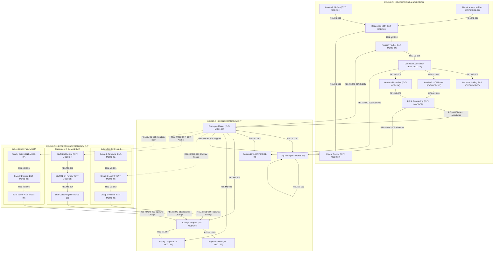

# Phase 4 — Database Documentation
## 04. Conceptual Entity-Relationship Specification

```
====================================================================================================
STATUS:
PHASE 4 — STEP 3: CONCEPTUAL ENTITY-RELATIONSHIP SPECIFICATION
DOCUMENTATION ONLY — NO PHYSICAL DATABASE ARTIFACTS

IMPORTANT GOVERNANCE NOTICE:
This document is STRICTLY DOCUMENTATION ONLY. 
It establishes the conceptual entity relationships, relationship semantics, conceptual cardinalities, 
domain interaction topologies, and cross-module associations for the University HR Change Management 
& Automation System.
No physical database tables, PostgreSQL schemas, column definitions, data types, primary/foreign keys, 
indexes, database constraints, normalization levels, SQL DDL/DML scripts, database migration files, 
Prisma schemas, or TypeORM entities are created herein.
All 104 atomic requirements, 59 business processes, 60 business rules, 11 official TBD items, 
and the 33 primary conceptual entities remain strictly frozen and authoritative.
====================================================================================================
```

---

## 1. Document Control

| Metadata Field | Specification Detail |
|---|---|
| **Document Title** | Conceptual Entity-Relationship Specification |
| **Document Reference** | `docs/08-database/04-ENTITY-RELATIONSHIP-SPECIFICATION.md` |
| **System Phase** | Phase 4 — Database Documentation (Step 3) |
| **Project Name** | University HR Change Management & Automation System |
| **Document Version** | `1.0.0` (Conceptual Baseline) |
| **Document Status** | `COMPLETED — CONCEPTUAL ENTITY-RELATIONSHIP SPECIFICATION` |
| **Baseline Date** | September 29, 2026 |
| **Authoritative Sources** | Official Requirements Baseline (`docs/01-requirements/`), Business Process Baseline (`docs/02-business-process/`), Functional Requirements Specifications (`docs/03-functional-requirements/`), Technology Architecture Baseline (`docs/07-system-architecture/` & `TECHNOLOGY_ARCHITECTURE_BASELINE.md`), Foundation Documents ([`00-DATABASE-DOCUMENTATION-INDEX.md`](file:///d:/Desktop/HR-CHANGE-MANAGEMENT-SYSTEM/docs/08-database/00-DATABASE-DOCUMENTATION-INDEX.md), [`01-DATABASE-DESIGN-OVERVIEW.md`](file:///d:/Desktop/HR-CHANGE-MANAGEMENT-SYSTEM/docs/08-database/01-DATABASE-DESIGN-OVERVIEW.md), [`02-DATA-MODEL-OVERVIEW.md`](file:///d:/Desktop/HR-CHANGE-MANAGEMENT-SYSTEM/docs/08-database/02-DATA-MODEL-OVERVIEW.md)), and Entity Identification ([`03-ENTITY-IDENTIFICATION.md`](file:///d:/Desktop/HR-CHANGE-MANAGEMENT-SYSTEM/docs/08-database/03-ENTITY-IDENTIFICATION.md)) |
| **Scope of Document** | Conceptual relationship specification, relationship semantics, conceptual cardinalities, domain interaction topologies, cross-module associations, and requirement traceability across all 33 approved conceptual entities |

---

## 2. Purpose of the Conceptual Relationship Model

The purpose of this specification is to define how the **33 primary conceptual entities** established in [`03-ENTITY-IDENTIFICATION.md`](file:///d:/Desktop/HR-CHANGE-MANAGEMENT-SYSTEM/docs/08-database/03-ENTITY-IDENTIFICATION.md) relate to, depend upon, and interact with one another across the university enterprise.

This document serves as the formal architectural bridge between functional workflows and data design:

```
[Official Requirements (104 REQ-*)]
                 │
                 ▼
[Business Processes (59 BP-*) & Rules (60 BR-*)]
                 │
                 ▼
[Functional Requirements Specifications (MOD*-REQ-*)]
                 │
                 ▼
[Conceptual Entities (33 Primary Entities in 03-ENTITY-IDENTIFICATION.md)]
                 │
                 ▼
====================================================================================
[CONCEPTUAL ENTITY-RELATIONSHIP SPECIFICATION (Current Document: 04-ENTITY-RELATIONSHIP-SPECIFICATION.md)]
====================================================================================
                 │ (Downstream Progressive Steps)
                 ▼
[Logical Schema & Attribute Specification (Step 4 / 05-DATABASE-SCHEMA-SPECIFICATION.md)]
```

By formalizing conceptual relationships, this document guarantees that:
1. **Business Semantics are Explicit:** Every connection between entities represents a verified institutional relationship (e.g., hierarchical reporting, staged change approval, evaluation scoring, or transactional outbox staging).
2. **Cardinalities are Source-Grounded:** Cardinalities reflect real-world business constraints mandated by the frozen baselines, rather than generic software conventions.
3. **Domain Ownership is Respected:** Relationships crossing module boundaries do so through defined conceptual associations without assuming physical database linkages or raw cross-module writes.
4. **Physical Design Remains Neutral:** No premature physical schema decisions (such as foreign key syntax, cascade triggers, or indexing) are introduced.

---

## 3. Relationship Modeling Principles

The conceptual relationship model is constructed under the following core principles:

1. **Source-Grounded Relationship Definition:**  
   A conceptual relationship is recognized if and only if it is explicitly mandated by an official requirement (`REQ-*`), business process (`BP-*`), business rule (`BR-*`), or functional requirement (`MOD*-REQ-*`). No relationships are inferred from generic HR practices.
2. **Relationship Direction & Semantic Clarity:**  
   Every relationship defines an explicit semantic direction (e.g., *Entity A initiates Entity B*, *Entity B provides evaluation input to Entity C*). Directionality reflects business lifecycle progression rather than physical database navigation.
3. **Conceptual Cardinality:**  
   Cardinality defines the multiplicity of conceptual instances participating in a relationship. Cardinality is stated only where explicitly supported by the requirements or where it is an unavoidable logical implication of the documented workflow.
4. **Domain Ownership Stewardship:**  
   Each entity belongs to a single owning domain. Cross-domain relationships represent conceptual collaborations and lifecycle events. They do not imply physical database foreign keys or physical PostgreSQL schema partitioning.
5. **Lifecycle Dependencies:**  
   The model explicitly captures lifecycle dependencies (e.g., an accepted Letter of Intent triggers the creation of an Employee Master Record; an approved appraisal outcome spawns a Service Condition Change Request).
6. **Cross-Module Interaction Encapsulation:**  
   Cross-module relationships respect modular boundaries. In alignment with the approved Modular Monolith architecture, cross-domain coordination occurs via public service contracts and domain events.
7. **TBD Preservation:**  
   Where relationship multiplicity, contractual scope, or policy boundaries remain unresolved in the source material, the relationship is explicitly classified as `Cardinality: TBD / Not explicitly specified` and mapped to the official project TBD register (`REQ-TBD-01` to `REQ-TBD-11`).
8. **Physical Implementation Neutrality:**  
   This document does not specify foreign key constraints, table column names, indexing, normalization levels, cascade rules, or ORM annotations.

---

## 4. Relationship Notation

To maintain conceptual rigor without confusing business multiplicity with physical database constraints, the following controlled notation is utilized:

| Notation | Multiplicity Description | Conceptual Meaning |
|---|---|---|
| **`1:1`** | One-to-One | Exactly one conceptual instance of Entity A is associated with exactly one conceptual instance of Entity B. |
| **`1:N`** | One-to-Many | One conceptual instance of Entity A is associated with zero, one, or multiple conceptual instances of Entity B. |
| **`N:1`** | Many-to-One | Multiple conceptual instances of Entity A relate to a single conceptual instance of Entity B. |
| **`N:M`** | Many-to-Many | Multiple conceptual instances of Entity A may associate with multiple conceptual instances of Entity B. |
| **`TBD`** | Open / Unspecified | The authoritative source documents do not establish sufficient policy or operational detail to fix cardinality. |

> **Governance Invariant:**  
> Conceptual cardinality describes business domain multiplicity only. It does not dictate physical foreign-key requirements, junction table implementations, or table schemas.

---

## 5. Module I Relationships (Change Management)

Module I governs the Central Employee Database, Dynamic Organization Hierarchy, Digital Personal Dossiers, and Service Condition Change Management. It encompasses **seven (7) primary conceptual relationships** among entities `ENT-MOD1-01` through `ENT-MOD1-06`:

```
┌──────────────────────────────────────────────────────────────────────────────────────────────────┐
│                            MODULE I: CONCEPTUAL RELATIONSHIP MAP                                 │
├──────────────────────────────────────────────────────────────────────────────────────────────────┤
│                                                                                                  │
│   ┌──────────────────────────┐   REL-M1-001 (1:1)    ┌──────────────────────────┐                │
│   │   Organization Node      │◄─────────────────────►│     Employee Master      │                │
│   │      (ENT-MOD1-02)       │                       │      (ENT-MOD1-01)       │                │
│   └────────────┬─────────────┘                       └─────────────┬────────────┘                │
│                │ REL-M1-002 (N:1 Self)                             │                             │
│                ▼                                                   │                             │
│         [Supervisor Node]                            ┌─────────────┴─────────────┐               │
│                                                      │ REL-M1-003 (1:1)          │ REL-M1-004    │
│                                                      ▼                           │ (1:N)         │
│                                        ┌──────────────────────────┐              ▼               │
│                                        │  Digital Personal File   │ ┌──────────────────────────┐ │
│                                        │      (ENT-MOD1-03)       │ │  Service Change Request  │ │
│                                        └──────────────────────────┘ │      (ENT-MOD1-04)       │ │
│                                                                     └────────────┬─────────────┘ │
│                                                                                  │               │
│                                                      ┌───────────────────────────┤               │
│                                                      │ REL-M1-007 (1:1)          │ REL-M1-005    │
│                                                      ▼                           │ (1:N)         │
│                                        ┌──────────────────────────┐              ▼               │
│                                        │  Service History Ledger  │ ┌──────────────────────────┐ │
│                                        │      (ENT-MOD1-06)       │ │  Change Approval Action  │ │
│                                        └──────────────────────────┘ │      (ENT-MOD1-05)       │ │
│                                                      ▲              └──────────────────────────┘ │
│                                                      │ REL-M1-006 (1:N)                          │
│                                                      └───────────────────────────────────────────┘ │
│                                                                                                  │
└──────────────────────────────────────────────────────────────────────────────────────────────────┘
```

### REL-M1-001: Employee Master ↔ Organization Node
- **From Entity:** `ENT-MOD1-01: Employee Master Record`
- **To Entity:** `ENT-MOD1-02: Organization Hierarchy Node`
- **Relationship Type:** Structural / Organizational Assignment
- **Conceptual Cardinality:** `1:1`
- **Relationship Description:** Every active employee record conceptually anchors exactly one organizational hierarchy position node representing their primary institutional appointment and departmental placement.
- **Lifecycle / Business Meaning:** Instantiated upon Day-1 onboarding; realigned in real time when an approved service condition change alters department, designation, or supervisory line.
- **Requirement Traceability:** `REQ-MOD1-01`, `REQ-MOD1-02`.
- **Business Process Traceability:** `BP-M1-001`, `BP-M1-002`.
- **Functional Requirement Traceability:** `MOD1-ORG-REQ-01`, `MOD1-ORG-REQ-02`.
- **Source Classification:** `[A] Explicit Requirement`.
- **Notes / TBD:** Secondary administrative roles (Dean, HOD, Warden) are tracked via additional responsibility attributes without fracturing the primary 1:1 organizational node anchor (`REQ-TBD-09`).

### REL-M1-002: Organization Node ↔ Supervisory Organization Node
- **From Entity:** `ENT-MOD1-02: Organization Hierarchy Node`
- **To Entity:** `ENT-MOD1-02: Organization Hierarchy Node` (Self-Association)
- **Relationship Type:** Hierarchical / Supervisory Reporting Association
- **Conceptual Cardinality:** `N:1`
- **Relationship Description:** Multiple employee position nodes report upward to a single supervisory position node within the university's organizational hierarchy.
- **Lifecycle / Business Meaning:** Forms the tree structure utilized by universal workflow engines to route approval tasks to HODs, Deans, and Executive Leadership.
- **Requirement Traceability:** `REQ-MOD1-02`, `REQ-MOD1-06`, `REQ-SHR-04`.
- **Business Process Traceability:** `BP-M1-002`, `BP-M1-010`.
- **Functional Requirement Traceability:** `MOD1-ORG-REQ-02`, `SHR-ORG-REQ-03`.
- **Source Classification:** `[A] Explicit Requirement`.
- **Notes / TBD:** Top-level executive leadership (Chancellor / Pro-Chancellor) represents the root of the hierarchy with no superior reporting node.

### REL-M1-003: Employee Master ↔ Digital Personal File
- **From Entity:** `ENT-MOD1-01: Employee Master Record`
- **To Entity:** `ENT-MOD1-03: Digital Employee File & Dossier Item`
- **Relationship Type:** Dossier Ownership / Archival Association
- **Conceptual Cardinality:** `1:1`
- **Relationship Description:** Every employee record possesses exactly one consolidated digital dossier container that indexes their verified credentials, joining letters, and career records.
- **Lifecycle / Business Meaning:** Created on Day-1 onboarding; remains permanently associated with the employee profile throughout their university tenure.
- **Requirement Traceability:** `REQ-MOD1-03`.
- **Business Process Traceability:** `BP-M1-003`, `BP-XMOD-001`.
- **Functional Requirement Traceability:** `MOD1-FIL-REQ-01` to `04`, `SHR-FIL-REQ-01`.
- **Source Classification:** `[A] Explicit Requirement`.
- **Notes / TBD:** Dossier items within the personal file accumulate across employee lifecycle events. Physical documents reside in external durable document storage.

### REL-M1-004: Employee Master ↔ Service Condition Change Request
- **From Entity:** `ENT-MOD1-01: Employee Master Record`
- **To Entity:** `ENT-MOD1-04: Service Condition Change Request`
- **Relationship Type:** Lifecycle Modification / Staged Modification Association
- **Conceptual Cardinality:** `1:N`
- **Relationship Description:** An employee master record may be the subject of multiple discrete service change requests across their university career.
- **Lifecycle / Business Meaning:** Initiated to propose modifications across 10 change formats (Salary, Designation, Reportee, Supervisor, Level, School, Location, Additional Responsibility, Qualification, Other). Completely isolates proposed values from active master data during review.
- **Requirement Traceability:** `REQ-MOD1-05`, `REQ-MOD1-07`.
- **Business Process Traceability:** `BP-M1-004`, `BP-M1-007`.
- **Functional Requirement Traceability:** `MOD1-CHG-REQ-01` to `05`.
- **Source Classification:** `[A] Explicit Requirement`.
- **Notes / TBD:** Active concurrent requests per employee are governed by institutional workflow rules; pending items do not mutate master data until scheduled effective dates.

### REL-M1-005: Service Change Request ↔ Service Change Approval Action
- **From Entity:** `ENT-MOD1-04: Service Condition Change Request`
- **To Entity:** `ENT-MOD1-05: Service Change Approval Action`
- **Relationship Type:** Workflow Governance / Sign-Off Logging
- **Conceptual Cardinality:** `1:N`
- **Relationship Description:** A single service change request accumulates sequential review and sign-off records as it progresses through the 2-level approval hierarchy.
- **Lifecycle / Business Meaning:** Captures mandatory approval actions: `Level 1: HR Review` followed by `Level 2: Senior Management Approval`. Also captures clarification returns and re-submissions.
- **Requirement Traceability:** `REQ-MOD1-06`.
- **Business Process Traceability:** `BP-M1-005`, `BP-M1-006`.
- **Functional Requirement Traceability:** `MOD1-APP-REQ-01` to `06`.
- **Source Classification:** `[A] Explicit Requirement`.
- **Notes / TBD:** Append-only log. Each action records acting authority, timestamp, outcome code, and mandatory justification comments.

### REL-M1-006: Employee Master ↔ Employee Service History Ledger
- **From Entity:** `ENT-MOD1-01: Employee Master Record`
- **To Entity:** `ENT-MOD1-06: Employee Service History Ledger`
- **Relationship Type:** Historical State Versioning Association
- **Conceptual Cardinality:** `1:N`
- **Relationship Description:** An employee master record is associated with an unbroken, append-only sequence of historical service slices.
- **Lifecycle / Business Meaning:** Each entry records the designation, salary, department, reporting authority, and rank that was operative during a specific historical interval.
- **Requirement Traceability:** `REQ-MOD1-08`.
- **Business Process Traceability:** `BP-M1-007`, `BP-M1-008`.
- **Functional Requirement Traceability:** `MOD1-AUD-REQ-04`.
- **Source Classification:** `[A] Explicit Requirement`.
- **Notes / TBD:** Enables point-in-time historical reconstruction for accreditation audits and statutory service verification.

### REL-M1-007: Service Change Request ↔ Employee Service History Ledger
- **From Entity:** `ENT-MOD1-04: Service Condition Change Request`
- **To Entity:** `ENT-MOD1-06: Employee Service History Ledger`
- **Relationship Type:** Lifecycle Trigger / Activation Provenance
- **Conceptual Cardinality:** `1:1`
- **Relationship Description:** The activation of an approved service condition change request directly generates the succeeding historical service slice in the history ledger.
- **Lifecycle / Business Meaning:** Bridges the staged change governance entity with the historical audit ledger upon arrival of the scheduled effective date.
- **Requirement Traceability:** `REQ-MOD1-07`, `REQ-MOD1-08`.
- **Business Process Traceability:** `BP-M1-007`.
- **Functional Requirement Traceability:** `MOD1-CHG-REQ-10`, `MOD1-AUD-REQ-04`.
- **Source Classification:** `[A] Explicit Requirement`.
- **Notes / TBD:** Maintains immutable backward traceability from the historical service record to the authorizing change request.

---

## 6. Module II Relationships (Recruitment & Selection)

Module II governs Academic and Non-Academic Manpower Planning, Requisitions (MRF), Sourcing, CV Processing, Selection Committees, Multi-Round Interviews, and Pre-Onboarding. It encompasses **nine (9) primary conceptual relationships** among entities `ENT-MOD2-01` through `ENT-MOD2-10`:

```
┌──────────────────────────────────────────────────────────────────────────────────────────────────┐
│                            MODULE II: CONCEPTUAL RECRUITMENT MAP                                 │
├──────────────────────────────────────────────────────────────────────────────────────────────────┤
│                                                                                                  │
│   ┌──────────────────────────┐             ┌──────────────────────────┐                          │
│   │  Academic Manpower Plan  │             │ Non-Academic M-Plan      │                          │
│   │      (ENT-MOD2-01)       │             │      (ENT-MOD2-02)       │                          │
│   └────────────┬─────────────┘             └────────────┬─────────────┘                          │
│                │ REL-M2-001 (1:N)                       │ REL-M2-002 (1:N)                       │
│                ▼                                        ▼                                        │
│   ┌───────────────────────────────────────────────────────────┐ ◄─── REL-M2-003 (1:1)            │
│   │             Manpower Requisition Form (MRF)               │      ┌─────────────────────────┐ │
│   │                      (ENT-MOD2-03)                        │      │ Urgent Replacement Trk. │ │
│   └────────────────────────────┬──────────────────────────────┘      │      (ENT-MOD2-10)      │ │
│                                │ REL-M2-004 (1:1)                    └─────────────────────────┘ │
│                                ▼                                                                 │
│   ┌───────────────────────────────────────────────────────────┐                                  │
│   │               Open Positions Tracker Entry                │                                  │
│   │                      (ENT-MOD2-04)                        │                                  │
│   └────────────────────────────┬──────────────────────────────┘                                  │
│                                │ REL-M2-005 (1:N)                                                │
│                                ▼                                                                 │
│   ┌───────────────────────────────────────────────────────────┐                                  │
│   │          Candidate Profile & Application Record           │                                  │
│   │                      (ENT-MOD2-05)                        │                                  │
│   └──────┬─────────────────────┬───────────────────────┬──────┘                                  │
│          │ REL-M2-006 (1:1)    │ REL-M2-007 (1:1)      │ REL-M2-008 (1:N)                        │
│          ▼                     ▼                       ▼                                         │
│   ┌──────────────┐      ┌──────────────┐        ┌──────────────┐                                 │
│   │ Recruiter CS │      │ Academic SCM │        │ Non-Acad Int │                                 │
│   │(ENT-MOD2-06) │      │(ENT-MOD2-07) │        │(ENT-MOD2-08) │                                 │
│   └──────────────┘      └──────┬───────┘        └──────┬───────┘                                 │
│                                │ REL-M2-009 (1:1)      │ REL-M2-009 (1:1)                        │
│                                └──────────────┬────────┘                                         │
│                                               ▼                                                  │
│                                 ┌───────────────────────────┐                                    │
│                                 │   Letter of Intent (LOI)  │                                    │
│                                 │       (ENT-MOD2-09)       │                                    │
│                                 └───────────────────────────┘                                    │
│                                                                                                  │
└──────────────────────────────────────────────────────────────────────────────────────────────────┘
```

### REL-M2-001: Academic Manpower Plan ↔ Manpower Requisition Form (MRF)
- **From Entity:** `ENT-MOD2-01: Academic Manpower Plan & Workload Requisition`
- **To Entity:** `ENT-MOD2-03: Manpower Requisition Form (MRF)`
- **Relationship Type:** Requisition Generation / Lifecycle Trigger
- **Conceptual Cardinality:** `1:N`
- **Relationship Description:** An approved semester academic faculty plan generates one or more individual planned MRF requisitions for authorized teaching positions.
- **Lifecycle / Business Meaning:** Triggered upon Hon'ble Pro-Chancellor approval of the Dean's teaching load distribution (**Attachment 1**) following HR vetting.
- **Requirement Traceability:** `REQ-MOD2-02`, `REQ-MOD2-06`.
- **Business Process Traceability:** `BP-M2-ACAD-005`, `BP-M2-ACAD-006`.
- **Functional Requirement Traceability:** `MOD2-MP-FAC-REQ-06`.
- **Source Classification:** `[A] Explicit Requirement`.
- **Notes / TBD:** Each generated MRF inherits departmental allocations and target completion milestones from the parent plan.

### REL-M2-002: Non-Academic Manpower Plan ↔ Manpower Requisition Form (MRF)
- **From Entity:** `ENT-MOD2-02: Non-Academic Manpower Plan`
- **To Entity:** `ENT-MOD2-03: Manpower Requisition Form (MRF)`
- **Relationship Type:** Requisition Generation / Lifecycle Trigger
- **Conceptual Cardinality:** `1:N`
- **Relationship Description:** An approved annual non-academic plan generates one or more planned MRFs for approved administrative, technical, and operational staff positions.
- **Lifecycle / Business Meaning:** Enforces the institutional constraint of maximum 1 planned requisition per department per year, triggered upon Pro-Chancellor sign-off.
- **Requirement Traceability:** `REQ-MOD2-07`, `REQ-MOD2-10`.
- **Business Process Traceability:** `BP-M2-NACAD-004`, `BP-M2-NACAD-005`.
- **Functional Requirement Traceability:** `MOD2-MP-NF-REQ-05`.
- **Source Classification:** `[A] Explicit Requirement`.
- **Notes / TBD:** Includes Lab Technicians under baseline `REQ-MOD2-01`.

### REL-M2-003: Urgent Replacement Tracker ↔ Manpower Requisition Form (MRF)
- **From Entity:** `ENT-MOD2-10: Urgent Replacement Tracker`
- **To Entity:** `ENT-MOD2-03: Manpower Requisition Form (MRF)`
- **Relationship Type:** Fast-Track Requisition Spawn / Lifecycle Trigger
- **Conceptual Cardinality:** `1:1`
- **Relationship Description:** An urgent replacement tracking instance auto-spawns exactly one pre-populated Urgent Replacement MRF.
- **Lifecycle / Business Meaning:** Initiated when an employee resignation is accepted in Module I; bypasses annual planning quotas to enable fast-track sourcing within 7 days.
- **Requirement Traceability:** `REQ-MOD2-03`.
- **Business Process Traceability:** `BP-M2-URG-001`, `BP-XMOD-002`.
- **Functional Requirement Traceability:** `MOD2-URG-REQ-02`.
- **Source Classification:** `[A] Explicit Requirement`.
- **Notes / TBD:** Linked to the outgoing employee's resignation notice period countdown.

### REL-M2-004: Manpower Requisition Form (MRF) ↔ Open Positions Tracker Entry
- **From Entity:** `ENT-MOD2-03: Manpower Requisition Form (MRF)`
- **To Entity:** `ENT-MOD2-04: Open Positions Tracker Entry`
- **Relationship Type:** Operational Ledger Synchronization
- **Conceptual Cardinality:** `1:1`
- **Relationship Description:** Every approved MRF instantiates and synchronizes with an authoritative operational tracker record in University **Attachment 3**.
- **Lifecycle / Business Meaning:** Created within 30 days of MRF sign-off to provide real-time institutional visibility into vacancy status, sourcing channels, and hiring velocity.
- **Requirement Traceability:** `REQ-MOD2-11`.
- **Business Process Traceability:** `BP-M2-ACAD-006`, `BP-M2-TRK-001`.
- **Functional Requirement Traceability:** `MOD2-POS-REQ-01`.
- **Source Classification:** `[A] Explicit Requirement`.
- **Notes / TBD:** Tracks status transitions from Open through Sourcing, Interviewing, Offered, to Filled.

### REL-M2-005: Open Positions Tracker Entry ↔ Candidate Application Record
- **From Entity:** `ENT-MOD2-04: Open Positions Tracker Entry`
- **To Entity:** `ENT-MOD2-05: Candidate Profile & Application Record`
- **Relationship Type:** Sourcing & Application Association
- **Conceptual Cardinality:** `1:N`
- **Relationship Description:** An open position receives multiple candidate applications across university portals, direct emails, employee referrals, and job boards.
- **Lifecycle / Business Meaning:** Represents the recruitment sourcing funnel; manages deduplication and screening pipelines per vacancy.
- **Requirement Traceability:** `REQ-MOD2-12`, `REQ-MOD2-19`.
- **Business Process Traceability:** `BP-M2-TRK-001`, `BP-M2-ACAD-007`.
- **Functional Requirement Traceability:** `MOD2-SRC-REQ-01` to `06`.
- **Source Classification:** `[A] Explicit Requirement`.
- **Notes / TBD:** A single candidate may conceptually submit applications to multiple open positions over time.

### REL-M2-006: Candidate Application ↔ Recruiter Calling Record (RCS)
- **From Entity:** `ENT-MOD2-05: Candidate Profile & Application Record`
- **To Entity:** `ENT-MOD2-06: Recruiter Calling Record (RCS)`
- **Relationship Type:** Preliminary Screening Assessment Association
- **Conceptual Cardinality:** `1:1`
- **Relationship Description:** Each candidate application undergoes preliminary telephonic screening documented in one Recruiter Calling Sheet record.
- **Lifecycle / Business Meaning:** Captures current CTC, expected CTC, notice period, location willingness, and recruiter evaluation to support departmental shortlisting.
- **Requirement Traceability:** `REQ-MOD2-12`.
- **Business Process Traceability:** `BP-M2-ACAD-007`, `BP-M2-ACAD-008`.
- **Functional Requirement Traceability:** `MOD2-RCS-REQ-01` to `06`.
- **Source Classification:** `[A] Explicit Requirement`.
- **Notes / TBD:** Forms the basis for HOD and HR candidate interview shortlisting.

### REL-M2-007: Candidate Application ↔ Academic SCM Session & Score Record
- **From Entity:** `ENT-MOD2-05: Candidate Profile & Application Record`
- **To Entity:** `ENT-MOD2-07: Academic Selection Committee (SCM) Session & Score Record`
- **Relationship Type:** Statutory Academic Selection Evaluation Association
- **Conceptual Cardinality:** `1:1`
- **Relationship Description:** A shortlisted academic faculty candidate appears before a statutory Selection Committee Meeting (SCM), generating one composite evaluation record.
- **Lifecycle / Business Meaning:** Aggregates individual panelist marks across subject knowledge, pedagogy, research, and communication into the Evaluation Matrix for Senior Management cost approval.
- **Requirement Traceability:** `REQ-MOD2-14`.
- **Business Process Traceability:** `BP-M2-ACAD-009`, `BP-M2-ACAD-010`.
- **Functional Requirement Traceability:** `MOD2-SCM-REQ-01` to `06`.
- **Source Classification:** `[A] Explicit Requirement`.
- **Notes / TBD:** Pertains exclusively to the Academic Recruitment track. Panelist marks are locked once submitted.

### REL-M2-008: Candidate Application ↔ Non-Academic Interview Round Record
- **From Entity:** `ENT-MOD2-05: Candidate Profile & Application Record`
- **To Entity:** `ENT-MOD2-08: Non-Academic Interview Round & Score Record`
- **Relationship Type:** Sequential Multi-Round Evaluation Association
- **Conceptual Cardinality:** `1:N`
- **Relationship Description:** A shortlisted non-academic candidate progresses through up to three sequential interview round evaluation records.
- **Lifecycle / Business Meaning:** Enforces strict sequential evaluation: Round 1 (Technical Interview — HOD/Technical Panel) → Round 2 (HR Interview — Head HR) → Round 3 (Management Interview — Senior Leadership).
- **Requirement Traceability:** `REQ-MOD2-15`.
- **Business Process Traceability:** `BP-M2-NACAD-006`, `BP-M2-NACAD-007`.
- **Functional Requirement Traceability:** `MOD2-INT-REQ-01` to `06`.
- **Source Classification:** `[A] Explicit Requirement`.
- **Notes / TBD:** Pertains exclusively to the Non-Academic Recruitment track. Candidate must pass a round to progress to the next.

### REL-M2-009: Candidate Application ↔ Letter of Intent (LOI) & Pre-Onboarding
- **From Entity:** `ENT-MOD2-05: Candidate Profile & Application Record`
- **To Entity:** `ENT-MOD2-09: Letter of Intent (LOI) & Pre-Onboarding Record`
- **Relationship Type:** Offer Management & Pre-Onboarding Association
- **Conceptual Cardinality:** `1:1`
- **Relationship Description:** A candidate recommended by the selection panel and approved by Management receives one formal Letter of Intent (LOI) and pre-onboarding tracking record.
- **Lifecycle / Business Meaning:** Captures candidate offer acceptance or decline, monitors "Yet to Join" milestones, and orchestrates Day-1 onboarding triggers.
- **Requirement Traceability:** `REQ-MOD2-16`, `REQ-MOD2-17`, `REQ-MOD2-18`.
- **Business Process Traceability:** `BP-M2-ACAD-011`/`012`, `BP-M2-NACAD-008`.
- **Functional Requirement Traceability:** `MOD2-YTJ-REQ-01` to `07`.
- **Source Classification:** `[A] Explicit Requirement`.
- **Notes / TBD:** Contractual boundary regarding whether LOI is the sole pre-joining instrument or if a distinct formal Appointment Letter is issued is an open policy item under `REQ-TBD-08`.

---

## 7. Module III Relationships (Performance Management)

Module III preserves **three completely independent performance management subsystems**. It encompasses **six (6) primary conceptual relationships** among entities `ENT-MOD3-01` through `ENT-MOD3-09`:

### 7.1 Subsystem 1 Relationships: Group-D / Band I Monthly & Annual Appraisal

```
┌──────────────────────────────────────────────────────────────────────────────────────────────────┐
│                           SUBSYSTEM 1: GROUP-D CONCEPTUAL RELATIONSHIPS                          │
├──────────────────────────────────────────────────────────────────────────────────────────────────┤
│                                                                                                  │
│   ┌──────────────────────────┐                                                                   │
│   │   Group-D Form Template  │                                                                   │
│   │      (ENT-MOD3-01)       │                                                                   │
│   └────────────┬─────────────┘                                                                   │
│                │ REL-M3-001 (1:N)                                                                │
│                ▼                                                                                 │
│   ┌──────────────────────────┐                      ┌──────────────────────────┐                 │
│   │ Group-D Monthly Instance │  REL-M3-002 (N:1)    │ Group-D Annual Collation │                 │
│   │      (ENT-MOD3-02)       │─────────────────────►│      (ENT-MOD3-03)       │                 │
│   └──────────────────────────┘                      └──────────────────────────┘                 │
│                                                                                                  │
└──────────────────────────────────────────────────────────────────────────────────────────────────┘
```

#### REL-M3-001: Group-D Template ↔ Group-D Monthly Evaluation Instance
- **From Entity:** `ENT-MOD3-01: Group-D Evaluation Form Template`
- **To Entity:** `ENT-MOD3-02: Group-D Monthly Evaluation Instance`
- **Relationship Type:** Template Instantiation / Configuration Association
- **Conceptual Cardinality:** `1:N`
- **Relationship Description:** Role-specific KPI templates (University **Enclosure 1**) are instantiated on the 1st of every month into active evaluation forms for designated Group-D personnel.
- **Lifecycle / Business Meaning:** Provides the role-specific rubric (peons, drivers, security personnel, sweepers) governing monthly scoring.
- **Requirement Traceability:** `REQ-MOD3-01`.
- **Business Process Traceability:** `BP-M3-GD-001`, `BP-M3-GD-002`.
- **Functional Requirement Traceability:** `MOD3-GD-REQ-01`, `MOD3-GD-REQ-04`.
- **Source Classification:** `[A] Explicit Requirement`.
- **Notes / TBD:** Semi-structured template configuration allows HR to adjust role competencies without altering core data models.

#### REL-M3-002: Group-D Monthly Instance ↔ Group-D Annual Collation Report
- **From Entity:** `ENT-MOD3-02: Group-D Monthly Evaluation Instance`
- **To Entity:** `ENT-MOD3-03: Group-D Annual Collation Report`
- **Relationship Type:** Periodic Aggregation & Collation Association
- **Conceptual Cardinality:** `N:1`
- **Relationship Description:** Twelve (12) consecutive monthly evaluation instances over a 1-year service period aggregate into one annual collation report.
- **Lifecycle / Business Meaning:** Triggered on the 1-year anniversary of Date of Joining (DOJ); computes parameter-weighted average scores and verifies probation clearance to support Management compensation slab decisions.
- **Requirement Traceability:** `REQ-MOD3-06`, `REQ-MOD3-07`.
- **Business Process Traceability:** `BP-M3-GD-006`, `BP-M3-GD-007`.
- **Functional Requirement Traceability:** `MOD3-GD-REQ-14` to `18`.
- **Source Classification:** `[A] Explicit Requirement`.
- **Notes / TBD:** Fixed business cardinality: exactly 12 monthly instances aggregate into 1 annual review.

---

### 7.2 Subsystem 2 Relationships: General Staff KRA/KPI Lifecycle

```
┌──────────────────────────────────────────────────────────────────────────────────────────────────┐
│                         SUBSYSTEM 2: GENERAL STAFF CONCEPTUAL RELATIONSHIPS                      │
├──────────────────────────────────────────────────────────────────────────────────────────────────┤
│                                                                                                  │
│   ┌──────────────────────────┐                                                                   │
│   │ Staff Goal Setting Rec.  │                                                                   │
│   │      (ENT-MOD3-04)       │                                                                   │
│   └────────────┬─────────────┘                                                                   │
│                │ REL-M3-003 (1:N)                                                                │
│                ▼                                                                                 │
│   ┌──────────────────────────┐                      ┌──────────────────────────┐                 │
│   │  Staff Quarterly Review  │  REL-M3-004 (N:1)    │ Staff Annual Appraisal   │                 │
│   │      (ENT-MOD3-05)       │─────────────────────►│      (ENT-MOD3-06)       │                 │
│   └──────────────────────────┘                      └──────────────────────────┘                 │
│                                                                                                  │
└──────────────────────────────────────────────────────────────────────────────────────────────────┘
```

#### REL-M3-003: Staff Goal Setting Record ↔ Staff Quarterly Review Record
- **From Entity:** `ENT-MOD3-04: General Staff KRA/KPI Goal Setting Record`
- **To Entity:** `ENT-MOD3-05: General Staff Quarterly Review Record (Q1–Q4)`
- **Relationship Type:** Goal Baseline Evaluation Association
- **Conceptual Cardinality:** `1:N`
- **Relationship Description:** The locked 30-day goal-setting record provides the performance baseline evaluated across four sequential quarterly reviews (Q1, Q2, Q3, Q4).
- **Lifecycle / Business Meaning:** Evaluates employee progress against agreed goals on a 90-day cadence, incorporating employee self-assessment and supervisor verification.
- **Requirement Traceability:** `REQ-MOD3-09`, `REQ-MOD3-10`.
- **Business Process Traceability:** `BP-M3-KRA-001`, `BP-M3-KRA-002`.
- **Functional Requirement Traceability:** `MOD3-KRA-REQ-05`.
- **Source Classification:** `[A] Explicit Requirement`.
- **Notes / TBD:** Fixed business cardinality: exactly 4 quarterly review cycles per annual performance cycle.

#### REL-M3-004: Staff Quarterly Review Record ↔ Staff Annual Appraisal Outcome
- **From Entity:** `ENT-MOD3-05: General Staff Quarterly Review Record (Q1–Q4)`
- **To Entity:** `ENT-MOD3-06: General Staff Annual Appraisal Outcome`
- **Relationship Type:** Annual Portfolio Synthesis Association
- **Conceptual Cardinality:** `N:1`
- **Relationship Description:** The four quarterly review records (Q1–Q4) synthesize into one final annual performance appraisal outcome.
- **Lifecycle / Business Meaning:** Senior Management reviews the composite annual portfolio to approve salary increments, designation changes, or promotions.
- **Requirement Traceability:** `REQ-MOD3-13`.
- **Business Process Traceability:** `BP-M3-KRA-005`.
- **Functional Requirement Traceability:** `MOD3-KRA-REQ-15`.
- **Source Classification:** `[A] Explicit Requirement`.
- **Notes / TBD:** Fixed business cardinality: 4 quarterly reviews synthesize into 1 annual outcome.

---

### 7.3 Subsystem 3 Relationships: Faculty Annual Appraisal (ECM Route)

```
┌──────────────────────────────────────────────────────────────────────────────────────────────────┐
│                         SUBSYSTEM 3: FACULTY ECM CONCEPTUAL RELATIONSHIPS                        │
├──────────────────────────────────────────────────────────────────────────────────────────────────┤
│                                                                                                  │
│   ┌──────────────────────────┐                                                                   │
│   │ Faculty Elig. Batch      │                                                                   │
│   │      (ENT-MOD3-07)       │                                                                   │
│   └────────────┬─────────────┘                                                                   │
│                │ REL-M3-005 (1:N)                                                                │
│                ▼                                                                                 │
│   ┌──────────────────────────┐                      ┌──────────────────────────┐                 │
│   │ Faculty Self-Appraisal   │  REL-M3-006 (1:1)    │ Faculty ECM Session Mat. │                 │
│   │      (ENT-MOD3-08)       │─────────────────────►│      (ENT-MOD3-09)       │                 │
│   └──────────────────────────┘                      └──────────────────────────┘                 │
│                                                                                                  │
└──────────────────────────────────────────────────────────────────────────────────────────────────┘
```

#### REL-M3-005: Faculty Eligibility Batch ↔ Faculty Self-Appraisal Dossier & Verification
- **From Entity:** `ENT-MOD3-07: Faculty Annual Appraisal Eligibility Batch`
- **To Entity:** `ENT-MOD3-08: Faculty Self-Appraisal Dossier & Multi-Unit Verification Record`
- **Relationship Type:** Batch Issuance / Dossier Generation Association
- **Conceptual Cardinality:** `1:N`
- **Relationship Description:** A confirmed monthly eligibility batch issues individual self-appraisal dossiers to all eligible faculty members on the roster.
- **Lifecycle / Business Meaning:** Triggered on the 10th of every month; confirms faculty matching `probation_completed = TRUE` and `>= 12 months` since last appraisal.
- **Requirement Traceability:** `REQ-MOD3-14`, `REQ-MOD3-15`, `REQ-MOD3-16`.
- **Business Process Traceability:** `BP-M3-FAC-001`, `BP-M3-FAC-002`, `BP-M3-FAC-003`.
- **Functional Requirement Traceability:** `MOD3-FAC-REQ-05`, `MOD3-FAC-REQ-06`.
- **Source Classification:** `[A] Explicit Requirement`.
- **Notes / TBD:** Each dossier routes in parallel to exactly 4 verification units (Dean, R&D Cell, Placement Cell, HR).

#### REL-M3-006: Faculty Self-Appraisal Dossier ↔ Faculty ECM Session & TNU Matrix
- **From Entity:** `ENT-MOD3-08: Faculty Self-Appraisal Dossier & Multi-Unit Verification Record`
- **To Entity:** `ENT-MOD3-09: Faculty ECM Session & TNU Protocol Evaluation Matrix Record`
- **Relationship Type:** Committee Session Evaluation Association
- **Conceptual Cardinality:** `1:1`
- **Relationship Description:** A verified 4-unit faculty dossier feeds directly into a scheduled Evaluation Committee Meeting (ECM) session for scoring and matrix compilation.
- **Lifecycle / Business Meaning:** ECM panelists record digital scores during the session; the system compiles the TNU Protocol Evaluation Matrix for Senior Management compensation decision.
- **Requirement Traceability:** `REQ-MOD3-17`, `REQ-MOD3-18`, `REQ-MOD3-19`.
- **Business Process Traceability:** `BP-M3-FAC-005`, `BP-M3-FAC-006`, `BP-M3-FAC-008`.
- **Functional Requirement Traceability:** `MOD3-FAC-REQ-14` to `21`.
- **Source Classification:** `[A] Explicit Requirement`.
- **Notes / TBD:** Governed by the 3 baseline outcomes: annual increment, accelerated increment, promotion.

---

## 8. Shared Platform Relationships

Shared platform entities provide cross-cutting capabilities across Module I, Module II, and Module III. It encompasses **eight (8) primary conceptual relationships** involving entities `ENT-SHR-01` through `ENT-SHR-08`:

### REL-SHR-001: User Account ↔ Employee Master Record
- **From Entity:** `ENT-SHR-01: User Account & Authentication Credential Profile`
- **To Entity:** `ENT-MOD1-01: Employee Master Record`
- **Relationship Type:** Identity & Core Subject Association
- **Conceptual Cardinality:** `1:1`
- **Relationship Description:** An internal university user account represents and authenticates exactly one active employee profile.
- **Lifecycle / Business Meaning:** Instantiated upon Day-1 employee onboarding; deactivated or restricted upon employee resignation or retirement.
- **Requirement Traceability:** `REQ-SEC-01`, `SHR-AUT-REQ-01`.
- **Source Classification:** `[B] Logical Implication`.
- **Notes / TBD:** External statutory SCM experts receive time-limited, single-use access tokens without full employee master records (`REQ-MOD2-14`). Enterprise SSO integration is governed by `REQ-TBD-07`.

### REL-SHR-002: User Account ↔ Role & Permission Assignment
- **From Entity:** `ENT-SHR-01: User Account & Authentication Credential Profile`
- **To Entity:** `ENT-SHR-02: Role & Permission Assignment`
- **Relationship Type:** RBAC Authorization Mapping
- **Conceptual Cardinality:** `N:M`
- **Relationship Description:** Users are assigned one or more organizational roles (Pro-Chancellor, Management, Dean, HOD, HR, Staff); roles are assigned to multiple users.
- **Lifecycle / Business Meaning:** Enforces system-wide Role-Based Access Control and contextual row-level data scoping rules (e.g., HOD restricted to department, Dean to school).
- **Requirement Traceability:** `REQ-SEC-03`.
- **Functional Traceability:** `SHR-RBC-REQ-01`, `SHR-RBC-REQ-02`.
- **Source Classification:** `[B] Logical Implication`.
- **Notes / TBD:** Authorization rules are consumed by all functional modules to enforce data boundaries.

### REL-SHR-003: Workflow State Instance ↔ Governed Transactional Entities
- **From Entity:** `ENT-SHR-03: Workflow State Instance & Transition Log`
- **To Entity:** Governed Transactional Entities (`ENT-MOD1-04`, `ENT-MOD2-01`, `ENT-MOD2-02`, `ENT-MOD2-03`, `ENT-MOD3-02`, `ENT-MOD3-05`, `ENT-MOD3-08`, `ENT-MOD3-09`)
- **Relationship Type:** Finite State Machine (FSM) Lifecycle Tracking
- **Conceptual Cardinality:** `1:1` (per active lifecycle instance) / `1:N` (transition log entries)
- **Relationship Description:** Tracks current state, prior state, acting authority, transition guards, and approval comments across all university workflows.
- **Lifecycle / Business Meaning:** Isolates business domain entities from repetitive workflow state-machine mechanics.
- **Requirement Traceability:** `REQ-MOD1-06`, `REQ-MOD2-14`, `REQ-MOD3-04`, `REQ-SHR-01`.
- **Functional Traceability:** `SHR-WFL-REQ-01` to `03`.
- **Source Classification:** `[B] Logical Implication`.
- **Notes / TBD:** Standardizes state transition validation across change requests, requisitions, and appraisals.

### REL-SHR-004: SLA & Deadline Timer ↔ Governed Operational Entities
- **From Entity:** `ENT-SHR-04: SLA & Deadline Timer Record`
- **To Entity:** Governed Operational Entities (`ENT-MOD2-01`, `ENT-MOD2-02`, `ENT-MOD2-03`, `ENT-MOD2-10`, `ENT-MOD3-02`, `ENT-MOD3-04`, `ENT-MOD3-05`, `ENT-MOD3-08`)
- **Relationship Type:** Deadline Monitoring & Automated Lockout Association
- **Conceptual Cardinality:** `1:N`
- **Relationship Description:** Monitors submission windows, grace periods, turnaround times, and lockout cutoffs across operational entities.
- **Lifecycle / Business Meaning:** Powers background timeline workers that identify breaches, issue automated countdown reminders, and execute auto-locks (e.g., 7th/10th Group-D auto-lock).
- **Requirement Traceability:** `REQ-MOD2-02`, `REQ-MOD3-02`, `REQ-SHR-03`.
- **Functional Traceability:** `SHR-SLA-REQ-01` to `03`.
- **Source Classification:** `[B] Logical Implication`.
- **Notes / TBD:** Operates asynchronously across all three business modules.

### REL-SHR-005: Document Metadata ↔ Referenced Binary Artifacts
- **From Entity:** `ENT-SHR-05: Document Metadata & Binary Reference`
- **To Entity:** Referenced Entities (`ENT-MOD1-03`, `ENT-MOD2-01`, `ENT-MOD2-05`, `ENT-MOD2-09`, `ENT-MOD3-05`, `ENT-MOD3-08`, `ENT-MOD3-09`)
- **Relationship Type:** Document Locator & Cryptographic Reference Association
- **Conceptual Cardinality:** `1:N`
- **Relationship Description:** Maintains locator keys, MIME types, file sizes, and cryptographic verification hashes for binary documents stored externally.
- **Lifecycle / Business Meaning:** Ensures the relational database stores strictly structured metadata rather than raw binary BLOBs.
- **Requirement Traceability:** `REQ-MOD1-03`, `REQ-MOD2-12`, `REQ-MOD3-16`, `REQ-SHR-02`.
- **Functional Traceability:** `SHR-DOC-REQ-01` to `03`.
- **Source Classification:** `[C] Approved Technical Decision`.
- **Notes / TBD:** Abstracted reference to durable external document storage.

### REL-SHR-006: Notification Queue ↔ Event Triggers Across Modules
- **From Entity:** `ENT-SHR-06: Notification Queue & Dispatch Record`
- **To Entity:** Event-Emitting Entities Across Modules I, II, and III
- **Relationship Type:** Asynchronous Communication Dispatch Association
- **Conceptual Cardinality:** `1:N`
- **Relationship Description:** Captures outbound multi-channel notifications (email, SMS, in-app alerts) spawned by workflow events, deadline reminders, or status transitions.
- **Lifecycle / Business Meaning:** Buffers outbound communication, tracking delivery status, retry attempts, and transmission logs without blocking transaction threads.
- **Requirement Traceability:** `REQ-MOD2-18`, `REQ-MOD3-02`, `REQ-SHR-05`.
- **Functional Traceability:** `SHR-NTF-REQ-01` to `03`.
- **Source Classification:** `[B] Logical Implication`.
- **Notes / TBD:** Outbound communication gateway host configurations remain an open technical decision under `REQ-TBD-10`.

### REL-SHR-007: Immutable Audit Trail ↔ All Conceptual Entities
- **From Entity:** `ENT-SHR-07: Immutable Audit Trail Entry`
- **To Entity:** All Conceptual Entities (`ENT-MOD1-*`, `ENT-MOD2-*`, `ENT-MOD3-*`, `ENT-SHR-*`)
- **Relationship Type:** System-Wide Audit Supervision & Diff Logging
- **Conceptual Cardinality:** `1:N`
- **Relationship Description:** Logs append-only before/after state diffs for every state creation, mutation, or activation across all system entities.
- **Lifecycle / Business Meaning:** Guarantees regulatory compliance, accreditation transparency, and tamper-evident administrative accountability.
- **Requirement Traceability:** `REQ-MOD1-08`, `REQ-SEC-04`.
- **Functional Traceability:** `MOD1-AUD-REQ-01` to `06`, `SHR-AUD-REQ-01`.
- **Source Classification:** `[A] Explicit Requirement`.
- **Notes / TBD:** Append-only ledger. Retention schedules remain an open policy decision under `REQ-TBD-11`.

### REL-SHR-008: ERP Transactional Outbox ↔ Master Employee Changes
- **From Entity:** `ENT-SHR-08: ERP Transactional Outbox Staging Record`
- **To Entity:** `ENT-MOD1-01: Employee Master Record` / `ENT-MOD1-04: Service Change Request`
- **Relationship Type:** Transactional Integration Staging Association
- **Conceptual Cardinality:** `1:N`
- **Relationship Description:** Stages outbound data synchronization payloads written within the same local transactional boundary as approved master employee updates.
- **Lifecycle / Business Meaning:** Implements the Transactional Outbox Pattern to guarantee reliable external ERP synchronization without distributed two-phase commit overhead.
- **Requirement Traceability:** `REQ-MOD1-04`, `REQ-INT-01`.
- **Functional Traceability:** `MOD1-CDB-REQ-03`, `SHR-INT-REQ-01`.
- **Source Classification:** `[C] Approved Technical Decision`.
- **Notes / TBD:** Transport protocol (staging table vs. REST webhook vs. SFTP batch) is governed by `REQ-TBD-01`.

---

## 9. Cross-Module Conceptual Relationships

Cross-module relationships define the lifecycle handshakes that unite the three functional modules into a cohesive institutional platform:

```
┌──────────────────────────────────────────────────────────────────────────────────────────────────┐
│                            CROSS-MODULE CONCEPTUAL INTERACTION TOPOLOGY                          │
├──────────────────────────────────────────────────────────────────────────────────────────────────┤
│                                                                                                  │
│   ┌────────────────────────────────┐                 ┌────────────────────────────────┐          │
│   │   MODULE II: RECRUITMENT       │                 │   MODULE I: CHANGE MANAGEMENT  │          │
│   │                                │                 │                                │          │
│   │ • LOI Record (ENT-MOD2-09)     │──REL-XMOD-001──►│ • Employee Master (ENT-MOD1-01)│          │
│   │ • Candidate Dossier (ENT-MOD2) │──REL-XMOD-003──►│ • Personal File (ENT-MOD1-03)  │          │
│   │ • Open Position (ENT-MOD2-04)  │◄─REL-XMOD-004───│ • Org Node (ENT-MOD1-02)       │          │
│   │ • Urgent Tracker (ENT-MOD2-10) │◄─REL-XMOD-005───│ • Resignation Event            │          │
│   └────────────────────────────────┘                 └───────────────┬────────────────┘          │
│                                                                      │                           │
│                                              ┌───────────────────────┴───────────────┐           │
│                                              │                                       │           │
│                               REL-XMOD-006 to 008 (Inbound Master Query)             │           │
│                                              │                                       │           │
│                                              ▼                                       │           │
│                              ┌────────────────────────────────┐                      │           │
│                              │  MODULE III: PERFORMANCE MGMT  │                      │           │
│                              │                                │                      │           │
│                              │ • Subsystem 1: Group-D Appr.   │                      │           │
│                              │ • Subsystem 2: Staff KRA/KPI   │                      │           │
│                              │ • Subsystem 3: Faculty ECM     │                      │           │
│                              │                                │                      │           │
│                              │ (Appraisal Outcome Handshake)  │                      │           │
│                              │ • Approved Outcome Records     │──REL-XMOD-009 to 011─┘           │
│                              │   (ENT-MOD3-03, 06, 09)        │  (Auto-Spawns Service Change     │
│                              └────────────────────────────────┘   Request: ENT-MOD1-04)          │
│                                                                                                  │
└──────────────────────────────────────────────────────────────────────────────────────────────────┘
```

### 9.1 Module I ↔ Module II (Recruitment to Employee Master)

#### REL-XMOD-001: LOI Acceptance ↔ Employee Master Instantiation
- **From Entity:** `ENT-MOD2-09: Letter of Intent (LOI) & Pre-Onboarding Record`
- **To Entity:** `ENT-MOD1-01: Employee Master Record`
- **Relationship Type:** Lifecycle Handshake / Entity Instantiation
- **Conceptual Cardinality:** `1:1`
- **Relationship Description:** When a candidate accepts an LOI and completes Day-1 joining verification, the system executes an automated handshake instantiating a new active record in the Employee Master Record.
- **Requirement Traceability:** `REQ-MOD2-16`, `REQ-MOD1-01`.
- **Business Process Traceability:** `BP-XMOD-001`.
- **Functional Requirement Traceability:** `MOD2-YTJ-REQ-05`, `MOD1-CDB-REQ-01`.
- **Source Classification:** `[A] Explicit Requirement`.
- **Notes / TBD:** Prevents duplicate manual data re-entry; transitions candidate to active employee.

#### REL-XMOD-002: Candidate Onboarding ↔ Organization Hierarchy Allocation
- **From Entity:** `ENT-MOD2-09: Letter of Intent (LOI) & Pre-Onboarding Record`
- **To Entity:** `ENT-MOD1-02: Organization Hierarchy Node`
- **Relationship Type:** Position Allocation Association
- **Conceptual Cardinality:** `1:1`
- **Relationship Description:** Day-1 joining allocates an active position node within the university organization hierarchy, establishing supervisory reporting lines.
- **Requirement Traceability:** `REQ-MOD1-02`, `REQ-MOD2-16`.
- **Business Process Traceability:** `BP-XMOD-001`.
- **Functional Requirement Traceability:** `MOD1-ORG-REQ-01`.
- **Source Classification:** `[A] Explicit Requirement`.
- **Notes / TBD:** Realigns the organization tree dynamically in real time.

#### REL-XMOD-003: Candidate Application ↔ Digital Employee File Archival
- **From Entity:** `ENT-MOD2-05: Candidate Profile & Application Record`
- **To Entity:** `ENT-MOD1-03: Digital Employee File & Dossier Item`
- **Relationship Type:** Dossier Ingestion & Credential Transfer
- **Conceptual Cardinality:** `1:1`
- **Relationship Description:** Verified candidate application credentials, degree certificates, resume metadata, and signed LOI are ingested directly into the employee's newly instantiated digital dossier.
- **Requirement Traceability:** `REQ-MOD1-03`, `REQ-MOD2-12`.
- **Business Process Traceability:** `BP-XMOD-001`.
- **Functional Requirement Traceability:** `MOD1-FIL-REQ-01`, `SHR-FIL-REQ-01`.
- **Source Classification:** `[A] Explicit Requirement`.
- **Notes / TBD:** Ensures continuous institutional documentation without physical re-uploading.

#### REL-XMOD-004: Employee Master Instantiation ↔ Open Position Fulfillment
- **From Entity:** `ENT-MOD1-01: Employee Master Record`
- **To Entity:** `ENT-MOD2-04: Open Positions Tracker Entry`
- **Relationship Type:** Headcount Reconciliation Association
- **Conceptual Cardinality:** `1:1`
- **Relationship Description:** Instantiating the active employee master record automatically updates the associated Open Positions Tracker entry from `OFFERED` to `FILLED`.
- **Requirement Traceability:** `REQ-MOD2-11`.
- **Business Process Traceability:** `BP-XMOD-001`.
- **Functional Requirement Traceability:** `MOD2-POS-REQ-02`.
- **Source Classification:** `[A] Explicit Requirement`.
- **Notes / TBD:** Closes the recruitment tracking cycle in University **Attachment 3**.

#### REL-XMOD-005: Employee Resignation ↔ Urgent Replacement Trigger
- **From Entity:** `ENT-MOD1-01: Employee Master Record`
- **To Entity:** `ENT-MOD2-10: Urgent Replacement Tracker`
- **Relationship Type:** Lifecycle Event Handshake / Emergency Sourcing Trigger
- **Conceptual Cardinality:** `1:1`
- **Relationship Description:** When an employee's resignation is accepted by the School Dean/HR in Module I, the system triggers the Urgent Replacement Tracker in Module II.
- **Requirement Traceability:** `REQ-MOD2-03`.
- **Business Process Traceability:** `BP-XMOD-002`.
- **Functional Requirement Traceability:** `MOD2-URG-REQ-01`.
- **Source Classification:** `[A] Explicit Requirement`.
- **Notes / TBD:** Starts the replacement countdown clock aligned with the outgoing employee's notice period.

---

### 9.2 Module I ↔ Module III (Performance to Change Management)

#### REL-XMOD-006: Employee Master ↔ Group-D Monthly Roster Query
- **From Entity:** `ENT-MOD1-01: Employee Master Record`
- **To Entity:** `ENT-MOD3-02: Group-D Monthly Evaluation Instance`
- **Relationship Type:** Master Data Ingestion / Subject Roster Query
- **Conceptual Cardinality:** `1:N`
- **Relationship Description:** Module III queries Module I active employee records on the 1st of every month to identify active Group-D staff and their reporting lines.
- **Requirement Traceability:** `REQ-MOD3-01`.
- **Business Process Traceability:** `BP-XMOD-003`.
- **Functional Requirement Traceability:** `MOD3-GD-REQ-04`.
- **Source Classification:** `[A] Explicit Requirement`.
- **Notes / TBD:** Ensures monthly evaluation forms dispatch exclusively to currently active personnel.

#### REL-XMOD-007: Employee Master ↔ Staff Goal Setting Initiation
- **From Entity:** `ENT-MOD1-01: Employee Master Record`
- **To Entity:** `ENT-MOD3-04: General Staff KRA/KPI Goal Setting Record`
- **Relationship Type:** Master Data Ingestion / Onboarding Milestone Anchor
- **Conceptual Cardinality:** `1:1`
- **Relationship Description:** Consumes the employee's official Date of Joining (DOJ) from Module I to initiate the 30-day goal-setting countdown window.
- **Requirement Traceability:** `REQ-MOD3-09`.
- **Business Process Traceability:** `BP-XMOD-003`.
- **Functional Requirement Traceability:** `MOD3-KRA-REQ-01`.
- **Source Classification:** `[A] Explicit Requirement`.
- **Notes / TBD:** Enforces strict 30-day milestone locking.

#### REL-XMOD-008: Employee Master ↔ Faculty Appraisal Eligibility Scanner
- **From Entity:** `ENT-MOD1-01: Employee Master Record`
- **To Entity:** `ENT-MOD3-07: Faculty Annual Appraisal Eligibility Batch`
- **Relationship Type:** Master Data Ingestion / Eligibility Scanner Query
- **Conceptual Cardinality:** `1:N`
- **Relationship Description:** The monthly batch scanner queries Module I master records on the 10th of every month for faculty matching `probation_completed = TRUE` and `>= 12 months` since last appraisal.
- **Requirement Traceability:** `REQ-MOD3-14`.
- **Business Process Traceability:** `BP-XMOD-003`.
- **Functional Requirement Traceability:** `MOD3-FAC-REQ-01`.
- **Source Classification:** `[A] Explicit Requirement`.
- **Notes / TBD:** Eligibility roster is confirmed by Registrar prior to form issuance.

#### REL-XMOD-009: Group-D Annual Collation ↔ Service Change Request Spawning
- **From Entity:** `ENT-MOD3-03: Group-D Annual Collation Report`
- **To Entity:** `ENT-MOD1-04: Service Condition Change Request`
- **Relationship Type:** Appraisal Handshake / Compensation Revision Spawning
- **Conceptual Cardinality:** `1:1`
- **Relationship Description:** Management approval of annual Group-D compensation revision automatically initializes a Module I Change Request (Category 1: Salary Change) without manual data re-entry.
- **Requirement Traceability:** `REQ-MOD3-08`, `REQ-INT-04`.
- **Business Process Traceability:** `BP-XMOD-004`.
- **Functional Requirement Traceability:** `MOD3-GD-REQ-20`.
- **Source Classification:** `[A] Explicit Requirement`.
- **Notes / TBD:** Transitions through Level 2 Management sign-off directly into scheduled activation.

#### REL-XMOD-010: Staff Annual Appraisal ↔ Service Change Request Spawning
- **From Entity:** `ENT-MOD3-06: General Staff Annual Appraisal Outcome`
- **To Entity:** `ENT-MOD1-04: Service Condition Change Request`
- **Relationship Type:** Appraisal Handshake / Compensation & Designation Spawning
- **Conceptual Cardinality:** `1:1`
- **Relationship Description:** Management approval of staff annual appraisal automatically initializes a Module I Change Request for approved salary increments, title revisions, or promotions.
- **Requirement Traceability:** `REQ-MOD3-13`, `REQ-INT-04`.
- **Business Process Traceability:** `BP-XMOD-004`.
- **Functional Requirement Traceability:** `MOD3-KRA-REQ-18`.
- **Source Classification:** `[A] Explicit Requirement`.
- **Notes / TBD:** Eliminates administrative overhead and guarantees cross-module data consistency.

#### REL-XMOD-011: Faculty ECM Outcome ↔ Service Change Request Spawning
- **From Entity:** `ENT-MOD3-09: Faculty ECM Session & TNU Protocol Matrix Record`
- **To Entity:** `ENT-MOD1-04: Service Condition Change Request`
- **Relationship Type:** Appraisal Handshake / Promotion & Increment Spawning
- **Conceptual Cardinality:** `1:1`
- **Relationship Description:** Approved ECM committee decisions (annual increment, accelerated increment, promotion) automatically initialize a Module I Change Request.
- **Requirement Traceability:** `REQ-MOD3-19`, `REQ-INT-04`.
- **Business Process Traceability:** `BP-XMOD-004`.
- **Functional Requirement Traceability:** `MOD3-FAC-REQ-21`.
- **Source Classification:** `[A] Explicit Requirement`.
- **Notes / TBD:** Applies to the next salary cycle upon arrival of the effective date.

---

### 9.3 Module II ↔ Module III (Recruitment to Performance)

- **Official Baseline Relationship Status:** **No Direct Conceptual Entity Relationships.**
- **Architectural Rationale:** Recruitment (Module II) and Performance Management (Module III) do not interact directly at the data layer. Newly hired personnel transition from Module II into Module I (Employee Master Record). Module III subsequently interacts with those personnel exclusively via Module I master records (`BP-XMOD-003`).
- **Governance Invariant:** No direct relationship is invented between Module II candidates/requisitions and Module III appraisals.

---

## 10. Domain Interaction Topology

The following conceptual topology illustrates entity ownership and cross-domain event lifecycles across the Modular Monolith:



---

## 11. Comprehensive Relationship Catalogue

The following catalogue indexes all **forty-one (41) conceptual relationships** established across the system:

| Rel. ID | From Entity | Semantic Relationship | To Entity | Card. | Domain | Requirement IDs | Process IDs | Functional IDs | Source Class |
|---|---|---|---|---|---|---|---|---|---|
| **`REL-M1-001`** | `ENT-MOD1-01` | anchors operational position of | `ENT-MOD1-02` | `1:1` | Module I | `REQ-MOD1-01`, `02` | `BP-M1-001`, `002` | `MOD1-ORG-REQ-01`, `02` | `[A]` |
| **`REL-M1-002`** | `ENT-MOD1-02` | reports hierarchically upward to | `ENT-MOD1-02` | `N:1` | Module I | `REQ-MOD1-02`, `06` | `BP-M1-002`, `010` | `MOD1-ORG-REQ-02` | `[A]` |
| **`REL-M1-003`** | `ENT-MOD1-01` | owns consolidated dossier of | `ENT-MOD1-03` | `1:1` | Module I | `REQ-MOD1-03` | `BP-M1-003` | `MOD1-FIL-REQ-01` to `04` | `[A]` |
| **`REL-M1-004`** | `ENT-MOD1-01` | undergoes proposed change via | `ENT-MOD1-04` | `1:N` | Module I | `REQ-MOD1-05`, `07` | `BP-M1-004`, `007` | `MOD1-CHG-REQ-01` to `05` | `[A]` |
| **`REL-M1-005`** | `ENT-MOD1-04` | accumulates 2-level sign-offs in | `ENT-MOD1-05` | `1:N` | Module I | `REQ-MOD1-06` | `BP-M1-005`, `006` | `MOD1-APP-REQ-01` to `06` | `[A]` |
| **`REL-M1-006`** | `ENT-MOD1-01` | maintains historical tenure in | `ENT-MOD1-06` | `1:N` | Module I | `REQ-MOD1-08` | `BP-M1-007`, `008` | `MOD1-AUD-REQ-04` | `[A]` |
| **`REL-M1-007`** | `ENT-MOD1-04` | generates activated slice in | `ENT-MOD1-06` | `1:1` | Module I | `REQ-MOD1-07`, `08` | `BP-M1-007` | `MOD1-CHG-REQ-10` | `[A]` |
| **`REL-M2-001`** | `ENT-MOD2-01` | generates planned requisitions in | `ENT-MOD2-03` | `1:N` | Module II | `REQ-MOD2-02`, `06` | `BP-M2-ACAD-005`, `006` | `MOD2-MP-FAC-REQ-06` | `[A]` |
| **`REL-M2-002`** | `ENT-MOD2-02` | generates annual requisitions in | `ENT-MOD2-03` | `1:N` | Module II | `REQ-MOD2-07`, `10` | `BP-M2-NACAD-004`, `005` | `MOD2-MP-NF-REQ-05` | `[A]` |
| **`REL-M2-003`** | `ENT-MOD2-10` | auto-spawns replacement MRF in | `ENT-MOD2-03` | `1:1` | Module II | `REQ-MOD2-03` | `BP-M2-URG-001` | `MOD2-URG-REQ-02` | `[A]` |
| **`REL-M2-004`** | `ENT-MOD2-03` | synchronizes with vacancy entry in | `ENT-MOD2-04` | `1:1` | Module II | `REQ-MOD2-11` | `BP-M2-ACAD-006` | `MOD2-POS-REQ-01` | `[A]` |
| **`REL-M2-005`** | `ENT-MOD2-04` | receives candidate applications in | `ENT-MOD2-05` | `1:N` | Module II | `REQ-MOD2-12`, `19` | `BP-M2-TRK-001` | `MOD2-SRC-REQ-01` to `06` | `[A]` |
| **`REL-M2-006`** | `ENT-MOD2-05` | evaluated telephonically via | `ENT-MOD2-06` | `1:1` | Module II | `REQ-MOD2-12` | `BP-M2-ACAD-007`, `008` | `MOD2-RCS-REQ-01` to `06` | `[A]` |
| **`REL-M2-007`** | `ENT-MOD2-05` | evaluated by SCM committee via | `ENT-MOD2-07` | `1:1` | Module II | `REQ-MOD2-14` | `BP-M2-ACAD-009`, `010` | `MOD2-SCM-REQ-01` to `06` | `[A]` |
| **`REL-M2-008`** | `ENT-MOD2-05` | evaluated sequentially across rounds | `ENT-MOD2-08` | `1:N` | Module II | `REQ-MOD2-15` | `BP-M2-NACAD-006`, `007` | `MOD2-INT-REQ-01` to `06` | `[A]` |
| **`REL-M2-009`** | `ENT-MOD2-05` | offered appointment terms via | `ENT-MOD2-09` | `1:1` | Module II | `REQ-MOD2-16`, `17`, `18` | `BP-M2-ACAD-011`, `012` | `MOD2-YTJ-REQ-01` to `07` | `[A]` |
| **`REL-M3-001`** | `ENT-MOD3-01` | instantiates monthly rubric for | `ENT-MOD3-02` | `1:N` | Module III | `REQ-MOD3-01` | `BP-M3-GD-001`, `002` | `MOD3-GD-REQ-01`, `04` | `[A]` |
| **`REL-M3-002`** | `ENT-MOD3-02` | aggregates 12 months into | `ENT-MOD3-03` | `N:1` | Module III | `REQ-MOD3-06`, `07` | `BP-M3-GD-006`, `007` | `MOD3-GD-REQ-14` to `18` | `[A]` |
| **`REL-M3-003`** | `ENT-MOD3-04` | baseline evaluated across Q1-Q4 in | `ENT-MOD3-05` | `1:N` | Module III | `REQ-MOD3-09`, `10` | `BP-M3-KRA-001`, `002` | `MOD3-KRA-REQ-05` | `[A]` |
| **`REL-M3-004`** | `ENT-MOD3-05` | four quarters synthesize into | `ENT-MOD3-06` | `N:1` | Module III | `REQ-MOD3-13` | `BP-M3-KRA-005` | `MOD3-KRA-REQ-15` | `[A]` |
| **`REL-M3-005`** | `ENT-MOD3-07` | issues self-appraisal dossier to | `ENT-MOD3-08` | `1:N` | Module III | `REQ-MOD3-14`, `16` | `BP-M3-FAC-002`, `003` | `MOD3-FAC-REQ-05`, `06` | `[A]` |
| **`REL-M3-006`** | `ENT-MOD3-08` | verified dossier feeds session of | `ENT-MOD3-09` | `1:1` | Module III | `REQ-MOD3-17`, `18` | `BP-M3-FAC-005`, `006` | `MOD3-FAC-REQ-14` to `21` | `[A]` |
| **`REL-XMOD-001`**| `ENT-MOD2-09` | triggers instantiation of master | `ENT-MOD1-01` | `1:1` | Cross-Mod | `REQ-MOD2-16`, `REQ-MOD1-01` | `BP-XMOD-001` | `MOD2-YTJ-REQ-05` | `[A]` |
| **`REL-XMOD-002`**| `ENT-MOD2-09` | allocates reporting node in | `ENT-MOD1-02` | `1:1` | Cross-Mod | `REQ-MOD1-02`, `REQ-MOD2-16` | `BP-XMOD-001` | `MOD1-ORG-REQ-01` | `[A]` |
| **`REL-XMOD-003`**| `ENT-MOD2-05` | archives credentials into | `ENT-MOD1-03` | `1:1` | Cross-Mod | `REQ-MOD1-03`, `REQ-MOD2-12` | `BP-XMOD-001` | `MOD1-FIL-REQ-01` | `[A]` |
| **`REL-XMOD-004`**| `ENT-MOD1-01` | marks as filled active entry in | `ENT-MOD2-04` | `1:1` | Cross-Mod | `REQ-MOD2-11` | `BP-XMOD-001` | `MOD2-POS-REQ-02` | `[A]` |
| **`REL-XMOD-005`**| `ENT-MOD1-01` | triggers urgent replacement in | `ENT-MOD2-10` | `1:1` | Cross-Mod | `REQ-MOD2-03` | `BP-XMOD-002` | `MOD2-URG-REQ-01` | `[A]` |
| **`REL-XMOD-006`**| `ENT-MOD1-01` | provides monthly active roster to | `ENT-MOD3-02` | `1:N` | Cross-Mod | `REQ-MOD3-01` | `BP-XMOD-003` | `MOD3-GD-REQ-04` | `[A]` |
| **`REL-XMOD-007`**| `ENT-MOD1-01` | provides DOJ goal anchor to | `ENT-MOD3-04` | `1:1` | Cross-Mod | `REQ-MOD3-09` | `BP-XMOD-003` | `MOD3-KRA-REQ-01` | `[A]` |
| **`REL-XMOD-008`**| `ENT-MOD1-01` | evaluated across monthly scans in | `ENT-MOD3-07` | `1:N` | Cross-Mod | `REQ-MOD3-14` | `BP-XMOD-003` | `MOD3-FAC-REQ-01` | `[A]` |
| **`REL-XMOD-009`**| `ENT-MOD3-03` | approved increment spawns | `ENT-MOD1-04` | `1:1` | Cross-Mod | `REQ-MOD3-08`, `REQ-INT-04` | `BP-XMOD-004` | `MOD3-GD-REQ-20` | `[A]` |
| **`REL-XMOD-010`**| `ENT-MOD3-06` | approved outcome spawns | `ENT-MOD1-04` | `1:1` | Cross-Mod | `REQ-MOD3-13`, `REQ-INT-04` | `BP-XMOD-004` | `MOD3-KRA-REQ-18` | `[A]` |
| **`REL-XMOD-011`**| `ENT-MOD3-09` | approved ECM decision spawns | `ENT-MOD1-04` | `1:1` | Cross-Mod | `REQ-MOD3-19`, `REQ-INT-04` | `BP-XMOD-004` | `MOD3-FAC-REQ-21` | `[A]` |
| **`REL-SHR-001`** | `ENT-SHR-01` | authenticates core identity of | `ENT-MOD1-01` | `1:1` | Shared | `REQ-SEC-01`, `02` | Security Authentication | `SHR-AUT-REQ-01` to `04` | `[B]` |
| **`REL-SHR-002`** | `ENT-SHR-01` | assigned roles and scopes via | `ENT-SHR-02` | `N:M` | Shared | `REQ-SEC-03` | Platform RBAC Enforcement | `SHR-RBC-REQ-01`, `02` | `[B]` |
| **`REL-SHR-003`** | `ENT-SHR-03` | tracks FSM state transitions for | Multiple | `1:1` / `1:N` | Shared | `REQ-MOD1-06`, `REQ-MOD2-14` | Universal FSM Engine | `SHR-WFL-REQ-01` to `03` | `[B]` |
| **`REL-SHR-004`** | `ENT-SHR-04` | monitors deadlines & lockouts for | Multiple | `1:N` | Shared | `REQ-MOD2-02`, `REQ-MOD3-02` | SLA & Timeline Worker | `SHR-SLA-REQ-01` to `03` | `[B]` |
| **`REL-SHR-005`** | `ENT-SHR-05` | indexes external document files for| Multiple | `1:N` | Shared | `REQ-MOD1-03`, `REQ-MOD2-12` | Universal Document Store | `SHR-DOC-REQ-01` to `03` | `[C]` |
| **`REL-SHR-006`** | `ENT-SHR-06` | stages outbound notifications for | Multiple | `1:N` | Shared | `REQ-MOD2-18`, `REQ-MOD3-02` | Multi-Channel Dispatcher | `SHR-NTF-REQ-01` to `03` | `[B]` |
| **`REL-SHR-007`** | `ENT-SHR-07` | logs state diffs across mutations | All Entities | `1:N` | Shared | `REQ-MOD1-08`, `REQ-SEC-04` | Audit Trail Supervision | `MOD1-AUD-REQ-01` to `06` | `[A]` |
| **`REL-SHR-008`** | `ENT-SHR-08` | stages outbound ERP deltas for | `ENT-MOD1-01` | `1:N` | Shared | `REQ-MOD1-04`, `REQ-INT-01` | `BP-M1-004`, `007` | `MOD1-CDB-REQ-03` | `[C]` |

---

## 12. Cardinality Exception Register

The following register identifies relationships where multiplicity cannot be fixed without resolving upstream policy decisions:

| Rel. ID | Participating Entities | Specified Multiplicity | Governance Uncertainty / Policy Basis | Governing TBD |
|---|---|---|---|---|
| **`REL-SHR-001`** | `ENT-SHR-01` ↔ `ENT-MOD1-01` | `1:1` (Staff) / `TBD` (Guests) | External SCM experts receive time-limited guest access without an Employee Master Record. The exact account mapping and lifecycle for non-employee experts depends on identity provider integration. | `REQ-TBD-07` |
| **`REL-M2-009`** | `ENT-MOD2-05` ↔ `ENT-MOD2-09` | `1:1` | Whether the Letter of Intent (LOI) is the sole pre-joining instrument or if a distinct formal Appointment Letter is issued post-joining remains an unresolved legal/HR decision. | `REQ-TBD-08` |
| **`REL-SHR-008`** | `ENT-SHR-08` ↔ `ENT-MOD1-01` | `1:N` | Outbound synchronization transport (single-record webhook vs. batch export) affects the frequency and cardinality of queued staging records. | `REQ-TBD-01` |
| **`REL-M3-001` / `003`** | `ENT-MOD3-01` / `04` ↔ Technical Staff | `TBD` | Whether mid-level technical staff (Lab Technicians, Technical Assistants) are evaluated under Subsystem 1 (Group-D) or Subsystem 2 (KRA/KPI) remains an open policy item. | `REQ-TBD-03` |

---

## 13. Cross-Domain Governance Boundaries

In strict alignment with the Modular Monolith architecture baseline (`TECHNOLOGY_ARCHITECTURE_BASELINE.md`), cross-domain interactions are governed by the following architectural boundaries:

1. **Logical Domain Stewardship:**  
   Each conceptual entity is owned by exactly one domain module. Domain ownership establishes exclusive responsibility for business logic validation, state transitions, and audit generation.
2. **Prohibition of Direct Cross-Domain Writes:**  
   No module may execute unmediated write operations directly against entities owned by another module. Cross-domain mutations (e.g., Module III triggering a salary change in Module I) occur strictly through public application service interfaces or in-process domain events.
3. **Transactional Integrity Across Boundaries:**  
   Cross-module handshakes (such as candidate onboarding or appraisal change spawning) execute within well-defined transactional boundaries in PostgreSQL, ensuring that master record updates and operational ledger updates commit atomically.
4. **Physical Database Schema Neutrality:**  
   Conceptual domain ownership does not mandate physical PostgreSQL schema partitioning (e.g., `schema_mod1`, `schema_mod2`). Whether tables reside in the default schema or partitioned schemas remains a downstream physical database design decision.

---

## 14. TBD Impact Register

The following register documents how the **eleven (11) official baseline TBD items** from [`docs/01-requirements/05-REQUIREMENTS-TBD-AND-OPEN-DECISIONS.md`](file:///d:/Desktop/HR-CHANGE-MANAGEMENT-SYSTEM/docs/01-requirements/05-REQUIREMENTS-TBD-AND-OPEN-DECISIONS.md) interact with conceptual relationships:

| TBD ID | Topic / Scope | Affected Relationship(s) | Conceptual Relationship Impact |
|---|---|---|---|
| **`REQ-TBD-01`** | ERP Synchronization Protocol | `REL-SHR-008` | Influences outbox staging frequency and payload granularity (record-level vs. batch staging). |
| **`REQ-TBD-02`** | Attachment Schemas | `REL-M2-001`, `REL-M3-001`, `REL-M3-005` | Influences parameter payload attributes transferred between plans, templates, and dossiers. |
| **`REQ-TBD-03`** | Staff Appraisal Track Boundaries | `REL-M3-001`, `REL-M3-003` | Governs whether technical cadre personnel link to Subsystem 1 or Subsystem 2 evaluation lifecycles. |
| **`REQ-TBD-04`** | TNU Protocol Weights | `REL-M3-006` | Governs score aggregation formulas feeding the composite Evaluation Matrix. |
| **`REQ-TBD-05`** | Compensation Slabs | `REL-XMOD-009`, `REL-XMOD-011` | Governs monetary bracket attributes passed into Module I Change Requests upon appraisal approval. |
| **`REQ-TBD-06`** | Resignation Intake Interface | `REL-XMOD-005` | Governs whether resignation events originate from employee self-service or administrative data entry. |
| **`REQ-TBD-07`** | Enterprise SSO & Expert Access | `REL-SHR-001`, `REL-SHR-002` | Governs identity provider mapping and time-limited token generation for external SCM experts. |
| **`REQ-TBD-08`** | LOI vs. Appointment Letter | `REL-M2-009`, `REL-XMOD-001` | Governs whether a second contractual document is generated post-onboarding. |
| **`REQ-TBD-09`** | Administrative Allowances | `REL-M1-001`, `REL-M1-006` | Governs financial allowance tracking attributes associated with secondary organizational roles. |
| **`REQ-TBD-10`** | Outbound Communication Gateways | `REL-SHR-006` | Governs transmission channel routing attributes for queued notifications. |
| **`REQ-TBD-11`** | Document Retention Schedules | `REL-SHR-005`, `REL-SHR-007` | Governs archival duration and statutory retention policies across document metadata and audit entries. |

---

## 15. Relationship Traceability Matrix

The following matrix provides comprehensive backward traceability for every conceptual relationship to the approved project baseline:

| Rel. ID | Entity A | Entity B | Requirement ID | Business Process | Functional Requirement | Business Rule | Source Class |
|---|---|---|---|---|---|---|---|
| **`REL-M1-001`** | `ENT-MOD1-01` | `ENT-MOD1-02` | `REQ-MOD1-01`, `02` | `BP-M1-001`, `002` | `MOD1-ORG-REQ-01`, `02` | `BR-M1-002` | `[A]` |
| **`REL-M1-002`** | `ENT-MOD1-02` | `ENT-MOD1-02` | `REQ-MOD1-02`, `06` | `BP-M1-002`, `010` | `MOD1-ORG-REQ-02` | `BR-M1-003` | `[A]` |
| **`REL-M1-003`** | `ENT-MOD1-01` | `ENT-MOD1-03` | `REQ-MOD1-03` | `BP-M1-003` | `MOD1-FIL-REQ-01` to `04` | `BR-M1-004` | `[A]` |
| **`REL-M1-004`** | `ENT-MOD1-01` | `ENT-MOD1-04` | `REQ-MOD1-05`, `07` | `BP-M1-004`, `007` | `MOD1-CHG-REQ-01` to `05` | `BR-M1-005` | `[A]` |
| **`REL-M1-005`** | `ENT-MOD1-04` | `ENT-MOD1-05` | `REQ-MOD1-06` | `BP-M1-005`, `006` | `MOD1-APP-REQ-01` to `06` | `BR-M1-007` | `[A]` |
| **`REL-M1-006`** | `ENT-MOD1-01` | `ENT-MOD1-06` | `REQ-MOD1-08` | `BP-M1-007`, `008` | `MOD1-AUD-REQ-04` | `BR-M1-009` | `[A]` |
| **`REL-M1-007`** | `ENT-MOD1-04` | `ENT-MOD1-06` | `REQ-MOD1-07`, `08` | `BP-M1-007` | `MOD1-CHG-REQ-10` | `BR-M1-008` | `[A]` |
| **`REL-M2-001`** | `ENT-MOD2-01` | `ENT-MOD2-03` | `REQ-MOD2-02`, `06` | `BP-M2-ACAD-005`, `006` | `MOD2-MP-FAC-REQ-06` | `BR-M2-002` | `[A]` |
| **`REL-M2-002`** | `ENT-MOD2-02` | `ENT-MOD2-03` | `REQ-MOD2-07`, `10` | `BP-M2-NACAD-004`, `005` | `MOD2-MP-NF-REQ-05` | `BR-M2-006` | `[A]` |
| **`REL-M2-003`** | `ENT-MOD2-10` | `ENT-MOD2-03` | `REQ-MOD2-03` | `BP-M2-URG-001` | `MOD2-URG-REQ-02` | `BR-M2-004` | `[A]` |
| **`REL-M2-004`** | `ENT-MOD2-03` | `ENT-MOD2-04` | `REQ-MOD2-11` | `BP-M2-ACAD-006` | `MOD2-POS-REQ-01` | `BR-M2-007` | `[A]` |
| **`REL-M2-005`** | `ENT-MOD2-04` | `ENT-MOD2-05` | `REQ-MOD2-12`, `19` | `BP-M2-TRK-001` | `MOD2-SRC-REQ-01` to `06` | `BR-M2-008` | `[A]` |
| **`REL-M2-006`** | `ENT-MOD2-05` | `ENT-MOD2-06` | `REQ-MOD2-12` | `BP-M2-ACAD-007`, `008` | `MOD2-RCS-REQ-01` to `06` | `BR-M2-009` | `[A]` |
| **`REL-M2-007`** | `ENT-MOD2-05` | `ENT-MOD2-07` | `REQ-MOD2-14` | `BP-M2-ACAD-009`, `010` | `MOD2-SCM-REQ-01` to `06` | `BR-M2-010` | `[A]` |
| **`REL-M2-008`** | `ENT-MOD2-05` | `ENT-MOD2-08` | `REQ-MOD2-15` | `BP-M2-NACAD-006`, `007` | `MOD2-INT-REQ-01` to `06` | `BR-M2-011` | `[A]` |
| **`REL-M2-009`** | `ENT-MOD2-05` | `ENT-MOD2-09` | `REQ-MOD2-16`, `17`, `18` | `BP-M2-ACAD-011`, `012` | `MOD2-YTJ-REQ-01` to `07` | `BR-M2-012` | `[A]` |
| **`REL-M3-001`** | `ENT-MOD3-01` | `ENT-MOD3-02` | `REQ-MOD3-01` | `BP-M3-GD-001`, `002` | `MOD3-GD-REQ-01`, `04` | `BR-M3-001` | `[A]` |
| **`REL-M3-002`** | `ENT-MOD3-02` | `ENT-MOD3-03` | `REQ-MOD3-06`, `07` | `BP-M3-GD-006`, `007` | `MOD3-GD-REQ-14` to `18` | `BR-M3-004` | `[A]` |
| **`REL-M3-003`** | `ENT-MOD3-04` | `ENT-MOD3-05` | `REQ-MOD3-09`, `10` | `BP-M3-KRA-001`, `002` | `MOD3-KRA-REQ-05` | `BR-M3-006` | `[A]` |
| **`REL-M3-004`** | `ENT-MOD3-05` | `ENT-MOD3-06` | `REQ-MOD3-13` | `BP-M3-KRA-005` | `MOD3-KRA-REQ-15` | `BR-M3-008` | `[A]` |
| **`REL-M3-005`** | `ENT-MOD3-07` | `ENT-MOD3-08` | `REQ-MOD3-14`, `16` | `BP-M3-FAC-002`, `003` | `MOD3-FAC-REQ-05`, `06` | `BR-M3-009` | `[A]` |
| **`REL-M3-006`** | `ENT-MOD3-08` | `ENT-MOD3-09` | `REQ-MOD3-17`, `18` | `BP-M3-FAC-005`, `006` | `MOD3-FAC-REQ-14` to `21` | `BR-M3-012` | `[A]` |
| **`REL-XMOD-001`**| `ENT-MOD2-09` | `ENT-MOD1-01` | `REQ-MOD2-16`, `REQ-MOD1-01` | `BP-XMOD-001` | `MOD2-YTJ-REQ-05` | `BR-M2-012` | `[A]` |
| **`REL-XMOD-002`**| `ENT-MOD2-09` | `ENT-MOD1-02` | `REQ-MOD1-02`, `REQ-MOD2-16` | `BP-XMOD-001` | `MOD1-ORG-REQ-01` | `BR-M1-002` | `[A]` |
| **`REL-XMOD-003`**| `ENT-MOD2-05` | `ENT-MOD1-03` | `REQ-MOD1-03`, `REQ-MOD2-12` | `BP-XMOD-001` | `MOD1-FIL-REQ-01` | `BR-M1-004` | `[A]` |
| **`REL-XMOD-004`**| `ENT-MOD1-01` | `ENT-MOD2-04` | `REQ-MOD2-11` | `BP-XMOD-001` | `MOD2-POS-REQ-02` | `BR-M2-007` | `[A]` |
| **`REL-XMOD-005`**| `ENT-MOD1-01` | `ENT-MOD2-10` | `REQ-MOD2-03` | `BP-XMOD-002` | `MOD2-URG-REQ-01` | `BR-M2-004` | `[A]` |
| **`REL-XMOD-006`**| `ENT-MOD1-01` | `ENT-MOD3-02` | `REQ-MOD3-01` | `BP-XMOD-003` | `MOD3-GD-REQ-04` | `BR-M3-001` | `[A]` |
| **`REL-XMOD-007`**| `ENT-MOD1-01` | `ENT-MOD3-04` | `REQ-MOD3-09` | `BP-XMOD-003` | `MOD3-KRA-REQ-01` | `BR-M3-005` | `[A]` |
| **`REL-XMOD-008`**| `ENT-MOD1-01` | `ENT-MOD3-07` | `REQ-MOD3-14` | `BP-XMOD-003` | `MOD3-FAC-REQ-01` | `BR-M3-009` | `[A]` |
| **`REL-XMOD-009`**| `ENT-MOD3-03` | `ENT-MOD1-04` | `REQ-MOD3-08`, `REQ-INT-04` | `BP-XMOD-004` | `MOD3-GD-REQ-20` | `BR-M3-004` | `[A]` |
| **`REL-XMOD-010`**| `ENT-MOD3-06` | `ENT-MOD1-04` | `REQ-MOD3-13`, `REQ-INT-04` | `BP-XMOD-004` | `MOD3-KRA-REQ-18` | `BR-M3-008` | `[A]` |
| **`REL-XMOD-011`**| `ENT-MOD3-09` | `ENT-MOD1-04` | `REQ-MOD3-19`, `REQ-INT-04` | `BP-XMOD-004` | `MOD3-FAC-REQ-21` | `BR-M3-013` | `[A]` |
| **`REL-SHR-001`** | `ENT-SHR-01` | `ENT-MOD1-01` | `REQ-SEC-01`, `02` | Authentication Services | `SHR-AUT-REQ-01` to `04` | `BR-SYS-001` | `[B]` |
| **`REL-SHR-002`** | `ENT-SHR-01` | `ENT-SHR-02` | `REQ-SEC-03` | Security RBAC | `SHR-RBC-REQ-01`, `02` | `BR-SYS-002` | `[B]` |
| **`REL-SHR-003`** | `ENT-SHR-03` | Multiple | `REQ-MOD1-06`, `REQ-MOD2-14` | Universal FSM Engine | `SHR-WFL-REQ-01` to `03` | `BR-SYS-003` | `[B]` |
| **`REL-SHR-004`** | `ENT-SHR-04` | Multiple | `REQ-MOD2-02`, `REQ-MOD3-02` | SLA & Timeline Workers | `SHR-SLA-REQ-01` to `03` | `BR-SYS-003` | `[B]` |
| **`REL-SHR-005`** | `ENT-SHR-05` | Multiple | `REQ-MOD1-03`, `REQ-MOD2-12` | Document Metadata | `SHR-DOC-REQ-01` to `03` | `BR-SYS-004` | `[C]` |
| **`REL-SHR-006`** | `ENT-SHR-06` | Multiple | `REQ-MOD2-18`, `REQ-MOD3-02` | Notification Engine | `SHR-NTF-REQ-01` to `03` | `BR-SYS-005` | `[B]` |
| **`REL-SHR-007`** | `ENT-SHR-07` | All Entities | `REQ-MOD1-08`, `REQ-SEC-04` | Immutable Audit Ledger | `MOD1-AUD-REQ-01` to `06` | `BR-SYS-006` | `[A]` |
| **`REL-SHR-008`** | `ENT-SHR-08` | `ENT-MOD1-01` | `REQ-MOD1-04`, `REQ-INT-01` | `BP-M1-004`, `007` | `MOD1-CDB-REQ-03` | `BR-SYS-007` | `[C]` |

---

## 16. Quality & Governance Review

| Governance Checkpoint | Audit Verification Finding | Compliance Status |
|---|---|---|
| **Conceptual Entity Integrity** | All 33 conceptual entities accounted for (6 Mod I, 10 Mod II, 9 Mod III, 8 Shared). Zero entities added or removed. | Verified Compliant |
| **Requirements Baseline Integrity** | All 104 atomic requirements remain untouched and frozen. | Verified Compliant |
| **Business Process Integrity** | All 59 business processes remain untouched and frozen. | Verified Compliant |
| **Business Rules Integrity** | All 60 business rules remain untouched and frozen. | Verified Compliant |
| **TBD Baseline Integrity** | Exactly 11 official baseline TBDs documented; zero TBDs resolved or invented. | Verified Compliant |
| **Stakeholder Delta Isolation** | Unconfirmed delta items (`CONF-01` to `CONF-10`, `DLT-*`) strictly isolated; none promoted to approved requirements. | Verified Compliant |
| **Physical Design Neutrality** | Zero physical tables, schemas, columns, keys, indexes, DDL/DML, migrations, or ORM entities defined. | Verified Compliant |
| **Relationship Grounding** | All 41 documented relationships have verified backward traceability to official requirements, processes, or rules. | Verified Compliant |

---

## 17. Explicit Scope Delimitation (Out of Scope)

To maintain strict compliance with Phase 4 governance, the following database implementation activities are explicitly **out of scope** for this document:

1. **No Physical Database Tables:** Physical table structures are not defined.
2. **No PostgreSQL Schemas:** Physical database schemas (`public`, `hr_core`, etc.) are not mandated.
3. **No Columns or Data Types:** Column-level definitions, data types, and nullability rules are not declared.
4. **No Primary or Foreign Keys:** Primary key mechanisms and relational foreign key constraints are not specified.
5. **No Database Indexes:** B-Tree, GIN, composite, or partial indexes are not specified.
6. **No Table Constraints:** Database check constraints, unique constraints, and cascade triggers are not defined.
7. **No Normalization Level Finalization:** 3NF/BCNF normalization or denormalization strategies are deferred.
8. **No ORM Entities or Mappings:** No Prisma schema models, TypeORM entity classes, or annotations are created.
9. **No Migration Scripts:** No SQL DDL/DML migrations or database migration files are generated.
10. **No Application Implementation:** No backend service code or API contracts are developed.

---

## 18. Document Status & Progression

```
====================================================================================================
STATUS:
COMPLETED — CONCEPTUAL ENTITY-RELATIONSHIP SPECIFICATION

NEXT PLANNED STEP:
Phase 4 — Step 4: Logical Data Model / Attribute Identification
(Detailed entity attributes, candidate logical domains, business keys, and normalization analysis)
====================================================================================================
```

---
*End of Document — Conceptual Entity-Relationship Specification.*
