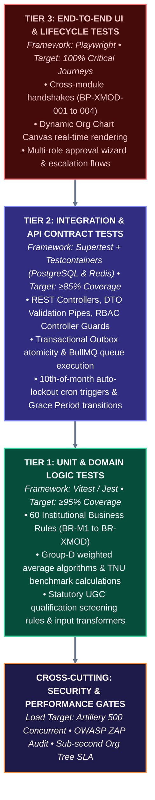

# Test Strategy & Quality Verification Plan
## University HR Change Management & Automation System

| Document Metadata | Specification Detail |
|---|---|
| **Document Identifier** | `DOC-09-TST-CANONICAL` |
| **Project Name** | University HR Change Management & Automation System |
| **System Phase** | Phase 7 — Verification, Quality Assurance & Test Strategy |
| **Document Status** | Approved Canonical Test Baseline |
| **Date** | October 2026 |
| **Testing Scope** | Unit, Integration, E2E, SLA/Cron Verification, Security & Load Testing |
| **Authoritative Sources** | `docs/01-requirements/`, `docs/02-business-process/`, `docs/03-functional-requirements/` |

---

## 1. Testing Framework & Quality Governance

### 1.1 Objective & Verification Mandate
The quality verification plan guarantees that all **104 atomic requirements**, **59 business processes**, **60 business rules**, and **152 functional requirements** execute with 100% compliance, zero data corruption, and robust error handling.

---

## 2. Critical Path Verification Test Suites

### Test Suite 1: Group-D Monthly Auto-Lockout (`TC-GPD-01`)
- **Governing Rules:** `BR-M3-001`, `BR-M3-002`, `BR-M3-003`, `REQ-MOD3-04`.
- **Preconditions:** Group-D monthly evaluation form initialized in `DRAFT_SUPERVISOR` on 1st of month.
- **Test Steps:**
  1. Verify form is accessible for editing between 1st and 7th.
  2. Verify reminder notifications fire on 8th, 9th, and 10th (Grace Period).
  3. Simulate arrival of 23:59:59 IST on 10th of month via cron worker.
  4. Attempt supervisor edit via `POST /api/v1/performance/group-d/monthly/:id/evaluate` at 00:00:01 on 11th.
- **Expected Result:**
  - Status transitions to `LOCKED_NON_COMPLIANT`.
  - Supervisor edit rejected with HTTP 423 Locked.
  - HR non-compliance dashboard reflects unsubmitted evaluation.

### Test Suite 2: Two-Level Sequential Approval Hierarchy (`TC-CHG-01`)
- **Governing Rules:** `BR-M1-004`, `REQ-MOD1-17`, `MOD1-APP-REQ-01`.
- **Preconditions:** Service Change Request (Format a) submitted by HR Operations, status `PENDING_HR_REVIEW`.
- **Test Steps:**
  1. Authenticate as Senior Management (`ACT-PRO`).
  2. Attempt to approve request directly via `POST /api/v1/change-requests/:id/approve-mgmt`.
  3. Authenticate as HR Reviewer (`ACT-HHR`) and commit Level-1 approval.
  4. Re-attempt Level-2 Senior Management approval.
- **Expected Result:**
  - Direct Level-2 attempt rejected with HTTP 400 Bad Request (`"Cannot approve at Level 2 prior to Level 1 HR sign-off"`).
  - Following Level-1 sign-off, Level-2 approval succeeds, transitioning status to `APPROVED_SCHEDULED`.

### Test Suite 3: Non-Academic Annual MRF Quota Enforcement (`TC-REC-01`)
- **Governing Rules:** `BR-M2-009`, `REQ-MOD2-07`, `MOD2-MPL-REQ-07`.
- **Preconditions:** Department of Computer Applications has 1 approved planned MRF for academic year 2026–27.
- **Test Steps:**
  1. Authenticate as HOD Computer Applications.
  2. Submit second planned MRF for routine lab assistant hiring via `POST /api/v1/requisitions/non-academic`.
- **Expected Result:**
  - Request rejected with HTTP 409 Conflict (`"Department annual requisition quota of 1 planned MRF already exhausted for current operational year"`).

### Test Suite 4: Urgent Replacement Exemption on Resignation (`TC-REC-02`)
- **Governing Rules:** `BR-M2-013`, `REQ-MOD2-08`, `BP-XMOD-002`.
- **Preconditions:** School of Engineering faculty member tenders resignation.
- **Test Steps:**
  1. School Dean executes formal resignation acceptance in Module I (`POST /api/v1/employees/:id/resign`).
  2. Inspect Module II active requisitions.
  3. Submit urgent replacement MRF referencing resignation event ID.
- **Expected Result:**
  - Urgent replacement MRF opened immediately, bypassing annual quota and 4-month lead time restrictions.
  - Urgent replacement countdown clock starts.

### Test Suite 5: Academic SCM Quorum & External Expert Mandate (`TC-SCM-01`)
- **Governing Rules:** `BR-M2-014`, `REQ-MOD2-15`.
- **Preconditions:** Academic Selection Committee Meeting scheduled for Professor position.
- **Test Steps:**
  1. Configure SCM panel with VC, Dean, HOD, but omit External Subject Expert (`ACT-EXP`).
  2. Attempt to docket panel for interview evaluation via `POST /api/v1/interviews/scm/docket`.
  3. Add verified External Subject Expert and re-attempt docketing.
- **Expected Result:**
  - Panel without External Expert rejected with HTTP 422 Unprocessable Entity (`"Statutory SCM invalid: Mandatory external subject matter expert missing"`).
  - Complete panel successfully docketed.

### Test Suite 6: Dynamic Org Chart Realignment & Redis Cache Invalidation (`TC-ORG-01`)
- **Governing Rules:** `BR-M1-002`, `REQ-MOD1-03`, `REQ-MOD1-04`.
- **Preconditions:** Employee A reports to Supervisor B in Department of Mechanical Engineering.
- **Test Steps:**
  1. Submit Change Request Format (d) reassigning Employee A to Supervisor C, with `effective_date = TODAY`.
  2. Complete Level-1 and Level-2 approvals.
  3. Execute effective-date activation batch worker.
  4. Query `GET /api/v1/org-chart`.
  5. Inspect WebSocket event stream.
- **Expected Result:**
  - Database commits parent edge update: Employee A now child of Supervisor C.
  - Redis cache key `cache:org_tree:master` invalidated and repopulated.
  - WebSocket client receives `org-tree:invalidated` event.
  - API response time $\le 200$ ms.

### Test Suite 7: Transactional Outbox Eventual Consistency for ERP (`TC-ERP-01`)
- **Governing Rules:** `REQ-EXT-01`, `REQ-EXT-02`, `BP-M1-007`.
- **Preconditions:** Local database active; mock University ERP endpoint configured to return HTTP 503 on first 2 attempts, then HTTP 200.
- **Test Steps:**
  1. Activate employee salary change.
  2. Verify atomic commit: Employee salary updated in `employees` table AND row inserted in `outbox_events` table with `status = 'PENDING'`.
  3. Trigger Outbox Dispatcher BullMQ worker.
- **Expected Result:**
  - Worker attempts delivery, catches HTTP 503, increments retry counter to 1, schedules exponential backoff.
  - On third attempt, receives HTTP 200, updates outbox row to `status = 'DELIVERED'`, logs acknowledgment timestamp.
  - Zero loss of ERP synchronization payloads.

---

## 3. Automated Test Execution Tooling & CI/CD Pipeline

| Test Category | Framework / Tool | Execution Target | Minimum Quality Threshold |
|---|---|---|---|
| **Unit Tests** | Jest / Vitest | Business rules, scoring algorithms, DTO validation | 100% of business rules covered; $\ge$ 90% branch coverage |
| **API Contract Tests**| Supertest + Testcontainers | All REST endpoints against ephemeral PostgreSQL/Redis | 100% of endpoints pass with valid status codes |
| **E2E Integration** | Playwright | Full browser user workflows (Desktop + Mobile) | Zero visual regression on core dashboard & Org Chart |
| **Load & Stress** | k6 | 500 concurrent users on Org Chart and directory | 95th percentile response time $< 500$ ms |
