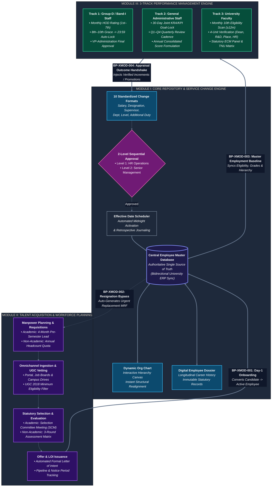

# University HR Change Management & Automation System
## Central Documentation Portal & System Architecture

Welcome to the authoritative documentation portal for the **University HR Change Management & Automation System**. This repository documents the complete end-to-end specifications, workflows, architecture, database models, design tokens, API interfaces, security policies, verification plans, and DevOps runbooks for the university's HR digital platform.

---

## 1. System Vision & Architecture Overview

The platform serves as the unified **digital backbone** for the employee lifecycle, connecting three core functional modules and shared platform services:

---

## 2. Master Documentation Directory (Complete End-to-End Suite)

The documentation is organized into ten cohesive, production-grade domain folders:

| # | Domain | Canonical Document | Description | Key Invariants Covered |
|---|---|---|---|---|
| **01** | **Requirements** | [`01-requirements/SOFTWARE-REQUIREMENTS-SPECIFICATION.md`](file:///d:/Desktop/HR-CHANGE-MANAGEMENT-SYSTEM/docs/01-requirements/SOFTWARE-REQUIREMENTS-SPECIFICATION.md) | Unified Software Requirements Specification (SRS). | • 104 Atomic Requirements (`REQ-01` to `REQ-104`) • 11 Baseline TBDs (`REQ-TBD-01` to `11`) • Stakeholder Decisions (`CONF-01` to `10`) • Full Traceability Matrix |
| **02** | **Business Processes** | [`02-business-process/01-BUSINESS-PROCESS-SPECIFICATION.md`](file:///d:/Desktop/HR-CHANGE-MANAGEMENT-SYSTEM/docs/02-business-process/01-BUSINESS-PROCESS-SPECIFICATION.md) | Comprehensive Business Process & Workflow Manual. | • 59 End-to-End Processes (`BP-M1`, `BP-M2`, `BP-M3`, `BP-XMOD`) • 16-Actor Taxonomy & RACI Matrix • Automated SLA Countdown Matrix |
| **02** | **Business Rules** | [`02-business-process/02-BUSINESS-RULES-SPECIFICATION.md`](file:///d:/Desktop/HR-CHANGE-MANAGEMENT-SYSTEM/docs/02-business-process/02-BUSINESS-RULES-SPECIFICATION.md) | Authoritative Catalogue of Institutional Governance Rules. | • 60 Invariant Business Rules (`BR-M1`, `BR-M2`, `BR-M3`, `BR-ENT`, `BR-XMOD`) • Auto-Lockouts, Quotas & Gating Logic |
| **03** | **Functional Specs** | [`03-functional-requirements/01-FUNCTIONAL-REQUIREMENTS-SPECIFICATION.md`](file:///d:/Desktop/HR-CHANGE-MANAGEMENT-SYSTEM/docs/03-functional-requirements/01-FUNCTIONAL-REQUIREMENTS-SPECIFICATION.md) | Granular Functional Requirements Document (FRD). | • 152 Functional Requirements (`MOD1-REQ`, `MOD2-REQ`, `MOD3-REQ`, `SHR-REQ`) • Inputs, State Transitions & Error Handling |
| **04** | **System Architecture** | [`04-system-architecture/01-SYSTEM-ARCHITECTURE-SPECIFICATION.md`](file:///d:/Desktop/HR-CHANGE-MANAGEMENT-SYSTEM/docs/04-system-architecture/01-SYSTEM-ARCHITECTURE-SPECIFICATION.md) | Modular Monolith Architecture Specification. | • Next.js App Router & Vanilla CSS Modules • NestJS Modular Monolith & Domain Event Bus • BullMQ Queues, Redis Caching & Transactional Outbox |
| **04** | **Architecture Decision** | [`04-system-architecture/ADR-001-REAL-TIME-COMMUNICATION.md`](file:///d:/Desktop/HR-CHANGE-MANAGEMENT-SYSTEM/docs/04-system-architecture/ADR-001-REAL-TIME-COMMUNICATION.md) | Approved Architectural Decision Record (ADR). | • Formal Technical Approval for Socket.IO Real-Time Push |
| **05** | **Database Design** | [`05-database/01-DATABASE-DESIGN-AND-SCHEMA-SPECIFICATION.md`](file:///d:/Desktop/HR-CHANGE-MANAGEMENT-SYSTEM/docs/05-database/01-DATABASE-DESIGN-AND-SCHEMA-SPECIFICATION.md) | Relational Schema Specification & Data Architecture. | • Single PostgreSQL Instance with 4 Domain Schemas • 33 Primary Conceptual Entities (`ENT-*`) • 41 Relational Foreign Key Mappings (`REL-*`) • Indexing Strategy & Temporal Versioning |
| **05** | **Data Dictionary** | [`05-database/02-LOGICAL-DATA-DICTIONARY.md`](file:///d:/Desktop/HR-CHANGE-MANAGEMENT-SYSTEM/docs/05-database/02-LOGICAL-DATA-DICTIONARY.md) | Canonical Logical Data Dictionary. | • 344 Logical Attributes Specification across all 33 Entities with Data Types, Nullability, and Descriptions |
| **06** | **Design Tokens & UI** | [`06-design/DESIGN.md`](file:///d:/Desktop/HR-CHANGE-MANAGEMENT-SYSTEM/docs/06-design/DESIGN.md) | Official UI Design Tokens & Theme Specification. | • Curated Palette, Inter Typography, Elevation, Surface Containers & Component Rules |
| **07** | **API Contracts** | [`07-api/01-API-SPECIFICATION.md`](file:///d:/Desktop/HR-CHANGE-MANAGEMENT-SYSTEM/docs/07-api/01-API-SPECIFICATION.md) | REST API & Real-Time WebSocket Specification. | • REST Endpoints for Auth, Modules I–III & Admin • Request/Response Envelopes, Error Codes • Socket.IO Events & Inbound/Outbound Payloads |
| **08** | **Security & RBAC** | [`08-security/01-SECURITY-AND-RBAC-SPECIFICATION.md`](file:///d:/Desktop/HR-CHANGE-MANAGEMENT-SYSTEM/docs/08-security/01-SECURITY-AND-RBAC-SPECIFICATION.md) | Security, Identity & Access Governance Specification. | • Master 16-Actor Permission Matrix (CRUD/A) • Stateless JWT Lifecycle & Refresh Rotation • PII/Salary Masking & Row-Level Security (RLS) |
| **09** | **Testing & QA** | [`09-testing/01-TEST-STRATEGY-AND-VERIFICATION-PLAN.md`](file:///d:/Desktop/HR-CHANGE-MANAGEMENT-SYSTEM/docs/09-testing/01-TEST-STRATEGY-AND-VERIFICATION-PLAN.md) | Test Strategy & Quality Verification Plan. | • Multi-Tier Testing Pyramid (Unit, Integ, E2E) • 7 Critical Path Test Suites (10th Auto-Lock, 2-Level Approvals, Quotas, SCM Quorum) |
| **10** | **DevOps & Deploy** | [`10-deployment/01-DEPLOYMENT-AND-DEVOPS-GUIDE.md`](file:///d:/Desktop/HR-CHANGE-MANAGEMENT-SYSTEM/docs/10-deployment/01-DEPLOYMENT-AND-DEVOPS-GUIDE.md) | Infrastructure, Deployment & Operations Guide. | • Production Docker Compose Specification • Complete `.env.example` Mapping • Database Schema Migration Runbook & Backups |

---

## 3. Reading Guide by Stakeholder Role

- **University Leadership & Mentors:**
  - Start with Section 1 of the [SRS](file:///d:/Desktop/HR-CHANGE-MANAGEMENT-SYSTEM/docs/01-requirements/SOFTWARE-REQUIREMENTS-SPECIFICATION.md) for institutional goals and scope boundaries.
  - Review Section 5 of the [SRS](file:///d:/Desktop/HR-CHANGE-MANAGEMENT-SYSTEM/docs/01-requirements/SOFTWARE-REQUIREMENTS-SPECIFICATION.md) for the Stakeholder Confirmation Register (`CONF-01` to `CONF-10`).
- **Software Engineers & Developers:**
  - Read [System Architecture](file:///d:/Desktop/HR-CHANGE-MANAGEMENT-SYSTEM/docs/04-system-architecture/01-SYSTEM-ARCHITECTURE-SPECIFICATION.md) for technology stack invariants, NestJS modular patterns, and queue setups.
  - Read [API Specification](file:///d:/Desktop/HR-CHANGE-MANAGEMENT-SYSTEM/docs/07-api/01-API-SPECIFICATION.md) for REST and WebSocket contracts.
  - Review [Design Tokens](file:///d:/Desktop/HR-CHANGE-MANAGEMENT-SYSTEM/docs/06-design/DESIGN.md) for color palettes, typography, and styling variables.
  - Reference [Database Design](file:///d:/Desktop/HR-CHANGE-MANAGEMENT-SYSTEM/docs/05-database/01-DATABASE-DESIGN-AND-SCHEMA-SPECIFICATION.md) and [Data Dictionary](file:///d:/Desktop/HR-CHANGE-MANAGEMENT-SYSTEM/docs/05-database/02-LOGICAL-DATA-DICTIONARY.md) before writing DDL, migrations, or ORM entities.
- **QA & Verification Engineers:**
  - Read [Test Strategy](file:///d:/Desktop/HR-CHANGE-MANAGEMENT-SYSTEM/docs/09-testing/01-TEST-STRATEGY-AND-VERIFICATION-PLAN.md) for critical path verification scenarios, automated test setup, and quality gates.
- **DevOps & Sysadmins:**
  - Read [Deployment Guide](file:///d:/Desktop/HR-CHANGE-MANAGEMENT-SYSTEM/docs/10-deployment/01-DEPLOYMENT-AND-DEVOPS-GUIDE.md) for Docker Compose, environment configs, healthcheck probes, and backup schedules.
- **HR Administrators & Business Analysts:**
  - Review the [Business Process Specification](file:///d:/Desktop/HR-CHANGE-MANAGEMENT-SYSTEM/docs/02-business-process/01-BUSINESS-PROCESS-SPECIFICATION.md) for step-by-step workflow stages, RACI matrices, and SLA timelines.
  - Review the [Business Rules Specification](file:///d:/Desktop/HR-CHANGE-MANAGEMENT-SYSTEM/docs/02-business-process/02-BUSINESS-RULES-SPECIFICATION.md) for all 60 institutional policies, quota limits, and auto-lockout conditions.
  - Review [Security & RBAC](file:///d:/Desktop/HR-CHANGE-MANAGEMENT-SYSTEM/docs/08-security/01-SECURITY-AND-RBAC-SPECIFICATION.md) for role permissions.

---

## 4. Source Evidence Repository (`source-requirements/`)

The [`source-requirements/`](file:///d:/Desktop/HR-CHANGE-MANAGEMENT-SYSTEM/source-requirements/) directory remains the permanent, untouched legal and institutional source of truth containing:
- **`source-requirements/Module-I/`**: Official Module I Requirement Briefs & Complete Narratives (PDF).
- **`source-requirements/Module-II/`**: Official Module II Recruitment SOPs, Narratives, and Visual Diagrams (PDF/JPEG).
- **`source-requirements/Module-III/`**: Official Module III Performance Management Briefs, Subsystems, and Workflows (PDF/JPEG).
- **`source-requirements/PROJECT_REQUIREMENTS_ANALYSIS.md`**: Foundational inception requirements extraction.
- **`source-requirements/TECHNOLOGY_ARCHITECTURE_BASELINE.md`**: Master approved technology architecture baseline.

---

## 5. Proprietary & Confidential Notice

**Copyright (c) 2026 The Neotia University. All Rights Reserved.**

All specifications, process flows, data dictionaries, and architectural artifacts in this documentation suite are the confidential and proprietary intellectual property of **The Neotia University**. 

Unauthorized downloading, cloning, forking, reproduction, or distribution without prior explicit written authorization from the repository owner is strictly forbidden and subject to formal legal action.

**Official Inquiries:** [halderaditya632@gmail.com](mailto:halderaditya632@gmail.com)
